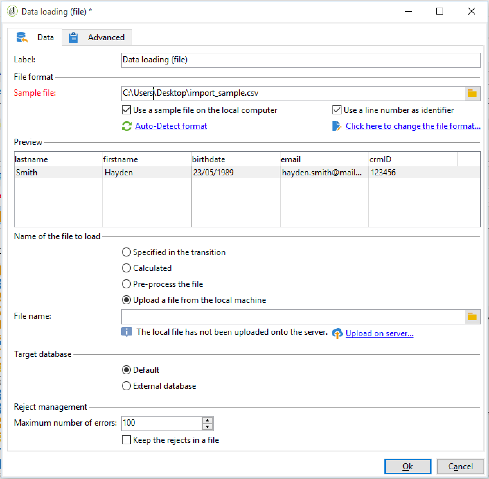

# Konfigurera ett arbetsflöde för återkommande import {#setting-up-a-recurring-import}


Det är bäst att använda en arbetsflödesmall om du behöver importera filer med samma struktur regelbundet.

I det här exemplet visas hur du anger ett förinställt arbetsflöde som kan återanvändas för import av profiler från en CRM i Adobe Campaign-databasen. Mer information om alla möjliga inställningar för varje aktivitet finns i det här [avsnittet](activities.md).

1. Skapa en ny arbetsflödesmall från **[!UICONTROL Resources > Templates > Workflow templates]**.
1. Lägg till följande aktiviteter:

   * **[!UICONTROL Data loading (file)]**: Definiera den förväntade strukturen för filen som innehåller de data som ska importeras.
   * **[!UICONTROL Enrichment]**: Stäm av importerade data med databasdata.
   * **[!UICONTROL Split]**: Skapa filter för att bearbeta poster på olika sätt beroende på om de kan förenas eller inte.
   * **[!UICONTROL Deduplication]**: Deduplicera data från den inkommande filen innan den infogas i databasen.
   * **[!UICONTROL Update data]**: Uppdatera databasen med importerade profiler.

   

1. Konfigurera aktiviteten **[!UICONTROL Data Loading (file)]**:

   * Definiera den förväntade strukturen genom att överföra en exempelfil. Exempelfilen bör bara innehålla några få rader, men alla kolumner som behövs för importen. Kontrollera och redigera filformatet för att se till att typen för varje kolumn är korrekt: text, datum, heltal osv. Exempel:

     ```
     lastname;firstname;birthdate;email;crmID
     Smith;Hayden;23/05/1989;hayden.smith@mailtest.com;123456
     ```

   * Välj **[!UICONTROL Upload a file from the local machine]** i avsnittet **[!UICONTROL Name of the file to load]** och lämna fältet tomt. Varje gång ett nytt arbetsflöde skapas från den här mallen kan du här ange vilken fil du vill ha, så länge den motsvarar den definierade strukturen.

     Du kan använda något av alternativen, men du måste ändra mallen därefter. Om du till exempel väljer **[!UICONTROL Specified in the transition]** kan du lägga till en **[!UICONTROL File Transfer]**-aktivitet innan för att hämta filen som ska importeras från en FTP-/SFTP-server. Med S3- eller SFTP-anslutning kan du även importera segmentdata till Adobe Campaign med Adobe kunddataplattform i realtid. Mer information finns i [Adobe Experience Platform-dokumentationen](https://experienceleague.adobe.com/docs/experience-platform/destinations/catalog/email-marketing/adobe-campaign.html?lang=sv-SE){target="_blank"}.

     

1. Konfigurera aktiviteten **[!UICONTROL Enrichment]**. Syftet med den här aktiviteten i det här sammanhanget är att identifiera inkommande data.

   * På fliken **[!UICONTROL Enrichment]** väljer du **[!UICONTROL Add data]** och definierar en länk mellan importerade data och måldimensionen för mottagarna. I det här exemplet används det anpassade fältet **CRM ID** för att skapa kopplingsvillkoret. Använd fältet eller kombinationen av fält som du behöver så länge det går att identifiera unika poster.
   * Lämna alternativet **[!UICONTROL Identify the document from the working data]** omarkerat på fliken **[!UICONTROL Reconciliation]**.

   

1. Konfigurera aktiviteten **[!UICONTROL Split]** för att hämta avstämda mottagare i en övergång och mottagare som inte kunde avstämas men som har tillräckligt med data i en andra övergång.

   Övergången med avstämda mottagare kan sedan användas för att uppdatera databasen. Övergången med okända mottagare kan sedan användas för att skapa nya mottagarposter i databasen om det finns en minimiuppsättning information i filen.

   Mottagare som inte kan förenas och som inte har tillräckligt med data markeras i en komplementövergång och kan exporteras i en separat fil eller helt enkelt ignoreras.

   * Välj **[!UICONTROL Use the additional data only]** som filterinställning på fliken **[!UICONTROL General]** i aktiviteten och kontrollera att **[!UICONTROL Targeting dimension]** automatiskt är inställd på **[!UICONTROL Enrichment]**.

     Markera alternativet **[!UICONTROL Generate complement]** för att se om det inte går att infoga någon post i databasen. Om du behöver kan du använda ytterligare bearbetning för komplementdata: filexport, listuppdatering osv.

   * I den första delmängden av fliken **[!UICONTROL Subsets]** lägger du till ett filtreringsvillkor i den inkommande fyllningen för att endast markera poster där den mottagande primärnyckeln inte är lika med 0. På så sätt markeras data från filen som är avstämda med mottagare från databasen i den delmängden.

     

   * Lägg till en andra delmängd som markerar ej avstämda poster som har tillräckligt med data för att infogas i databasen. Exempel: e-postadress, förnamn och efternamn.

     Deluppsättningar bearbetas i den ordning de skapas, vilket innebär att alla poster som redan finns i databasen redan är markerade i den första deluppsättningen när den andra deluppsättningen bearbetas.

     

   * Alla poster som inte är markerade i de två första delmängderna markeras i **[!UICONTROL Complement]**.

1. Konfigurera aktiviteten **[!UICONTROL Update data]** som finns efter den första utgående övergången för aktiviteten **[!UICONTROL Split]** som konfigurerats tidigare.

   * Välj **[!UICONTROL Update]** som **[!UICONTROL Operation type]** eftersom den inkommande övergången bara innehåller mottagare som redan finns i databasen.
   * I avsnittet **[!UICONTROL Record identification]** väljer du **[!UICONTROL Using reconciliation keys]** och definierar en nyckel mellan måldimensionen och länken som skapas i **[!UICONTROL Enrichment]**. I det här exemplet används det anpassade fältet **CRM ID**.
   * I avsnittet **[!UICONTROL Fields to update]** anger du fälten från mottagardimensionen som ska uppdateras med värdet för motsvarande kolumn från filen. Om namnen på filkolumnerna är identiska eller nästan identiska med namnen på mottagarnas dimensionsfält kan du använda trollstavsknappen för att automatiskt matcha de olika fälten.

     

1. Konfigurera aktiviteten **[!UICONTROL Deduplication]** som finns efter övergången som innehåller ej avstämda mottagare:

   * Välj **[!UICONTROL Edit configuration]** och ange måldimensionen till det temporära schema som genereras från **[!UICONTROL Enrichment]**-aktiviteten i arbetsflödet.

     

   * I det här exemplet används e-postfältet för att hitta unika profiler. Du kan använda vilket fält som helst som du är säker på är ifyllt och ingår i en unik kombination.
   * Markera **[!UICONTROL Advanced parameters]** på skärmen **[!UICONTROL Deduplication method]** och markera alternativet **[!UICONTROL Disable automatic filtering of 0 ID records]** för att se till att poster som har en primärnyckel som är lika med 0 (som ska vara alla poster i övergången) inte utesluts.

   

1. Konfigurera aktiviteten **[!UICONTROL Update data]** som finns efter att aktiviteten **[!UICONTROL Deduplication]** har konfigurerats tidigare.

   * Välj **[!UICONTROL Insert]** som **[!UICONTROL Operation type]** eftersom den inkommande övergången bara innehåller mottagare som inte finns i databasen.
   * I avsnittet **[!UICONTROL Record identification]** väljer du **[!UICONTROL Directly using the targeting dimension]** och sedan dimensionen **[!UICONTROL Recipients]**.
   * I avsnittet **[!UICONTROL Fields to update]** anger du fälten från mottagardimensionen som ska uppdateras med värdet för motsvarande kolumn från filen. Om namnen på filkolumnerna är identiska eller nästan identiska med namnen på mottagarnas dimensionsfält kan du använda trollstavsknappen för att automatiskt matcha de olika fälten.

     

1. Efter den tredje övergången för aktiviteten **[!UICONTROL Split]** lägger du till en **[!UICONTROL Data extraction (file)]**-aktivitet och en **[!UICONTROL File transfer]**-aktivitet om du vill hålla reda på data som inte har infogats i databasen. Konfigurera de aktiviteterna för att exportera den kolumn du behöver och för att överföra filen till en FTP- eller SFTP-server där du kan hämta den.
1. Lägg till en **[!UICONTROL End]**-aktivitet och spara arbetsflödesmallen.

Mallen kan nu användas och är tillgänglig för alla nya arbetsflöden. Allt behövs sedan för att ange filen som innehåller de data som ska importeras i aktiviteten **[!UICONTROL Data loading (file)]**.


