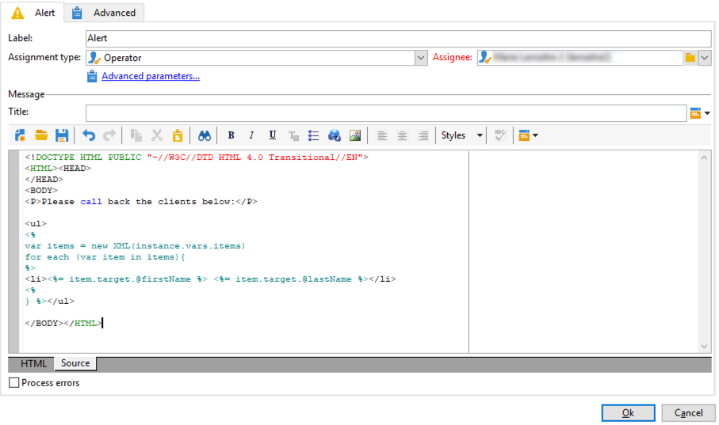

# Skicka personaliserade aviseringar till operatörer{#sending-personalized-alerts-to-operators}


I det här exemplet vill vi skicka en varning till en operator som ska innehålla namnet på profiler som öppnade ett nyhetsbrev men som inte klickade på länken som det innehåller.

Profilernas för- och efternamnsfält är länkade till **[!UICONTROL Recipients]** målgruppsdimension, **[!UICONTROL Alert]** aktiviteten är länkad till **[!UICONTROL Operator]** målgruppsdimension. Därför finns det inget tillgängligt fält mellan de två måldimensionerna för att utföra en avstämning och hämta för- och efternamnsfälten, och visa dem i aviseringsaktiviteten.

Processen är att skapa ett arbetsflöde enligt nedan:

1. Använd en **[!UICONTROL Query]** till måldata.
1. Lägg till en **[!UICONTROL JavaScript code]** till arbetsflödet för att spara ifyllningen från frågan till instansvariabeln.
1. Använd en **[!UICONTROL Test]** aktivitet för att kontrollera antalet populationer.
1. Använd en **[!UICONTROL Alert]** aktivitet som skickar en varning till en operator, beroende på vilken **[!UICONTROL Test]** aktivitetsresultat.


## Spara populationen i instansvariabeln {#saving-the-population-to-the-instance-variable}

Lägg till koden nedan i **[!UICONTROL JavaScript code]** aktivitet.

```
var query = xtk.queryDef.create(  
    <queryDef schema="temp:query" operation="select">  
      <select>  
       <node expr="[target/recipient.@firstName]"/>  
       <node expr="[target/recipient.@lastName]"/>  
      </select>  
     </queryDef>  
  );  
  var items = query.ExecuteQuery();
```

Kontrollera att JavaScript-koden motsvarar arbetsflödesinformationen:

* The **[!UICONTROL queryDef schema]** -taggen ska motsvara namnet på måldimensionen som används i frågeaktiviteten.
* The **[!UICONTROL node expr]** -taggen ska motsvara namnet på de fält som du vill hämta.


Följ stegen nedan för att hämta informationen:

1. Högerklicka på den utgående övergången från **[!UICONTROL Query]** aktivitet, välj **[!UICONTROL Display the target]**.

   

1. Högerklicka på listan och välj **[!UICONTROL Configure list]**.

   

1. Frågemålets dimension och fältnamn visas i listan.

   

## Testning av populationsantal {#testing-the-population-count}

Lägg till koden nedan i **[!UICONTROL Test]** aktivitet för att kontrollera om målpopulationen innehåller minst en profil.

```
var.recCount>0
```


## Konfigurera aviseringen {#setting-up-the-alert}

Nu när populationen har lagts till i instansvariabeln med de önskade fälten kan du lägga till dessa uppgifter i **[!UICONTROL Alert]** aktivitet.

Om du vill göra det lägger du till **[!UICONTROL Source]** tabba koden nedan:

```
<ul>
<%
var items = new XML(instance.vars.items)
for each (var item in items){
%>
<li><%= item.target.@firstName %> <%= item.target.@lastName %></li>
<%
} %></ul>
```

>[!NOTE]
>
>The **[!UICONTROL <%= item.target.recipient.@fieldName %>]** kan du lägga till ett av fälten som har sparats i instansvariabeln via **[!UICONTROL JavaScript code]** aktivitet.\
>Du kan lägga till så många fält som du vill, så länge de har infogats i JavaScript-koden.


