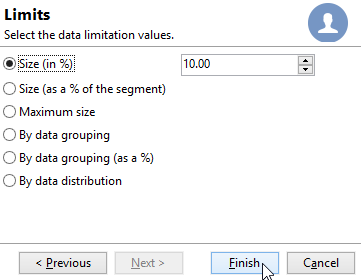
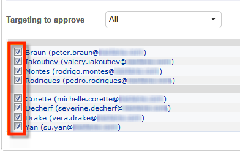

# Dela{#split}

A **Dela** Med aktiviteten -type kan du dela upp ett mål i flera deluppsättningar. Målet har konstruerats med alla mottagna resultat: alla tidigare aktiviteter måste därför ha avslutats för att den här aktiviteten ska kunna utföras.

Denna aktivitet utlöser inte någon union av inkommande populationer. Om flera övergångar landar i en delad aktivitet rekommenderar vi att du infogar en **[!UICONTROL Union]** verksamhet framför den.

>[!NOTE]
>
>Det går inte att utföra delade åtgärder för tabeller som har olika källor. Därför måste du lägga till en **Berikning** aktivitet före **Dela** aktivitet.

* Ett exempel på den delade aktivitet som används finns i [det här avsnittet](targeting-workflows.md#create-subsets-using-the-split-activity).
* Ett exempel som illustrerar hur du använder Dela-aktiviteten för att segmentera målet i olika populationer med filtervillkor beskrivs i [det här avsnittet](cross-channel-delivery-workflow.md).
* Ett exempel som visar hur du använder en förekomstvariabel i en delad aktivitet finns i [det här avsnittet](javascript-scripts-and-templates.md).

Om du vill konfigurera den här aktiviteten definierar du delmängdens innehåll och etikett i **[!UICONTROL Subsets]** och sedan välja måldimensionen i **[!UICONTROL General]** -fliken.

## Skapa delmängder {#create-subsets}

Så här skapar du en delmängd:

1. Klicka på etiketten i det matchande fältet och välj det filter som ska användas.
1. Välj **[!UICONTROL Add a filtering condition]** och klicka på **[!UICONTROL Edit...]** länk.

   Välj vilken typ av filter som ska användas på data som ska inkluderas i uppsättningen.

   Processen är densamma som för en **Fråga**-type-aktivitet.

   >[!NOTE]
   >
   >Du kan filtrera data i högst två externa databaser (FDA).

1. Du kan ange maximalt antal poster som ska extraheras från målet för att skapa delmängden. Om du vill göra det går du till **[!UICONTROL Limit the selected records]** och klicka på **[!UICONTROL Edit...]** länk.

   Med en guide kan du välja valläge för poster i den här delmängden. [Läs mer](#limit-the-number-of-subset-records).

   

1. Om du vill kan du **lägg till andra delmängder** med **[!UICONTROL Add]** -knappen.

   

   >[!NOTE]
   >
   >Om **[!UICONTROL Enable overlapping of output populations]** om alternativet inte är markerat skapas delmängder i tabbordningen. Använd pilarna i fönstrets övre högra del för att flytta dem. Om den första delmängden återställer 70 % av den ursprungliga populationen kommer nästa delmängd endast att tillämpa sina urvalskriterier på de återstående 30 % och så vidare.

   För varje delmängd som skapas läggs en utgående övergång till i den delade aktiviteten.

   

   Du kan välja att generera en enskild utgående övergång (och identifiera uppsättningar med exempelvis segmentkoden): om du vill göra det väljer du **[!UICONTROL Generate subsets in the same table]** i **[!UICONTROL General]** -fliken.

   Om den är klar sparas segmentkoden för varje delmängd automatiskt i en extra kolumn. Den här kolumnen är tillgänglig i personaliseringsfälten på leveransnivå.

## Begränsa antalet delmängdsposter {#limit-the-number-of-subset-records}

Om du inte vill använda hela populationen i en delmängd kan du begränsa antalet poster som den ska innehålla.

1. I redigeringsfönstret för delmängd kontrollerar du **[!UICONTROL Limit the selected records]** och klicka på **[!UICONTROL Edit...]** länk.
1. Välj gränstyp för ditt val:

   * **[!UICONTROL Activate random sampling]**: det här alternativet tar ett slumpmässigt urval av posterna. Vilken typ av slumpmässigt urval som används beror på databasmotorn.
   * **[!UICONTROL Keep only the first records after sorting]**: Med det här alternativet kan du definiera en begränsning baserat på en eller flera sorteringsordningar. Om du väljer **[!UICONTROL Age]** fält som sorteringskriterium och 100 som gräns, endast de yngsta 100 mottagarna behålls.
   * **[!UICONTROL Keep the first ones after sorting (criteria, random)]**: Det här alternativet kombinerar de två föregående alternativen. Du kan definiera en begränsning baserat på en eller flera sorteringsordningar och sedan göra ett slumpmässigt urval på de första posterna om vissa poster har samma värden som de definierade villkoren.

     Om du t.ex. väljer **[!UICONTROL Age]** -fält som sorteringsvillkor, och du definierar sedan en gräns på 100, men de 2 000 yngsta mottagarna i databasen är alla 18, så väljs 100 mottagare slumpmässigt bland dessa 2 000.

   

1. Om du vill definiera sorteringsvillkor kan du definiera kolumnerna och sorteringsordningen med ett extra steg.

   

1. Välj sedan metoden för databegränsning.

   

   Det finns flera sätt att göra detta:

   * **[!UICONTROL Size (in %)]**: en procentandel av posterna. Till exempel extraherar konfigurationen nedan 10 % av den totala populationen.

     Procentandelen gäller den inledande populationen, inte resultatet av aktiviteten.

   * **[!UICONTROL Size (as a % of the segment)]**: en procentandel av posterna som endast avser delmängderna och inte den ursprungliga populationen.
   * **[!UICONTROL Maximum size]**: ett maximalt antal poster.
   * **[!UICONTROL By data grouping]**: du kan ange en gräns för antalet poster beroende på värdena i ett angivet fält i den inkommande populationen. [Läs mer](#limit-the-number-of-subset-records-by-data-grouping).
   * **[!UICONTROL By data grouping (in %)]**: du kan ange en gräns för antalet poster beroende på värdena i ett angivet fält i den inkommande populationen med en procentandel. [Läs mer](#limit-the-number-of-subset-records-by-data-grouping).
   * **[!UICONTROL By data distribution]**: Om grupperingsfälten har för många värden eller om du inte vill ange värden igen för varje ny delad aktivitet kan du konfigurera en **[!UICONTROL By data distribution]** begränsning (valfri modul för distribuerad marknadsföring). [Läs mer](#limit-the-number-of-subset-records-per-data-distribution).

1. Klicka **[!UICONTROL Finish]** för att godkänna urvalskriterierna för posten. Den definierade konfigurationen visas sedan i redigerarens mittersta fönster.

## Begränsa antalet delmängdsposter per datagrupp {#limit-the-number-of-subset-records-by-data-grouping}

Du kan begränsa antalet poster per datagrupp. Denna gräns kan göras med hjälp av ett fast värde eller en procentsats.

Om du till exempel väljer **[!UICONTROL Language]** som gruppfält kan du definiera en lista med poster för varje språk.

1. När du har valt värden för databegränsning väljer du **[!UICONTROL By data grouping]** eller **[!UICONTROL By data grouping (as a %)]** och klicka **[!UICONTROL Next]**.

   

1. Markera sedan grupperingsfälten (den **[!UICONTROL Language]** fält) och klicka **[!UICONTROL Next]**.

   

1. Slutligen anger du tröskelvärden för datagruppering (med hjälp av fasta värden eller procentandelar beroende på den tidigare valda grupperingsmetoden). Om du vill ange samma tröskelvärde för varje värde, till exempel om du vill ange antalet poster för varje språk till 10, väljer du **[!UICONTROL All data groupings are the same size]** alternativ. Om du vill ange en annan gräns för varje värde väljer du **[!UICONTROL Limitations by grouping value]** alternativ. Då kan du välja en annan begränsning för engelska, franska och så vidare.

   

1. Klicka **[!UICONTROL Finish]** för att godkänna begränsningen och återgå till att redigera den delade aktiviteten.

## Begränsa antalet delmängdsposter per datadistribution {#limit-the-number-of-subset-records-per-data-distribution}

Om grupperingsfälten innehåller för många värden eller om du vill undvika att återställa värden för varje ny delad aktivitet, kan du skapa en begränsning per datadistribution i Adobe Campaign. Vid val [databegränsningsvärden](#create-subsets) väljer du **[!UICONTROL By data distribution]** och välj en mall i listrutan. Nedan visas hur du skapar en mall för datadistribution.

Ett exempel på **[!UICONTROL Local approval]** aktivitet med en distributionsmall, se [den här sidan](local-approval-activity.md).

>[!CAUTION]
>
>Den här funktionen är bara tillgänglig med [Tillägg för distribuerad marknadsföring](../distributed-marketing/about-distributed-marketing.md). Kontrollera licensavtalet.

Med mallen för datadistribution kan du begränsa antalet poster med hjälp av en lista med grupperingsvärden. Så här skapar du en mall för datadistribution:

1. Om du vill skapa en mall går du till **[!UICONTROL Resources > Campaign management > Data distribution]** och klicka på **[!UICONTROL New]**.

   

1. The **[!UICONTROL General]** kan du ange etiketten och körningskontexten för distributionen (måldimension, distributionsfält).

   

   Följande fält måste anges:

   * **[!UICONTROL Label]**: etikett för distributionsmallen.
   * **[!UICONTROL Targeting dimension]**: Ange måldimensionen som datafördelningen ska tillämpas på. **[!UICONTROL Recipient]** till exempel. Det här schemat måste alltid vara kompatibelt med de data som används i målarbetsflödet.
   * **[!UICONTROL Distribution field]**: välj ett fält via måldimensionen. Om du till exempel väljer **[!UICONTROL Email domain]** -fältet kommer listan över mottagare att delas upp efter domän.
   * **[!UICONTROL Distribution type]**: välj hur målets begränsningsvärde ska delas upp i **[!UICONTROL Distribution]** tab: **[!UICONTROL Percentage]** eller **[!UICONTROL Set]**.
   * **[!UICONTROL Approval storage]**: om du använder en [Lokalt godkännande](local-approval.md) i målarbetsflödet anger du det schema som godkännanderesultaten ska lagras i. Du måste ange ett lagringsschema per målschema. Om du använder **[!UICONTROL Recipients]** målschema, ange standard **[!UICONTROL Local approval of recipients]** lagringsschema.

     Om en enkel begränsning är per datagrupp utan lokalt godkännande behöver du inte ange **[!UICONTROL Approvals storage]** fält.

1. Om du använder en [Lokalt godkännande](local-approval.md) aktivitet, ange **[!UICONTROL Advanced settings]** för distributionsmallen:

   

   Följande fält måste anges:

   * **[!UICONTROL Approve targeted messages]**: markera det här alternativet om du vill att alla mottagare ska vara förmarkerade i listan över mottagare som ska godkännas. Om alternativet inte är markerat markeras ingen mottagare i förväg.

     >[!NOTE]
     >
     >Det här alternativet är markerat som standard.

     

   * **[!UICONTROL Delivery label]**: låter dig definiera ett uttryck som visar leveransetiketten i returmeddelandet. Standarduttrycket innehåller information om leveransens standardetikett (beräkningssträng). Du kan ändra det här uttrycket.

     

   * **[!UICONTROL Grouping field]**: det här fältet gör att du kan definiera den gruppering som används för att visa mottagare i godkännande- och returmeddelanden.

     

   * **[!UICONTROL Web Interface]**: gör att du kan länka ett webbprogram till mottagarlistan. I meddelandet för godkännande och retur kan varje mottagare klickas och länkas till det valda webbprogrammet. The **[!UICONTROL Parameters]** fält (till exempel **[!UICONTROL recipientId]**) kan du konfigurera den extra parametern som ska användas i URL:en och webbprogrammet.

1. The **[!UICONTROL Breakdown]** kan du definiera en lista med distributionsvärden.

   

   * **[!UICONTROL Value]**: ange fördelningsvärdena.
   * **[!UICONTROL Percentage / Set]**: Ange postgränsen (fast eller i procent) för varje värde.

     Den här kolumnen definieras av **[!UICONTROL Distribution type]** fält i **[!UICONTROL General]** -fliken.

   * **[!UICONTROL Label]**: Ange den etikett som är länkad till varje värde.
   * **[!UICONTROL Group or operator]**: om du använder en[Lokalt godkännande](local-approval.md) väljer du operatorn eller gruppen med operatorer som tilldelas varje distributionsvärde.

     Om en enkel begränsning är per datagrupp utan lokalt godkännande behöver du inte ange **[!UICONTROL Group or operator]** fält.

     >[!CAUTION]
     >
     >Kontrollera att operatorerna har tilldelats rätt behörigheter.

## Filtreringsparametrar {#filtering-parameters}

Klicka på **[!UICONTROL General]** för att ange aktivitetsetiketten. Välj mål- och filterdimensionerna för den här delningen. Om det behövs kan du ändra de här dimensionerna för en viss delmängd.

Kontrollera **[!UICONTROL Generate complement]** om du vill utnyttja den återstående populationen. Komplementet är det inkommande målet minus kombinationen av delmängderna. En ytterligare utgående övergång läggs sedan till i aktiviteten enligt följande:

För att det här alternativet ska fungera på rätt sätt måste inkommande data ha en primärnyckel.

Om data till exempel läses direkt från en extern databas som Netezza (som inte stöder begreppet index) via en **[!UICONTROL Data loading (RDBMS)]** verksamhet, det komplement som **[!UICONTROL Split]** aktiviteten blir felaktig.

Du kan undvika detta genom att dra och släppa en **[!UICONTROL Enrichment]** aktiviteten precis före **[!UICONTROL Split]** aktivitet. I **[!UICONTROL Enrichment]** aktivitet, kontrollera **[!UICONTROL Keep all additional data from the main set]** och ange de kolumner som du vill använda för att konfigurera filtren i **[!UICONTROL Split]** aktivitet. Data från den inkommande övergången för **[!UICONTROL Split]** -aktiviteten lagras sedan lokalt i en temporär tabell på Adobe Campaign-servern och komplementet kan genereras på rätt sätt.

The **[!UICONTROL Enable overlapping of output populations]** gör att du kan hantera populationer som tillhör flera delmängder:

* När rutan inte är markerad ser delningsaktiviteten till att en mottagare inte kan finnas i flera utdataövergångar, även om den uppfyller villkoren för flera delmängder. De kommer att vara i målet för den första fliken med matchande villkor.
* När rutan är markerad kan mottagarna hittas i flera delmängder om de uppfyller filtervillkoren. Adobe Campaign rekommenderar att man använder exklusiva kriterier.

## Indataparametrar {#input-parameters}

* tableName
* schema

Varje inkommande händelse måste ange ett mål som definieras av dessa parametrar.

## Utdataparametrar {#output-parameters}

* tableName
* schema
* recCount

Den här uppsättningen med tre värden identifierar det mål som är resultatet av uteslutningen. **[!UICONTROL tableName]** är namnet på den tabell som registrerar målidentifierarna, **[!UICONTROL schema]** är schemat för populationen (vanligtvis nms:mottagare) och **[!UICONTROL recCount]** är antalet element i tabellen.

Övergången som är associerad med komplementet har samma parametrar.
