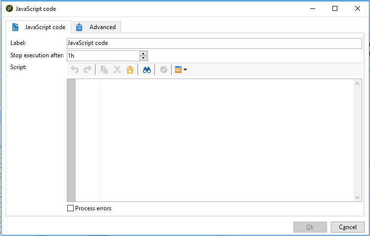

# SQL-kod och JavaScript-kod{#sql-code-and-javascript-code}


## SQL-kod {#sql-code}

An **[!UICONTROL SQL code]** aktiviteten kör ett SQL-skript. Skriptet är en JST-mall.


* **[!UICONTROL Script]**

   Redigerarens centrala del innehåller skriptet som ska köras. Skriptet är en JST-mall och kan därför konfigureras enligt arbetsflödeskontexten.

* **[!UICONTROL Processing errors]**

   Se [Bearbetningsfel](monitor-workflow-execution.md#processing-errors).

## JavaScript-kod och avancerad JavaScript-kod {#javascript-code}

**[!UICONTROL JavaScript code]** och **[!UICONTROL Advanced JavaScript code]** -aktiviteter kör ett JavaScript-skript i ett arbetsflödes kontext. Mer information om skript finns i följande avsnitt:

* [JavaScript-skript och mallar](javascript-scripts-and-templates.md)
* [Exempel på JavaScript-kod i arbetsflöden](javascript-in-workflows.md)

### Körningsfördröjning {#exec-delay}

Från och med version 20.2 har en körningsfördröjning lagts till i **[!UICONTROL JavaScript code]** och **[!UICONTROL Advanced JavaScript code]** verksamhet. Som standard får körningsfasen inte överskrida 1 timme. Efter den här fördröjningen avbryts processen med ett felmeddelande och aktivitetskörningen misslyckas.

Du kan ändra den här fördröjningen i **[!UICONTROL Stop execution after]** fält som är tillgängliga i dessa aktiviteter.

Om du vill ignorera den här gränsen måste du ange värdet till **0**.

### JavaScript-kod {#js-code-desc}



* **[!UICONTROL Script]**: Redigerarens centrala del innehåller skriptet som ska köras.

* **[!UICONTROL Process errors]**: Se [Bearbetningsfel](monitor-workflow-execution.md#processing-errors).

### Avancerad JavaScript-kod {#adv-js-code-desc}


* **[!UICONTROL First call]**: Den första zonen i redigeraren innehåller skriptet som ska köras under det första anropet.
* **[!UICONTROL Next calls]**: Den andra zonen i redigeraren innehåller skriptet som ska köras under nästa anrop.
* **[!UICONTROL Transitions]**: Du kan definiera flera aktivitetsutdatagränser.
* **[!UICONTROL Schedule]**: The **[!UICONTROL Schedule]** kan du schemalägga när aktiviteten ska utlösas.

Avancerad JavaScript är en beständig uppgift och återkommer regelbundet om den inte har markerats som slutförd. Om du vill avbryta uppgiften och förhindra att den återkallas i framtiden måste du använda **task.setCompleted()** metoden i **[!UICONTROL Next calls]** avsnitt:

```
task.postEvent(task.transitionByName("ok")); // to transition to Ok branch
task.setCompleted();

return 0;
```
