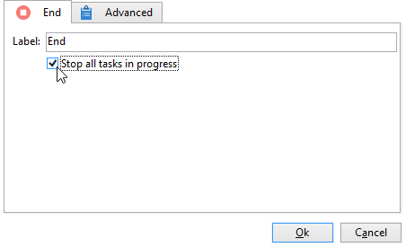

# Start och slut{#start-and-end}

The **[!UICONTROL Start]** och **[!UICONTROL End]** Med -aktiviteter kan du markera början och slutet av ett arbetsflöde grafiskt. Dessa aktiviteter har ingen funktionell inverkan och är därför valfria.

* **[!UICONTROL Start]**

   Körningen av ett arbetsflöde börjar med aktiviteter utan en inkommande övergång och aktiviteter av typen Start.

   

* **[!UICONTROL End]**

   Du kan konfigurera **[!UICONTROL End]** aktivitet för att avbryta alla pågående uppgifter. Det gör du genom att dubbelklicka på aktiviteten för att visa dess egenskaper och markera lämpligt alternativ.

   

   Data i arbetstabellen tas bort automatiskt när slutaktiviteten är aktiverad. Om det inte är nödvändigt och för att undvika onödiga inläsningar kan du välja att inaktivera övergången vid den senaste aktivitetsutdata. Om ingen process är schemalagd vid en utleverans avmarkerar du det relevanta alternativet enligt nedan:

   
