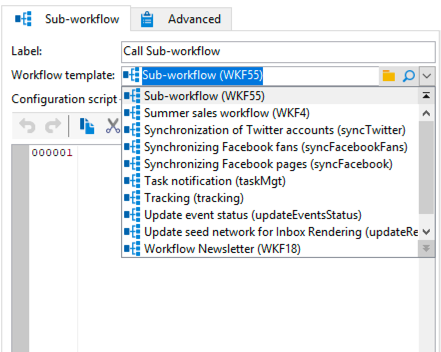
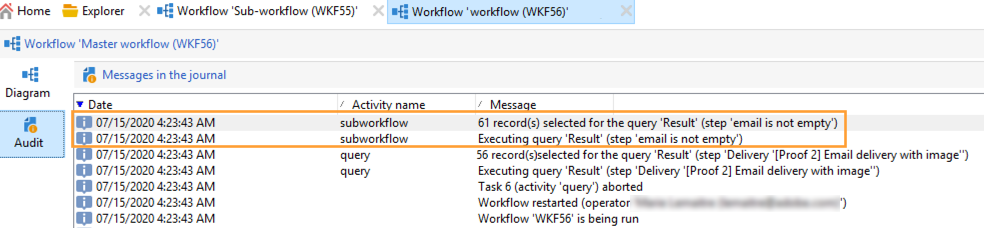

# Delarbetsflöde{#sub-workflow}

Med aktiviteten **[!UICONTROL Sub-workflow]** kan du utlösa körningen av ett annat arbetsflöde och återställa resultatet. Med den här aktiviteten kan du använda komplexa arbetsflöden med ett förenklat gränssnitt.

Du kan anropa flera delarbetsflöden i ett enda arbetsflöde. Delarbetsflöden körs synkront.

I exemplet nedan anropar ett primärt arbetsflöde ett delarbetsflöde med jumps. Mer information om grafiska objekt av hopptyp finns i [det här avsnittet](jump-start-point-and-end-point.md).

1. Skapa ett arbetsflöde som du vill använda som ett underarbetsflöde i ett annat arbetsflöde.
1. Infoga en **[!UICONTROL Jump (end point)]**-aktivitet med prioriteten 1 i början av arbetsflödet. Om du har flera&quot;slutpunkttypshopp&quot; använder Adobe Campaign&quot;slutpunktshoppet&quot; med det lägsta talet.
1. Infoga en **[!UICONTROL Jump (start point)]**-aktivitet med prioritet 2 i slutet av arbetsflödet. Om du har flera&quot;startpunktshopp&quot; använder Adobe Campaign&quot;startpunktshoppet&quot; med det högsta talet.

   

   >[!NOTE]
   >
   >Om delarbetsflödesaktiviteten refererar till ett arbetsflöde med flera **[!UICONTROL Jump]** aktiviteter, körs delarbetsflödet mellan &quot;slutpunktstypen&quot; och det lägsta talet och &quot;startpunktstypen&quot; med det högsta talet.
   >
   >För att delarbetsflödet ska kunna köras på rätt sätt får du bara ha en &quot;slutpunktstyp&quot; som hoppar med det lägsta talet och bara en &quot;startpunktstyp&quot; som hoppar med det högsta talet.

1. Slutför och spara det här delarbetsflödet.
1. Skapa ett primärt arbetsflöde.
1. Infoga en **[!UICONTROL Sub-workflow]**-aktivitet och öppna den.
1. Välj det arbetsflöde som du vill använda i listrutan **[!UICONTROL Workflow template]**.

   

1. Du kan också lägga till ett konfigurationsskript för att ändra det refererade arbetsflödet.
1. Klicka på **[!UICONTROL Ok]**. En utgående övergång skapas automatiskt med etiketten för aktiviteten **[!UICONTROL Jump (start point)]** från det valda arbetsflödet.

   

1. Kör arbetsflödet.

När arbetsflödet som anropades som ett underarbetsflöde har körts behåller det statusen **[!UICONTROL Being edited]**, vilket innebär följande:

* Du kan inte högerklicka på övergångarna för att visa målet.
* Antalet mellanliggande populationer kan inte visas.
* Delarbetsflödets loggar visas i det primära arbetsflödet.

  

>[!NOTE]
>
>Om något fel inträffar i delarbetsflödet pausas det primära arbetsflödet och en kopia av delarbetsflödet skapas.

## Indataparametrar (valfritt) {#input-parameters--optional-}

* tableName
* schema

Varje inkommande händelse måste ange ett mål som definieras av dessa parametrar.

## Utdataparametrar {#output-parameters}

* tableName
* schema
* recCount

Den här uppsättningen med tre värden identifierar den population som frågan riktar sig till. **[!UICONTROL tableName]** är namnet på tabellen som registrerar målidentifierarna, **[!UICONTROL schema]** är schemat för populationen (vanligtvis nms:mottagare) och **[!UICONTROL recCount]** är antalet element i tabellen.

* targetSchema: Det här värdet är arbetstabellens schema. Den här parametern är giltig för alla övergångar med **[!UICONTROL tableName]** och **[!UICONTROL schema]**.
