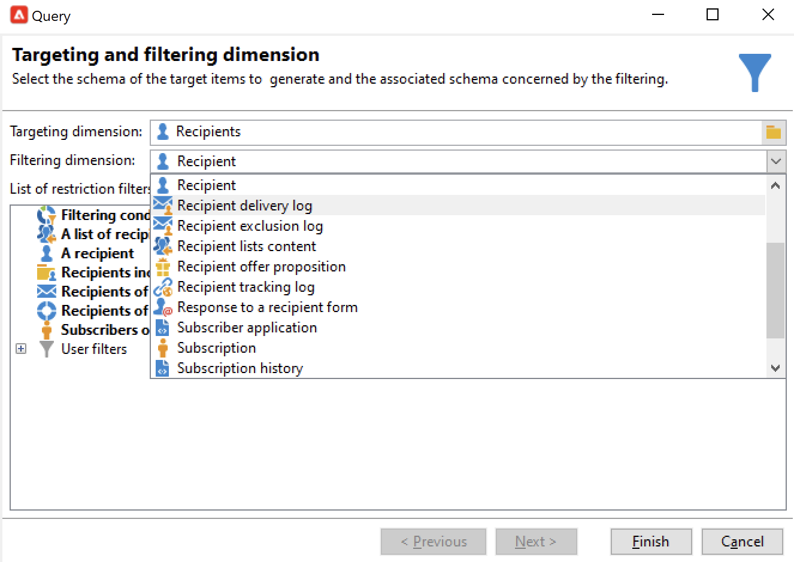
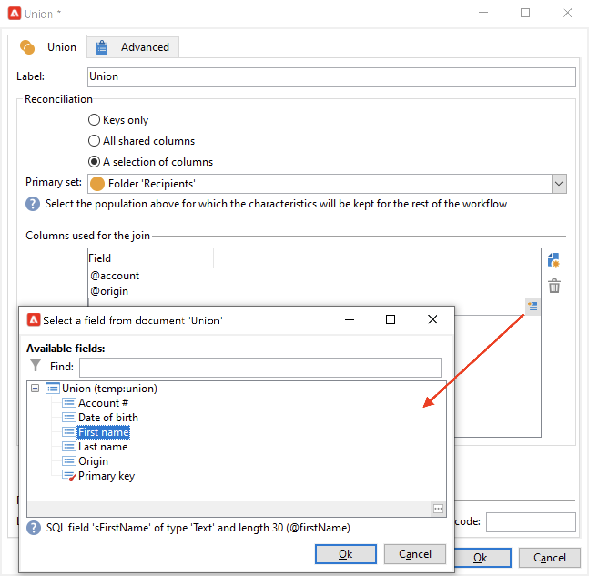

# Skapa ett målinriktat arbetsflöde{#target-data}

Arbetsflödet kan användas för att fråga databasen och segmentera data. Modulen för kampanjarbetsflöde är ett kraftfullt verktyg för att utföra datahanteringsaktiviteter, extrahera, berika och omvandla data, hantera målgrupper och förfina populationer.

Med målarbetsflöden kan du skapa flera leveransmål. Du kan skapa frågor, definiera fackföreningar eller undantag baserat på specifika villkor, lägga till schemaläggning tack vare arbetsflödesaktiviteter. Resultatet av den här målsättningen kan automatiskt överföras till en lista som kan fungera som mål för leveransåtgärder

Förutom dessa aktiviteter kan du med alternativen för datahantering hantera data och komma åt avancerade funktioner för att tillgodose komplexa målgruppsproblem. Mer information finns i [Datahantering](targeting-workflows.md#data-management).

Alla dessa aktiviteter finns på den första arbetsflödesfliken.

>[!NOTE]
>
>Målinriktade aktiviteter beskrivs i [det här avsnittet](activities.md).

Målarbetsflöden kan skapas och redigeras via **[!UICONTROL Profiles and Targets > Jobs > Targeting workflows]** noden i Adobe Campaign-trädet eller via **[!UICONTROL Profiles and Targets > Targeting workflows]** hemsidans meny.

Målarbetsflöden inom ramen för en kampanj lagras med alla kampanjarbetsflöden.

## Viktiga steg för att skapa ett målarbetsflöde {#implementation-steps-}

Steg för att skapa ett arbetsflöde för målinriktning finns i följande avsnitt:

1. **Identifiera** data i databasen - se [Skapa frågor](#create-queries)
1. **Förbered** data för att tillgodose leveransbehov - se [Förbättra och ändra data](#enrich-and-modify-data)
1. **Använd** data för att utföra uppdateringar eller inom en leverans - se [Uppdatera databasen](use-workflow-data.md#update-the-database)

Resultaten av alla berikningar och all hantering som utförs under målgruppsanpassningen lagras och är tillgängliga i personaliseringsfält, särskilt för användning när personaliserade meddelanden skapas. Mer information finns i [Måldata](use-workflow-data.md#target-data).

## Målinriktning och filtrering {#targeting-and-filtering-dimensions}

Vid datasegmenteringsåtgärder mappas målnyckeln till en filtreringsdimension. Med måldimensionen kan du definiera målgruppen för åtgärden: mottagare, mottagare, mottagare, operatör, abonnenter osv. Filtreringsdimensionen gör att du kan välja populationen baserat på vissa kriterier: kontraktsägare, nyhetsbrev, prenumeranter osv.

Om du till exempel vill välja kunder som har haft en livförsäkring i över 5 år väljer du följande målgruppsdimension: **Klienter** och följande filterdimension: **Kontraktsinnehavare**. Du kan sedan definiera filtervillkoren i frågeaktiviteten

Under måldimensionens urvalsfas finns endast kompatibla filtreringsdimensioner i gränssnittet.

Dessa två dimensioner måste vara relaterade. Innehållet i **[!UICONTROL Filtering dimension]** -listan beror på måldimensionen som anges i det första fältet.

Till exempel för mottagare (**mottagare**) kommer följande filterdimensioner att vara tillgängliga:

Med **Besökare** innehåller listan följande filterdimensioner:

## Skapa frågor {#create-queries}

### Arbeta med ytterligare data {#select-data}

A **[!UICONTROL Query]** Med -aktivitet kan du välja grundläggande data för att skapa målpopulationen. Mer information om detta finns i [det här avsnittet](query.md#create-a-query).

Du kan även använda följande aktiviteter för att fråga efter och finjustera data från databasen: [Inkrementell fråga](incremental-query.md), [Läslista](read-list.md).

Det är möjligt att samla in ytterligare data som ska vidarebefordras och behandlas under arbetsflödets hela livscykel. Mer information finns i [Lägg till data](query.md#add-data) och [Redigera ytterligare data](#edit-additional-data).

### Redigera ytterligare data {#edit-additional-data}

När ytterligare data har lagts till kan du redigera dem eller använda dem för att förfina det mål som definierats i frågeaktiviteten.

The **[!UICONTROL Edit additional data...]** kan du visa tillagda data och ändra dem eller lägga till i dem.

Om du vill lägga till data i de tidigare definierade utdatakolumnerna markerar du dem i listan med tillgängliga fält. Om du vill skapa en ny utdatakolumn klickar du på **[!UICONTROL Add]** ikonen, markera fältet och klicka på **[!UICONTROL Edit expression]**.

Klicka på **Avancerat urval** -knappen.

Definiera ett beräkningssätt för det fält som ska läggas till, t.ex. en mängd.

The **[!UICONTROL Add a sub-item]** kan du bifoga beräknade data till samlingen. På så sätt kan du välja ytterligare data från samlingen eller definiera aggregeringsberäkningar för samlingselement.

Underelementen representeras i underträdet till den samling som de mappas till.

Samlingar visas i **[!UICONTROL Collections]** underflik. Du kan filtrera de insamlade elementen genom att klicka på **[!UICONTROL Detail]** ikonen för den valda samlingen. Med filterguiden kan du välja insamlade data och ange de filtreringsvillkor som ska tillämpas på data i samlingen.

### Förfina ett mål med hjälp av ytterligare data {#refine-the-target-using-additional-data}

Med de ytterligare data som samlas in kan du förfina datafiltreringen i databasen. Om du vill göra det klickar du på **[!UICONTROL Refine the target using additional data...]** länk: på så sätt kan du överfiltrera på tillagda data.

### Homogenisera data {#homogenize-data}

I **[!UICONTROL Union]** eller **[!UICONTROL Intersection]** typaktiviteter kan du välja att bara behålla delade ytterligare data för att hålla data konsekventa. I det här fallet kommer den temporära utdatatabellen för den här aktiviteten endast att innehålla de ytterligare data som finns i alla inkommande uppsättningar.

### Avstämning med ytterligare data {#reconciliation-with-additional-data}

Under datavstämningsfaserna (**[!UICONTROL Union]**, **[!UICONTROL Intersection]**, osv. aktiviteter) kan du välja vilka kolumner som ska användas för datavstämning från de andra kolumnerna. Det gör du genom att konfigurera en avstämning för ett urval kolumner och ange huvuduppsättningen. Markera sedan kolumnerna i fönstrets nedre kolumn, så som visas i följande exempel:

Markera ett uttryck och bekräfta.

### Skapa delmängder {#create-subsets}

The **[!UICONTROL Split]** Med -aktivitet kan du skapa delmängder på villkor som definieras via extraheringsfrågor. När du redigerar ett filtervillkor för populationen för varje delmängd får du sedan tillgång till standardfrågeaktiviteten som gör att du kan definiera målsegmenteringsvillkoren.

Du kan dela upp ett mål i flera delmängder genom att endast använda ytterligare data som filtreringsvillkor, eller utöver måldata. Du kan också använda externa data om du har köpt **Åtkomst till federerade data** alternativ.

Mer information om detta finns i [det här avsnittet](#create-subsets-using-the-split-activity).

## Segmentdata {#segment-data}

### Kombinera flera mål (unionen) {#combine-several-targets--union-}

Med unionsaktiviteten kan du kombinera resultatet av flera aktiviteter i en övergång. Satser behöver inte nödvändigtvis vara homogena.

Följande datavstämningsalternativ är tillgängliga:

* **[!UICONTROL Keys only]**

   Detta alternativ kan användas om indatapulserna är homogena.

* **[!UICONTROL All columns in common]**

   Med det här alternativet kan du stämma av data baserat på alla kolumner som är gemensamma för målets olika populationer.

   Adobe Campaign identifierar kolumner utifrån deras namn. Tröskelvärdet accepteras: En &quot;E-post&quot;-kolumn kan till exempel tolkas som identisk med en &#39;@email&#39;-kolumn.

* **[!UICONTROL A selection of columns]**

   Välj det här alternativet om du vill definiera en lista över kolumner som datavstämning ska tillämpas på.

   Börja med att markera huvuduppsättningen (den som innehåller källdata) och sedan de kolumner som ska användas för kopplingen.

   

   >[!CAUTION]
   >
   >Under datavstämning dedupliceras inte populationer.

   Du kan begränsa populationsstorleken till ett visst antal poster. Om du vill göra det klickar du på lämpligt alternativ och anger antalet poster som ska sparas.

   Ange även prioriteten för inkommande populationer: I fönstrets nedre del visas de inkommande övergångarna för unionsaktiviteten och du kan sortera dem med de blå pilarna till höger om fönstret.

   Posterna hämtas först från populationen i den första ingående övergången i listan och sedan, om det maximala antalet inte har uppnåtts, tas de från populationen i den andra ingående övergången osv.

   

### Extrahera leddata (skärning) {#extract-joint-data--intersection-}

Med skärningspunkten kan du bara återställa de linjer som delas av populationerna av inkommande övergångar. Den här aktiviteten måste konfigureras på samma sätt som unionsaktiviteten.

Dessutom är det bara möjligt att behålla ett urval av kolumner, eller bara de kolumner som delas av den inkommande populationen.

Skärningsaktiviteten beskrivs i [Skärningspunkt](intersection.md) -avsnitt.

### Uteslut en population (Uteslutning) {#exclude-a-population--exclusion-}

Med exkluderingsaktiviteten kan du utesluta element i ett mål från en annan målpopulation. Den här aktivitetens målgruppsdimension kommer att vara huvuduppsättningens.

Om det behövs kan du ändra inkommande tabeller. För att utesluta ett mål från en annan dimension måste detta mål återställas till samma måldimension som huvudmålet. Klicka på **[!UICONTROL Add]** och ange villkoren för dimensionsändring.

Datavstämning utförs antingen via en identifierare, en axel som ändras eller en koppling.

### Skapa delmängder med aktiviteten Dela {#create-subsets-using-the-split-activity}

The **[!UICONTROL Split]** är en standardaktivitet som gör att du kan skapa så många uppsättningar som behövs via en eller flera filterdimensioner, samt generera antingen en utdataövergång per delmängd eller en unik övergång.

Ytterligare data som förmedlas av den inkommande övergången kan användas i filtreringsvillkoren.

För att konfigurera det måste du först välja villkor:

1. Dra och släpp en **[!UICONTROL Split]** aktivitet.
1. I **[!UICONTROL General]** väljer du ett alternativ: **[!UICONTROL Use data from the target and additional data]**, **[!UICONTROL Use the additional data only]** eller **[!UICONTROL Use external data]**.
1. Om **[!UICONTROL Use data from the target and additional data]** Om du väljer det här alternativet kan du använda alla data som överförs av den inkommande övergången med målinriktningsdimensionen.

   

   När delmängder skapas används de ovannämnda filterparametrarna.

   Om du vill definiera filtreringsvillkor väljer du **[!UICONTROL Add a filtering condition on the inbound population]** och klicka på **[!UICONTROL Edit...]** länk. Ange sedan filtervillkoren för att skapa den här delmängden.

   

   Ett exempel som visar hur du använder filtervillkor i **[!UICONTROL Split]** aktiviteten att dela in målet i olika populationer beskrivs i [det här avsnittet](cross-channel-delivery-workflow.md).

   The **[!UICONTROL Label]** I kan du ge den nyskapade delmängden ett namn som matchar den utgående övergången.

   Du kan också tilldela en segmentkod till delmängden för att identifiera den och använda den för att ange målpopulationen.

   Om det behövs kan du ändra målinriktnings- och filtreringsdimensionerna individuellt för varje delmängd som du vill skapa. Det gör du genom att redigera delmängdens filtreringsvillkor och kontrollera **[!UICONTROL Use a specific filtering dimension]** alternativ.

   

1. Om **[!UICONTROL Use the additional data only]** Om du väljer det här alternativet erbjuds endast ytterligare data för delmängdsfiltrering.

1. Om **Åtkomst till federerade data** är aktiverat, **[!UICONTROL Use external data]** I kan du bearbeta data i en extern databas som redan är konfigurerad, eller skapa en ny anslutning till en databas.

Sedan måste vi lägga till nya delmängder:

1. Klicka på **[!UICONTROL Add]** och ange filtervillkoren.

   

1. Definiera filterdimensionen i **[!UICONTROL General]** aktivitetens flik (se ovan). Den gäller som standard för alla delmängder.

   

1. Om det behövs kan du ändra filtreringsdimensionen för varje delmängd individuellt. Detta gör att du kan skapa en uppsättning för alla Gold-kortinnehavare, en för alla mottagare som klickade i det senaste nyhetsbrevet och en tredjedel för personer mellan 18 och 25 år som gjorde ett köp i butiken de senaste 30 dagarna, alla med samma delade aktivitet. Om du vill göra det väljer du **[!UICONTROL Use a specific filtering dimension]** och välj datafiltreringssammanhang.

När deluppsättningar har skapats visar den delade aktiviteten som standard så många utdataövergångar som det finns deluppsättningar:

Du kan gruppera alla dessa delmängder i en enda utdataövergång. I det här fallet visas länken till respektive delmängd i segmentkoden. Om du vill göra det väljer du **[!UICONTROL Generate all subsets in the same table]** alternativ.

Du kan till exempel placera en enda leveransaktivitet och anpassa leveransinnehållet baserat på segmentkoden för varje mottagaruppsättning.

Du kan också skapa delmängder med **[!UICONTROL Cells]** aktivitet. Mer information finns i [Celler](cells.md) -avsnitt.

### Använd måldata {#using-targeted-data}

När data har identifierats och beretts kan de användas i följande sammanhang:

* Du kan uppdatera data i databasen efter dataändringar i de olika arbetsflödesstegen.

   Mer information finns här: [Uppdatera data](update-data.md).

* Du kan även uppdatera innehållet i befintliga listor.

   Mer information finns i [Listuppdatering](list-update.md).

* Du kan förbereda eller starta leveranser direkt i arbetsflödet.

   Mer information finns i [Leverans](delivery.md), [Leveranskontroll](delivery-control.md) och [Kontinuerlig leverans](continuous-delivery.md).

## Datahantering {#data-management}

I Adobe Campaign kombinerar datahanteringen en uppsättning aktiviteter för att lösa komplexa målgruppsproblem genom att erbjuda mer effektiva och flexibla verktyg. På så sätt kan ni implementera en konsekvent hantering av all kommunikation med en kontakt genom att använda information som hör till deras kontrakt, prenumerationer, reaktivitet av leveranser osv. Datahantering låter dig följa datas livscykeln under segmenteringsåtgärder och då särskilt:

* Förenkla och optimera målinriktningsprocesser genom att inkludera data som inte är modellerad i datakartläggningen (skapa nya tabeller: lokalt tillägg till varje arbetsflöde per målgrupp beroende på konfiguration).
* Behålla och överföra buffertberäkningar. Särskilt under faserna då målgrupper konstrueras eller för databasadministration.
* Åtkomst till externa baser (tillval): heterogena databaser som beaktas under målinriktningsprocessen.

För att genomföra dessa åtgärder erbjuder Adobe Campaign

* Datainsamling: [Filöverföring](file-transfer.md), [Inläsning av data (fil)](data-loading--file-.md), [Datainläsning (RDBMS)](data-loading--rdbms-.md), [Uppdatera data](update-data.md). Detta första steg i datainsamlingen förbereder data så att de kan behandlas i andra aktiviteter. Flera parametrar måste övervakas för att arbetsflödet ska fungera korrekt och ge de förväntade resultaten. När du till exempel importerar data måste primärnyckeln (Pkey) för dessa data vara unik för varje post.
* Målinriktade aktiviteter har förbättrats med datahanteringsalternativ: [Fråga](query.md), [Union](union.md), [Skärningspunkt](intersection.md), [Dela](split.md). På så sätt kan du konfigurera en union eller en skärning mellan data från flera olika måldimensioner, så länge datavstämning är möjligt.
* Dataomvandlingsaktiviteter: [Berikning](enrichment.md), [Ändra dimension](change-dimension.md).

>[!CAUTION]
>
>När två arbetsflöden är länkade innebär det inte att alla data som är länkade till dem tas bort om du tar bort ett källtabellselement.
>  
>Om du t.ex. tar bort en mottagare via ett arbetsflöde tas inte hela mottagarens leveranshistorik bort. Om du tar bort en mottagare direkt i mappen Mottagare tas alla data som är länkade till den här mottagaren bort.

### Förbättra och ändra data {#enrich-and-modify-data}

Förutom måldimensionen kan du med filtreringsdimensionen ange vilken typ av insamlade data som ska användas. Se [det här avsnittet](targeting-workflows.md#targeting-and-filtering-dimensions).

Identifierade och insamlade data kan berikas, aggregeras och ändras för att optimera målkonstruktionen. För att göra detta, utöver de databehandlingsaktiviteter som beskrivs i [det här avsnittet](#segmen-data)använder du följande:

* The **[!UICONTROL Enrichment]** kan du snabbt lägga till kolumner i ett schema samt lägga till information i vissa element. Den beskrivs i [Berikning](enrichment.md) i databasen med aktiviteter.
* The **[!UICONTROL Edit schema]** kan du ändra strukturen för ett schema. Den beskrivs i [Redigera schema](edit-schema.md) i databasen med aktiviteter.
* The **[!UICONTROL Change dimension]** kan du ändra målinriktningsdimensionen under målkonstruktionscykeln. Den beskrivs i [Ändra dimension](change-dimension.md) -avsnitt.
