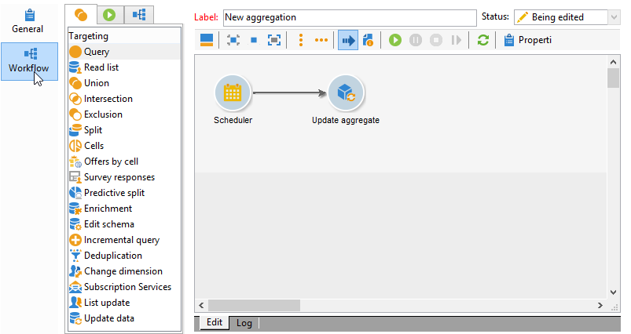

# Uppdatera aggregat{#update-aggregate}

Aggregat definieras på kubnivå för rapportering. A **[!UICONTROL Workflow]** -fliken är tillgänglig när du konfigurerar en mängd.

Mer information om kuber och hur du använder aggregat i Adobe Campaign finns i [Campaign Classic v7-dokumentation](https://experienceleague.adobe.com/docs/campaign-classic/using/reporting/designing-reports-with-cubes/about-cubes.html){target=&quot;_blank&quot;}.

Om du vill uppdatera en mängd redigerar du **[!UICONTROL Update aggregate]** och välj den kub och mängd som ska uppdateras.

Du kan göra en **Fullständig uppdatering** eller en **Delvis uppdatering**.

Som standard utförs en fullständig uppdatering under varje beräkning. Om du vill aktivera en partiell uppdatering väljer du det relevanta alternativet och definierar uppdateringsvillkoren.

**God praxis**: a **[!UICONTROL Scheduler]** kan användas för att ange frekvensen för uppdateringar av beräkningar.

