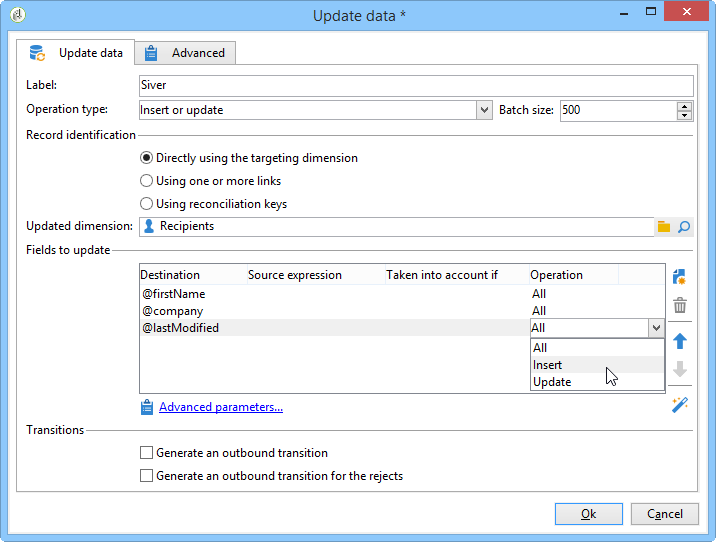

# Uppdatera data{#update-data}

En aktivitet av typen **Uppdatera data** utför en massuppdatering av fälten i databasen.

## Åtgärdstyp {#operation-type}

I fältet **[!UICONTROL Operation type]** kan du välja vilken process som ska utföras på data i databasen:

* **[!UICONTROL Insert or update]**: lägg till eller uppdatera data om det redan har lagts till.
* **[!UICONTROL Insert]**: lägg endast till data.
* **[!UICONTROL Update]**: endast uppdatera data.
* **[!UICONTROL Update and merge collections]**: Uppdatera data, välj en primär post och länka sedan element som är länkade till dubbletterna i den här primära posten. Dubbletter kan sedan tas bort utan att överordnade element skapas.
* **[!UICONTROL Delete]**: ta bort data.

I fältet **[!UICONTROL Batch size]** kan du välja antalet inkommande övergångselement som ska uppdateras. Om du till exempel anger 500 uppdateras de första 500 posterna som behandlas.

## Registrerings-ID {#record-identification}

Ange hur posterna i databasen ska identifieras:

* Om dataposter relaterar till en befintlig måldimension väljer du alternativet **[!UICONTROL By directly using the targeting dimension]** och markerar det i fältet **[!UICONTROL Updated dimension]**.

  Du kan visa fälten för den valda dimensionen med förstoringsglasknappen **[!UICONTROL Edit this link]**.

* Annars anger du en eller flera länkar som gör det möjligt att identifiera data i databasen eller att använda avstämningsnycklar direkt.

## Markera de fält som ska uppdateras {#selecting-the-fields-to-be-updated}

Använd alternativet **[!UICONTROL Automatically associate fields with the same name]** för att Adobe Campaign automatiskt ska identifiera de fält som ska uppdateras.

Du kan också använda ikonen **[!UICONTROL Insert]** för att manuellt välja de databasfält som ska uppdateras.

Markera alla fält som ska uppdateras och, om det behövs, lägg till villkor beroende på vilka uppdateringen ska utföras. Om du vill göra det använder du kolumnen **[!UICONTROL Taken into account if]**. Villkoren tillämpas efter varandra och i enlighet med ordningen i listan. Använd pilarna till höger för att ändra uppdateringsordningen.

Du kan använda samma målfält flera gånger.

Inom en **[!UICONTROL Insert or update]**-åtgärd kan du välja vilken kampanj som ska användas, antingen individuellt eller för varje fält. Det gör du genom att markera det önskade värdet i kolumnen **[!UICONTROL Operation]**.

Fälten **[!UICONTROL modifiedDate]**, **[!UICONTROL modifiedBy]**, **[!UICONTROL createdDate]** och **[!UICONTROL createdBy]** uppdateras automatiskt under datauppdateringar, såvida inte deras hanteringsläge har konfigurerats specifikt i fältuppdateringstabellen.

Postuppdatering utförs bara för poster som innehåller minst en skillnad. Om värdena är desamma utförs ingen uppdatering.

Med länken **[!UICONTROL Advanced parameters]** kan du ange ytterligare alternativ för att hantera uppdateringar av data och dubbletter. Du kan också:

* **[!UICONTROL Disable automatic key management]**.
* **[!UICONTROL Disable audit]**.
* **[!UICONTROL Empty the destination value if the source value is empty (NULL)]**. Det här alternativet är automatiskt markerat som standard.
* **[!UICONTROL Update all columns with matching names]**.
* Ange villkor som beaktar källelement med hjälp av ett uttryck i fältet **[!UICONTROL Enabled if]**.
* Ange villkor som hanterar dubbletter med hjälp av ett uttryck. Om du markerar alternativet **[!UICONTROL Ignore records which concern the same target]** beaktas bara den första i listan med uttryck.

**[!UICONTROL Generate an outbound transition]**

Skapar en utgående övergång som ska aktiveras i slutet av körningen. Uppdatering signalerar vanligtvis slutet på ett målarbetsflöde och alternativet är därför inte aktiverat som standard.

**[!UICONTROL Generate an outbound transition for the rejects]**

Skapar en utgående övergång som innehåller poster som inte har bearbetats korrekt efter uppdateringen (till exempel om det finns en dubblett). Uppdateringen markerar vanligtvis slutet av ett målarbetsflöde och därför är alternativet inte aktiverat som standard.

## Uppdatera och sammanfoga samlingar {#updating-and-merging-collections}

Genom att uppdatera data och sammanfoga samlingar kan du uppdatera data i en post genom att använda data från en eller flera sekundära poster, så att bara en post sparas om du vill. Uppdateringarna hanteras av en uppsättning regler.

>[!NOTE]
>
>Med det här alternativet kan du även bearbeta referenser till sekundära poster från arbetsflödestabeller (targetWorkflow), leveranser (targetDelivery) och listor (targetList). Om det behövs visas länkarna i listan där du väljer fält och samlingar.

1. Välj åtgärden **[!UICONTROL Update and merge collections]**.

   

1. Välj prioritetsordning för länkarna. På så sätt kan du identifiera huvudposten. De tillgängliga länkarna varierar beroende på den inkommande övergången.

   

1. Markera de samlingar som ska flyttas till den primära posten och de fält som ska uppdateras.

   Ange de regler som gäller för dessa när en eller flera sekundära poster identifieras. Du kan använda uttrycksverktyget för att göra detta. Genom att till exempel ange att det är det senast uppdaterade värdet av alla olika poster som måste behållas.

   Ange sedan de villkor som ska beaktas för regeln.

   Ange slutligen vilken typ av uppdatering som ska utföras. Du kan till exempel välja att ta bort de sekundära posterna efter att du har uppdaterat data.

   Du kan till exempel konfigurera sammanslagningen av samlingar som innehåller heterogena data, till exempel en lista över prenumerationer för en mottagare. Med hjälp av regler kan du också skapa nya prenumerationshistorik från prenumerationer på sekundära poster eller till och med flytta listan över prenumerationer från en sekundär post till en primär post.

1. Ange i vilken ordning du vill att de sekundära posterna ska behandlas genom att välja **[!UICONTROL Advanced parameters]** > **[!UICONTROL Duplicates]**.

   

Data för sekundära poster kopplas till huvudposten om de definierade reglerna är tillämpliga. Beroende på vilken typ av uppdatering som har valts kan de sekundära posterna tas bort.

## Exempel: Uppdatera data efter en anrikning {#example--update-data-following-an-enrichment}

[Steg 2: Skriver anrikade data till avsnittet Inköpsregister](create-a-summary-list.md#step-2--writing-enriched-data-to-the--purchases--table) i användningsexemplet där detaljerad information om hur du skapar en sammanfattning ger ett exempel på en datauppdatering efter en anrikningsaktivitet.

## Indataparametrar {#input-parameters}

* tableName
* schema

Varje inkommande händelse måste ange ett mål som definieras av dessa parametrar.
