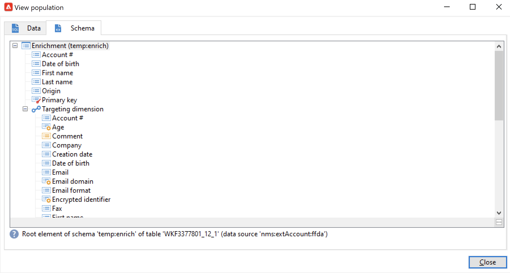

# Använd arbetsflödesdata{#how-to-use-workflow-data}

Du kan använda arbetsflödesaktiviteter för att utföra flera uppgifter. Nedan finns exempel på användning för att uppdatera databasen genom att skapa listor, hantera prenumerationer, skicka meddelanden via ett arbetsflöde eller berika leveranser och deras målgrupper.

En uppsättning användningsfall för arbetsflöden finns i [det här avsnittet](workflow-use-cases.md).

## Datas livscykel {#data-life-cycle}

### Tillfälligt arbetsflödestabell {#work-table}

I arbetsflöden lagras data som transporteras från en aktivitet till en annan i en temporär arbetstabell.

Dessa data kan visas och analyseras genom att högerklicka på lämplig övergång.


Välj den relevanta menyn för att göra detta:

* **[!UICONTROL Display the target...]**

  Den här menyn visar tillgängliga data för målpopulationen.

  

  Du kan komma åt arbetstabellens struktur på fliken **[!UICONTROL Schema]**.

  

  Mer information om detta finns i [det här avsnittet](monitor-workflow-execution.md#worktables-and-workflow-schema).

* **[!UICONTROL Analyze target...]**

  Använd den här menyn för att komma åt den beskrivande analysguiden som gör att du kan generera statistik och rapporter om övergångsdata.

  Lär dig hur du använder den beskrivande analysguiden i [Campaign Classic v7-dokumentationen](https://experienceleague.adobe.com/docs/campaign-classic/using/reporting/analyzing-populations/about-descriptive-analysis.html){target="_blank"}.

Måldata rensas när arbetsflödet körs. Endast den sista arbetstabellen är tillgänglig. Du kan konfigurera arbetsflödet så att alla arbetsregister förblir tillgängliga: markera alternativet **[!UICONTROL Keep the result of interim populations between two executions]** i arbetsflödesegenskaperna.


>[!CAUTION]
>
>Det här alternativet får **aldrig** checkas in i ett **produktion**-arbetsflöde. Det här alternativet används för att analysera resultaten och är utformat endast för teständamål och ska därför endast användas i utvecklings- eller staging-miljöer.


### Utnyttja måldata {#target-data}

De data som lagras i arbetsflödets temporära arbetstabell är tillgängliga för personaliseringsåtgärder. Data kan användas i [anpassningsfälten](../../v8/send/personalization-fields.md).

Detta gör att du till exempel kan använda data som samlats in via en lista i en leverans. Använd följande syntax:

```
%= targetData.FIELD %
```

Anpassningselement av typen **[!UICONTROL Target extension]** (targetData) är inte tillgängliga för arbetsflöden med målinriktning. Leveransmålet måste byggas in i arbetsflödet och anges i den inkommande övergången för leveransen.

I följande exempel samlar du in en lista med information om kunder som ska användas i ett personligt e-postmeddelande. Använd följande steg:

1. Skapa ett arbetsflöde för att samla in information, stämma av den med data som redan finns i databasen och starta sedan en leverans.

   

1. I vårt exempel är filinnehållet följande:

   ```
   Music,First name,Last name,Account,CD/DVD,Card
   Pop,David,BLAIR,4323,CD,0
   Rock,Daniel,ARCARI,3222,DVD,1
   Disco,Uma,ALTON,0488,DVD,0
   Jazz,Paul,BOLES,6475,CD,1
   Jazz,David,BOUKHARI,0841,DVD,1
   [...]
   ```

   Konfigurera aktiviteten **[!UICONTROL Data loading (file)]** så här för att läsa in filen:

   

1. Konfigurera aktiviteten **[!UICONTROL Enrichment]** för att stämma av insamlade data med data som redan finns i Adobe Campaign-databasen. Här är avstämningsnyckeln kontonumret:

   

1. Konfigurera sedan **[!UICONTROL Delivery]**: den skapas baserat på en mall och mottagarna anges av den inkommande övergången.

   

   >[!CAUTION]
   >
   >Endast data i övergången får användas för att anpassa leveransen. Anpassningsfält av typen **targetData** är bara tillgängliga för den inkommande populationen av aktiviteten **[!UICONTROL Delivery]**.

1. Använd de fält som samlats in i arbetsflödet i leveransmallen.

   Om du vill göra det infogar du **[!UICONTROL Target extension]**-typanpassningsfält.

   

   Här vill vi infoga kundens favoritmusikgenre och medietyp (CD eller DVD) enligt den fil som samlas in i arbetsflödet.

   Dessutom kommer vi att lägga till en kupong för förmånskortinnehavare, dvs. mottagare för vilka &#39;kortet&#39; är lika med 1.

   

   Data av typen **[!UICONTROL Target extension]** (targetData) infogas i leveranser med samma egenskaper som alla anpassningsfält. De kan också användas i ämnet, länketiketterna eller själva länkarna.


## Uppdatera databasen {#update-the-database}

Alla insamlade data kan användas för att uppdatera databasen eller i leveranser. Du kan till exempel utöka möjligheterna att personalisera innehåll i meddelanden (ange antalet kontrakt i meddelandet, ange den genomsnittliga kundvagnen under det senaste året, osv.) eller målgruppsanpassning (skicka ett meddelande till kontraktsparter, rikta in de 1 000 bästa abonnenterna på onlinetjänster osv.). Dessa data kan också exporteras eller arkiveras i en lista.

### Uppdatera listor  {#list-updates}

Data från Adobe Campaign-databasen och de befintliga listorna kan uppdateras med hjälp av två dedikerade aktiviteter:

* Med aktiviteten **[!UICONTROL List update]** kan du lagra arbetstabeller i en datalist.

  Du kan välja en befintlig lista eller skapa den. I det här fallet beräknas namnet och eventuellt postmappen.

  

  Se [Listuppdatering](list-update.md).

* Aktiviteten **[!UICONTROL Update data]** utför en massuppdatering av fälten i databasen.

  Mer information finns i [Uppdatera data](update-data.md).

### Hantera prenumerationer {#subscription-management}

Mer information om att prenumerera på och avsluta prenumerationer på en informationstjänst via ett arbetsflöde finns i [Prenumerationstjänster](subscription-services.md).
