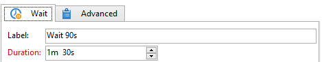

# Vänta{#wait}

En **Wait**-aktivitet aktiverar övergången efter en tidsfördröjning på mellan några sekunder och flera månader. En vänteuppgift blockerar inte körningen av andra uppgifter. Arbetsflödet kan köra uppgifter parallellt medan den här uppgiften väntar.

Du kan ange etiketten och vänta med redigeraren, som i exemplet nedan:

I fältet **[!UICONTROL Duration]** kan värdet uttryckas i valfri enhet: (enligt operatorns nationella inställningar):

* Om nationella inställningar inte anges: **s** för sekunder, **m** för minuter, **h** för timmar, **d** för dagar, **y** för år. Vid tidpunkten för godkännandet konverteras värdet automatiskt till den mest läsbara enheten.

  Standardenheten är dagen (**d**).

* Om de regionala inställningarna till exempel är inställda på Français: **s** för sekunder, **mn** för minuter, **h** för timmar, **j** för dagar, **m** för månader, **a** för år. Vid tidpunkten för godkännandet konverteras värdet automatiskt till den mest läsbara enheten, som i exemplet ovan konverterades **90s** till **1mn 30s**.

  Standardenheten är dagen (**d**).
