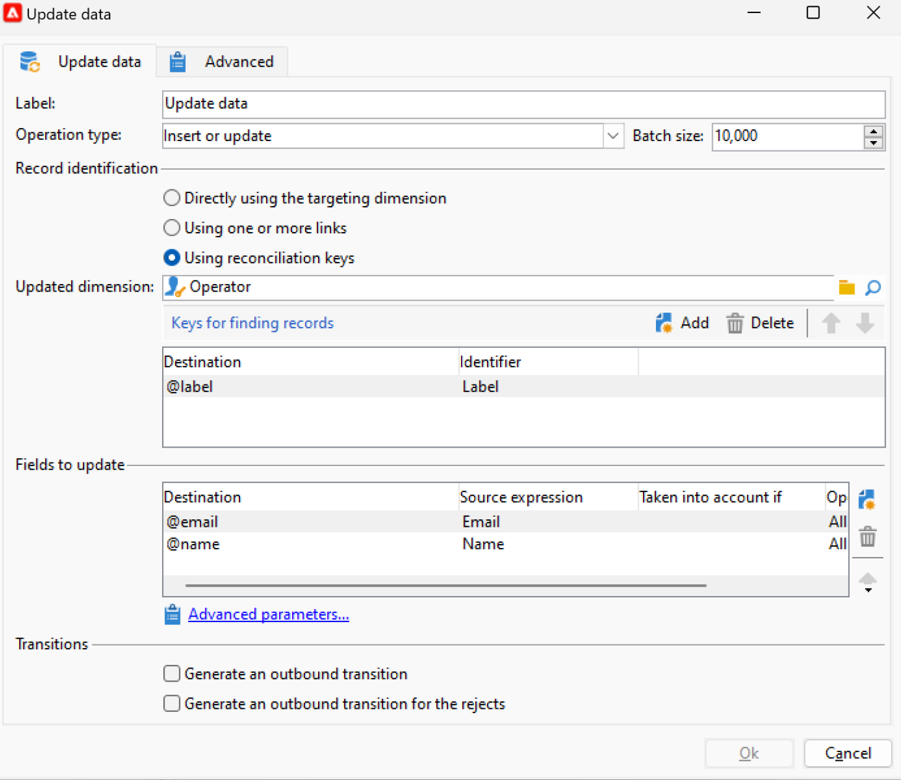
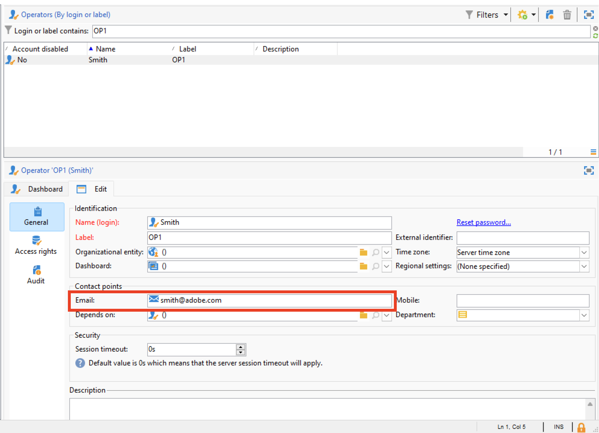
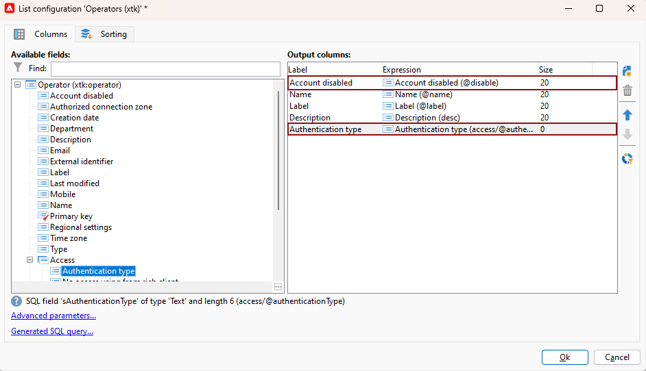

# Migrera kampanjoperatorer till Adobe Identity Management System (IMS) {#migrate-users-to-ims}

Från och med Campaign v8.6 förbättras autentiseringsprocessen till Campaign v8. Alla operatorer använder [Adobe Identity Management System (IMS)](https://helpx.adobe.com/enterprise/using/identity.html){target="_blank"} **only** för att ansluta till Campaign. Det går inte längre att ansluta till användare/lösenord (dvs. inbyggd autentisering). Adobe rekommenderar att du utför migreringen i Campaign v8.5.2 för att smidigt kunna migrera till Campaign v8.6.

Om du migrerar till Campaign v8 som kund av hanterade tjänster i Campaign Classic v7 gäller den här proceduren även dig.

I den här artikeln beskrivs stegen som krävs för att migrera en teknisk operatör till ett tekniskt konto på Adobe Developer-konsolen.

## Vad har ändrats?{#move-to-ims-changes}

Med Campaign v8 bör alla vanliga användare redan ansluta till Adobe Campaign klientkonsol via Adobe ID via Adobe Identity Management System (IMS). I vissa äldre konfigurationer var dock användar-/lösenordsanslutningar fortfarande tillgängliga. **Det här är inte längre tillåtet att starta Campaign v8.6.**

Som en del av arbetet med att förstärka säkerhets- och autentiseringsprocessen anropar nu Adobe Campaign klientprogram Campaign-API:er direkt med IMS-token för tekniskt konto. Migreringen för tekniska operatorer beskrivs i en dedikerad artikel på [den här sidan](ims-migration.md).

Den här ändringen gäller från och med Campaign v8.5.2 och är **obligatorisk** med början av Campaign v8.6.

## Påverkas du?{#migrate-ims-impacts}

Om operatörer i organisationen ansluter till Campaign-klientkonsolen med hjälp av sina inloggnings-/lösenord (dvs. inbyggd autentisering) påverkas du och måste migrera dessa operatorer till Adobe IMS enligt nedan.

Migrering till [Adobe Identity Management System (IMS)](https://helpx.adobe.com/enterprise/using/identity.html){target="_blank"} är ett säkerhetskrav för att göra dina miljöer säkra och standardiserade, eftersom de flesta andra Adobe Experience Cloud-lösningar och -appar redan finns på IMS.

## Hur migrerar jag?{#ims-migration-procedure}

### Förhandskrav{#ims-migration-prerequisites}

Innan du startar migreringsprocessen måste du kontakta din Adobe-representant (Transition Manager) så att de tekniska teamen i Adobe kan migrera dina befintliga operatörsgrupper och namngivna rättigheter till Adobe Identity Management System (IMS).

### Viktiga steg {#ims-migration-steps}

Viktiga steg för migreringen visas nedan:

1. Adobe uppgraderar dina miljöer till Campaign v8.5.2.
1. Efter uppgraderingen kan du fortfarande skapa nya användare med båda metoderna, som systemspecifik användare eller med IMS.
1. Din interna Campaign-administratör måste lägga till unika e-postmeddelanden till alla inbyggda användare på Campaign-klientkonsolen och bekräfta för din Adobe Transition Manager när detta är klart. Det här steget beskrivs närmare i [det här avsnittet](#ims-migration-id).
1. Arbeta med Adobe för att säkra ett datum för när Adobe ska köra automatiserad migrering för icke-tekniska användare (operatörer) och produktprofiler. Det här steget kräver ett timmars fönster utan driftstopp för någon av dina förekomster.
1. Din interna Campaign-administratör validerar dessa ändringar och godkänner dem. Efter den här migreringen får du inte längre skapa någon ytterligare operator som autentiseras med användarens inloggning och lösenord.

Nu kan du migrera dina tekniska operatorer till Adobe Developer Console enligt informationen i [den här tekniken](ims-migration.md). Det här steget är obligatoriskt om du använder Campaign-API:er.

När migreringen är klar bekräftar du till din Adobe Transition Manager: Adobe markerar sedan migreringen som slutförd och blockerar skapande av nya inbyggda användare och inloggning. Miljön är sedan säker och standardiserad.

## Vanliga frågor och svar {#ims-migration-faq}

### När kan jag starta migreringen? {#ims-migration-start}

En förutsättning för migrering till [Adobe Identity Management System (IMS)](https://helpx.adobe.com/enterprise/using/identity.html){target="_blank"} är att du uppgraderar din miljö till Campaign v8.5.2.

Du kan starta IMS-migrering på din scenmiljö när den har uppgraderats till Campaign v8.5.2 och därefter planera för produktionsmiljön.

### Vad händer efter en uppgradering av Campaign v8.5.2? {#ims-migration-after-upgrade}

När dina miljöer har uppgraderats till Campaign v8.5.2 kan du initiera övergången till [Adobe Identity Management System (IMS)](https://helpx.adobe.com/enterprise/using/identity.html){target="_blank"}.

Det går fortfarande att skapa nya inbyggda användare tills IMS-migreringen är klar.

### När är migreringen klar? {#ims-migration-end}

När slutanvändarmigreringen och den tekniska användarmigreringen till Adobe Identity Management System (IMS) är klar måste du kontakta Adobe Transition Manager så att Adobe kan markera migreringen som slutförd och blockera användargenerering från klientkonsolen och inaktivera inloggning för inbyggda användare.

### Hur skapar man användare efter migreringen? {#ims-migration-native}

När den fullständiga IMS-migreringen är klar tillämpar Adobe de begränsningar som kommer att blockera skapandet av nya inbyggda användare. Dessa begränsningar tillämpas inte förrän IMS-migreringen är klar.

För nya kunder är det inte tillåtet att skapa nya inbyggda användare från början.

Som kampanjadministratör kan du bevilja behörigheter till användare i organisationen via Adobe Admin Console och Campaign-klientkonsolen. Användare loggar in på Adobe Campaign med sin Adobe ID. Läs mer i [den här dokumentationen](../../v8/start/gs-permissions.md).

### Hur lägger jag till e-post för befintliga användare? {#ims-migration-id}

Som kampanjadministratör måste du lägga till e-post-ID:n till alla inbyggda användare från klientkonsolen. Gör så här:

1. Anslut till klientkonsolen och bläddra till **Administration > Åtkomsthantering > Operatorer**.
1. Välj den operator som ska uppdateras i operatorlistan.
1. Ange operatörens e-postadress i avsnittet **Kontaktpunkter** i operatorformuläret.
1. Spara ändringarna.

Som arbetsflödesansvarig eller Campaign-administratör kan du även utföra en satsvis uppdatering av dina operatorer med ett arbetsflöde.

+++Nyckelsteg för att uppdatera operatorerna med ett arbetsflöde

Så här gör du en satsvis uppdatering av de inbyggda operatorerna:

1. Skapa ett arbetsflöde för att i en CSV-fil extrahera alla operatorer som ansluter till Campaign med det inbyggda autentiseringsläget. Använd en **Fråga**-aktivitet och en **dataextraheringsaktivitet (fil)**-aktivitet för att skapa CSV-filen. Du kan exportera följande kolumner för varje operator baserat på deras profildata: `Name, Label`.

   Läs mer om aktiviteten **Fråga** i [den här sidan](../../automation/workflow/query.md)

   Läs mer om aktiviteten **Dataextrahering (fil)** i [den här sidan](../../automation/workflow/extraction-file.md)

1. Uppdatera CSV-filen med en ny kolumn som innehåller operatörernas e-postmeddelanden.

1. Skapa ett arbetsflöde för import av uppdaterade data, med en **datainläsningsaktivitet (fil)** och en **Uppdatera data**-aktivitet i arbetsflödet.

   {width="70%"}

1. Redigera aktiviteten **Datainläsning (fil)** och definiera inställningarna för att läsa in den uppdaterade CSV-filen enligt exemplet nedan.

   {width="70%"}

   Läs mer om aktiviteten **Datainläsning (fil)** i [den här sidan](../../automation/workflow/data-loading-file.md)

1. Redigera aktiviteten **Uppdatera data** och definiera inställningarna enligt exemplet nedan. Observera att den **uppdaterade dimensionen** har ändrats till `Operators (xtk)`.

   {width="70%"}

   Läs mer om aktiviteten **Uppdatera data** på [den här sidan](../../automation/workflow/update-data.md)

1. Kör arbetsflödet och kontrollera resultaten. E-postadressen har lagts till i operatörens profil.

   {width="70%"}

+++

### Hur loggar jag in på Campaign via IMS? {#ims-migration-log}

Lär dig hur du ansluter till Campaign med din Adobe ID i [det här avsnittet](../../v8/start/connect.md).

### Kommer det att bli några driftavbrott under den här migreringen? {#ims-migration-downtime}

För att slutföra migreringen (migrera användare och produktprofiler) behöver Adobe ett timmars fönster utan driftstopp till någon av dina instanser (arbetsflöden osv.).

Under den här tidsramen måste alla Campaign-användare logga ut och logga in igen med sin Adobe ID när migreringen till IMS är klar.

### Vad händer med användare som är inloggade under IMS-användarmigrering? {#ims-migration-log-off}

Adobe rekommenderar starkt att alla användare loggas ut under migreringsfönstret.

### Användare i min organisation använder redan IMS, behöver jag ändå utföra IMS-migrering?{#ims-migration-needed}

Det finns två aspekter av migreringen: migrering av slutanvändare och migrering av tekniska användare (används i API:er i din anpassade kod).

Om alla användare (Campaign-operatorer) använder IMS behöver du inte utföra den här migreringen. Du måste dock fortfarande migrera tekniska användare som du kan ha använt i anpassad kod. Läs mer på [den här sidan](ims-migration.md).

När migreringen är klar måste du kontakta Adobe Transition Manager så att Adobe kan slutföra migreringen.

### Hur visar jag din operatörs autentiseringstyp?

Lär dig hur du visar operatörernas autentiseringstyp i Campaign:

1. I **Utforskaren** öppnar du **Administration** `>` **Åtkomsthantering** `>` **Operatorer**.

1. Högerklicka på rubrikraden och välj menyn **Konfigurera lista** .

   

1. Lägg till **Konto inaktiverat** och **autentiseringstyp** som **Utdatakolumner**.

   

Du kan nu se listan över dina **operatorer** och deras **autentiseringstyp**.

## Användbara länkar {#ims-useful-links}

* [Migrering av tekniska användare till Adobe Developer Console](ims-migration.md)
* [Ansluta till Adobe Campaign v8](../../v8/start/connect.md)
* [Åtkomst och behörigheter i Adobe Campaign v8](../../v8/start/gs-permissions.md)
* [Versionsinformation för Adobe Campaign v8](../../v8/start/release-notes.md)
* [Vad är Adobe Identity Management System (IMS)](https://helpx.adobe.com/enterprise/using/identity.html){target="_blank"}
