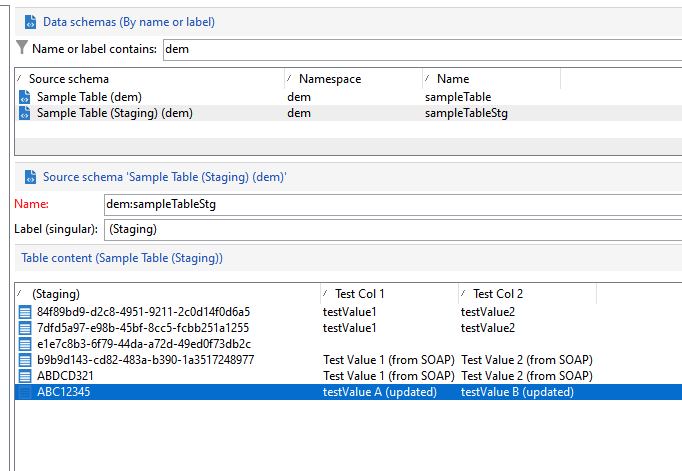

# Nya kampanj-API:er{#gs-new-api}

När det gäller [Företagsdistribution (FFDA)](enterprise-deployment.md)innehåller Campaign v8 två nya API:er för att hantera data mellan Campaigns lokala databas och molndatabasen. Förutsättningar för att använda dem är att aktivera mellanlagringsmekanismen i schemat. [Läs mer](staging.md)

* Ing-API: **xtk.session.ingest**

   Detta API är endast avsett för datainmatning. [Läs mer](#data-insert-api)

* API för datauppdatering/borttagning: **xtk.session.ingestExt**

   Detta API används för att uppdatera eller ta bort data. [Läs mer](#data-update-api)

Ett dedikerat inbyggt arbetsflöde synkroniserar data i molndatabasen.

## Infoga data{#data-insert-api}

The **xtk.session.ingest** API är endast dedikerat till datainmatning. Ingen uppdatering/borttagning.

### Infoga utan avstämning

**I ett arbetsflöde**

Använd följande kod i en **Javascript-kod** aktivitet för att infoga data i molndatabasen utan avstämning:

```
var xmlStagingSampleTable = <sampleTableStg
                                testcol1="testValue1"
                                testcol2="testValue2"
                                xtkschema="dem:sampleTableStg">
                            </sampleTableStg>;
strUuid = xtk.session.Ingest(xmlStagingSampleTable);
logInfo(strUuid);
```

När arbetsflödet har körts matas mellanlagringstabellen som förväntat.

**Från ett SOAP-anrop**

1. Hämta autentiseringstoken.
1. Utlös API:t. Nyttolasten är:

   ```
   <soapenv:Envelope xmlns:soapenv="http://schemas.xmlsoap.org/soap/envelope/" xmlns:urn="urn:xtk:session">
   <soapenv:Header/>
   <soapenv:Body>
       <urn:Ingest>
           <urn:sessiontoken>___xxxxxxx-xxxx-xxx-xxx-xxxxxxxxxxx</urn:sessiontoken>
           <urn:domDoc>
               <sampleTableStg
                   testcol1="Test Value 1 (from SOAP)"
                   testcol2="Test Value 2 (from SOAP)"
                   xtkschema="dem:sampleTableStg">
               </sampleTableStg>
           </urn:domDoc>
       </urn:Ingest>
   </soapenv:Body>
   </soapenv:Envelope>
   ```

1. UUID skickas tillbaka till SOAP-svaret:

   ```
   <SOAP-ENV:Envelope xmlns:xsd="http://www.w3.org/2001/XMLSchema" xmlns:xsi="http://www.w3.org/2001/XMLSchema-instance" xmlns:ns="urn:wpp:default" xmlns:SOAP-ENV="http://schemas.xmlsoap.org/soap/envelope/">
   <SOAP-ENV:Body>
       <IngestResponse SOAP-ENV:encodingStyle="http://schemas.xmlsoap.org/soap/encoding/" xmlns="urn:wpp:default">
           <pstrSUuids xsi:type="xsd:string">e1e7c8b3-6f79-44da-a72d-49ed0f73db2c</pstrSUuids>
       </IngestResponse>
   </SOAP-ENV:Body>
   </SOAP-ENV:Envelope>
   ```

Därför matas mellanlagringstabellen som förväntat.


### Infoga med avstämning

**I ett arbetsflöde**

Använd följande kod i en **Javascript-kod** aktivitet som infogar data i molndatabasen med avstämning:

```
var xmlStagingSampleTable = <sampleTableStg  _key="@id" id="ABC12345"
                              testcol1="testValue1"
                              testcol2="testValue2"
                              xtkschema="dem:sampleTableStg">
                            </sampleTableStg>;         
strUuid = xtk.session.Ingest(xmlStagingSampleTable);
logInfo(strUuid);
```

När arbetsflödet har körts matas mellanlagringstabellen som förväntat.


**Från ett SOAP-anrop**

1. Hämta autentiseringstoken.
1. Utlös API:t. Nyttolasten är:

   ```
   <soapenv:Envelope xmlns:soapenv="http://schemas.xmlsoap.org/soap/envelope/" xmlns:urn="urn:xtk:session">
   <soapenv:Header/>
   <soapenv:Body>
     <urn:Ingest>
        <urn:sessiontoken>___5e71f4bf-d38a-4ba8-ac15-35a958f7f138</urn:sessiontoken>
        <urn:domDoc>
           <sampleTableStg  _key="@id" id="ABDCD321"
                testcol1="Test Value 1 (from SOAP)"
                testcol2="Test Value 2 (from SOAP)"
                xtkschema="dem:sampleTableStg">
            </sampleTableStg>
        </urn:domDoc>
     </urn:Ingest>
    </soapenv:Body>
   </soapenv:Envelope>
   ```

1. I det här fallet skickas inte UUID tillbaka till svaret eftersom det har angetts i nyttolasten. Svaret är:

   ```
   <SOAP-ENV:Envelope xmlns:xsd="http://www.w3.org/2001/XMLSchema" xmlns:xsi="http://www.w3.org/2001/XMLSchema-instance" xmlns:ns="urn:wpp:default" xmlns:SOAP-ENV="http://schemas.xmlsoap.org/soap/envelope/">
   <SOAP-ENV:Body>
       <IngestResponse SOAP-ENV:encodingStyle="http://schemas.xmlsoap.org/soap/encoding/" xmlns="urn:wpp:default">
           <pstrSUuids xsi:type="xsd:string"/>
       </IngestResponse>
   </SOAP-ENV:Body>
   </SOAP-ENV:Envelope>
   ```

Därför matas mellanlagringstabellen som förväntat.

## Uppdatera eller ta bort data{#data-update-api}

The **xtk.session.IngestExt** API är optimerat för uppdatering/borttagning av data. Använd endast Infoga **xtk.session.ingest**. Infoga fungerar oavsett om postnyckeln finns i mellanlagringstabellen.

### Infoga/uppdatera

**I ett arbetsflöde**

Använd följande kod i en **Javascript-kod** aktivitet för att uppdatera data i molndatabasen:

```
var xmlStagingRecipient = <sampleTableStg  _key="@id" id="ABC12345"
                              testcol1="testValue A (updated)"
                              testcol2="testValue B (updated)"
                              xtkschema="dem:sampleTableStg">
                            </sampleTableStg>;
xtk.session.IngestExt(xmlStagingRecipient);
```

När arbetsflödet har körts uppdateras mellanlagringstabellen som förväntat.



**Från ett SOAP-anrop**


1. Hämta autentiseringstoken.
1. Utlös API:t. Nyttolasten är:

   ```
   <soapenv:Envelope xmlns:soapenv="http://schemas.xmlsoap.org/soap/envelope/" xmlns:urn="urn:xtk:session">
   <soapenv:Header/>
   <soapenv:Body>
       <urn:IngestExt>
           <urn:sessiontoken>___444cd168-a1e2-4fb6-a2a8-73be9f133489</urn:sessiontoken>
           <urn:domDoc>
           <sampleTableStg  _key="@id" id="ABDCD321"
                   testcol1="Test Value E (from SOAP)"
                   testcol2="Test Value F (from SOAP)"
                   xtkschema="dem:sampleTableStg">
               </sampleTableStg>
           </urn:domDoc>
       </urn:IngestExt>
   </soapenv:Body>
   </soapenv:Envelope>
   ```

1. SOAP-svaret är:

   ```
   <SOAP-ENV:Envelope xmlns:xsd="http://www.w3.org/2001/XMLSchema" xmlns:xsi="http://www.w3.org/2001/XMLSchema-instance" xmlns:ns="urn:wpp:default" xmlns:SOAP-ENV="http://schemas.xmlsoap.org/soap/envelope/">
   <SOAP-ENV:Body>
       <IngestExtResponse SOAP-ENV:encodingStyle="http://schemas.xmlsoap.org/soap/encoding/" xmlns="urn:wpp:default"/>
   </SOAP-ENV:Body>
   </SOAP-ENV:Envelope>
   ```

Därför uppdateras mellanlagringstabellen som förväntat.

## Prenumerationshantering {#sub-apis}

Prenumerationshantering i Campaign beskrivs i [den här sidan](../start/subscriptions.md).

Inläggning av prenumerations- och avprenumerationsdata bygger på [Mellanlagringsmekanism](staging.md) i Campaign-databasen. Prenumerationsinformation lagras tillfälligt i mellanlagringstabeller i den lokala databasen och synkroniseringsarbetsflödet skickar dessa data från den lokala databasen till molndatabasen. Som en följd av detta är prenumerations- och avabonnemangsprocesserna **asynkron**. Begäranden om anmälan och avanmälan behandlas varje timme via ett specifikt tekniskt arbetsflöde. [Läs mer](replication.md#tech-wf)


**Relaterade ämnen**

* [Campaign Classic v7 JSAPI](https://experienceleague.adobe.com/developer/campaign-api/api/p-1.html)
