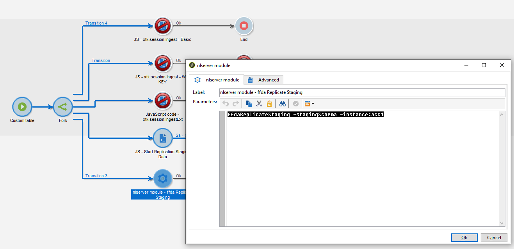

# Tekniska arbetsflöden och datareplikering {#wf-data-replication}

## Tekniska arbetsflöden {#tech-wf}

När det gäller en [Företagsdistribution (FFDA)](enterprise-deployment.md)Adobe Campaign innehåller ett antal inbyggda tekniska arbetsflöden. Tekniska arbetsflöden kör processer eller jobb som schemaläggs regelbundet på servern.

Dessa arbetsflöden utför underhållsåtgärder på databasen, utnyttjar spårningsinformationen i leveransloggarna, skapar återkommande kampanjer med mera.

En fullständig lista över tekniska arbetsflöden finns i [den här sidan](https://experienceleague.adobe.com/docs/campaign/automation/workflows/introduction/wf-type/technical-workflows.html).

Utöver dessa tekniska arbetsflöden förlitar sig Campaign v8 på specifika tekniska arbetsflöden för att hantera [datareplikering](#data-replication).

* **[!UICONTROL Replicate Reference tables]**
Det här arbetsflödet utför automatisk replikering av inbyggda tabeller som måste finnas i den lokala kampanjdatabasen (Postgres) och molndatabasen ([!DNL Snowflake]). Det är schemalagt att köras varje timme, varje dag. If **lastModified** finns det ett fält som replikeras stegvis, annars replikeras hela tabellen. Ordningen på tabellerna i arrayen nedan är den ordning som används i replikeringsarbetsflödet.
* **[!UICONTROL Replicate Staging data]**
Det här arbetsflödet replikerar mellanlagringsdata för enhetsanrop. Det är schemalagt att köras varje timme, varje dag.
* **[!UICONTROL Deploy FFDA immediately]**\
  Det här arbetsflödet utför en omedelbar distribution till molndatabasen.
* **[!UICONTROL Replicate FFDA data immediately]**
Det här arbetsflödet replikerar XS-data för ett givet externt konto.

Dessa tekniska arbetsflöden är tillgängliga via **[!UICONTROL Administration > Production > Technical workflows > Full FFDA Replication]** nod i Campaign Explorer. **De får inte ändras.**

Vid behov kan du starta datasynkronisering manuellt. Om du vill göra det högerklickar du på **Schemaläggare** aktivitet och välj **Kör väntande uppgifter nu**.

## Datareplikering {#data-replication}

Vissa inbyggda tabeller replikeras från Campaign-databasen till [!DNL Snowflake] Molndatabas via dedikerade arbetsflöden som beskrivs ovan.

Förstå vilka databaser Adobe Campaign v8 använder, varför data replikeras, vilka data som replikeras och hur replikeringsprocessen fungerar.

>[!VIDEO](https://video.tv.adobe.com/v/334460?quality=12)


### Principer för datareplikering {#data-replication-policies}

Replikeringsprinciperna baseras på tabellstorleken. Vissa tabeller replikeras i realtid, andra replikeras i timläge. Vissa tabeller får stegvisa uppdateringar när andra ersätts.

Förutom den inbyggda **Replikera referenstabeller** tekniskt arbetsflöde kan du tvinga fram datareplikering i dina arbetsflöden.

Du kan:

* lägga till en specifik **Javascript-kod** aktivitet med följande kod:

```
nms.replicationStrategy.StartReplicateStagingData("dem:sampleTable")
```


* lägga till en specifik **nlmodule** aktivitet med följande kommando:

```
nlserver ffdaReplicateStaging -stagingSchema -instance:acc1
```




**Relaterade ämnen**

* [Kom igång med arbetsflöden](https://experienceleague.adobe.com/docs/campaign/automation/workflows/introduction/about-workflows.html)

* [Datalagringsperioder](../dev/datamodel-best-practices.md#data-retention)
