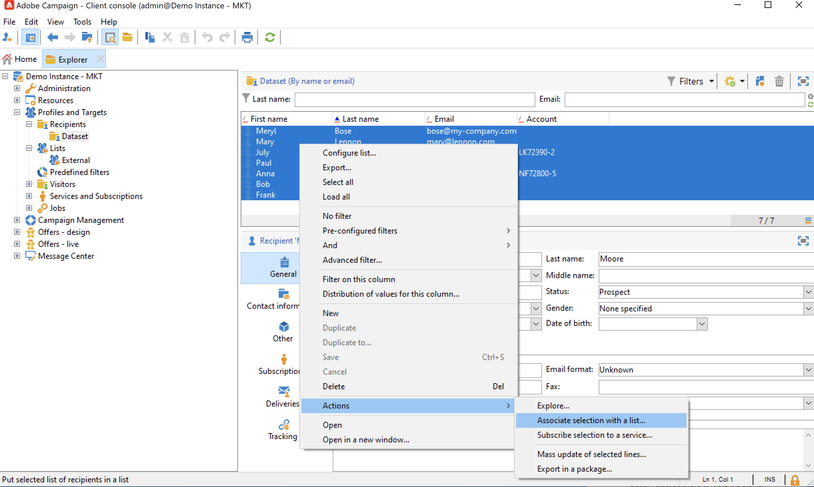
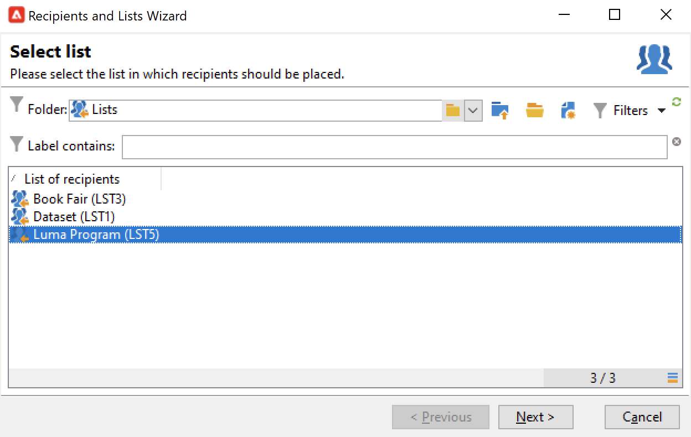

# Skapa en målgrupp i en lista{#create-segments}

Använd Campaign-listor för att skapa och ordna era målgrupper.

En lista är en statisk uppsättning kontakter som kan användas för leveransåtgärder eller uppdateras under en import- eller en annan arbetsflödesåtgärd. En population som har extraherats från databasen via en fråga kan till exempel lagras som en lista.

Listor skapas och hanteras via **[!UICONTROL Lists]** i **[!UICONTROL Profiles and targets]** -fliken. Listan baseras på Adobe Campaign standardprofiltabell (nms:mottagare). [Läs mer](../dev/datamodel.md#ootb-profiles.md)

Du kan skapa en lista med **Uppdatera lista** i ett arbetsflöde. Den här aktiviteten lagrar den resulterande populationen i en lista. Använd den för att skapa en ny lista eller uppdatera en befintlig lista. Om du vill skapa listor som innehåller andra typer av data än den inbyggda profiltabellen måste du köra ett arbetsflöde. Om du till exempel använder en fråga i besökstabellen och sedan uppdaterar listan, kan du skapa en besökslista. [Läs mer](#create-a-list-wf).

I den här videon får du lära dig mer om Lists hantering i Adobe Campaign.

>[!VIDEO](https://video.tv.adobe.com/v/334909?quality=12)

## Skapa en lista med kontakter {#create-a-list-of-contacts}

Följ stegen nedan för att skapa en lista över kontakter:

1. Klicka på **[!UICONTROL Create]** och markera **[!UICONTROL New list]**.

   

1. Ange informationen i dialogrutan **[!UICONTROL Edit]** i fönstret där listan skapades.

   

   * Ange listnamnet i dialogrutan **[!UICONTROL Label]** och vid behov ändra det interna namnet.
   * Lägg till en beskrivning av den här listan.
   * Du kan ange ett förfallodatum: när det här datumet har nåtts rensas listan och tas automatiskt bort.

1. I **[!UICONTROL Content]** flik, klicka **[!UICONTROL Add]** för att välja de profiler som tillhör listan.

   

   Du kan skapa en ny profil och lägga till den i listan direkt från det här fönstret med hjälp av **[!UICONTROL Create]** ikon. Profilen läggs till i databasen.

1. Klicka **[!UICONTROL Save]** för att spara listan. Sedan läggs den till i översikten över listor.

## Konvertera filtrerade kontakter till en lista {#convert-data-to-a-list}

Du kan välja profiler och lägga till dem i en lista. Gör så här:

1. Välj profiler i Campaign Explorer och högerklicka.

   Dessa profiler kan filtreras så att de uppfyller vissa villkor.

1. Välj **[!UICONTROL Actions > Associate selection with a list...]**.

   

1. Välj en befintlig lista eller skapa en ny lista och klicka på **[!UICONTROL Next]**.

   

1. Klicka på knappen **[!UICONTROL Start]**.

   

Välj **[!UICONTROL Recreate the list]** om du vill ta bort befintligt innehåll från listan och optimera skapandet av listan (ingen fråga behövs för att kontrollera om profilerna redan är länkade till listan).

Om du avmarkerar **[!UICONTROL No trace of this job is saved in the database]** kan du välja (eller skapa) den körningsmapp där den information som är länkad till processen ska lagras.

I fönstrets övre del kan du övervaka körningen. The **[!UICONTROL Stop]** kan du stoppa processen. Kontakter som redan har bearbetats länkas till listan.

När körningen är klar går du till **[!UICONTROL Profiles and Targets > Lists]** och välj listan: den **[!UICONTROL Content]** visas de profiler som är länkade till den här listan.

## Skapa en lista med ett arbetsflöde  {#create-a-list-wf}

Du kan använda **[!UICONTROL List update]** för att skapa en lista eller lägga till en population i en lista med mottagare.

I exemplet nedan skapar du en lista med alla mottagare mellan 25 och 40.

1. Välj **[!UICONTROL Profiles and targets]** och **[!UICONTROL Targeting workflows]** och sedan skapa ett nytt arbetsflöde från **[!UICONTROL Create]** -knappen.
1. Ange en etikett för det här arbetsflödet, till exempel&quot;25-40 kontakter&quot;, lägg till en beskrivning och klicka på **[!UICONTROL Next]**.

   

1. Infoga en **[!UICONTROL Query]** -aktivitet för att definiera målpopulationen och redigera frågan.

   

1. Definiera filtervillkoren enligt nedan:

   

   Lär dig hur du skapar en fråga i ett arbetsflöde i [Campaign Classic v7-dokumentation](https://experienceleague.adobe.com/docs/campaign-classic/using/automating-with-workflows/targeting-activities/query.html#creating-a-query){target=&quot;_blank&quot;}

1. Lägg till en etikett för frågan och spara ändringarna.
1. Lägg till en **[!UICONTROL List update]** och redigera.

   

1. Ange en etikett för aktiviteten.
1. Välj **[!UICONTROL Create the list if necessary (Computed name)]** för att visa att listan skapas när det första arbetsflödet har körts och sedan uppdateras med följande körningar.
1. Markera en mapp och ange en etikett för listan.
1. Välj **[!UICONTROL Database of the targeting dimension]** för att lagra tabellen.
1. Lämna **[!UICONTROL Purge the list if it exists (otherwise add to the list)]** markerat för att ta bort mottagare som inte matchar målinriktningsvillkoret och för att infoga de nya i listan.
1. Lämna även **[!UICONTROL Create or use a list with its own table]** alternativet är markerat.
1. Lämna **[!UICONTROL Generate an outbound transition]** alternativet inte markerat.
1. Klicka **[!UICONTROL Ok]** och spara arbetsflödet.
1. Starta arbetsflödet.

   Listan med matchande mottagare skapas sedan. Du kan komma åt den här listan från **[!UICONTROL Lists]** hemsidans inmatning.

   

   Du kan göra det här arbetsflödet återkommande genom att lägga till en schemaläggare i arbetsflödet. Läs mer i [Campaign Classic v7-dokumentation](https://experienceleague.adobe.com/docs/campaign-classic/using/automating-with-workflows/flow-control-activities/scheduler.html){target=&quot;_blank&quot;}.

## Ta bort en profil från en lista {#remove-a-profile-from-a-list}

Om du vill ta bort en profil från en lista redigerar du listan och väljer profilen i dialogrutan **[!UICONTROL Content]** klickar du på **[!UICONTROL Delete]** ikon.

## Ta bort en lista med profiler {#delete-a-list-of-profiles}

Om du vill ta bort en lista går du till den i Campaign Explorer, markerar den och högerklickar. Välj **[!UICONTROL Delete]**. Ett varningsmeddelande ber dig bekräfta borttagningen.

>[!NOTE]
>
>När du tar bort en lista påverkas inte profilerna i listan, men data i deras profil uppdateras.
