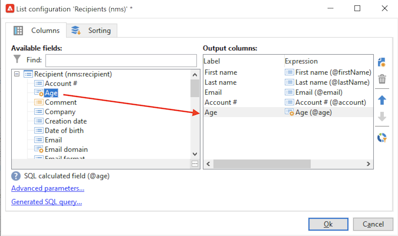
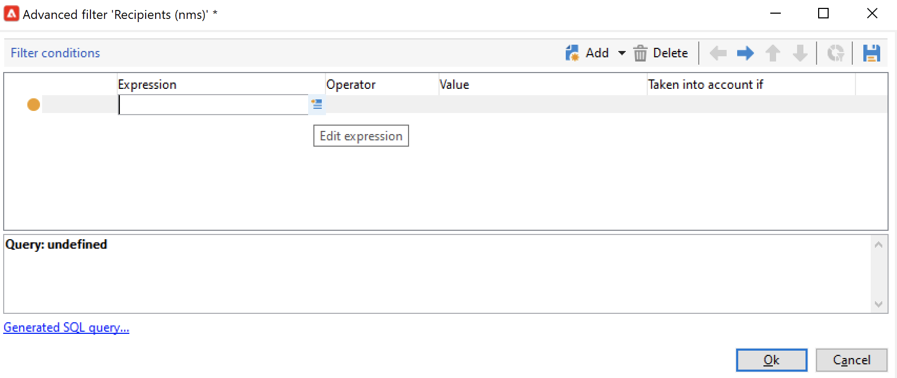
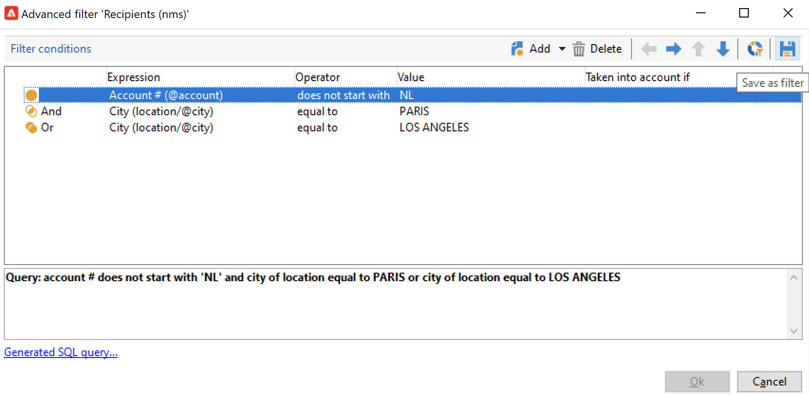
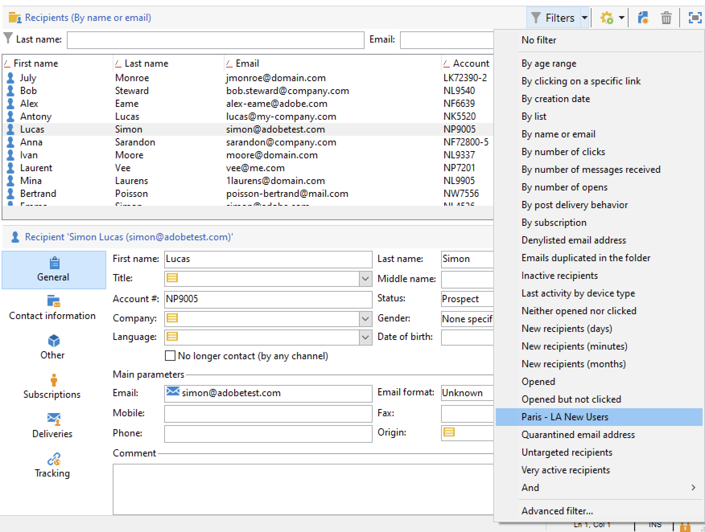

# Arbeta med filter{#create-filters}

Datafiltrering innebär att en datauppsättning begränsas till endast de poster som matchar specifika villkor. Den här delmängden kan sedan användas för målinriktade åtgärder (till exempel uppdateringar eller målgruppsskapande) eller för analys.

När du bläddrar i Campaign visas data i listor. Du kan använda inbyggda filter för att snabbt komma åt en definierad delmängd, till exempel adresser i karantän, mottagare utan mål eller poster inom ett visst åldersintervall eller ett visst datum när de skapades.

Dessutom kan du skapa anpassade filter, spara dem för framtida bruk och dela dem med andra Campaign-användare.

Filter tillämpas **dynamiskt**: när data ändras uppdateras de filtrerade resultaten automatiskt.

>[!NOTE]
>
>Konfigurationsinställningarna för användargränssnittet definieras lokalt på enhetsnivå. Ibland kan det vara nödvändigt att rensa upp dessa data, särskilt om det uppstår problem när data uppdateras. Använd menyn **[!UICONTROL File > Clear the local cache]** om du vill göra det.

Följande typer av filter finns i Adobe Campaign:

* [Fördefinierade filter](#predefined-filters)
* [Snabbfilter](#quick-filters)
* [Avancerade anpassade filter](#advanced-filters)

## Fördefinierade filter{#predefined-filters}

### Fördefinierade filter på kontrollpanelerna

Som standard visar Adobe Campaign alla databasposter som operatorn har behörighet att läsa. Du kan filtrera dessa data med hjälp av alternativen i det övre avsnittet i webbläsarfönstret.

Det finns flera sätt att filtrera de data som ska visas. Vid behov kan dessa användas tillsammans.

* Filtrera på mappar, se [Filtrera efter mapp](#filter-by-folder),
* Filtrera efter status, se [Filter efter status](#filter-by-status),
* Datasortering, se [Ordna efter](#order-by),
* Sök, se [Snabbsökning](#quick-search).

>[!BEGINTABS]

>[!TAB Filtrera efter mapp]

Om du vill filtrera data baserat på deras mapp klickar du på ikonen **[!UICONTROL Folder]** och väljer den mapp som innehåller de data som ska visas.

Endast profilerna i mappen visas:

Använd krysset till höger om mappmarkeringsfältet för att återgå till standardvisningsläget.

>[!TAB Filtrera efter status]

Beroende på vilken typ av information som visas kan du använda ett filter efter status eller efter läge.

För leveranser kan du t.ex. välja att bara visa de färdiga leveranserna enligt nedan:

>[!TAB Beställ av]

Du kan välja sorteringsordning för de data som finns på sidorna via den nedrullningsbara listan till höger om filtreringsfältet per mapp. Innehållet i det här fältet beror på vilken typ av data som finns på sidan.

Du kan till exempel sortera uppgifter efter prioritet, skapandedatum eller i alfabetisk ordning.

>[!TAB Snabbsökning]

Använd sökfältet för att snabbt komma åt objektet du söker efter: ange tecknen som finns i etiketten eller det interna namnet på objektet som du vill visa och bekräfta sedan att du vill använda ett automatiskt filter på data på sidan.

Om du vill visa alla objekt igen klickar du på krysset för att ta bort innehållet i sökfältet.

>[!ENDTABS]

### Fördefinierade filter i Utforskaren

Fördefinierade filter är tillgängliga från knappen **Filter** ovanför varje lista.

Följande inbyggda filter är till exempel tillgängliga för profilerna:

Du kan komma åt filterinformationen i noden **[!UICONTROL Profiles and Targets > Pre-defined filters]** i Utforskaren.

>[!NOTE]
>
>För alla andra listor med data lagras fördefinierade filter i noden **[!UICONTROL Administration > Configuration > Predefined filters]**.

Välj ett filter för att visa dess definition.

Använd den sista fliken för att förhandsgranska filtrerade data.

+++  Inbyggda fördefinierade filter för profiler

<table> 
 <tbody> 
  <tr> 
   <td> <strong>Etikett</strong>  </td> 
   <td> <strong>Fråga</strong>  </td> 
  </tr> 
  <tr> 
   <td> Öppnad  </td> 
   <td> Väljer mottagare som har öppnat en leverans.  </td> 
  </tr> 
  <tr> 
   <td> Öppnad men inte klickad   </td> 
   <td> Väljer mottagare som har öppnat en leverans men inte klickat på en länk.  </td> 
  </tr> 
  <tr> 
   <td> Inaktiva mottagare  </td> 
   <td> Väljer mottagare som inte har öppnat en leverans på X månader.  </td> 
  </tr> 
  <tr> 
   <td> Senaste aktivitet efter enhetstyp   </td> 
   <td> Väljer mottagare som har klickat eller öppnat leveransadress Y med enhet X de senaste Z-dagarna.  </td> 
  </tr> 
  <tr> 
   <td> Senaste aktivitet per enhetstyp (spårning)   </td> 
   <td> Väljer mottagare som har klickat eller öppnat leveransadress Y med enhet X de senaste Z-dagarna.  </td> 
  </tr> 
  <tr> 
   <td> Mottagare utan mål   </td> 
   <td> Väljer mottagare som aldrig har fått mål via kanal Y på X månader.  </td> 
  </tr> 
  <tr> 
   <td> Mycket aktiva mottagare  </td> 
   <td> Väljer mottagare som har klickat på en leverans minst X gånger under de senaste Y-månaderna.  </td> 
  </tr> 
  <tr> 
 <td> Blocklist e-postadress   </td> 
    <td> Väljer mottagare vars e-postadress finns på blockeringslista.  </td>
  </tr> 
  <tr> 
   <td> E-postadress i karantän   </td> 
   <td> Väljer mottagare vars e-postadress är i karantän.  </td> 
  </tr> 
  <tr> 
   <td> E-postadresser dupliceras i mappen   </td> 
   <td> Väljer mottagare vars e-postadress är duplicerad i mappen.  </td> 
  </tr> 
  <tr> 
   <td> Varken öppnad eller klickad   </td> 
   <td> Väljer mottagare som inte har öppnat en leverans eller klickat i en leverans.  </td> 
  </tr> 
  <tr> 
   <td> Nya mottagare (dagar)  </td> 
   <td> Väljer mottagare som har skapats de senaste X dagarna.  </td> 
  </tr> 
  <tr> 
   <td> Nya mottagare (minuter)  </td> 
   <td> Väljer mottagare som har skapats de senaste X minuterna.  </td> 
  </tr> 
  <tr> 
   <td> Nya mottagare (månader)  </td> 
   <td> Väljer mottagare som har skapats de senaste X månaderna.  </td> 
  </tr> 
  <tr> 
   <td> Efter prenumeration  </td> 
   <td> Väljer mottagare efter prenumeration.  </td> 
  </tr> 
  <tr> 
   <td> Genom att klicka på en specifik länk   </td> 
   <td> Väljer mottagare som klickat på en viss URL i en leverans.  </td> 
  </tr> 
  <tr> 
   <td> Beteende efter postleverans   </td> 
   <td> Väljer mottagare utifrån deras beteende efter att de har tagit emot en leverans.  </td> 
  </tr> 
  <tr> 
   <td> Efter skapandedatum   </td> 
   <td> Väljer mottagare efter skapandedatum, över en period som sträcker sig från X månader (aktuellt datum minus n månader) till Y månader (aktuellt datum minus n månader).  </td> 
  </tr> 
  <tr> 
   <td> Efter lista   </td> 
   <td> Väljer mottagare efter lista.  </td> 
  </tr> 
  <tr> 
   <td> Efter antal klick   </td> 
   <td> Väljer mottagare som klickat på en leverans de senaste X månaderna.  </td> 
  </tr> 
  <tr> 
   <td> Efter antal mottagna meddelanden:   </td> 
   <td> Väljer mottagare baserat på antalet meddelanden de tagit emot.  </td> 
  </tr> 
  <tr> 
   <td> Efter antal öppningar   </td> 
   <td> Väljer mottagare som öppnat mellan X och Y levererar över Z tid.  </td> 
  </tr> 
  <tr> 
   <td> Efter namn eller e-postadress   </td> 
   <td> Väljer mottagare efter namn eller e-postadress.  </td> 
  </tr> 
  <tr> 
   <td> Efter åldersintervall   </td> 
   <td> Väljer mottagare efter deras ålder.  </td> 
  </tr> 
 </tbody> 
</table>

+++

#### Standardfilter{#default-filters}

I fälten ovanför varje lista kan du använda det **fördefinierade standardfiltret** för den här listan. För mottagarlistan kan du som standard filtrera på namn och e-postadress.

>[!NOTE]
>
>Tecknet **%** ersätter alla teckensträngar. Ange till exempel `%@gmail.com` i fältet E-post om du vill visa alla profiler med en Gmail-adress. Ange `%@L` i fältet Efternamn om du vill visa alla profiler med ett L i efternamnet.

Bläddra till noden **[!UICONTROL Profiles and Targets > Predefined filters]** om du vill ändra standardfiltret för en mottagarlista.

Konfigurera standardfiltret via noden **[!UICONTROL Administration > Configuration > Predefined filters]** för alla andra typer av data.

Använd följande steg:

1. Markera det filter som du vill använda som standard.
1. Klicka på fliken **[!UICONTROL Parameters]** och välj **[!UICONTROL Default filter for the associated document type]**.

   

1. Avmarkera samma alternativ för det aktuella fördefinierade standardfiltret.
1. Klicka på **[!UICONTROL Save]** för att använda filtret.
1. Bläddra till mappen Mottagare och klicka på ikonen **[!UICONTROL Remove this filter]** till höger om det aktuella filtret: det nya standardfiltret är tillgängligt.
   

## Snabbfilter{#quick-filters}

Du kan ställa in och kombinera **snabbfilter** för att skapa anpassade filter för specifika fält.

När du har lagt till snabbfilterfält visas de ovanför datalistan, den ena efter den andra. De kan tas bort oberoende av varandra.

Snabbfilter är specifika för varje operator och initieras om varje gång som operatorn rensar cachen för sin klientkonsol.

Om du behöver återanvända ett filter skapar du ett **avancerat filter** och sparar det. [Läs mer](#advanced-filters).

Så här skapar du ett **snabbfilter**:

1. Högerklicka på det fält som du vill filtrera och välj **[!UICONTROL Filter on this field]**.

   

   Standardfilterfälten visas ovanför listan.

   

1. Markera filteralternativen.
1. Använd vid behov den grå ikonen till höger om ett filter för att ta bort det.
1. Du kan kombinera filter för att förfina filtret.

   

Om du behöver filtrera ett fält som inte är tillgängligt i formuläret, utan i kolumnerna, och filtrera på den kolumnen. För att göra detta

1. Klicka på ikonen **[!UICONTROL Configure list]**.

   

1. Markera den kolumn som ska visas, till exempel mottagarnas ålder, och klicka på **OK**.

   

1. Högerklicka på kolumnen **Ålder** i mottagarlistan och välj **[!UICONTROL Filter on this column]**.

   

   Du kan sedan välja alternativ för åldersfiltrering. Lägg till ytterligare ett filter på sidan för att definiera ett intervall.

   

## Avancerade filter{#advanced-filters}

Kombinera komplexa villkor i anpassade **avancerade filter**. Använd dessa filter för att skapa en komplex fråga eller en kombination av frågor på dina data. Dessa filter kan sparas och delas med andra Campaign-användare.

### Skapa ett avancerat filter{#create-adv-filters}

Om du vill skapa ett **avancerat filter** klickar du på knappen **[!UICONTROL Filters]** och väljer **[!UICONTROL Advanced filter...]**.

Du kan också högerklicka på listan med data och välja **[!UICONTROL Advanced filter...]**.

Definiera filtreringsvillkoren. I exemplet nedan filtrerar du på mottagare vars kontonummer inte börjar med NL och som bor i Paris eller Los Angeles.

1. Klicka på ikonen **[!UICONTROL Edit expression]** för kolumnen **[!UICONTROL Expression]**.

   

1. Markera fältet som du vill filtrera på.
1. Välj den operator som ska användas i listrutan.

   

1. Välj ett förväntat värde i kolumnen **[!UICONTROL Value]**. Du kan kombinera flera filter för att förfina frågan. Klicka på **[!UICONTROL Add]** om du vill lägga till ett filtervillkor.

   

   >[!NOTE]
   >
   >Du kan tilldela uttryck en hierarki eller ändra ordningen på frågeuttrycken med hjälp av pilarna i verktygsfältet.

1. Det finns tre operatorer för att kombinera uttryck: **And**, **Or**, **Förutom**. Klicka på pilen för att växla till **Eller**.

   

1. Klicka på **[!UICONTROL Ok]** om du vill skapa filtret och använda det i den aktuella listan.

Filtret som används visas ovanför listan.

Om du vill redigera eller ändra det här filtret klickar du på beskrivningslänken i blått ovanför listan.

### Spara ett avancerat filter{#save-adv-filters}

Du kan spara ett avancerat filter som ett [fördefinierat filter](#predefined-filters) så att du kan återanvända det och dela det med andra Campaign-användare.

Så här sparar du ett avancerat filter:

1. Klicka på beskrivningen av filtret för att redigera det.
1. Klicka på ikonen **[!UICONTROL Save as filter]** i fönstrets övre högra del.

   

1. Ange ett namn för det här filtret och spara det.

   

Filtret läggs till i de [fördefinierade filtren](#predefined-filters). Den kan uppdateras från den här noden.

>[!NOTE]
>
>Du kan lägga till ett kortkommando för filtret för att aktivera det från tangentbordet.

Det här filtret är också tillgängligt från de fördefinierade filtren i mottagarlistan.

### Använd ett filter för att definiera ett segment {#filter-as-segment}

Du kan använda och kombinera filter för att skapa ett målpopulationssegment.

När du har sparat avancerade filter är de tillgängliga när du väljer målpopulation för ett meddelande i avsnittet **[!UICONTROL User filters]**.

>[!NOTE]
>
>Använd **[!UICONTROL Exclude recipients from this segment]** om du bara vill rikta in dig på kontakter som inte matchar filtervillkoren.

### Använda funktioner för att skapa avancerade filter{#use-functions-adv-filters}

Om du vill utföra avancerade filtreringsfunktioner använder du funktioner för att definiera filtrets innehåll. Den avancerade filterredigeraren utnyttjar alla funktioner i frågeredigeraren i Campaign.

Lär dig hur du skapar avancerade frågor i dessa kompletta exempel:

* Lär dig hur du aktiverar enkla mottagarattribut på [den här sidan](https://experienceleague.adobe.com/docs/campaign/automation/workflows/wf-activities/targeting-activities/query.html){target="_blank"}.
* Lär dig filtrera efter mottagare som inte har kontaktats under de senaste 7 dagarna på [den här sidan](https://experienceleague.adobe.com/docs/campaign/automation/workflows/use-cases/designing-queries/query-many-to-many-relationship.html){target="_blank"}.
* Lär dig hur du återställer listan över operatorer som kan filtreras efter aktiva konton på [den här sidan](https://experienceleague.adobe.com/docs/campaign/automation/workflows/use-cases/designing-queries/create-a-filter.html){target="_blank"}.
* Lär dig hur du skapar en målgrupp för e-postfödelsedag på [den här sidan](https://experienceleague.adobe.com/docs/campaign/automation/workflows/use-cases/deliveries/send-a-birthday-email.html){target="_blank"}.

### Avancerade parametrar för fördefinierade filter {#param-for-data-filters}

Avancerade parametrar är tillgängliga för fördefinierade filter. Bläddra till fliken **[!UICONTROL Parameters]** i filtret om du vill komma åt dem.

* Om du vill visa filtret som standard för alla listor baserade på den här dokumenttypen väljer du alternativet **[!UICONTROL Default filter for the associated document type]**.

  Filtret **[!UICONTROL By name or login]** används till exempel för operatorer Det här alternativet är markerat, så filtret visas alltid i alla operatorlistor.

* Om du vill göra ett filter tillgängligt för alla Campaign-operatorer väljer du alternativet **[!UICONTROL Filter shared with other operators]**.

* Välj alternativet **[!UICONTROL Use parameter entry form]** om du vill definiera ett formulär för att välja filtreringsvillkor. Det här formuläret måste anges i XML-format på fliken **[!UICONTROL Form]**. Det inbyggda fördefinierade filtret **[!UICONTROL Recipients who have opened]**, som finns i mottagarlistan, visar till exempel ett filterfält där du kan välja leveransen som filtret gäller för.

* Med länken **[!UICONTROL Advanced parameters]** kan du definiera ytterligare inställningar.

   * Du kan koppla en SQL-tabell till filtret så att den blir gemensam för alla redigerare som delar tabellen.
   * Om du inte vill att någon användare ska kunna åsidosätta filtret markerar du alternativet **[!UICONTROL Do not restrict the filter]**. Det här alternativet är t.ex. aktivt för filter av typen &quot;Mottagare av en leverans&quot; och &quot;Mottagare av leveranser som tillhör en mapp&quot; som finns i leveransguiden. Dessa filter kan inte överladdas.

