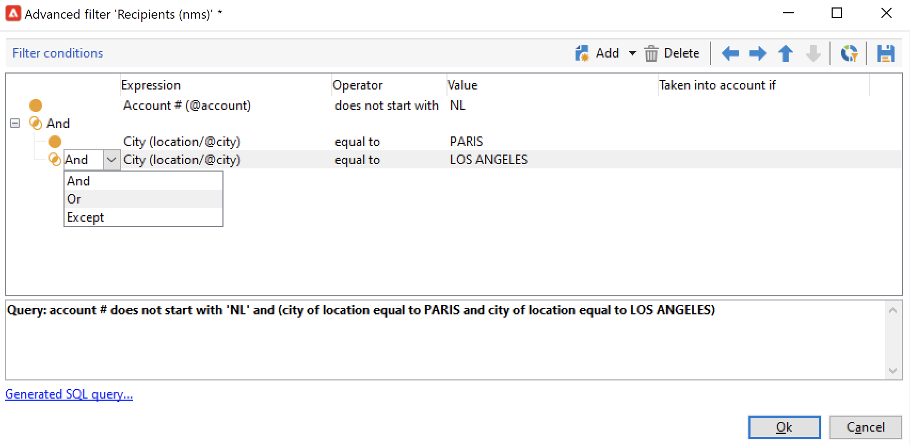

# Skapa och hantera filter{#create-filters}

Datafiltrering är processen att välja en mindre del av datauppsättningen, bara de poster som matchar vissa villkor, och att använda den deluppsättningen för specifika åtgärder (uppdateringar, målgruppsgenerering) eller analyser.

När du bläddrar i Campaign från **[!UICONTROL Explorer]** visas data i listor. Du kan använda befintliga inbyggda filter för att komma åt en viss delmängd av dessa data: Adresser i karantän, mottagare utan mål, ett visst åldersintervall eller ett visst datum när de skapades, till exempel.

Du kan också skapa egna filter, spara dem för framtida bruk eller dela dem med andra Campaign-användare.

Med filterkonfigurationen kan du välja data från en lista **[!UICONTROL dynamically]**: när data ändras uppdateras de filtrerade data.

>[!NOTE]
>
>Konfigurationsinställningarna för användargränssnittet definieras lokalt på enhetsnivå. Ibland kan det vara nödvändigt att rensa upp dessa data, särskilt om det uppstår problem när data uppdateras. Om du vill göra det använder du **[!UICONTROL File > Clear the local cache]** -menyn.

Följande typer av filter finns i Adobe Campaign:

## Fördefinierade filter{#predefined-filters}

Fördefinierade filter är tillgängliga från **Filter** ovanför varje lista.

Följande inbyggda filter är till exempel tillgängliga för profilerna:

Du kommer åt filterinformationen i **[!UICONTROL Profiles and Targets > Pre-defined filters]** Utforskarens nod.

>[!NOTE]
>
>För alla andra listor med data lagras fördefinierade filter i  **[!UICONTROL Administration > Configuration > Predefined filters]** nod.

Välj ett filter för att visa dess definition.

Använd den sista fliken för att förhandsgranska filtrerade data.

Inbyggda fördefinierade filter är:

<table> 
 <tbody> 
  <tr> 
   <td> <strong>Etikett</strong>  </td> 
   <td> <strong>Fråga</strong>  </td> 
  </tr> 
  <tr> 
   <td> Öppnad  </td> 
   <td> Väljer mottagare som har öppnat en leverans.  </td> 
  </tr> 
  <tr> 
   <td> Öppnad men inte klickad  </td> 
   <td> Väljer mottagare som har öppnat en leverans men inte klickat på en länk.  </td> 
  </tr> 
  <tr> 
   <td> Inaktiva mottagare  </td> 
   <td> Väljer mottagare som inte har öppnat en leverans på X månader.  </td> 
  </tr> 
  <tr> 
   <td> Senaste aktivitet efter enhetstyp  </td> 
   <td> Väljer mottagare som har klickat eller öppnat leveransadress Y med enhet X de senaste Z-dagarna.  </td> 
  </tr> 
  <tr> 
   <td> Senaste aktivitet per enhetstyp (spårning)  </td> 
   <td> Väljer mottagare som har klickat eller öppnat leveransadress Y med enhet X de senaste Z-dagarna.  </td> 
  </tr> 
  <tr> 
   <td> Ej riktade mottagare  </td> 
   <td> Väljer mottagare som aldrig har fått något mål via kanal Y på X månader.  </td> 
  </tr> 
  <tr> 
   <td> Mycket aktiva mottagare  </td> 
   <td> Väljer mottagare som har klickat på en leverans minst X gånger under de senaste Y-månaderna.  </td> 
  </tr> 
  <tr> 
 <td> Blocklist e-postadress  </td> 
    <td> Väljer mottagare vars e-postadress finns på blockeringslista.  </td>
  </tr> 
  <tr> 
   <td> E-postadress i karantän  </td> 
   <td> Väljer mottagare vars e-postadress är i karantän.  </td> 
  </tr> 
  <tr> 
   <td> E-postadresser som är duplicerade i mappen  </td> 
   <td> Väljer mottagare vars e-postadress är duplicerad i mappen.  </td> 
  </tr> 
  <tr> 
   <td> Varken öppnad eller klickad  </td> 
   <td> Väljer mottagare som inte har öppnat en leverans eller klickat i en leverans.  </td> 
  </tr> 
  <tr> 
   <td> Nya mottagare (dagar)  </td> 
   <td> Väljer mottagare som har skapats de senaste X dagarna.  </td> 
  </tr> 
  <tr> 
   <td> Nya mottagare (minuter)  </td> 
   <td> Väljer mottagare som har skapats de senaste X minuterna.  </td> 
  </tr> 
  <tr> 
   <td> Nya mottagare (månader)  </td> 
   <td> Väljer mottagare som har skapats de senaste X månaderna.  </td> 
  </tr> 
  <tr> 
   <td> Efter prenumeration  </td> 
   <td> Väljer mottagare efter prenumeration.  </td> 
  </tr> 
  <tr> 
   <td> Genom att klicka på en specifik länk  </td> 
   <td> Väljer mottagare som klickat på en viss URL i en leverans.  </td> 
  </tr> 
  <tr> 
   <td> Beteende vid postleverans  </td> 
   <td> Väljer mottagare utifrån deras beteende efter att de har tagit emot en leverans.  </td> 
  </tr> 
  <tr> 
   <td> Efter skapad den  </td> 
   <td> Väljer mottagare efter skapandedatum, över en period som sträcker sig från X månader (aktuellt datum minus n månader) till Y-månader (aktuellt datum minus n månader).  </td> 
  </tr> 
  <tr> 
   <td> Per lista  </td> 
   <td> Väljer mottagare efter lista.  </td> 
  </tr> 
  <tr> 
   <td> Efter antal klick  </td> 
   <td> Väljer mottagare som klickat på en leverans de senaste X månaderna.  </td> 
  </tr> 
  <tr> 
   <td> Efter antal mottagna meddelanden  </td> 
   <td> Väljer mottagare baserat på det antal meddelanden som de har fått.  </td> 
  </tr> 
  <tr> 
   <td> Efter antal öppningar  </td> 
   <td> Väljer mottagare som har öppnat mellan X- och Y-leveranser över Z tid.  </td> 
  </tr> 
  <tr> 
   <td> Efter namn eller e-post  </td> 
   <td> Väljer mottagare efter namn eller e-postadress.  </td> 
  </tr> 
  <tr> 
   <td> Efter åldersintervall  </td> 
   <td> Väljer mottagare efter deras ålder.  </td> 
  </tr> 
 </tbody> 
</table>

### Standardfilter{#default-filters}

I fälten ovanför varje lista kan du använda **fördefinierat standardfilter** för den här listan. För mottagarlistan kan du som standard filtrera på namn och e-postadress.

>[!NOTE]
>
>The **%** tecken ersätter alla teckensträngar. Skriv till exempel `%@gmail.com` i fältet E-post om du vill visa alla profiler med en Gmail-adress. Retur `%@L` i fältet Efternamn om du vill visa alla profiler med ett L i efternamnet.

Om du vill ändra standardfiltret för en mottagarlista går du till **[!UICONTROL Profiles and Targets > Predefined filters]** nod.

För alla andra typer av data konfigurerar du standardfiltret via **[!UICONTROL Administration > Configuration > Predefined filters]** nod.

Använd följande steg:

1. Markera det filter som du vill använda som standard.
1. Klicka på **[!UICONTROL Parameters]** och markera **[!UICONTROL Default filter for the associated document type]**.

   

1. Avmarkera samma alternativ för det aktuella fördefinierade standardfiltret.
1. Klicka **[!UICONTROL Save]** för att använda filtret.
1. Bläddra till mappen Mottagare och klicka på **[!UICONTROL Remove this filter]** ikonen till höger om det aktuella filtret: det nya standardfiltret är tillgängligt.
   

## Snabbfilter{#quick-filters}

Använd och kombinera **Snabbfilter** för att definiera filter för specifika fält.

När du har lagt till snabbfilterfält visas de ovanför datalistan, den ena efter den andra. De kan tas bort oberoende av varandra.

Snabbfilter är specifika för varje operator och initieras om varje gång som operatorn rensar cachen för sin klientkonsol.

Om du behöver återanvända ett filter skapar du en **avancerat filter** och spara. [Läs mer](#advanced-filters).

Skapa en **snabbfilter** följer du de här stegen:

1. Högerklicka på det fält som du vill filtrera och välj **[!UICONTROL Filter on this field]**.

   

   Standardfilterfälten visas ovanför listan.

   

1. Markera filteralternativen.
1. Använd vid behov den grå ikonen till höger om ett filter för att ta bort det.
1. Du kan kombinera filter för att förfina filtret.

   

Om du behöver filtrera ett fält som inte är tillgängligt i formuläret, visas det i kolumnerna och filtreras efter den kolumnen. Så här gör du,

1. Klicka på **[!UICONTROL Configure list]** ikon.

   

1. Markera kolumnen som ska visas, t.ex. mottagarnas ålder, och klicka på **OK**.

   

1. Högerklicka på **Ålder** -kolumn i mottagarlistan, och markera **[!UICONTROL Filter on this column]**.

   

   Du kan sedan välja alternativ för åldersfiltrering. Lägg till ytterligare ett filter på sidan för att definiera ett intervall.

   

## Avancerade filter{#advanced-filters}

Kombinera komplexa kriterier i **Avancerade filter**. Använd dessa filter för att skapa en komplex fråga eller en kombination av frågor på dina data. Dessa filter kan sparas och delas med andra Campaign-användare.

### Skapa ett avancerat filter{#create-adv-filters}

Skapa en **avancerat filter** klickar du på **[!UICONTROL Filters]** och markera **[!UICONTROL Advanced filter...]**.

Du kan också högerklicka på listan med data och välja **[!UICONTROL Advanced filter...]**.

Definiera filtreringsvillkoren. I exemplet nedan filtrerar du på mottagare vars kontonummer inte börjar med NL och som bor i Paris eller Los Angeles.

1. Klicka på **[!UICONTROL Edit expression]** ikonen för **[!UICONTROL Expression]** kolumn.

   

1. Markera fältet som du vill filtrera på.
1. Välj den operator som ska användas i listrutan.

   

1. Välj ett förväntat värde från **[!UICONTROL Value]** kolumn. Du kan kombinera flera filter för att förfina frågan. Om du vill lägga till ett filtervillkor klickar du på **[!UICONTROL Add]**.

   

   >[!NOTE]
   >
   >Du kan tilldela uttryck en hierarki eller ändra ordningen på frågeuttrycken med hjälp av pilarna i verktygsfältet.

1. Det finns tre operatorer för att kombinera uttryck:  **Och**, **eller**, **Förutom**. Klicka på pilen för att växla till **eller**.

   

1. Klicka **[!UICONTROL Ok]** för att skapa filtret och använda det i den aktuella listan.

Filtret som används visas ovanför listan.

Om du vill redigera eller ändra det här filtret klickar du på beskrivningslänken i blått ovanför listan.

### Spara ett avancerat filter{#save-adv-filters}

Du kan spara ett avancerat filter som  [fördefinierat filter](#predefined-filters)så att ni kan återanvända den och dela den med andra Campaign-användare.

Så här sparar du ett avancerat filter:

1. Klicka på beskrivningen av filtret för att redigera det.
1. Klicka på **[!UICONTROL Save as filter]** ikonen i fönstrets övre högra del.

   

1. Ange ett namn för det här filtret och spara det.

   

Filtret läggs till i [fördefinierade filter](#predefined-filters). Den kan uppdateras från den här noden.

>[!NOTE]
>
>Du kan lägga till ett kortkommando för filtret för att aktivera det från tangentbordet.

Det här filtret är också tillgängligt från de fördefinierade filtren i mottagarlistan.

### Använd ett filter för att definiera ett segment {#filter-as-segment}

Du kan använda och kombinera filter för att skapa ett målpopulationssegment.

När du har sparat avancerade filter är de tillgängliga när du väljer målgrupp för ett meddelande i **[!UICONTROL User filters]** -avsnitt.

>[!NOTE]
>
>Använd **[!UICONTROL Exclude recipients from this segment]** om du bara vill ha kontakter som inte matchar filtervillkoren som mål.

### Använda funktioner för att skapa avancerade filter{#use-functions-adv-filters}

Om du vill utföra avancerade filtreringsfunktioner använder du funktioner för att definiera filtrets innehåll. Den avancerade filterredigeraren utnyttjar alla funktioner i frågeredigeraren i Campaign.

Lär dig hur du skapar avancerade frågor i dessa kompletta exempel:

* Lär dig hur du använder enkla mottagarattribut i [den här sidan](https://experienceleague.adobe.com/docs/campaign/automation/workflows/wf-activities/targeting-activities/query.html).
* Lär dig filtrera efter mottagare som inte kontaktats under de senaste 7 dagarna på [den här sidan](https://experienceleague.adobe.com/docs/campaign/automation/workflows/use-cases/designing-queries/query-many-to-many-relationship.html).
* Lär dig hur du återställer listan över operatorer som kan filtreras efter aktiva konton i [den här sidan](https://experienceleague.adobe.com/docs/campaign/automation/workflows/use-cases/designing-queries/create-a-filter.html).
* Lär dig hur du skapar en målgrupp för e-postfödelsedag i  [den här sidan](https://experienceleague.adobe.com/docs/campaign/automation/workflows/use-cases/deliveries/send-a-birthday-email.html).

### Avancerade parametrar för fördefinierade filter {#param-for-data-filters}

Avancerade parametrar är tillgängliga för fördefinierade filter. Bläddra till **[!UICONTROL Parameters]** filtrets flik.

* Om du vill visa filtret som standard för alla listor baserade på den här dokumenttypen väljer du **[!UICONTROL Default filter for the associated document type]** alternativ.

   Till exempel **[!UICONTROL By name or login]** filter används för operatorer Det här alternativet är markerat, så filtret visas alltid i alla operatorlistor.

* Om du vill göra ett filter tillgängligt för alla Campaign-operatorer väljer du  **[!UICONTROL Filter shared with other operators]** alternativ.

* Om du vill definiera ett formulär för att välja filtreringsvillkor väljer du  **[!UICONTROL Use parameter entry form]** alternativ. Det här formuläret måste anges i XML-format i **[!UICONTROL Form]** -fliken. Det inbyggda fördefinierade filtret **[!UICONTROL Recipients who have opened]**, som finns i mottagarlistan, visar ett filterfält där du kan välja leveransen som filtret gäller för.

* The **[!UICONTROL Advanced parameters]** kan du definiera ytterligare inställningar.

   * Du kan koppla en SQL-tabell till filtret så att den blir gemensam för alla redigerare som delar tabellen.
   * Om du vill förhindra att användare åsidosätter filtret markerar du **[!UICONTROL Do not restrict the filter]** alternativ. Det här alternativet är t.ex. aktivt för filter av typen &quot;Mottagare av en leverans&quot; och &quot;Mottagare av leveranser som tillhör en mapp&quot; som finns i leveransguiden. Dessa filter kan inte överladdas.
