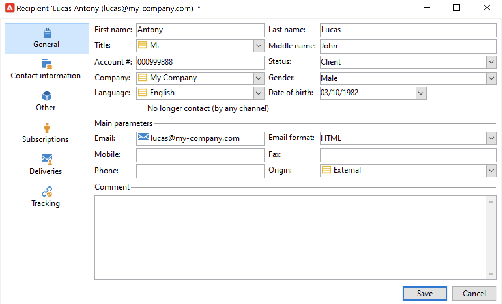

# Skapa profiler manuellt{#create-profiles-manual}

Om du vill fylla i Campaign-databasen kan du [importera profiler](import-profiles.md) eller lägg till dem manuellt enligt anvisningarna nedan.

Följ stegen nedan om du vill skapa en mottagare manuellt:

1. Bläddra till **[!UICONTROL Profiles and targets]** och väljer **[!UICONTROL Recipients]** kategori.

   

   Som standard lagras mottagarna i **[!UICONTROL Profiles and Targets > Recipients]** trädnod. Du kan också skapa mottagare från den här vyn.

1. Klicka på **[!UICONTROL Create button]**.
1. Ange profilens data.

   

   Läs mer om det inbyggda formuläret [den här sidan](view-profiles.md#edit-a-profiles).

1. Klicka **[!UICONTROL Save]**: profilen läggs till i Campaign i standardmottagarmappen.
