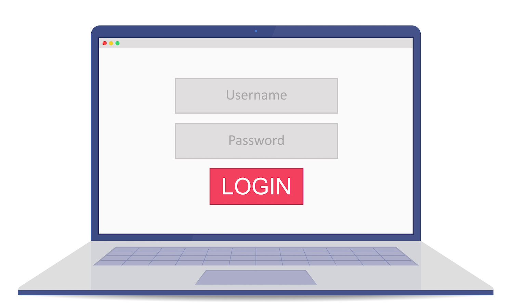

# Adobe Campaign v8-dokumentation {#campaign-documentation}

## Nyheter

* **[[!DNL Adobe Campaign] automatiseringsguide](https://experienceleague.adobe.com/docs/campaign/automation/home.html){target="_blank"}** - Lär dig skapa arbetsflöden och kampanjer

* **[Vad är [!DNL Adobe Campaign]](start/get-started.md)** - Nyckelfunktioner och användningsfall

* **[Nyheter i v8](start/whats-new.md)** - Upptäck Campaign v8-funktioner

* **[Genomförande av riktlinjer](start/implement.md)**  - Lär dig hur du startar implementeringen

* **[Från v7 till v8](start/v7-to-v8.md)** - Övergår från Campaign Classic v7 till v8? Lär dig viktiga skillnader

* **[Kontrollpanelen för Campaign v8](https://experienceleague.adobe.com/docs/control-panel/using/discover-control-panel/key-features.html){target="_blank"}** - Utför viktiga administratörsuppgifter på egen hand med Campaign Control Panel

* **[Versionsinformation](start/release-notes.md)** - Upptäck de senaste funktionerna och förbättringarna

## Kom igång

<table style="table-layout:fixed"><tr style="border: 0;">
<td>

<a href="start/connect.md"><strong>Anslut till Campaign</strong>

</td>
<td>

<a href="start/import.md"><strong>Importera profiler</strong></a>

</td>
<td>

<a href="start/create-message.md"><strong>Skapa ett e-postmeddelande</strong></a>

</td>
<td>

<a href="send/push.md"><strong>Skicka push-meddelanden</strong></a>

</td>
</tr></table>

## Fler resurser

* [Skyddsritningar och begränsningar](start/ac-guardrails.md)
* [Arkitektur](architecture/architecture.md)
* [Mät och spåra](reporting/gs-reporting.md)
* [Anslut till andra lösningar](connect/integration.md)
* [Vanliga frågor om Campaign v8](start/campaign-faq.md)
* [Adobe Campaign v8 - produktbeskrivning](https://helpx.adobe.com/legal/product-descriptions/adobe-campaign-managed-cloud-services.html){target="_blank"}
