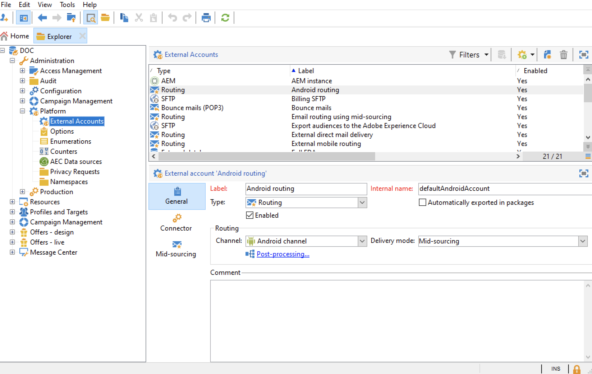
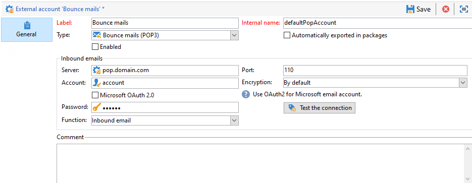
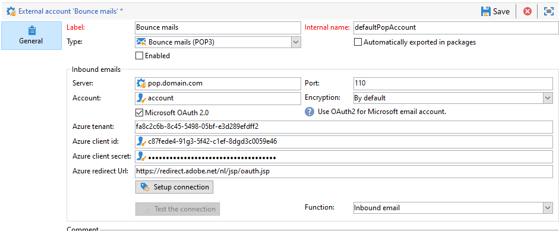

# Konfigurera dina externa konton {#config-external-accounts}

Adobe Campaign levereras med en uppsättning fördefinierade externa konton. Om du vill konfigurera anslutningar med externa system kan du skapa nya externa konton.

Externa konton används av tekniska processer som tekniska arbetsflöden eller kampanjarbetsflöden. Om du till exempel konfigurerar en filöverföring i ett arbetsflöde eller ett datautbyte med något annat program (Adobe Target, Experience Manager, osv.) måste du välja ett externt konto.

Du kan komma åt externa konton från Adobe Campaign **[!UICONTROL Explorer]**: bläddra till **[!UICONTROL Administration]** `>` **[!UICONTROL Platform]** `>` **[!UICONTROL External accounts]**.




>[!CAUTION]
>
>* Som användare av hanterade molntjänster konfigureras externa konton för din instans av Adobe och får inte ändras.
>
>* I kontexten för en [Enterprise (FFDA)-distribution](../architecture/enterprise-deployment.md) hanterar ett specifikt **[!UICONTROL Full FDA]** (FFDA) externt konto anslutningen mellan den lokala Campaign-databasen och molndatabasen ([!DNL Snowflake]).
>

## Kampanjspecifika externa konton {#ac-external-accounts}

Följande tekniska konton används av Adobe Campaign för att aktivera och köra specifika processer.

### Studsa e-post {#bounce-mails-external-account}

>[!NOTE]
>
>Microsoft Exchange Online OAuth 2.0-autentisering för POP3-kapacitet är tillgänglig från och med Campaign v8.3. Mer information om hur du kontrollerar versionen finns i [det här avsnittet](../start/compatibility-matrix.md#how-to-check-your-campaign-version-and-buildversion).
>

Det externa **studs-e-postkontot** anger det externa POP3-kontot som ska användas för att ansluta till e-posttjänsten. Alla servrar som konfigurerats för POP3-åtkomst kan användas för att ta emot returmeddelanden.

Läs mer om inkommande e-post på [den här sidan](https://experienceleague.adobe.com/docs/campaign/automation/workflows/wf-activities/event-activities/inbound-emails.html?lang=sv-SE){target="_blank"}.



Så här konfigurerar du det externa kontot **[!UICONTROL Bounce mails (defaultPopAccount)]**:

* **[!UICONTROL Server]** - URL för POP3-servern.

* **[!UICONTROL Port]** - portnummer för POP3-anslutning. Standardporten är 10.

* **[!UICONTROL Account]** - Användarens namn.

* **[!UICONTROL Password]** - Lösenord för användarkonto.

* **[!UICONTROL Encryption]** - Typ av vald kryptering mellan **[!UICONTROL By default]**, **[!UICONTROL POP3 + STARTTLS]**, **[!UICONTROL POP3]** eller **[!UICONTROL POP3S]**.

* **[!UICONTROL Function]** - Inkommande e-post eller SOAP-router.



>[!CAUTION]
>
>Innan du konfigurerar ditt POP3-externa konto med Microsoft OAuth 2.0 måste du först registrera programmet i Azure-portalen. Mer information finns på [sidan](https://docs.microsoft.com/en-us/azure/active-directory/develop/quickstart-register-app){target="_blank"}.
>

Om du vill konfigurera ett POP3-externt konto med Microsoft OAuth 2.0 markerar du alternativet **[!UICONTROL Microsoft OAuth 2.0]** och fyller i följande fält:

* **[!UICONTROL Azure tenant]** - Azure-id (eller klient-ID) finns i listrutan **Grundläggande** i programöversikten på Azure-portalen.

* **[!UICONTROL Azure Client ID]** - Klient-ID (eller program-ID (klient)) finns i listrutan **Grundläggande** i programöversikten på Azure-portalen.

* **[!UICONTROL Azure Client secret]** - Klienthemligt ID finns i kolumnen **Klienthemligheter** på menyn **Certifikat och hemligheter** i ditt program på Azure-portalen.

* **[!UICONTROL Azure Redirect URL]** - Omdirigerings-URL finns på menyn **Autentisering** i ditt program på Azure-portalen. Den ska sluta med följande syntax `nl/jsp/oauth.jsp`, t.ex. `https://redirect.adobe.net/nl/jsp/oauth.jsp`.

När du har angett dina autentiseringsuppgifter klickar du på **[!UICONTROL Setup the connection]** för att slutföra konfigurationen av det externa kontot.

### Routning {#routing}

Med det externa kontot **[!UICONTROL Routing]** kan du konfigurera varje kanal som är tillgänglig i Adobe Campaign beroende på vilka paket som är installerade.

Läs mer om extern kontohantering och leveranskörning i [det här avsnittet](../architecture/architecture.md#split).

### Körningsinstans {#execution-instance}

När det gäller transaktionsmeddelanden är körningsinstansen länkad till kontrollinstansen och kopplar dem. Transaktionsmeddelandemallar distribueras till körningsinstansen. Läs mer om arkitekturen i Message Center på [den här sidan](../architecture/architecture.md#transac-msg-archi).

## Tillgång till externa systemkonton {#external-syst-external-accounts}

### FDA (Federated Data Access) {#fda-external-accounts}

Det externa kontot av typen **Extern databas** används för att ansluta till en extern databas via FDA (Federated Data Access). Läs mer om FDA-alternativet (Federated Data Access) i [det här avsnittet](../connect/fda.md).

>[!NOTE]
>
>Externa databaser som är kompatibla med Adobe Campaign v8 visas i [kompatibilitetsmatrisen](../start/compatibility-matrix.md). FDA-anslutningar använder ODBC-drivrutiner; med Adobe Campaign Managed Cloud Services konfigureras ODBC-drivrutinen och det externa kontot av Adobe.

Konfigurationsinställningarna för det externa kontot beror på databasmotorn. Med Adobe Campaign Managed Cloud Services utförs konfigurationen av det externa kontot av Adobe.

Användargränssnittet för Campaign-webben (v8) finns i:

* [Skapa ett externt konto](https://experienceleague.adobe.com/en/docs/campaign-web/v8/administration/create-external-account){target="_blank"}
* [Externa databaskonton](https://experienceleague.adobe.com/en/docs/campaign-web/v8/administration/external-account-database){target="_blank"}

Webbgränssnittssidan för Campaign innehåller en mer omfattande lista över **externa databasprovidertyper**, inklusive:

* **[Amazon Redshift](https://experienceleague.adobe.com/en/docs/campaign-web/v8/administration/external-account-database#amazon-redshift){target="_blank"}** / **[Amazon Redshift (äldre)](https://experienceleague.adobe.com/en/docs/campaign-web/v8/administration/external-account-database#amazon-redshift-legacy){target="_blank"}** - Ansluta Campaign till AWS Redshift-molndatalagermiljöer.
* **[Azure Synapse Analytics](https://experienceleague.adobe.com/en/docs/campaign-web/v8/administration/external-account-database#azure-synapse-analytics){target="_blank"}** - Ansluta Campaign till Microsoft Azure Synapse dedikerade SQL-pooler.
* **[Databricks](https://experienceleague.adobe.com/en/docs/campaign-web/v8/administration/external-account-database#databricks){target="_blank"}** - Ansluta kampanjen till SQL-databaser och lokala arbetsbelastningar.
* **[Google BigQuery](https://experienceleague.adobe.com/en/docs/campaign-web/v8/administration/external-account-database#google-bigquery){target="_blank"}** - Ansluta Campaign till datauppsättningar för BigQuery-analyser i Google Cloud.
* **[Microsoft SQL Server](https://experienceleague.adobe.com/en/docs/campaign-web/v8/administration/external-account-database#microsoft-sql-server){target="_blank"}** - Anslut kampanj till lokala eller värdbaserade SQL Server-databaser.
* **[MySQL](https://experienceleague.adobe.com/en/docs/campaign-web/v8/administration/external-account-database#mysql){target="_blank"}** - Anslut kampanj till MySQL-databaser för federerade frågor och arbetsflöden.
* **[Netezza](https://experienceleague.adobe.com/en/docs/campaign-web/v8/administration/external-account-database#netezza){target="_blank"}** - Ansluta Campaign till IBM Netezza/Performance Server-system.
* **[ODBC (Sybase ASE, Sybase IQ)](https://experienceleague.adobe.com/en/docs/campaign-web/v8/administration/external-account-database#odbc-sybase-ase-sybase-iq){target="_blank"}** - Ansluta kampanj via ODBC till Sybase-databasmotorer.
* **[HTTP-relä till fjärrdatabas](https://experienceleague.adobe.com/en/docs/campaign-web/v8/administration/external-account-database#http-relay-to-remote-database){target="_blank"}** - Anslut via en HTTP-reläslutpunkt till en fjärrdatabas.
* **[Oracle](https://experienceleague.adobe.com/en/docs/campaign-web/v8/administration/external-account-database#oracle){target="_blank"}** - Ansluta Campaign till Oracle-databaser för federerade åtkomstanvändningsfall.
* **[PostgreSQL](https://experienceleague.adobe.com/en/docs/campaign-web/v8/administration/external-account-database#postgresql){target="_blank"}** - Anslut Campaign till PostgreSQL-databaser med FDA-externa konton.
* **[SAP HANA](https://experienceleague.adobe.com/en/docs/campaign-web/v8/administration/external-account-database#sap-hana){target="_blank"}** - Ansluta Campaign till SAP HANA i minnesdatabasmiljöer.
* **[Snowflake](https://experienceleague.adobe.com/en/docs/campaign-web/v8/administration/external-account-database#snowflake){target="_blank"}** - Ansluta Campaign till Snowflake molndataplattmiljöer.
* **[Teradata](https://experienceleague.adobe.com/en/docs/campaign-web/v8/administration/external-account-database#teradata){target="_blank"}** - Ansluta Campaign till Teradata datalagersystem för företag.
* **[Vertica Analytics](https://experienceleague.adobe.com/en/docs/campaign-web/v8/administration/external-account-database#vertica-analytics){target="_blank"}** - Ansluta Campaign till OpenText Vertica-analysdatabaser.
* **[Microsoft Fabric](https://experienceleague.adobe.com/en/docs/campaign-web/v8/administration/external-account-database#fabric){target="_blank"}** - Ansluta Campaign till Microsoft Fabric SQL och lagringstjänster.

Information om äldre klient-konsol och ytterligare referenser finns i [Adobe Campaign Classic v7-dokumentationen](https://experienceleague.adobe.com/sv/docs/campaign-classic/using/installing-campaign-classic/accessing-external-database/external-accounts){target="_blank"}.

#### Externt konto för databaser {#databricks-external-accounts}

Databrikens FDA-anslutning använder ODBC-drivrutinen för databaser. Från och med Campaign v8.9.1 har externa konton i DataRicks stöd för OAuth2-autentisering via tjänstens huvudnamn (icke-interaktivt klientautentiseringsflöde), vilket ger säker autentisering för federerad dataåtkomst.

Läs mer om tjänstens huvudnamn i [Microsoft-dokumentationen](https://learn.microsoft.com/en-us/azure/databricks/admin/users-groups/service-principals){target="_blank"}.

Så här konfigurerar du OAuth2-autentisering via tjänstens huvudnamn i Campaign:

1. Administratören för arbetsytan Databaser aktiverar tjänstens huvudnamn på arbetsytan Databaser och genererar autentiseringsuppgifter. Skapa en OAuth-hemlighet (används för att generera OAuth-åtkomsttoken för autentisering) om du vill tillåta åtkomst till dina Azure Database-resurser med OAuth.
2. Skapa eller redigera ett externt databankskonto i Adobe Campaign och öppna fliken **OAuth**.
3. Klistra in inloggningsuppgifterna i fälten på fliken OAuth i det externa databankskontot.
4. Använd **[!UICONTROL Test the connection]** för att validera konfigurationen.

#### Snowflake externt konto {#snowflake-external-accounts}

Snowflake FDA-anslutningen använder Snowflake ODBC-drivrutinen. Från och med Campaign v8.9.1 har Snowflake externa konton stöd för OAuth2-autentisering, vilket ger säker autentisering för federerad dataåtkomst.

Läs mer om OAuth i Snowflake i [Snowflake-dokumentationen](https://docs.snowflake.com/en/user-guide/oauth-intro){target="_blank"}.

Först måste du utföra följande steg på Snowflake:

1. Innan du konfigurerar ditt externa Snowflake-konto med OAuth 2.0 måste du skapa en OAuth-säkerhetsintegrering i Snowflake. Rollen **ACCOUNTADMIN** krävs för att skapa säkerhetsintegreringen.

   Läs mer om hur du skapar OAuth-säkerhetsintegrering i [Snowflake-dokumentationen](https://docs.snowflake.com/en/sql-reference/sql/create-security-integration-oauth-snowflake){target="_blank"}.

1. Du kan sedan fråga klient-ID och klienthemlighet med:

   ```
   select system$show_oauth_client_secrets('OAUTH_INTEGRATION_ABC'); // use uppercase letters
   ```

Så här konfigurerar du OAuth2-autentisering i Campaign:

1. Skapa eller redigera ett externt Snowflake-konto i Adobe Campaign och markera alternativet **[!UICONTROL Use OAuth 2.0]**.

1. Ange servern, databasen och schemat och öppna fliken **[!UICONTROL OAuth]**.

1. Ange säkerhetsintegrationsparametrarna **[!UICONTROL Client ID]**, **[!UICONTROL Client Secret]** och **[!UICONTROL Redirect URL]**. Dessa parametrar hämtas från din Snowflake OAuth-säkerhetsintegrering. Mer information finns i [Snowflake-dokumentationen](https://docs.snowflake.com/en/user-guide/oauth-custom){target="_blank"}.

1. Klicka på **[!UICONTROL Proceed to Sign in]** om du vill logga in manuellt. Ett nytt webbläsarfönster öppnas där du uppmanas att ange dina användaruppgifter för Snowflake.

1. När autentiseringsprocessen är slutförd autentiseras kontot för det antal dagar som definieras i Snowflake OAuth Security Integration (med parametern `OAUTH_REFRESH_TOKEN_VALIDITY`). Uppdateringstoken lagras i det externa kontot.

>[!CAUTION]
>
>Observera att omdirigerings-URL alltid ska ha `oauth.jsp` som mål på din Campaign-programserverdator via HTTPS (port 443). Serverdomäner med understreck stöds inte heller när OAuth används. Använd serverdomäner utan understreck om du tänker använda OAuth.

### X (tidigare Twitter) {#twitter-external-account}

Det externa kontot av typen **Twitter** används för att ansluta Campaign till ditt X-konto och för att skicka meddelanden åt dig. Läs mer om X-integrering i [det här avsnittet](../connect/ac-tw.md).

## Externa konton för integrering av lösningar i Adobe {#adobe-integration-external-accounts}

* **Adobe Experience Cloud** - Det **[!UICONTROL Adobe Experience Cloud]** externa kontot används för att implementera Adobe Identity Management-tjänsten (IMS) för att ansluta till Adobe Campaign. Läs mer om Adobe Identity Management-tjänsten (IMS) i [det här avsnittet](../start/connect.md#logon-to-ac).

* **Web Analytics** - Det **[!UICONTROL Web Analytics (Adobe Analytics)]** externa kontot används för att konfigurera dataöverföring från Adobe Analytics till Adobe Campaign. Läs mer om Adobe Campaign - Adobe Analytics-integrering på [den här sidan](../connect/ac-aa.md).

* **Adobe Experience Manager** - Med det **[!UICONTROL AEM]** externa kontot kan du hantera innehållet i e-postleveranser och dina formulär direkt i Adobe Experience Manager. Läs mer om Adobe Campaign - Adobe Experience Manager-integrering på [den här sidan](../connect/ac-aem.md).


## Externa konton för CRM Connector {#crm-external-accounts}

* **Microsoft Dynamics CRM** - Med det **[!UICONTROL Microsoft Dynamics CRM]** externa kontot kan du importera och exportera Microsoft Dynamics-data till Adobe Campaign. Läs mer om Adobe Campaign - Microsoft Dynamics CRM-integrering på [den här sidan](../connect/ac-ms-dyn.md).

* **Salesforce.com** - Med det **[!UICONTROL Salesforce CRM]** externa kontot kan du importera och exportera Salesforce-data till Adobe Campaign. Läs mer om Adobe Campaign - Salesforce.com CRM-integrering i [den här sidan](../connect/ac-sfdc.md).

## Överför externa konton för data {#transfer-data-external-accounts}

Dessa externa konton kan användas för att importera eller exportera data till Adobe Campaign med hjälp av en **[!UICONTROL Transfer file]**-arbetsflödesaktivitet. Läs mer om **Filöverföring** i arbetsflöden på [den här sidan](https://experienceleague.adobe.com/docs/campaign/automation/workflows/wf-activities/event-activities/file-transfer.html?lang=sv-SE){target="_blank"}.

* **FTP och SFTP** - Med det externa **FTP**-kontot kan du konfigurera och testa åtkomst till en server utanför Adobe Campaign. Om du vill konfigurera anslutningar till externa system som SFTP- eller FTP-servrar som används för filöverföringar kan du skapa egna externa konton.

  Om du vill göra det anger du den adress och de autentiseringsuppgifter som ska användas för att upprätta anslutningen till SFTP- eller FTP-servern i det här externa kontot.

  >[!NOTE]
  >
  >Från och med version 8.5 kan du nu autentisera säkert med en privat nyckel när du konfigurerar ditt externa SFTP-konto. [Läs mer om nyckelhantering](https://experienceleague.adobe.com/docs/control-panel/using/sftp-management/key-management.html?lang=sv-SE){target="_blank"}.

* **Amazon Simple Storage Service (S3)** - **AWS S3**-anslutningen kan användas för att importera eller exportera data till Adobe Campaign med hjälp av en **[!UICONTROL Transfer file]** arbetsflödesaktivitet. När du konfigurerar det här externa kontot måste du ange följande information:

   * **[!UICONTROL AWS S3 Account Server]**: Serverns URL i formatet `<S3bucket name>.s3.amazonaws.com/<s3object path>`.

   * **[!UICONTROL AWS access key ID]**: Lär dig hur du hittar ditt ID för AWS-åtkomstnyckel i [Amazon-dokumentationen](https://docs.aws.amazon.com/general/latest/gr/aws-sec-cred-types.html#access-keys-and-secret-access-keys){target="_blank"}.

   * **[!UICONTROL Secret access key to AWS]**: Lär dig hur du hittar din hemliga åtkomstnyckel till AWS i [Amazon-dokumentationen](https://aws.amazon.com/fr/blogs/security/wheres-my-secret-access-key/){target="_blank"}.

   * **[!UICONTROL AWS Region]**: Läs mer om AWS-regioner i [Amazon-dokumentationen](https://aws.amazon.com/about-aws/global-infrastructure/regions_az/){target="_blank"}.

   * Med kryssrutan **[!UICONTROL Use server-side encryption]** kan du lagra filen i S3-krypterat läge. Lär dig hur du hittar åtkomstnyckel-ID och hemlig åtkomstnyckel i [Amazon-dokumentationen](https://docs.aws.amazon.com/general/latest/gr/aws-sec-cred-types.html#access-keys-and-secret-access-keys){target="_blank"}.

* **Azure Blob Storage** - Det externa **Azure**-kontot kan användas för att importera eller exportera data till Adobe Campaign med hjälp av en **[!UICONTROL Transfer file]**-arbetsflödesaktivitet. Om du vill konfigurera det externa **Azure**-kontot så att det fungerar med Adobe Campaign måste du ange följande information:

   * **[!UICONTROL Server]**: URL-adressen till Azure Blob-lagringsservern.

   * **[!UICONTROL Encryption]**: Typ av kryptering: **[!UICONTROL None]** eller **[!UICONTROL SSL]**.

   * **[!UICONTROL Access key]**: Lär dig hur du hittar **[!UICONTROL Access key]** i [Microsoft-dokumentationen](https://docs.microsoft.com/en-us/azure/storage/common/storage-account-keys-manage?tabs=azure-portal){target="_blank"}.

* **Microsoft Fabric** - Med det externa kontot **Microsoft Fabric** kan du importera och exportera data mellan Microsoft Fabric och Adobe Campaign med hjälp av arbetsflödesaktiviteten **[!UICONTROL Transfer file]**. Om du vill konfigurera den här integreringen anger du följande information:

   * **[!UICONTROL Server]**: URL:en till din Microsoft Fabric-lagringsserver.

   * **[!UICONTROL Application ID]**: Den unika identifieraren för programmet som används för att autentisera och få åtkomst till Microsoft Fabric-resurser.

   * **[!UICONTROL Client secret]**: Den autentiseringsnyckel eller det lösenord som är associerat med programmet, som krävs för att ansluta till Microsoft Fabric på ett säkert sätt.
