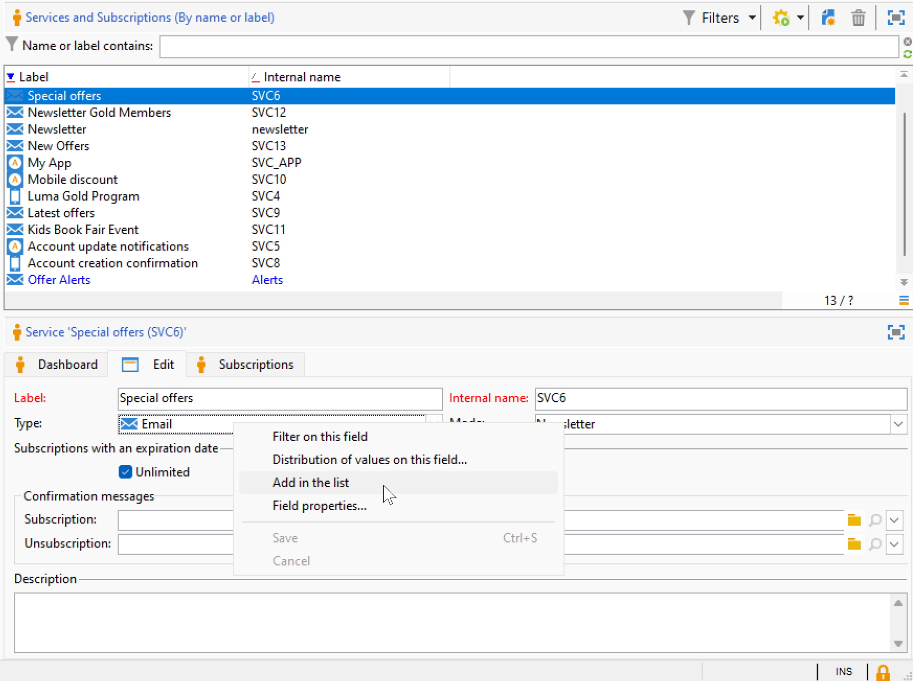

# Inställningar för gränssnittet i kampanjen {#ui-settings}

## Standardenheter {#default-units}

I Adobe Campaign, för fält som uttrycker en varaktighet (t.ex. resursernas giltighetsperiod, tidsgräns för godkännande av en uppgift osv.), kan värdena uttryckas i följande **enheter**:

* **[!UICONTROL s]** i sekunder
* **[!UICONTROL mn]** i minuter
* **[!UICONTROL h]** i timmar
* **[!UICONTROL d]** i dagar

## Anpassa Campaign Explorer{#customize-explorer}

Du kan lägga till mappar i Campaign Explorer, skapa vyer och tilldela behörigheter.

Lär dig hur du hanterar mappar och vyer i [den här sidan](../audiences/folders-and-views.md)

## Hantera och anpassa listor{#customize-lists}

I Campaign Client Console visas data i listor. Du kan anpassa listorna efter dina behov. Du kan till exempel lägga till kolumner, filtrera data, räkna poster, spara och dela inställningarna.

Dessutom kan du skapa och spara filter.  Läs mer om filter i [den här sidan](../audiences/create-filters.md).

### Antal poster {#number-of-records}

Som standard läser Adobe Campaign in de första 200 posterna i en lista. Det innebär att visningen inte nödvändigtvis visar alla poster i tabellen som du visar. Du kan räkna antalet poster i listan och läsa in fler poster.

I den nedre högra delen av listskärmen visas en **räknare** visar hur många poster som har lästs in och det totala antalet poster i databasen (efter att eventuella filter har använts):

Om ett frågetecken visas i stället för numret till höger, till exempel `240/?`klickar du på räknaren för att starta beräkningen.

Om du vill läsa in och visa fler poster klickar du **[!UICONTROL Continue loading]**. Som standard läses 200 poster in. Använd **[!UICONTROL Configure list]** ikonen längst ned till höger i listan. Klicka på **[!UICONTROL Advanced parameters]** (längst ned till vänster) och ändra antalet rader som ska hämtas.

Om du vill läsa in alla poster högerklickar du på listan och väljer **[!UICONTROL Load all]**.

>[!CAUTION]
>
>När en lista innehåller många poster kan det ta en stund att läsa in hela filen.
>

### Lägga till och ta bort kolumner {#add-columns}

För varje lista kan den inbyggda kolumnkonfigurationen anpassas för att visa mer information eller dölja oanvända kolumner.

Högerklicka på fältet och markera data när de visas i detaljerna för en post **[!UICONTROL Add in the list]**.

Kolumnen läggs till till höger om de befintliga kolumnerna.

Du kan också använda skärmen för listkonfiguration för att lägga till och ta bort kolumner:

1. Klicka på i en lista över poster **[!UICONTROL Configure list]** ikonen längst ned till höger.
1. Dubbelklicka på de fält som ska läggas till i dialogrutan **[!UICONTROL Available fields]** lista: de läggs till i **[!UICONTROL Output columns]** lista.

   

   >[!NOTE]
   >
   >Som standard visas inte avancerade fält. Klicka på knappen **Visa avancerade fält** ikonen längst ned till höger i listan med tillgängliga fält.
   >
   >Fält identifieras av specifika ikoner: SQL-fält, länkade tabeller, beräkningsfält osv. För varje markerat fält visas beskrivningen under listan med tillgängliga fält.
   >

1. Använd upp-/nedpilarna för att ändra **visningsordning**.

1. Klicka **[!UICONTROL OK]** för att bekräfta konfigurationen och visa resultatet.

Om du behöver ta bort en kolumn markerar du den och klickar på **Papperskorgen** -ikon.

Du kan använda **[!UICONTROL Distribution of values]** om du vill visa ompartitionen av värden för det valda fältet i den aktuella mappen.

### Skapa en ny kolumn {#create-a-new-column}

Du kan skapa nya kolumner för att visa ytterligare fält i listan.

Så här skapar du en kolumn:

1. Klicka på i en lista över poster **[!UICONTROL Configure list]** ikonen längst ned till höger.
1. Klicka på **[!UICONTROL Add]** om du vill visa ett nytt fält i listan.
1. Konfigurera fältet som ska läggas till i kolumnen.

### Visa data i undermappar {#display-sub-folders-records}

Listor kan visa:

* Alla poster i den valda mappen (standard)
* Alla poster i den markerade mappen och dess undermappar

Om du vill växla från ett visningsläge till ett annat klickar du på **[!UICONTROL Display sub-levels]** i verktygsfältet Campaign.

### Spara en listkonfiguration {#saving-a-list-configuration}

Listkonfigurationerna definieras lokalt för varje användare. När den lokala cachen rensas inaktiveras lokala konfigurationer.

Som standard gäller inställningsparametrar för alla listor med motsvarande mapptyp. När du ändrar hur listan med mottagare visas från en mapp, tillämpas den här konfigurationen på alla andra mottagarmappar.

Du kan spara mer än en konfiguration som ska användas för olika mappar av samma typ. Konfigurationen sparas med egenskaperna för den mapp som innehåller data och kan tillämpas på nytt.

Så här sparar du en listkonfiguration så att den kan återanvändas:

1. I Utforskaren högerklickar du på mappen som innehåller de data som visas.
1. Välj **[!UICONTROL Properties]**.
1. Klicka **[!UICONTROL Advanced settings]** och ange sedan ett namn i **[!UICONTROL Configuration]** fält.
1. Klicka **[!UICONTROL OK]** och sedan klicka **[!UICONTROL Save]**.

Du kan sedan använda den här konfigurationen i en annan mapp av samma typ. Läs mer om mappar i [den här sidan](../audiences/folders-and-views.md).

### Exportera en lista {#exporting-a-list}

Om du vill exportera data från en lista måste du använda en exportguide. Du kommer åt den genom att markera de element som ska exporteras i listan, högerklicka och välja **[!UICONTROL Export...]**.

<!--The use of the import and export functions is explained in [Generic imports and exports](../../platform/using/about-generic-imports-exports.md).-->

>[!CAUTION]
>
>Element från en lista får inte exporteras med funktionen Kopiera/Klistra in.

### Sortera en lista {#sorting-a-list}

Listor kan innehålla en stor mängd data. Du kan sortera dessa data eller använda enkla eller avancerade filter. Med sortering kan du visa data i stigande eller fallande ordning. Med filter kan du definiera och kombinera villkor så att endast markerade data visas.

Klicka på kolumnrubriken om du vill använda en stigande eller fallande sortering eller om du vill avbryta sorteringen. Aktiv sorteringsstatus och sorteringsordning anges med en blå pil före kolumnetiketten. Ett rött streck före kolumnetiketten betyder att sorteringen tillämpas på data som indexeras från databasen. Den här sorteringsmetoden används för att optimera sorteringsjobb.

Du kan också konfigurera sortering eller kombinera sorteringsvillkor. Följ stegen nedan för att göra detta:

1. **[!UICONTROL Configure list]** nedan och till höger om listan.
1. I fönstret för listkonfiguration klickar du på **[!UICONTROL Sorting]** -fliken.
1. Markera de fält som ska sorteras och sorteringsriktningen (stigande eller fallande).
1. Sorteringsprioriteten definieras av sorteringskolumnernas ordning. Om du vill ändra prioriteten använder du lämpliga ikoner för att ändra ordningen på kolumnerna.

   Sorteringsprioriteten påverkar inte visningen av kolumnerna i listan.

1. Klicka **[!UICONTROL Ok]** för att bekräfta konfigurationen och visa resultatet i listan.

## Arbeta med uppräkningar {#enumerations}

En uppräkning (kallas även&quot;lista med specificerade värden&quot;) är en lista med värden som föreslås av systemet för att fylla i fält. Använd uppräkningar för att standardisera värdena för dessa fält, hjälp med inmatning av data eller användning inom frågor.

Värdelistan visas som en listruta där du kan välja vilket värde som ska anges i fältet. Listrutan möjliggör även prediktiv inmatning: ange de första bokstäverna och programmet fyller i resten.

Värdena för den här typen av fält definieras och den övergripande administrationen av dessa fält (genom att lägga till/ta bort ett värde) utförs via **[!UICONTROL Administration > Platform > Enumerations]** trädnod.

### Uppräkningstyper {#types-of-enum}

Uppräkningar lagras i **[!UICONTROL Administration > Platform > Enumerations]** Utforskarens mapp.

De kan vara: Open, System, Emoticon eller Closed.

* An **Öppna** Med uppräkning kan användare lägga till nya värden direkt i de fält som är baserade på den här uppräkningen.
* A **Stängd** uppräkningen har en fast lista med värden som bara kan ändras från **[!UICONTROL Administration > Platform > Enumerations]** Utforskarens mapp.
* An **Emoticon** uppräkning används för att uppdatera uttryckslistan. Läs mer
* A **System** uppräkningen är kopplad till systemfält och kommer med ett internt namn.

För **Öppna** och **Stängd** uppräkningar, specifika alternativ är tillgängliga:

* **Enkel uppräkning** är standardstandardtypen.
* **Rensa alias** uppräkningen används för att harmonisera uppräkningsvärdena som lagras i databasen. [Läs mer](#alias-cleansing)
* **Reserverad för bindning** är ett alternativ som gör att du kan länka kubvärden till den här uppräkningen. [Läs mer](../reporting/gs-cubes.md)

### Rensa alias {#alias-cleansing}

I uppräkningsfälten kan du välja ett värde eller ange ett anpassat värde som inte är tillgängligt i listrutan. Anpassade värden kan läggas till i de befintliga uppräkningsvärdena som ett nytt - i det här fallet **[!UICONTROL Open]** måste vara markerat. Dessa anpassade värden kan rensas med hjälp av funktioner för aliasrensning. Om en användare till exempel anger `Adob` i stället för `Adobe`, kan aliasrensningsprocessen automatiskt ersätta den med rätt term.

>[!CAUTION]
>
>Datarensning är en kritisk process som påverkar data i databasen. Adobe Campaign genomför massuppdateringar, vilket kan leda till att vissa värden tas bort. Den här åtgärden är därför reserverad för expertanvändare.

Aktivera **[!UICONTROL Alias cleansing]** om du vill använda datarensningsfunktioner för en uppräkning. När det här alternativet är markerat visas **[!UICONTROL Alias]** visas längst ned i fönstret.

När en användare anger ett värde som inte finns i en uppräkning för aliasrensning läggs det till i **Värden** lista. Du kan [skapa alias utifrån dessa värden](#convert-to-alias), eller [skapa nya alias från grunden](#create-alias).

#### Skapa ett alias{#create-alias}

Så här skapar du ett alias:

1. Klicka **[!UICONTROL Add]** knappen på **[!UICONTROL Alias]** -fliken.
1. Ange det alias som du vill konvertera och välj det värde som ska användas i listrutan.

   

1. Klicka **[!UICONTROL Ok]** och bekräfta.

1. Spara ändringarna. Ersättningen av värden utförs av **Rensa alias** arbetsflöde som körs varje kväll. Se [Kör datarensning](#running-data-cleansing).

För alla fält som baseras på den här uppräkningen, när en användare anger värdet **Adobe** i ett&quot;företag&quot;-fält (i Adobe Campaign Client Console, i ett webbformulär) ersätts det automatiskt av värdet **Adobe**.

#### Konvertera fel värde till alias{#convert-to-alias}

Du kan också konvertera ett befintligt uppräkningsvärde till ett alias. Så här gör du:

1. Högerklicka och bläddra till listan med värden för en uppräkning **[!UICONTROL Actions... > Convert values into aliases...]**.

   

1. Markera de värden som ska konverteras i alias och klicka på **[!UICONTROL Next]**.
1. Klicka **[!UICONTROL Start]** för att köra konverteringen.

   När körningen är klar läggs alias till i listan i **Alias** -fliken. Du kan associera ett korrekt värde om du vill ersätta fel poster. Så här gör du:

1. Välj ett värde som ska rensas.
1. Klicka på **Detalj...** -knappen.
1. Välj det nya värdet i listrutan.

   

>[!NOTE]
>
>Du kan spåra förekomster av ett alias i dialogrutan **[!UICONTROL Hits]** kolumn i **[!UICONTROL Alias]** underflik. Den kan visa hur många gånger det här värdet har angetts.  [Läs mer](#calculate-entry-occurrences).

#### Kör datarensning {#running-data-cleansing}

Datarensning utförs av **[!UICONTROL Alias cleansing]** tekniskt arbetsflöde. Som standard utförs den dagligen.

Rensning kan också aktiveras via **[!UICONTROL Cleanse values...]** länk.

The **[!UICONTROL Advanced parameters...]** -länken kan du ange det datum från vilket insamlade värden ska beaktas.

Klicka på **[!UICONTROL Start]** för att köra datarensning.

##### Övervaka förekomster {#calculate-entry-occurrences}

The **[!UICONTROL Alias]** en uppräknings underflik kan visa antalet förekomster av ett alias bland alla värden som anges. Den här informationen är en uppskattning och visas i **[!UICONTROL Hits]** kolumn.

>[!CAUTION]
>
>Det kan ta lång tid att beräkna aliaspostförekomster.
>

Du kan köra träffberäkning manuellt via **[!UICONTROL Cleanse values...]** länk. Klicka på **[!UICONTROL Advanced parameters...]** och välj alternativ.

* **[!UICONTROL Update the number of alias hits]**: detta gör att du kan uppdatera träffar som redan har beräknats, baserat på det angivna datumet.
* **[!UICONTROL Recalculate the number of alias hits from the start]**: gör att du kan köra beräkningen på hela Adobe Campaign-plattformen.

Du kan också skapa ett dedikerat arbetsflöde så att beräkningen körs automatiskt för en viss period, till exempel en gång i veckan.

Om du vill göra det skapar du en kopia av **[!UICONTROL Alias cleansing]** ändrar du schemaläggaren och använder följande inställningar i **[!UICONTROL Enumeration value cleansing]** aktivitet:

* **-updateHits** för att uppdatera antalet aliasträffar,
* **-updateHits:full** om du vill beräkna om alla aliasträffar.
