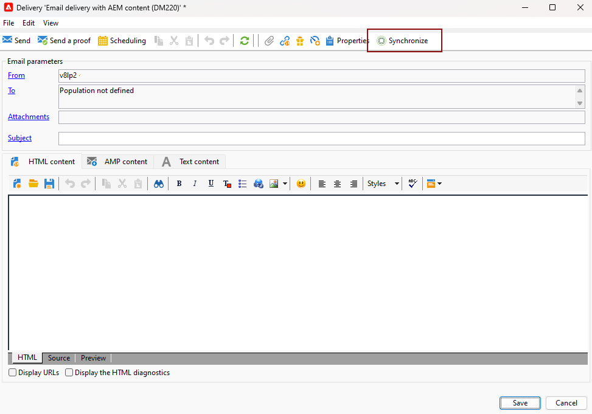

# Arbeta med Campaign och Adobe Experience Manager {#ac-aem}

Tack vare integrationen mellan Adobe Campaign och Adobe Experience Manager kan ni hantera innehållet i era e-postleveranser och era formulär direkt i Adobe Experience Manager. Du kan antingen importera **Adobe Experience Manager** innehåll i Campaign eller koppla samman **Adobe Experience Manager som molntjänst** så att du kan redigera innehållet direkt i webbgränssnittet.

[Upptäck hur du kan redigera din Adobe Experience Manager som Cloud Service i webbgränssnittet för Campaign](https://experienceleague.adobe.com/docs/campaign-web/v8/integrations/aem-content.html){target="_blank"}.

[Läs mer om Adobe Experience Manager i det här dokumentet](https://experienceleague.adobe.com/docs/experience-manager-65/administering/integration/campaignonpremise.html#aem-and-adobe-campaign-integration-workflow){target="_blank"}.

>[!NOTE]
>
>Som användare av hanterade Cloud Service [kontakta Adobe](../start/campaign-faq.md#support) för att integrera Adobe Experience Manager med Campaign.

## Importera innehåll från Adobe Experience Manager {#integrating-with-aem}

Den här integreringen kan till exempel användas för att skapa ett nyhetsbrev i Adobe Experience Manager som sedan används i Adobe Campaign som en del av en e-postkampanj.

**Från Adobe Experience Manager:**

1. Navigera till [!DNL Adobe Experience Manager] författarinstans och klicka på Adobe Experience i det övre vänstra hörnet på sidan. Välj **[!UICONTROL Sites]** på menyn.

   

1. Åtkomst **[!UICONTROL Campaigns > Name of your brand (here we.Shopping) > Main Area > Email]**.

1. Klicka **[!UICONTROL Create]** och markera **[!UICONTROL Page]** i listrutan.

   

1. Välj **[!UICONTROL Adobe Campaign Email]** mall och ge nyhetsbrevet ett namn.

1. När du har skapat sidan öppnar du **[!UICONTROL Page information]** meny och klicka **[!UICONTROL Open Properties]**.

   

1. Anpassa e-postinnehållet genom att lägga till komponenter, till exempel anpassningsfält från Adobe Campaign. Läs mer i [Adobe Experience Manager-dokumentation](https://experienceleague.adobe.com/docs/experience-manager-65/content/sites/authoring/aem-adobe-campaign/campaign.html#editing-email-content){target="_blank"}.

1. När e-postmeddelandet är klart går du till **[!UICONTROL Page information]** meny och klicka **[!UICONTROL Start workflow]**.

   

1. I den första listrutan väljer du **[!UICONTROL Approve Adobe Campaign]** som arbetsflödesmodell och klicka **[!UICONTROL Start workflow]**.

   

1. En ansvarsfriskrivning visas högst upp på sidan med följande information: `This page is subject to the workflow Approve for Adobe Campaign`. Klicka **[!UICONTROL Complete]** bredvid ansvarsfriskrivningen för att bekräfta granskningen och klicka på **[!UICONTROL Ok]**.

1. Klicka **[!UICONTROL Complete]** igen och välj **[!UICONTROL Newsletter approval]** i **[!UICONTROL Next Step]** nedrullningsbar meny.

   

Nyhetsbrevet är nu klart och synkroniserat i Adobe Campaign.

**Från Adobe Campaign:**

1. Från **[!UICONTROL Campaigns]** flik, klicka **[!UICONTROL Deliveries]** sedan **[!UICONTROL Create]**.

1. Välj **[!UICONTROL Email delivery with AEM content (mailAEMContent)]** mall från **[!UICONTROL Delivery template]** listruta.

   

1. Lägg till en **[!UICONTROL Label]** till leveransen och klicka **[!UICONTROL Continue]**.

1. Klicka **[!UICONTROL Synchronize]** för att få tillgång till era AEM.

   Om knappen inte visas i gränssnittet går du till **[!UICONTROL Properties]** och få åtkomst till **[!UICONTROL Advanced]** -fliken. Se till att **[!UICONTROL Content editing mode]** fältet är konfigurerat till **[!UICONTROL AEM]** och ange AEM i **[!UICONTROL AEM account]** fält.

   

1. Välj den AEM leveransen som skapades i [!DNL Adobe Experience Manager] och bekräfta genom att klicka **[!UICONTROL Ok]**.

   

1. Klicka på **[!UICONTROL Refresh content]** när AEM ändras.

   

1. Om du vill ta bort länken mellan Experience Manager och Campaign klickar du på **[!UICONTROL Desynchronize]**.

Din e-post kan nu skickas till din målgrupp.

## Importera resurser från Adobe Experience Manager Assets bibliotek {#assets-library}

Du kan även infoga resurser direkt från [!DNL Adobe Experience Manager Assets Library] när du redigerar ett e-postmeddelande eller en landningssida i Adobe Campaign. Den här funktionen beskrivs i [Adobe Experience Manager Assets-dokumentation](https://experienceleague.adobe.com/docs/experience-manager-65/content/assets/managing/manage-assets.html){target="_blank"}.

**Från Adobe Experience Manager:**

1. Navigera till [!DNL Adobe Experience Manager] författarinstans och klicka på Adobe Experience i det övre vänstra hörnet på sidan. Välj **[!UICONTROL Assets]** `>` **[!UICONTROL Files]** på menyn.

   

1. Klicka **Skapa** sedan **Filer** för att importera resursen till **Adobe Experience Manager Assets Library**. Läs mer i [Adobe Experience Manager-dokumentation](https://experienceleague.adobe.com/docs/experience-manager-65/content/assets/managing/manage-assets.html#uploading-assets){target="_blank"}.

   

1. Byt namn på resursen om det behövs och välj **Överför**.

Din resurs har nu överförts till din **Adobe Experience Manager Assets Library**.

**Från Adobe Campaign:**

1. Skapa en ny leverans i Adobe Campaign genom att gå till **Kampanjer** flik, klicka **Leveranser** och klicka på **Skapa** ovanför listan över befintliga leveranser.

   

1. Välj en **Leveransmall** och namnge sedan leveransen.

1. Definiera och anpassa meddelandeinnehållet. [Läs mer](../send/email.md)

1. Använd **Adobe Experience Manager Assets-bibliotek**, få åtkomst till **[!UICONTROL Properties]** AEM och välj **[!UICONTROL Advanced]** -fliken.

   Välj **AEM** och aktivera **[!UICONTROL Use above AEM instance as shared asset library]** alternativ.

   

1. Från **Bild** -ikonen, visa **[!UICONTROL Select a shared asset]** -menyn.

   

1. I urvalsfönstret väljer du en bild från **Adobe Experience Manager Assets-bibliotek** sedan **Välj**.

   

Din mediefil överförs nu till din e-postleverans. Nu kan du ange målgruppen, bekräfta leveransen och fortsätta skicka den.
