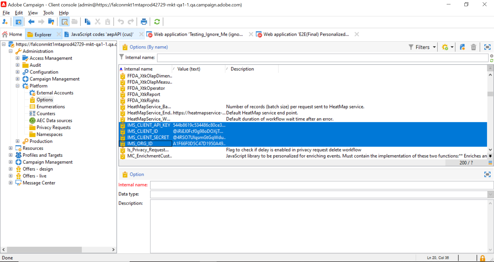

# Uppdatera Adobe Experience Platform-profiler från Adobe Campaign landningssidor

Tack vare integreringen mellan Adobe Campaign och Adobe Experience Platform kan du synkronisera data sömlöst mellan Adobe Campaign landningssidor och Adobe Experience Platform. Med den här integreringen kan du

* Hämta Adobe Experience Platform-profilattribut för att visa uppdaterad information på Adobe Campaign landningssidor,
* Skicka tillbaka uppdaterade profilattribut till Adobe Experience Platform för att uppdatera motsvarande attribut baserat på vad som fyllts i och skickats in på landningssidorna.

De viktigaste stegen för att konfigurera integreringen är följande:

<table>
<tr>
<td><p><a href="#oauth">Konfigurera en OAuth-anslutning</a></p></td>
<td><p><a href="#source">Skapa en HTTP API-källanslutning</a></p></td>
<td><p><a href="#xtk">Lägg till autentiseringsalternativ i Campaign</a></p></td>
<td><p><a href="#javascript">Lägga till JavaScript-koder i Campaign</a></p></td>
<td><p><a href="#script">Konfigurera arbetsflödet för landningssidan</a></p></td>
</table>

## Konfigurera en Oauth-anslutning {#oauth}

Adobe Cloud Platform API:er använder OAuth 2.0-protokollet för autentisering och auktorisering. Om du vill ansluta Adobe Experience Platform till Adobe Campaign med API-anrop måste du generera en åtkomsttoken med den OAuth-integrering som skapats i Adobe Developer Console.

Följ dessa steg för att göra detta:

1. Gå till Adobe Developer Console.
1. Skapa en ny API-anslutning med Adobe Experience Platform API-produkten. Detaljerade anvisningar om hur du får en OAuth 2.0-åtkomsttoken finns i [Adobe Developer Console-dokumentation](https://developer.adobe.com/developer-console/docs/guides/authentication/Tools/OAuthPlayground/).
1. När anslutningen har skapats går du till **[!UICONTROL OAuth Server-to-Server]** meny och kopiera informationen nedan, som krävs i Campaign för autentisering:

   * KLIENT-ID
   * KLIENTSHEMLIGHET
   * ORGANISATIONS-ID

   {width="70%"}

Nu när din Oauth-anslutning är konfigurerad skapar och konfigurerar du en ny **[!UICONTROL HTTP API]** Källanslutning för att länka Adobe Campaign till Adobe Experience Platform.

## Skapa en HTTP API-källanslutning {#source}

När OAuth-anslutningen är på plats är nästa steg att skapa en **[!UICONTROL HTTP API]** Källanslutning i Adobe Experience Platform. Med den här anslutningen kan du strömma data till Adobe Experience Platform med API:er. Följ de här stegen:

1. Navigera till Adobe Experience Platform **[!UICONTROL Sources]**, sök efter **[!UICONTROL HTTP API]** klicka sedan på **[!UICONTROL Add data]**.

   {width="70%"}

1. Konfigurera anslutningen beroende på dina behov. Detaljerad information om hur du konfigurerar en HTTP API-anslutning finns i [Dokumentation för Adobe Experience Platform-källor](https://experienceleague.adobe.com/docs/experience-platform/sources/ui-tutorials/create/streaming/http.html).

   På **[!UICONTROL Authentication]** steg, växla till **[!UICONTROL Enable authentication]** autentiseringsalternativ med åtkomsttoken som genererats tidigare genom OAuth-integreringen.

   {width="70%"}

1. När källanslutningen har konfigurerats visas slutpunkten för direktuppspelning. Den här slutpunkten krävs för att importera data till Adobe Experience Platform.

   {width="70%"}

   Du kan även få åtkomst till ett exempel på dataformatet som har importerats till Adobe Experience Platform genom att öppna det nya dataflödet från **[!UICONTROL Dataflows]** -fliken.

   {width="70%"}

Nu när HTTP API Source-anslutningen har konfigurerats måste du lägga till specifika alternativ i Adobe Campaign för att aktivera anslutningen till Adobe Experience Platform.

## Lägg till autentiseringsalternativ i Adobe Campaign {#xtk}

När HTTP API-källanslutningen har konfigurerats måste du lägga till specifika alternativ i Adobe Campaign för att aktivera anslutningen med Adobe Experience Platform. Detta kan du göra antingen på menyn Kampanjadministration eller när du kör arbetsflödet för landningssidan genom att lägga till en specifik **[!UICONTROL JavaScript code]** aktivitet.

Bläddra bland flikarna nedan för att hitta de två metoderna:

>[!BEGINTABS]

>[!TAB Lägg till alternativ från menyn Administration]

1. Navigera till **[!UICONTROL Administration]** > **[!UICONTROL Platform]** > **[!UICONTROL Options]**  -menyn.
1. Lägg till följande alternativ med motsvarande värden från Adobe Developer Console:

   * IMS_CLIENT_ID = cryptString(CLIENT ID)
   * IMS_CLIENT_SECRET = cryptString(CLIENT SECRET)
   * IMS_ORG_ID = ORGANISATIONS-ID
   * IMS_CLIENT_API_KEY = cryptString(CLIENT ID)

   {width="70%"}

   >[!NOTE]
   >
   >Funktionen cryptString() används för att kryptera dina autentiseringsdata.

>[!TAB Lägga till alternativ med en JavaScript-kodsaktivitet]

Om du vill konfigurera dessa alternativ automatiskt när du utför arbetsflödet för landningssidor lägger du till en **[!UICONTROL JavaScript code]** till ditt arbetsflöde med koden nedan. [Lär dig hur du konfigurerar en JavaScript-kodaktivitet](https://experienceleague.adobe.com/docs/campaign/automation/workflows/wf-activities/action-activities/sql-code-and-JavaScript-code.html#JavaScript-code).

När arbetsflödet körs skapas alternativen automatiskt i Campaign-konsolen med de angivna värdena.

    &quot;
    loadLibrary(&quot;xtk:shared/nl.js&quot;);
    loadLibrary(&quot;xtk:shared/xtk.js&quot;);
    loadLibrary(&quot;xtk:shared/json2.js&quot;);
    loadLibrary(&quot;xtk:common.js&quot;);
    
    function setAuthCredentials()
    {
    setOption(&quot;IMS_CLIENT_ID&quot;, cryptString(&#39;CLIENT ID&#39;));
    setOption(&quot;IMS_CLIENT_SECRET&quot;, cryptString(&#39;CLIENT SECRET&#39;));
    setOption(&quot;IMS_ORG_ID&quot;, cryptString(&#39;ORGANIZATION ID&#39;));
    setOption(&quot;IMS_CLIENT_API_KEY&quot;, cryptString(&#39;CLIENT ID&#39;));
    }
    &quot;

>[!ENDTABS]

Nu när autentiseringsalternativen har konfigurerats i Campaign måste du skapa anpassade JavaScript-koder som tillåter datasynkronisering mellan Campaign och Adobe Experience Platform från landningssidan.

## Lägg till alternativ vid körning av arbetsflöde {#javacript}

Om du vill tillåta datasynkronisering mellan landningssidor och Adobe Experience Platform måste du lägga till anpassade JavaScript-koder i Adobe Campaign. Följ de här stegen:

1. Navigera till **[!UICONTROL Administration]** > **[!UICONTROL Configuration]** > **[!UICONTROL JavaScript codes]** -menyn.
1. Skapa nya JavaScript-koder och kopiera och klistra in kodavsnitten nedan.

   >[!NOTE]
   >
   >Åtkomsttoken och autentiseringsdata hämtas automatiskt från de alternativ som tidigare konfigurerats.

   {width="70%"}

+++  Skript 1 - Läs in profilattribut från Experience Platform

   Den här koden kontrollerar om profilen finns i Adobe Experience Platform innan landningssidan läses in. Profilattributen hämtas och visas i motsvarande fält på landningssidan.

   ```
   // API implementation to read profile from AEP
   function getProfileInfo(email)
   {
   var accessToken = getAccessToken();
   var request = new HttpClientRequest(('https://platform-stage.adobe.io/data/core/ups/access/entities?schema.name=_xdm.context.profile&entityId=' + email + '&entityIdNS=email&fields=identities,consents.marketing'));
   request.method = 'GET';
   request.header["Content-Type"] = "application/json";
   request.header["sandbox-name"] = "prod";
   request.header["x-gw-ims-org-id"] = getOption('IMS_ORG_ID');
   request.header["x-api-key"] = getOption('IMS_CLIENT_API_KEY');
   request.header["Authorization"] = "Bearer " + accessToken;
   request.execute();
   return request.response;
   }
   ```

+++

+++ Skript 2 - Uppdatera profilattribut för Experience Platform

   Den här koden uppdaterar profilattributen i Adobe Experience Platform med värdena som skickas på landningssidan.

   ```
   // API implementation to update profile in AEP
   loadLibrary("xtk:shared/nl.js");
   loadLibrary("xtk:shared/xtk.js");
   loadLibrary("xtk:shared/json2.js");
   loadLibrary("xtk:common.js");
   
   function updateProfileInAEP(profileUpdatePayload)
   {
   var accessToken = getAccessToken();
   var request = new HttpClientRequest('https://dcs-stg.adobedc.net/collection/64a300b84d61c0bcea4f0cd4ecaaa224a19477026d14f7e08b5408ffaf5e6162?syncValidation=false');
   request.method = 'POST';
   request.header["Content-Type"] = "application/json";
   request.header["sandbox-name"] = "prod";
   request.header["Authorization"] = "Bearer " + accessToken;
   var body = '{"header":{"schemaRef":{"id":"https://ns.adobe.com/campdev/schemas/35d8e567772e1a1093ed6cf9e41d2c1fec22eeb3a89583e1","contentType":"application/vnd.adobe.xed-full+json;version=1.0"},"imsOrgId":"A1F66F0D5C47D1950A494133@AdobeOrg","datasetId":"63c7fa2a20cce11b98cccb41","source":{"name":"testHTTPSourcesVinay - 03/06/2023 5:43 PM"}},"body":{"xdmMeta":{"schemaRef":{"id":"https://ns.adobe.com/campdev/schemas/35d8e567772e1a1093ed6cf9e41d2c1fec22eeb3a89583e1","contentType":"application/vnd.adobe.xed-full+json;version=1.0"}},"xdmEntity":' + profileUpdatePayload +'}}';
   request.body = body;
   request.execute();
   return request.response;
   }
   
   
   // Get Access token from OAuth-Server-to-server API call
   function getAccessToken() {
   var clientId = decryptString(getOption('IMS_CLIENT_ID'));
   var clientSecret = decryptString(getOption('IMS_CLIENT_SECRET'));
   var request = new HttpClientRequest(('https://ims-na1-stg1.adobelogin.com/ims/token/v2?grant_type=client_credentials' + '&client_id=' + clientId + '&client_secret=' + clientSecret + '&scope=openid,session,AdobeID,read_organizations,additional_info.projectedProductContext'));
   request.method = 'POST';
   request.execute();
   var response = request.response;
   if(response.code != 200){
   logError('GetAccessToken failed,', response.code, response.body);
   return;
   }
   var body = ''+response.body;
   var parsedResponse = JSON.parse(body);
   var accessToken = parsedResponse.access_token;
   logInfo("Access token generated successfully");
   return accessToken;
   }
   ```

+++

Nu när de anpassade JavaScript-koderna har skapats i Adobe Campaign kan du konfigurera arbetsflödet som innehåller landningssidan så att dessa JavaScript-koder används för datasynkronisering.

## Konfigurera arbetsflödet för landningssidan {#script}

Med JavaScript-koderna i Adobe Campaign kan du använda dem i arbetsflödet på landningssidan med **[!UICONTROL JavaScript code]** verksamhet:

* Om du vill läsa in data från Experience Platform innan du läser in landningssidan lägger du till en **[!UICONTROL JavaScript code]** aktivitet före landningssidans aktivitet och kopiera Klistra in skript 1.

+++ Skript 1 - Läs in profilattribut från Experience Platform

  ```
  // Script code to read profile from AEP.
  
  logInfo("Loading profile from AEP");
  loadLibrary("cus:aepAPI");
  var recipient=ctx.recipient;
  var email = recipient.@email;
  var response = getProfileInfo(email);
  ctx.isAEPProfileExists = 1;
  
  if(response.code == 404){
  ctx.isAEPProfileExists = 0
  logInfo("Profile with email" + email + " not found in AEP, ignoring the update activity");
  }
  else if(response.code == 200){
  var body = ''+response.body;
  var parsedResponse = JSON.parse(body);
  for (var key in parsedResponse) {
      var value =  parsedResponse[key];
      var marketing = value.entity.consents.marketing;
      logInfo("User Consent Details : " + JSON.stringify(marketing));   
      if(marketing.hasOwnProperty('email')&&marketing.email.hasOwnProperty('val')&&marketing.email.val=='n'){
      ctx.recipient.@blackListEmail = 1;
      }
      if(marketing.hasOwnProperty('sms')&&marketing.sms.hasOwnProperty('val')&&marketing.sms.val=='n'){
      ctx.recipient.@blackListMobile = 1;
      }
      if(marketing.hasOwnProperty('push')&&marketing.push.hasOwnProperty('val')&&marketing.push.val=='n'){
      ctx.recipient.@blackListPostalMail = 1;
      }
  } 
  }
  ```

+++

* Om du vill uppdatera profilattributen för Experience Platform med data som skickats in på landningssidan lägger du till en **[!UICONTROL JavaScript code]** efter landningssidans aktivitet och kopiera Klistra in skript 2.

+++ Skript 2 - Uppdatera profilattribut för Experience Platform

  ```
  // Script code to update profile in AEP and ACC.
  
  logInfo("Executing script to update AEP profile.");
  
  // Loading aepAPI library JS code
  loadLibrary("cus:aepAPI");
  
  var recipient=ctx.recipient
  
  // Update profile only if it exists in AEP
  if(ctx.isAEPProfileExists==1){
  
  var email = recipient.@email
  logInfo(email);
  logInfo(recipient.@blackListEmail);
  logInfo(recipient.@blackListMobile);
  logInfo(recipient.@blackListPostalMail);
  
  var optOutPayload = new Array();
  
  if(recipient.@blackListEmail==1){
      optOutPayload.push('"email":{"val":"n"}');
  }
  else
      optOutPayload.push('"email":{"val":"y"}');
  
  if(recipient.@blackListMobile==1){
      optOutPayload.push('"sms":{"val":"n"}');
  }
  else
      optOutPayload.push('"sms":{"val":"y"}');
  
  if(recipient.@blackListPostalMail==1){
      optOutPayload.push('"push":{"val":"n"}');
  }
  else
      optOutPayload.push('"push":{"val":"y"}');
  
  var profileUpdatePayload = '{'+ '"personalEmail":{"address":' + '\"' + email + '\"' + '},' +'"consents":{"marketing":{' + optOutPayload.toString() + '}}}';
  
  var response = updateProfileInAEP(profileUpdatePayload);
  if(response.code == 200){
  var body = '' + response.body;
  logInfo("AEP Profile Updated successfully, Response " + body);
  // Update ACC profile 
  recipient.@xtkschema = "nms:recipient";
  recipient.@_operation = "update";
  recipient.@_key="@id";
  xtk.session.Write(recipient);
  logInfo("ACC Profile Updated successfully");
  }
  else{
      logError('Server Error: ', response.code, response.body);
  } 
  }
  else {
  logInfo("Ignoring AEP profile update as profile doesn't exists.");
  
  // Update ACC profile   
  recipient.@xtkschema = "nms:recipient";
  recipient.@_operation = "update";
  recipient.@_key="@id";  
  xtk.session.Write(recipient);
  logInfo("ACC Profile Updated successfully");
  }
  ```

+++

>[!CAUTION]
>
>Se till att du anpassar nyttolasten i varje skript utifrån dina specifika behov.
>
>Om du inte lägger till något skript före landningssidans aktivitet utförs ingen kontroll av förekomsten av profiler i Adobe Experience Platform. När landningssidan skickas och profilen inte finns, skapas den i Adobe Experience Platform med attributen från landningssidan.

Här följer ett exempel på ett arbetsflöde med JavaScript-kodaktiviteter före och efter en landningssida:

{width="70%"}

Här är ett exempel på en landningssida och en JavaScript-kodaktivitet som konfigurerats för att uppdatera profilattribut i Adobe Experience Platform:

{width="70%"}

{width="70%" zoomable="yes"}

### Mer information

* [Konfigurera en JavaScript-kodaktivitet](../../automation/workflow/sql-code-and-javascript-code.md#javascript-code)
* [Skapa en landningssida](https://experienceleague.adobe.com/docs/campaign-classic/using/designing-content/editing-html-content/creating-a-landing-page.html)
* [Hantera prenumerationer och avbeställningar](../start/subscriptions.md)
