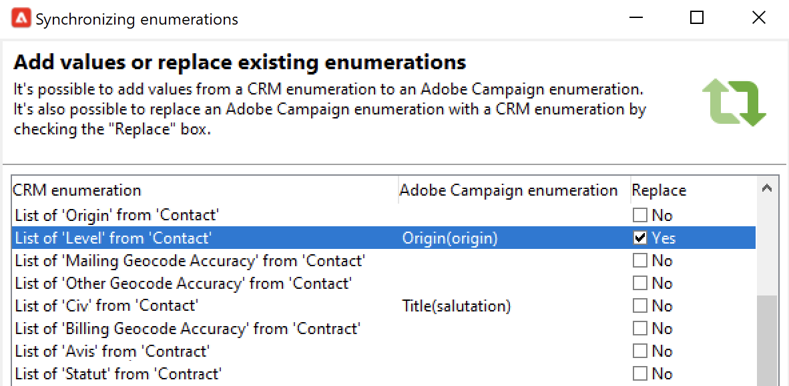

# Arbeta med Campaign och SFDC{#crm-sfdc}

Lär dig hur du konfigurerar Campaign CRM-anslutningen för att ansluta Campaign v8 till **Salesforce.com**.

När konfigurationen är klar utförs datasynkronisering mellan system via en dedikerad arbetsflödesaktivitet. [Läs mer](crm-data-sync.md).

>[!NOTE]
>
>De SFDC-versioner som stöds beskrivs i Campaign [Kompatibilitetsmatrisen](../start/compatibility-matrix.md).

Följ stegen nedan för att konfigurera ett dedikerat externt konto för att importera och exportera Salesforce-data till Adobe Campaign.

## Skapa anslutningen{#new-sfdc-external-account}

Först måste du skapa Salesforce externa konto.

1. Bläddra i noden **[!UICONTROL Administration > Platform > External accounts]** i Campaign Explorer och skapa ett externt konto.
1. Välj **[!UICONTROL Salesforce.com]** externt konto i avsnittet **Typ**.
1. Ange inställningar för att aktivera anslutningen.

   

   Om du vill konfigurera det externa Salesforce CRM-kontot så att det fungerar med Adobe Campaign måste du ange följande information:

   * Ange din Salesforce-inloggning i fältet **[!UICONTROL Account]**.
   * Ange ditt Salesforce-lösenord.
   * Du kan ignorera fältet **[!UICONTROL Client identifier]**.
   * Kopiera/klistra in din Salesforce **[!UICONTROL Security token]**
   * Välj din **[!UICONTROL API version]**. De SFDC API-versioner som stöds listas i Campaign [Kompatibilitetsmatrisen](../start/compatibility-matrix.md).

1. Välj alternativet **Aktivera** om du vill aktivera kontot i Campaign.

>[!NOTE]
>
>Om du vill godkänna konfigurationen måste du logga ut och sedan logga in på Adobe Campaign Client Console igen.

## Markera tabeller som ska synkroniseras{#sfdc-create-tables}

Nu kan du konfigurera tabeller att synkronisera.

1. Klicka på **[!UICONTROL Salesforce CRM configuration wizard...]**.
1. Markera de tabeller som ska synkroniseras och starta processen.
1. Kontrollera schemat som genererats i Adobe Campaign i noden **[!UICONTROL Administration > Configuration > Data schemas]**.

   Exempel på ett **Salesforce**-schema som importerats i Campaign:

   

## Synkronisera uppräkningar{#sfdc-enum-sync}

När schemat har skapats kan du synkronisera uppräkningar automatiskt från Salesforce till Adobe Campaign.

1. Öppna assistenten från länken **[!UICONTROL Synchronizing enumerations...]**.
1. Välj den Adobe Campaign-uppräkning som överensstämmer med uppräkningen i Salesforce.
Du kan ersätta alla värden i en Adobe Campaign-uppräkning med dem i CRM: om du vill göra det väljer du **[!UICONTROL Yes]** i kolumnen **[!UICONTROL Replace]**.

   

1. Klicka på **[!UICONTROL Next]** och sedan på **[!UICONTROL Start]** för att börja importera uppräkningarna.

1. Bläddra i noden **[!UICONTROL Administration > Platform > Enumerations]** för att kontrollera importerade värden. Läs mer om uppräkningar på [den här sidan](../config/ui-settings.md#enumerations).

Adobe Campaign och Salesforce.com är nu anslutna. Du kan konfigurera datasynkronisering mellan de två systemen.

Om du vill synkronisera data mellan Adobe Campaign-data och SFDC skapar du ett arbetsflöde och använder aktiviteten **[!UICONTROL CRM connector]**.

Läs mer om datasynkronisering [på den här sidan](crm-data-sync.md).
