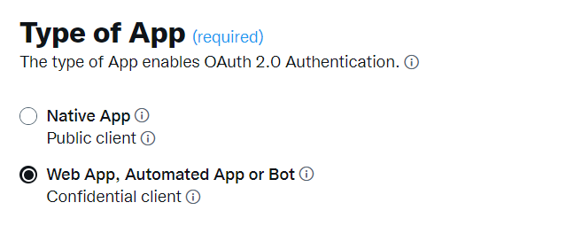

# Arbeta med Campaign och X (Twitter) {#tw-ac-ovv}

The **Hantera sociala nätverk (social marknadsföring)** kan ni interagera med kunderna via X (tidigare Twitter). Använd den här funktionen för att

* Posta meddelanden och skicka DM:er - Använd Adobe Campaign Social Marketing för att publicera meddelanden på X. Du kan också skicka direktmeddelanden till alla dina följare.

* Samla in nya kontakter - Adobe Campaign Social Marketing gör det också enkelt att skaffa nya kontakter: kontakta användare och fråga dem om de vill dela sin profilinformation. Om de godkänner det återhämtar Adobe Campaign automatiskt data, vilket gör att ni kan genomföra riktade kampanjer och, när det är möjligt, implementera flerkanalsstrategier.

>[!NOTE]
>
>Som användare av hanterade Cloud Service [kontakta Adobe](../start/campaign-faq.md#support) för att ansluta Campaign till X.  **Hantera sociala nätverk (social marknadsföring)** Tillägget måste installeras i din miljö via det dedikerade paketet och Twitternas externa konto måste konfigureras.

Om du vill konfigurera Adobe Campaign att bokföra tweets på dina X-konton delegerar du skrivåtkomst till Adobe Campaign för dessa konton. För att göra detta måste du:

1. Skapa ett X-konto och registrera dig för ett utvecklarkonto. [Läs mer](#dev-account)
1. (valfritt) Skapa ett X-testkonto för att skicka korrektur. [Läs mer](#tw-test-account)
1. Skapa ett X-program (en app per X-konto). [Läs mer](#create-an-app-on-twitter)
1. Skapa en ny tjänst för **[!UICONTROL Twitter]** (en tjänst per X-konto). [Läs mer](#create-tw-service)
1. Synkronisera ditt X-konto med Campaign. [Läs mer](#synchro-tw-accounts)

## X-utvecklarkonto {#dev-account}

För att börja med den här integreringen måste du registrera dig för en [X-utvecklarkonto](https://developer.twitter.com){target="_blank"}.

Campaign använder version 1.1 av X API. Om du vill använda den måste du ansöka om utökad åtkomst via Developer Portal. Läs mer om X - utökad åtkomst [på den här sidan](https://developer.twitter.com/en/portal/products/elevated){target="_blank"}.

## Skapa ett program på X {#create-an-app-on-twitter}

När du har godkänts med utökad åtkomst skapar du ett X-program som gör det möjligt för Adobe Campaign att skapa inlägg på ditt X-konto. Gör så här:

1. Logga in på ditt X-konto.
1. Anslut till [X-utvecklarportal](https://developer.twitter.com/en/apps){target="_blank"}.
1. Välj **Skapa en app**.
1. Låt X-assistenten vägleda dig genom processen.
1. Om du vill att Adobe Campaign ska kunna skapa inlägg på ditt konto redigerar du till **Programbehörigheter** i inställningsavsnittet för användarautentisering i din app. Välj **Läsa, skriva och skicka direktmeddelanden**.

   

1. I **Typ av app** avsnitt, markera **Webbapp, automatiserad app eller port**. Du kan lämna **Återanrops-URL** fältet är tomt och du sparar konfigurationen.

   

1. Gå tillbaka till appkontrollpanelen, välj din app och bläddra till **Tangenter och variabler** -fliken. Under **Åtkomsttoken och hemlighet**, om **Läsa, skriva och skicka direktmeddelanden** ingen behörighet nämns, du måste återskapa din apps token och hemlighet. Observera att alla nycklar och token måste sparas när de skapas. Du behöver dem för att konfigurera din Campaign Twitter-tjänst.

   

>[!NOTE]
>
>Du behöver ett program per X-konto. Därför måste du skapa ett annat testprogram för att skicka korrektur till testkontot.
>

## Skapa en Twitter i Campaign {#create-tw-service}

Om du vill länka din Campaign-instans till ditt X-konto skapar du en **Twitter** och delegera skrivåtkomst till Campaign.

>[!CAUTION]
>
>Skapa en **Twitter** per X-konto. Därför måste du skapa en annan testtjänst för att skicka korrektur till [testkonto](#tw-test-account).
>
>Varje **Twitter** måste också skapas av Adobe på MID-instansen. Kontakta din Adobe-representant för att konfigurera din miljö.
>

Om du vill ange inställningar måste du ha tillgång till både din Adobe Campaign klientkonsol och dina X-appbehörigheter.

1. I **Adobe Campaign**, bläddra till **[!UICONTROL Profiles and targets]** och väljer **[!UICONTROL Services and Subscriptions]** link
1. Skapa en ny tjänst.
1. Välj **[!UICONTROL Twitter]** typ.
1. Ange etiketten och det interna namnet på tjänsten.

   >[!CAUTION]
   >
   >The **[!UICONTROL Internal name]** för tjänsten måste vara exakt samma namn som ditt X-konto.
   >

1. Som standard sparas följare i **[!UICONTROL Visitors]** mapp. Du kan välja en annan plats på **[!UICONTROL Visitor folder]** fält. [Läs mer](../send/twitter.md#direct-tw-messages)

   

   >[!NOTE]
   >
   >The **[!UICONTROL Synchronize subscriptions]** är aktiverat som standard: det här alternativet återställer automatiskt listan med dina X-följare så att du kan [skicka direktmeddelanden till dem](../send/twitter.md#direct-tw-messages). Synkronisering utförs av en [dedikerat tekniskt arbetsflöde](#synchro-tw-accounts).

1. Kopiera innehållet i ditt X-program **API-nyckel** och **[API-nyckelhemlighet]** fält och klistra in dem i **[!UICONTROL Consumer key]** och **[!UICONTROL Consumer secret]** fält i din kampanj **Twitter** service.

1. Kopiera innehållet i ditt X-program **Åtkomsttoken** och **Åtkomsttokenhemlighet** fält och klistra in dem i **[!UICONTROL Access token]** och **[!UICONTROL Access token secret]** fält i din kampanj **Twitter** service.

1. Klicka på i Campaign-klientkonsolen **[!UICONTROL Save]**. Du har nu delegerat skrivbehörighet till Adobe Campaign.

Om du vill kontrollera inställningarna kan du:

* Redigera **Twitter** som du just har skapat.
* Sök i **[!UICONTROL Twitter page]** -flik: ditt Twitter-konto ska visas.
  

## Synkronisera ditt X-konto {#synchro-tw-accounts}

Synkroniseringen mellan Campaign och X hanteras via dedikerade tekniska arbetsflöden. Dessa arbetsflöden lagras i **[!UICONTROL Administration > Production > Technical workflows > Managing social networks]** mapp.

De stoppas som standard: du måste starta dem manuellt när du börjar använda **Social marknadsföring** -modul.

The **[!UICONTROL Synchronization of Twitter accounts]** tekniskt arbetsflöde synkroniserar X-konton i Adobe Campaign. Det här arbetsflödet återställer listan med X-följare så att du kan skicka direktmeddelanden till dem. [Läs mer](../send/twitter.md#direct-tw-messages)

Som standard aktiveras arbetsflödet varje torsdag kl. 7.30. Du kan använda **[!UICONTROL Execute pending task(s) now]** möjlighet att starta arbetsflödet när som helst när du implementerar den här integreringen.  Du kan också redigera schemaläggaren för att ändra arbetsflödets utlösande frekvens. Läs mer på [den här sidan](../../automation/workflow/scheduler.md).

>[!CAUTION]
>
>Om du vill återställa listan över X-prenumeranter **[!UICONTROL Twitter account synchronization]** alternativet måste kontrolleras för den tjänst som är länkad till kontot. [Läs mer](#create-tw-service)

Följande lagras i en specifik tabell: besökstabellen. Om du vill visa listan med X-följare går du till **[!UICONTROL Profiles and Targets > Visitors]**.

För varje följare lagrar Adobe Campaign följande information:

* **[!UICONTROL Origin]**: TWITTER
* **[!UICONTROL External ID]**: användaridentifierare
* **[!UICONTROL Username]**: användarens kontonamn
* **[!UICONTROL Full name]**: användarens namn
* **[!UICONTROL Number of friends]**: antal följare
* **[!UICONTROL Checked]**: det här fältet anger om användaren har ett verifierat Twitter-konto

När konfigurationen är klar kan du skapa inlägg på dina X-konton och skicka direktmeddelanden till dina följare. [Läs mer](../send/twitter.md)

## Skapa ett testkonto på X {#tw-test-account}

Utöver X-kontot skapar du ett privat X-konto som kan användas för att skicka [tweet-korrektur](../send/twitter.md#send-tw-proofs). Gör så här:

1. Skapa ett nytt X-konto.
1. Åtkomst till kontot  **Inställningar**.
1. Bläddra till **Integritet och säkerhet** och **Målgrupp och taggning** och kontrollera **Protect dina inlägg** alternativ. Dina inlägg och annan kontoinformation visas endast för personer som följer efter dig.

Konfigurera X-appen och Campaign-tjänsten så att den fungerar med det här testkontot enligt beskrivningen ovan.
