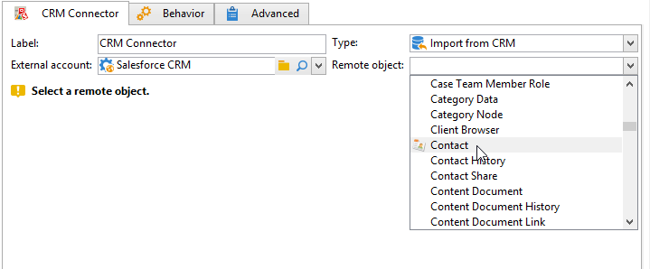
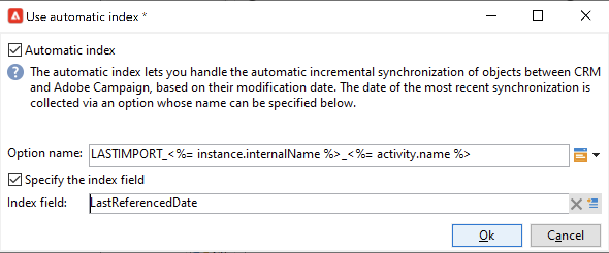

# Synkronisera data mellan Campaign och CRM {#data-synchronization}

Datasynkronisering mellan Adobe Campaign och CRM hanteras av arbetsflödesaktiviteten för **CRM Connector**.

Om du till exempel vill importera Microsoft Dynamics-data till Adobe Campaign skapar du följande arbetsflöde:

Det här arbetsflödet importerar kontakterna via Microsoft Dynamics, synkroniserar dem med befintliga Adobe Campaign-data, tar bort dubblettkontakter och uppdaterar Adobe Campaign-databasen.

Aktiviteten **[!UICONTROL CRM Connector]** måste konfigureras för att synkronisera data.

Med den här aktiviteten kan du

* Importera från CRM - [Läs mer](#importing-from-the-crm)
* Exportera till CRM - [Läs mer](#exporting-to-the-crm)
* Importera objekt som tagits bort i CRM - [Läs mer](#importing-objects-deleted-in-the-crm)
* Ta bort objekt i CRM - [Läs mer](#deleting-objects-in-the-crm)

Välj det externa konto som matchar det CRM-konto som du vill konfigurera synkronisering med och välj sedan det objekt som ska synkroniseras: konton, affärsmöjligheter, leads, kontakter osv.

Aktivitetens konfiguration beror på vilken process som ska utföras. Olika konfigurationer beskrivs nedan.

## Importera från CRM {#importing-from-the-crm}

Om du vill importera data via CRM i Adobe Campaign måste du skapa följande arbetsflöde:

1. Välj en **[!UICONTROL Import from the CRM]**-åtgärd.
1. I listrutan **[!UICONTROL Remote object]** markerar du det objekt som ska importeras. Det här objektet matchar en av tabellerna som skapades i Adobe Campaign under anslutningskonfigurationen.
1. I avsnittet **[!UICONTROL Remote fields]** anger du de fält som ska importeras.

   Om du vill lägga till ett fält klickar du på knappen **[!UICONTROL Add]** i verktygsfältet och sedan på ikonen **[!UICONTROL Edit expression]** .

   Om det behövs ändrar du dataformatet med hjälp av listrutan för kolumnerna **[!UICONTROL Conversion]**. Möjliga konverteringstyper beskrivs i [det här avsnittet](#data-format).

   >[!CAUTION]
   >
   >Identifieraren för posten i CRM är obligatorisk för att länka objekt i CRM och Adobe Campaign. Den läggs till automatiskt när lådan är godkänd.
   >
   >Det sista ändringsdatumet på CRM-sidan är också obligatoriskt för inkrementell dataimport.

1. Du kan filtrera de data som ska importeras efter dina behov. Klicka på länken **[!UICONTROL Edit the filter...]** om du vill göra det.

   I följande exempel kommer Adobe Campaign endast att importera kontakter för vilka viss aktivitet har registrerats sedan 1 november 2021.

   

   >[!CAUTION]
   >
   >Begränsningarna för datafiltreringslägena beskrivs i [det här avsnittet](#filtering-data).

1. Välj alternativet **[!UICONTROL Use automatic index...]** om du automatiskt vill hantera inkrementell objektsynkronisering mellan CRM och Adobe Campaign, beroende på datum och senaste ändring.

   Mer information om detta finns i [det här avsnittet](#variable-management).

### Hantera variabler {#variable-management}

Aktivera alternativet **[!UICONTROL Automatic index]** om du bara vill samla in objekt som har ändrats sedan den senaste importen.

Datumet för den senaste synkroniseringen lagras som standard i ett alternativ som anges i konfigurationsfönstret: **LASTIMPORT_&lt;%=instance.internalName%>_&lt;%=activityName%>**.

>[!NOTE]
>
>Den här anteckningen gäller bara för den generiska **[!UICONTROL CRM Connector]**-aktiviteten. För andra CRM-aktiviteter är processen automatisk.
>
>Det här alternativet måste skapas och fyllas i manuellt under **[!UICONTROL Administration]** > **[!UICONTROL Platform]** > **[!UICONTROL Options]**. Det måste vara ett textalternativ och dess värde måste matcha följande format: **`yyyy/MM/dd hh:mm:ss`**.
> 
>Du måste uppdatera det här alternativet manuellt för ytterligare import.

Du kan ange vilket fjärr-CRM-fält som ska beaktas för att identifiera de senaste ändringarna.

Som standard används följande fält (i den angivna ordningen):

* För Microsoft Dynamics: **modifiedon**,
* För Salesforce.com: **LastModifiedDate**, **SystemModstamp**.

När du aktiverar alternativet **[!UICONTROL Automatic index]** genereras tre variabler som kan användas i synkroniseringsarbetsflödet via en **[!UICONTROL JavaScript code]**-typaktivitet. Dessa verksamheter är följande:

* **vars.crmOptionName**: namnet på alternativet som innehåller det senaste importdatumet.
* **vars.crmStartImport**: startdatum (inkluderat) för den senaste dataimporten.
* **vars.crmEndDate**: slutdatum (exkluderat) för den senaste dataimporten.

  >[!NOTE]
  >
  >Dessa datum visas i följande format: **`yyyy/MM/dd hh:mm:ss`**.

### Filtrera data {#filtering-data}

För att de olika CRM-systemen ska fungera effektivt måste du skapa filter enligt följande regler:

* För varje filtreringsnivå får endast en typ av operator användas.
* Operatorn AND NOT stöds inte.
* Jämförelser kan bara gälla null-värden (&#39;är tom&#39;/&#39;är inte tom&#39;) eller tal. Detta innebär att värdet (högerkolumnen) bedöms och att resultatet av denna bedömning måste vara ett tal. JOBIN-typjämförelser stöds därför inte.
* Värdet i högerkolumnen utvärderas i JavaScript.
* JOIN-jämförelser stöds inte.
* Uttrycket i den vänstra kolumnen måste vara ett fält. Det kan inte vara en kombination av flera uttryck, ett tal osv.

### Beställ av {#order-by}

I Microsoft Dynamics och Salesforce.com kan du sortera de fjärrfält som ska importeras i stigande eller fallande ordning.

Det gör du genom att klicka på länken **[!UICONTROL Order by]** och lägga till kolumnerna i listan.

Sorteringsordningen för kolumnerna i listan är:

### Registrerings-ID {#record-identification}

I stället för att importera element som ingår (och eventuellt filtreras) i CRM kan du använda en population som beräknas i förväg i arbetsflödet.

Det gör du genom att markera alternativet **[!UICONTROL Use the population calculated upstream]** och ange fältet som innehåller fjärr-ID:t.

Markera sedan fälten för den inkommande ifyllning som du vill importera, så som visas nedan:

## Exportera till CRM {#exporting-to-the-crm}

Exportera Adobe Campaign-data till CRM för att kopiera hela innehållet till CRM-databasen.

Om du vill exportera data till CRM skapar du följande typ av arbetsflöde:

1. Välj en **[!UICONTROL Export to CRM]**-åtgärd.
1. Gå till listrutan **[!UICONTROL Remote object]** och markera objektet som ska exporteras. Det här objektet matchar en av tabellerna som skapades i Adobe Campaign under anslutningskonfigurationen.

   >[!CAUTION]
   >
   >Exportfunktionen för aktiviteten **[!UICONTROL CRM Connector]** kan infoga eller uppdatera fält i CRM. Om du vill aktivera fältuppdateringar i CRM anger du primärnyckeln för fjärrtabellen. Om nyckeln saknas infogas data i stället för att uppdateras.

1. Om du behöver utföra snabbare exporter ska du markera alternativet **[!UICONTROL Export in Batches]**.

   

1. I avsnittet **[!UICONTROL Mapping]** klickar du på **[!UICONTROL New]** för att ange fälten som ska exporteras och deras mappning i CRM.

   Om du vill lägga till ett fält klickar du på knappen **[!UICONTROL Add]** i verktygsfältet och sedan på ikonen **[!UICONTROL Edit expression]** .

   >[!NOTE]
   >
   >Om ingen matchning har definierats för ett fält kan värdena inte uppdateras: de infogas direkt i CRM.

   Om det behövs ändrar du dataformatet med hjälp av listrutan för kolumnerna **[!UICONTROL Conversion]**. Möjliga konverteringstyper beskrivs i [det här avsnittet](#data-format).

   >[!NOTE]
   >
   >Listan med poster som ska exporteras och resultatet av exporten sparas i en temporär fil som är tillgänglig tills arbetsflödet har slutförts eller startats om. Detta gör att du kan starta processen på ett säkert sätt om fel uppstår.

## Ytterligare konfigurationer {#additional-configurations}

### Dataformat {#data-format}

Du kan konvertera dataformat direkt när du importerar dem till eller från CRM.

Det gör du genom att välja den konvertering som ska användas i den matchande kolumnen.

Läget **[!UICONTROL Default]** tillämpar automatisk datakonvertering, som i de flesta fall är lika med en kopia/inklistring av data. Tidszonshantering används dock.

Andra konverteringar är:

* **[!UICONTROL Date only]**: tar bort fält av typen Datum + Tid.
* **[!UICONTROL Without time offset]**: avbryter den tidszonshantering som används i standardläget.
* **[!UICONTROL Copy/Paste]**: använder rådata som strängar (ingen konvertering).

### Felbearbetning {#error-processing}

Inom ramen för import och export av data kan du tillämpa en specifik process på fel och avslag. Det gör du genom att välja alternativen **[!UICONTROL Keep the rejections in a file]** och **[!UICONTROL Process errors]** på fliken **[!UICONTROL Behavior]**.

Dessa alternativ lägger till relaterade utdataövergångar.

Infoga sedan de relevanta aktiviteterna för att bearbeta data. Lägg till exempel till en **Vänta**-aktivitet och schemalägg nya försök för fel.

Utdataövergången **[!UICONTROL Reject]** ger dig åtkomst till utdataschemat som innehåller de specifika kolumner som är relevanta för felmeddelanden och koder. I Salesforce.com är den här kolumnen **errorSymbol** (felsymbol, skiljer sig från felkoden), **errorMessage** (beskrivning av felkontexten).

## Importera objekt som tagits bort i CRM {#importing-objects-deleted-in-the-crm}

Du kan importera objekt som har tagits bort i CRM till Adobe Campaign.

1. Välj en **[!UICONTROL Import objects deleted in the CRM]**-åtgärd.
1. Gå till listrutan **[!UICONTROL Remote object]** och markera objektet som berörs av processen. Det här objektet matchar en av tabellerna som skapades i Adobe Campaign under anslutningskonfigurationen.
1. Ange den borttagningsperiod som ska beaktas i fälten **[!UICONTROL Start date]** och **[!UICONTROL End date]** (datum ingår).

   >[!CAUTION]
   >
   >Borttagningsperioden måste sammanfalla med dina CRM-specifika begränsningar. För Salesforce.com går det inte att återställa element som tagits bort för över 30 dagar sedan.

## Ta bort objekt i CRM {#deleting-objects-in-the-crm}

Om du vill ta bort objekt i CRM anger du primärnyckeln för de fjärrelement som ska tas bort.

På fliken **[!UICONTROL Behavior]** kan du aktivera bearbetning av avslag. Det här alternativet genererar en andra utdataövergång för aktiviteten **[!UICONTROL CRM connector]**. Mer information finns i [Felbearbetning](#error-processing).
