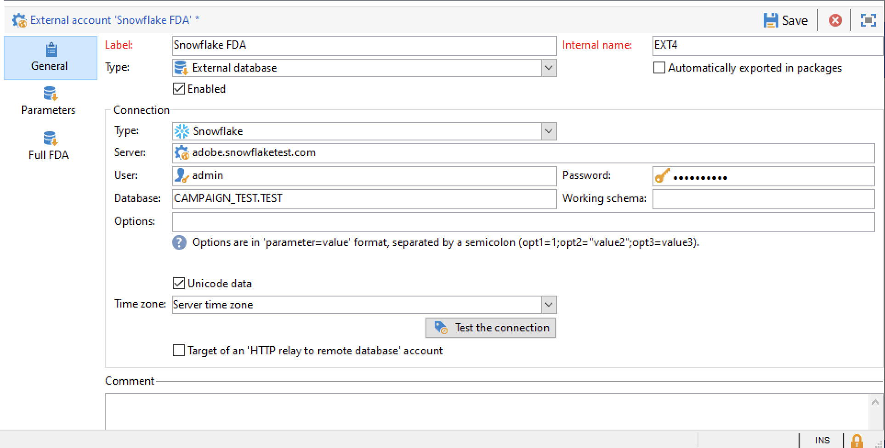

# Federerad dataåtkomst (FDA){#gs-fda}

Använd FDA Connector (Federated Data Access) för att ansluta Campaign till en eller flera **externa databaser** och bearbeta information som lagras i dem utan att påverka data i Campaign Cloud-databasen. Sedan kan du komma åt externa data utan att ändra strukturen på Adobe Campaign-data.

>[!NOTE]
>
>* Kompatibla databaser för FDA listas i [Kompatibilitetsmatris](../start/compatibility-matrix.md).
>
>* När det gäller [Företagsdistribution (FFDA)](../architecture/enterprise-deployment.md), finns det ett specifikt externt konto för att hantera kommunikationen mellan den lokala databasen i Campaign och molndatabasen i Snowflake. Det här externa kontot har konfigurerats för dig av Adobe och får inte ändras.
>

Med Campaign FDA-alternativet kan ni utöka er datamodell i en tredjepartsdatabas. Det identifierar automatiskt strukturen för måltabellerna och använder data från SQL-källorna.

Specifik **behörigheter** krävs på [!DNL Adobe Campaign] och den externa databasen för att interagera med varandra. Läs mer i [det här avsnittet](#fda-permissions).

## God praxis och begränsningar

* **Optimera e-postpersonalisering med externa data**

   Du kan förbearbeta meddelandepersonalisering i ett dedikerat arbetsflöde. Om du vill göra det använder du **[!UICONTROL Prepare the personalization data with a workflow]** alternativ, finns i **[!UICONTROL Analysis]** -fliken för leveransegenskaperna.

   Under leveransanalysen skapar och kör det här alternativet automatiskt ett arbetsflöde som lagrar alla data som är länkade till målet i en tillfällig tabell, inklusive data från tabeller som är länkade i en extern databas.

   Det här alternativet förbättrar prestanda avsevärt när personaliseringssteget körs.

* **FDA-begränsningar**

   FDA-alternativet används för att ändra data i externa databaser i batchläge i arbetsflöden. För att undvika prestandaproblem rekommenderar vi inte att du använder FDA-modulen i samband med enhetsåtgärder som: personalisering, interaktion, meddelanden i realtid osv.

   Undvik de åtgärder som behöver använda både Adobe Campaign och den externa databasen så mycket som möjligt. Om du vill göra det kan du:

   * Exportera Adobe Campaign-databasen till den externa databasen och kör åtgärderna endast från den externa databasen innan du importerar resultaten till Adobe Campaign igen.

   * Samla in data från den externa Adobe Campaign-databasen och kör åtgärderna lokalt.

   Om du vill utföra personalisering i leveranser med data från den externa databasen, samlar du in data som ska användas i ett arbetsflöde för att göra dem tillgängliga i en tillfällig tabell. Använd sedan data från den tillfälliga tabellen för att anpassa leveransen.

   FDA-alternativet har begränsningar för det externa databassystem som du använder.

## Konfigurationssteg{#fda-configuration-steps}

Så här ställer du in åtkomst till en extern databas med FDA:

1. Som användare av Adobes hanterade tjänster kan du kontakta Adobe för att installera drivrutinerna i Campaign-instansen.
1. När drivrutinerna har installerats konfigurerar du det externa konto som motsvarar din databas på Adobe Campaign-servern och testar det externa kontot. [Läs mer](#fda-external-account)
1. Skapa schemat för den externa databasen i Adobe Campaign. På så sätt kan du identifiera den externa databasens datastruktur. [Läs mer](#create-data-schema)

<!--
1. If needed, create a new target mapping from the previously created schema. This is required if the recipients of your deliveries come from the external database. This implementation comes with limitations related to message personalization. [Learn more](#define-data-mapping)
-->

Observera det med Campaign [Företagsdistribution (FFDA)](../architecture/enterprise-deployment.md)kan du inte skapa en målmappning från ett schema som lagras i en extern databas som FDA har åtkomst till. Därför kan mottagarna av dina leveranser inte komma från den externa databasen.

## Externt konto för extern databas{#fda-external-account}

Du måste skapa ett specifikt externt konto för att ansluta Campaign-instansen till din externa databas.

Följ stegen nedan för att uppnå detta:

1. Från kampanj **[!UICONTROL Explorer]**, bläddra till **[!UICONTROL Administration]** `>` **[!UICONTROL Platform]** `>` **[!UICONTROL External accounts]**.

1. Klicka på **[!UICONTROL New]**.

   >[!NOTE]
   >
   > För att vara aktiv **[!UICONTROL Enabled]** måste vara markerat. Om det behövs avmarkerar du det här alternativet för att inaktivera åtkomst till den här databasen utan att ta bort dess konfiguration.

1. Välj **[!UICONTROL External database]** som ditt externa konto **[!UICONTROL Type]**.

1. Välj en extern databas i listrutan och konfigurera det externa kontot. Du måste ange:

   * **[!UICONTROL Server]**: URL för servern

   * **[!UICONTROL Account]**: Användarens namn

   * **[!UICONTROL Password]**: Lösenord för användarkonto

   * **[!UICONTROL Database]**: Namn på databasen

      

1. Klicka på **[!UICONTROL Parameters]** tabben **[!UICONTROL Deploy functions]** för att skapa funktioner.

1. När parametrarna har angetts klickar du på **[!UICONTROL Test the connection]** för att godkänna dem.

1. Om du vill att Adobe Campaign ska kunna komma åt den här databasen måste du distribuera SQL-funktionerna. Klicka på **[!UICONTROL Parameters]** tabben **[!UICONTROL Deploy functions]** -knappen.

Du kan definiera särskilda arbetskatalogutrymmen för tabellerna och för indexvärdena i **[!UICONTROL Parameters]** -fliken.

För [!DNL Snowflake]stöder anslutningen följande alternativ:

| Option | Beskrivning |
|---|---|
| arbetsschema | Databasschema som ska användas för arbetsregister |
| lagerställe | Namnet på standardlagerstället som ska användas. Det åsidosätter användarens standardvärde. |
| TimeZoneName | Som standard är den tom, vilket innebär att systemtidszonen för programservern i Campaign Classic används. Alternativet kan användas för att framtvinga TIMEZONE-sessionsparametern.  Mer information finns på [den här sidan](https://docs.snowflake.net/manuals/sql-reference/parameters.html#timezone). |
| WeekStart | WEEK_START-sessionsparameter. Standardinställningen är 0.  Mer information finns på [den här sidan](https://docs.snowflake.com/en/sql-reference/parameters.html#week-start). |
| AnvändCachedResult | USE_CACHED_RESULTS sessionsparameter. Standardinställningen är TRUE. Det här alternativet kan användas för att inaktivera cachelagrade resultat i Snowflake.  Mer information finns på [den här sidan](https://docs.snowflake.net/manuals/user-guide/querying-persisted-results.html). |

## Skapa dataschemat{#create-data-schema}

Följ stegen nedan för att skapa schemat för den externa databasen i Adobe Campaign:

1. Klicka på **[!UICONTROL New]** knappen ovanför listan med datamodeller och välj **[!UICONTROL Access external data]**.

   

1. Ange ett namn och en beskrivning för schemat och välj det externa konto som ska aktivera anslutningen till databasen. Detta ger åtkomst till listan med tabeller som är tillgängliga i den externa basen. Välj den tabell som innehåller de data som ska samlas in.

   

1. Klicka på **[!UICONTROL OK]** för att bekräfta. Adobe Campaign identifierar automatiskt strukturen i den markerade tabellen och genererar det logiska schemat. Observera att Adobe Campaign inte genererar några länkar.

1. Klicka **[!UICONTROL Save]** för att bekräfta skapandet.

<!-- 
## Define the target mapping{#define-data-mapping}

You can define a mapping on the data in an external table.

To do this, once the schema of the external table has been created, you need to create a new delivery mapping to use the data in this table as a delivery target.

To do this, follow these steps:

1. Browse to **[!UICONTROL Administration]** `>` **[!UICONTROL Campaign Management]** `>` **[!UICONTROL Target mappings]** from Adobe Campaign explorer.

1. Create a new target mapping and select the schema you just created as the targeting dimension.

   

1. Indicate the fields where the delivery information is stored (last name, first name, email, address, etc.).

   

1. Specify the parameters for information storage, including the suffix of the extension schemas for them to be easily identifiable.

   

   You can choose whether to store exclusions (**excludelog**), with messages (**broadlog**) or in a separate table.

   You can also choose whether to manage tracking for this delivery mapping (**trackinglog**).

1. Then select the extensions to be taken into account. The extension type depends on your platform's parameters and options (view your license contract).

   

   Click the **[!UICONTROL Save]** button to launch delivery mapping creation: all linked tables are created automatically based on the selected parameters.
-->

## Behörigheter{#fda-permissions}

Specifik **behörigheter** krävs på [!DNL Adobe Campaign] och den externa databasen för att interagera med varandra.

För att användaren ska kunna utföra åtgärder på en extern databas via FDA måste operatorn ha en specifik namngiven behörighet i [!DNL Adobe Campaign].

1. Välj **[!UICONTROL Administration > Access Management > Named Rights]** i Adobe Campaign Explorer.
1. Skapa en ny rättighet genom att ange den valda etiketten.
1. Ange namnet på den namngivna rättigheten i följande format **användare:base@server**, där

   * **användare** är namnet på användaren i den externa databasen
   * **bas** är namnet på den externa databasen
   * **server** är namnet på den externa databasservern

1. Spara den namngivna rättigheten och länka den till den valda operatorn från **[!UICONTROL Administration > Access Management > Operators]** noden i Adobe Campaign Explorer.

Om du sedan vill bearbeta data i en extern databas måste Adobe Campaign-operatorn ha minst skrivbehörighet för databasen för att kunna skapa arbetstabeller. Tabellerna tas bort automatiskt av Adobe Campaign.

Följande behörigheter är nödvändiga:

* **CONNECT**: anslutning till fjärrdatabasen
* **LÄS data**: skrivskyddad åtkomst till tabeller som innehåller kunddata
* **LÄS &#39;MetaData&#39;**: åtkomst till serverns datakataloger för att hämta tabellstrukturen
* **LADDA**: massinläsning i arbetstabeller (krävs vid arbete med samlingar och kopplingar),
* **SKAPA/SLÄPP** for **TABELL/INDEX/FÖRFARANDE/FUNKTION** (endast för arbetsfiler som genererats av Adobe Campaign)
* **FÖRKLARA** (rekommenderas): för övervakning av prestanda vid problem
* **SKRIV data** (beroende på integrationsscenariot)

Databasadministratören måste se till att dessa rättigheter matchar de rättigheter som är specifika för varje databasmotor, vilket beskrivs nedan.

|   | Snowflake | Amazon Redshift |
|:-:|:-:|:-:|
| **Ansluter till fjärrdatabas** | ANVÄNDNING I LAGERHUS, ANVÄNDNING I DATABAS OCH ANVÄNDNING I SCHEMABEHÖRIGHETER | Skapa en användare som är länkad till AWS-kontot |
| **Skapa tabeller** | Behörighet SKAPA TABELL PÅ SCHEMA | SKAPA privilegium |
| **Skapa index** | N/A | SKAPA privilegium |
| **Skapa funktioner** | SKAPA FUNKTION PÅ SCHEMABEHÖRIGHET | ANVÄNDNING PÅ SPRÅKPLAN-plypthonu-privilegium för att kunna anropa externa python-skript |
| **Skapa procedurer** | Ej tillämpligt | ANVÄNDNING PÅ SPRÅKPYthon-privilegium för att kunna anropa externa python-skript |
| **Ta bort objekt (tabeller, index, funktioner, procedurer)** | Äga objektet | Äga objektet eller vara superanvändare |
| **Övervaka körningar** | MONITOR-behörighet för det begärda objektet | Ingen behörighet krävs för kommandot EXPLAIN |
| **Skriver data** | INSERT- och/eller UPDATE-behörigheter (beroende på skrivåtgärd) | INSERT- och UPDATE-behörigheter |
| **Läsa in data i tabeller** | SKAPA SCENEN I SCHEMA, MARKERA OCH INFOGA i målregisterprivilegier | VÄLJ OCH INFOGA BEHÖRIGHETER |
| **Åtkomst till klientdata** | VÄLJ BEHÖRIGHET FÖR (FRAMTIDA) TABELL(ER) ELLER VY(ER) | VÄLJ privilegium |
| **Åtkomst till metadata** | VÄLJ BEHÖRIGHET FÖR INFORMATION_SCHEMA SCHEMA | VÄLJ privilegium |

## Använd externa data i ett arbetsflöde

När dataschemat har skapats kan data bearbetas i Adobe Campaign arbetsflöden.

Med flera aktiviteter kan du interagera med data från en extern databas:

* **Filtrera på externa data** - **[!UICONTROL Query]** Med -aktivitet kan du lägga till externa data och använda dem i definierade filterkonfigurationer.

* **Skapa underuppsättningar** - **[!UICONTROL Split]** kan du skapa delmängder. Du kan använda externa data för att definiera de filtervillkor som ska användas.

* **Läs in extern databas** - Du kan använda externa data i **[!UICONTROL Data loading (RDBMS)]** aktivitet.

* **Lägga till information och länkar** - **[!UICONTROL Enrichment]** Med -aktivitet kan du lägga till ytterligare data i arbetsflödet och länka till en extern tabell. I det här sammanhanget kan den använda data från en extern databas.

Du kan också definiera en anslutning till en extern databas direkt från dessa arbetsflödesaktiviteter, för att tillfälligt kunna använda den. I det här fallet kommer den att finnas i en lokal extern databas som är reserverad för att användas i ett aktuellt arbetsflöde: den sparas inte på externa konton.

>[!CAUTION]
>
>Den här typen av konfiguration får endast användas temporärt för att samla in data. Konfiguration av det externa kontot bör föredras för all annan användning.

I **[!UICONTROL Query]** -aktiviteten kan du definiera en tillfällig anslutning till en extern databas enligt följande:

1. Öppna aktiviteten och klicka på **[!UICONTROL Add data...]**
1. Välj **[!UICONTROL External data]** alternativ
1. Välj **[!UICONTROL Locally defining the data source]** option
1. Välj måldatabasmotorn i listrutan. Ange namnet på servern och ange autentiseringsparametrarna. Ange också namnet på den externa databasen.
1. Markera tabellen där data lagras. Du kan ange namnet på tabellen direkt i motsvarande fält eller klicka på redigeringsikonen för att öppna listan med databastabeller.
1. Klicka på **[!UICONTROL Add]** för att definiera ett eller flera avstämningsfält mellan externa databasdata och data i Adobe Campaign-databasen. The **[!UICONTROL Edit expression]** ikoner för **[!UICONTROL Remote field]** och **[!UICONTROL Local field]** ger dig tillgång till listan med fält i varje tabell.
1. Om det behövs anger du ett filtreringsvillkor och datasorteringsläget.
1. Välj de ytterligare data som ska samlas in i den externa databasen. Det gör du genom att dubbelklicka på de fält som du vill lägga till för att visa dem i **[!UICONTROL Output columns]**.
1. Klicka **[!UICONTROL Finish]** för att bekräfta konfigurationen.
