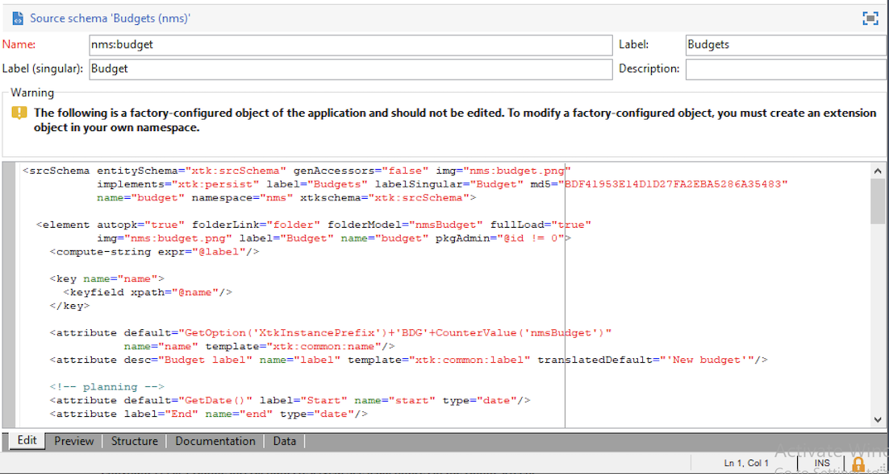
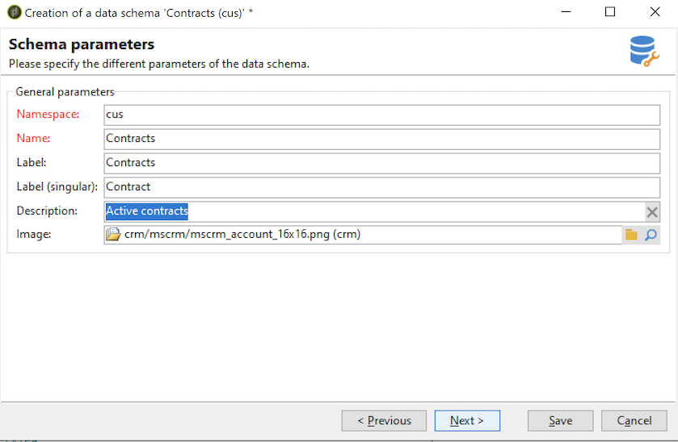

# Skapa ett nytt schema{#create-new-schema}

Om du vill redigera, skapa och konfigurera scheman klickar du på knappen **[!UICONTROL Administration > Configuration > Data schemas]** noden i Adobe Campaign klientkonsol.

>[!NOTE]
>
>Inbyggda datascheman kan bara tas bort av en administratör för din Adobe Campaign-konsol.


The **[!UICONTROL Edit]** -fliken visar XML-innehållet i ett schema:



>[!NOTE]
>
>Med redigeringskontrollen &quot;Namn&quot; kan du ange schemanyckeln som består av namnet och namnutrymmet. Attributen name och namespace för schemats rotelement uppdateras automatiskt i schemats XML-redigeringszon. Observera att vissa namnutrymmen bara är interna. [Läs mer](schemas.md#reserved-namespaces)

The **[!UICONTROL Preview]** genererar automatiskt det utökade schemat:


>[!NOTE]
>
>När källschemat sparas startas genereringen av det utökade schemat automatiskt.

Om du behöver kontrollera hela strukturen för ett schema kan du använda **[!UICONTROL Preview]** -fliken. Om schemat har utökats kan du visa alla dess tillägg. Som komplement **[!UICONTROL Documentation]** På -fliken visas alla schemaattribut och -element och deras egenskaper (SQL-fält, typ/längd, etikett, beskrivning). The **[!UICONTROL Documentation]** gäller endast för genererade scheman.

## Användningsfall: skapa en kontraktstabell {#example--creating-a-contract-table}

I följande exempel skapar du en ny tabell för **kontrakt** i databasen. I den här tabellen kan du lagra förnamn och efternamn samt e-postadresser för innehavare och medarbetare för varje kontrakt.

För att göra detta måste du skapa tabellschemat och uppdatera databasstrukturen för att generera motsvarande tabell. Detaljerade steg visas nedan.

1. Redigera **[!UICONTROL Administration > Configuration > Data schemas]** noden i Adobe Campaign-trädet och klicka **[!UICONTROL New]**.
1. Välj **[!UICONTROL Create a new table in the data template]** och klicka **[!UICONTROL Next]** .

   

1. Ange ett namn för tabellen och ett namnutrymme.

   

   >[!NOTE]
   >
   >Som standard lagras scheman som skapas av användare i &#39;cus&#39;-namnutrymmet. Mer information finns i [Identifiering av ett schema](extend-schema.md#identification-of-a-schema).

1. Skapa tabellens innehåll. Vi rekommenderar att du använder den dedikerade assistenten för att kontrollera att inga inställningar saknas. Om du vill göra det klickar du på **[!UICONTROL Insert]** och väljer vilken typ av inställning som ska läggas till.

   

1. Definiera inställningarna för kontraktstabellen.

   Ett tips är att skapa tabellen i molndatabasen genom att lägga till `dataSource="nms:extAccount:ffda"` -attribut. Det här attributet läggs till som standard när en ny tabell skapas.

   ```
   <srcSchema created="YYYY-MM-DD HH:MM:SS.TZ" desc="Active contracts" img="crm:crm/mscrm/mscrm_account_16x16.png"
           label="Contracts" labelSingular="Contract" lastModified="YYYY-MM-DD HH:MM:SS.TZ"
           mappingType="sql" name="Contracts" namespace="cus" xtkschema="xtk:srcSchema">
      <element dataSource="nms:extAccount:ffda" desc="Active contracts" img="crm:crm/mscrm/mscrm_account_16x16.png"
           label="Contracts" labelSingular="Contract" name="Contracts">
           <attribute name="holderName" label="Holder last name" type="string"/>
           <attribute name="holderFirstName" label="Holder first name" type="string"/>
           <attribute name="holderEmail" label="Holder email" type="string"/>
           <attribute name="co-holderName" label="Co-holder last name" type="string"/>           
           <attribute name="co-holderFirstName" label="Co-holder first name" type="string"/>           
           <attribute name="co-holderEmail" label="Co-holder email" type="string"/>    
           <attribute name="date" label="Subscription date" type="date"/>     
           <attribute name="noContract" label="Contract number" type="long"/> 
      </element>
   </srcSchema>
   ```

   Lägg till typen av kontraktsuppräkning.

   ```
   <srcSchema created="AA-MM-DD HH:MM:SS.TZ" desc="Active contracts" img="crm:crm/mscrm/mscrm_account_16x16.png" label="Contracts" labelSingular="Contract" AA-MM-DD HH:MM:SS.TZ"mappingType="sql" name="Contracts" namespace="cus" xtkschema="xtk:srcSchema">
      <enumeration basetype="byte" name="typeContract">
         <value label="Home" name="home" value="0"/>
         <value label="Car" name="car" value="1"/>
         <value label="Health" name="health" value="2"/>
         <value label="Pension fund" name="pension fund" value="2"/>
      </enumeration>
      <element dataSource="nms:extAccount:ffda" desc="Active contracts" img="crm:crm/mscrm/mscrm_account_16x16.png"
           label="Contracts" labelSingular="Contract" name="Contracts">
           <attribute name="holderName" label="Holder last name" type="string"/>
           <attribute name="holderFirstName" label="Holder first name" type="string"/>
           <attribute name="holderEmail" label="Holder email" type="string"/>
           <attribute name="co-holderName" label="Co-holder last name" type="string"/>           
           <attribute name="co-holderFirstName" label="Co-holder first name" type="string"/>           
           <attribute name="co-holderEmail" label="Co-holder email" type="string"/>    
           <attribute name="date" label="Subscription date" type="date"/>     
           <attribute name="noContract" label="Contract number" type="long"/> 
      </element>
   </srcSchema>
   ```

1. Spara schemat och klicka på **[!UICONTROL Structure]** för att generera strukturen:

   

1. Uppdatera databasstrukturen för att skapa tabellen som schemat ska länkas till. Mer information om detta finns i [det här avsnittet](update-database-structure.md).
