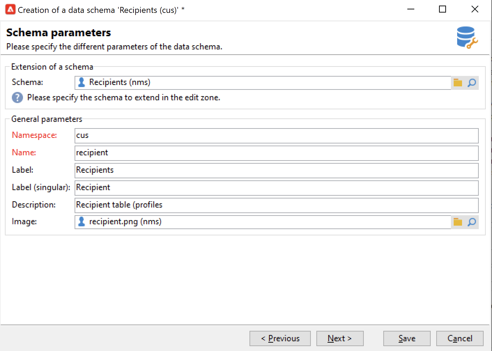
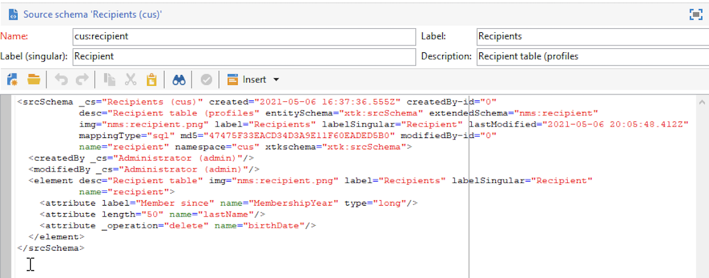

# Utöka ett schema{#extend-schemas}

Som teknisk användare kan ni anpassa Campaign-datamodellen efter era implementeringskrav: lägga till element i ett befintligt schema, ändra ett element i ett schema eller ta bort element.

De viktigaste stegen för att anpassa Campaign-datamodellen är:

1. Skapa ett tilläggsschema
1. Uppdatera Campaign-databas
1. Anpassa indataformuläret

>[!CAUTION]
>Inbyggt schema får inte ändras direkt. Om du behöver anpassa ett inbyggt schema måste du utöka det.

 Om du vill få en bättre förståelse för de inbyggda tabellerna i Campaign och deras interaktion kan du läsa [den här sidan](datamodel.md). Se även rekommendationer när du skapar ett nytt schema i [den här sidan](create-schema.md).

Följ stegen nedan för att utöka ett schema:

1. Navigera till **[!UICONTROL Administration > Configuration > Data schemas]** i Utforskaren.
1. Klicka på **Nytt** och markera **[!UICONTROL Extend the data in a table using an extension schema]**.

   

1. Identifiera det inbyggda schemat för att utöka och markera det.

   

   Ange som konvention samma namn för tilläggsschemat som det inbyggda schemat och använd ett anpassat namnutrymme.  Observera att vissa namnutrymmen bara är interna. [Läs mer](schemas.md#reserved-namespaces)

   

1. När du är i schemaredigeraren lägger du till de element du behöver via snabbmenyn och sparar.

   

   I exemplet nedan lägger vi till **MembershipYear** anger du en längdgräns för efternamn (den här gränsen skriver över standardvärdet) och tar bort födelsedatumet från det inbyggda schemat.

   

   ```
   <srcSchema created="YYYY-MM-DD" desc="Recipient table" extendedSchema="nms:recipient"
           img="nms:recipient.png" label="Recipients" labelSingular="Recipient" lastModified="YYYY-MM-DD"
           mappingType="sql" name="recipient" namespace="cus" xtkschema="xtk:srcSchema">
    <element desc="Recipient table" img="nms:recipient.png" label="Recipients" labelSingular="Recipient" name="recipient">
       <attribute label="Member since" name="MembershipYear" type="long"/>
       <attribute length="50" name="lastName"/>
       <attribute _operation="delete" name="birthDate"/>
   </element>
   </srcSchema>
   ```

1. Koppla från och återanslut till Campaign för att kontrollera schemastrukturuppdateringen i **[!UICONTROL Structure]** -fliken.

   

1. Uppdatera databasstrukturen för att tillämpa ändringarna. [Läs mer](update-database-structure.md)

1. När ändringarna har implementerats i databasen kan du anpassa mottagarens indataformulär så att ändringarna blir synliga. [Läs mer](forms.md)
