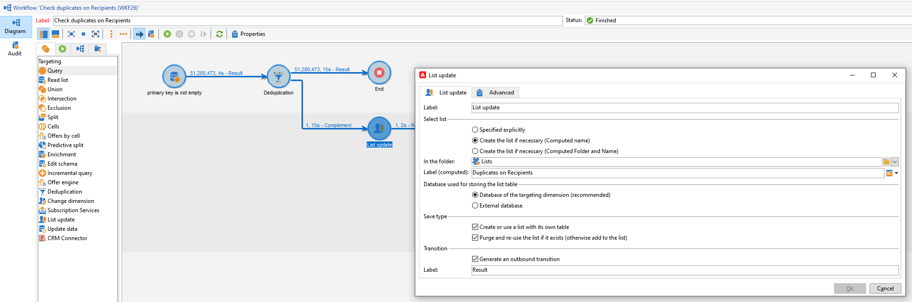

# Nyckelhantering och unicitet {#key-management}

I Campaign v8 är primärnyckeln en UUID (Universally Unique IDentifier), som är en teckensträng. Om du vill skapa det här UUID:t måste huvudelementet i schemat innehålla attributen **autouid** och **autopk** inställda på **true**.

Adobe kampanj v8 levereras med Snowflake som kärndatabas. Den distribuerade arkitekturen i Snowflake-databasen innehåller inga mekanismer för att hantera en nyckels unicitet i en tabell: slutanvändarna ansvarar för att säkerställa att nycklarna i Adobe Campaign-databasen är konsekventa.

För att relationsdatabasens enhetlighet ska bevaras är det obligatoriskt att undvika dubbletter av nycklar, särskilt på primärnycklar. Dubbletter av primärnycklar leder till problem med datahanteringsarbetsflödesaktiviteter som Fråga, Avstämning, Uppdatera med mera.

Adobe Campaign föreslår kraftfulla datahanteringsverktyg för att stämma av data, se till att data infogas eller uppdateras beroende på dess närvaro i databasen (avstämning) och ta bort dubbletter innan data hämtas (borttagning av dubbletter). Som en god praxis rekommenderar Adobe att du antar en [Detect](#detect-duplicates)- och [Correct](#correct-duplicates)-strategi som en del av den övergripande datahanteringsprocessen om dubblerade nycklar har lästs in i databasen.

## Identifiera dubbletter{#detect-duplicates}

Campaign har ett nytt skyddssystem som automatiskt tar bort dubbletter av UUID från en målgrupp när leveransen förbereds. Den här nya mekanismen förhindrar att fel inträffar när en leverans förbereds.

Som slutanvändare kan du kontrollera den här informationen i leveransloggarna: vissa mottagare kan uteslutas från huvudmålet på grund av en duplicerad nyckel. I så fall visas följande varning: `Exclusion of duplicates (based on the primary key or targeted records)`.


När det inträffar kan du skapa ett arbetsflöde för att identifiera dubblettnycklarna. Då kan du korrigera de här nycklarna. Gör så här:

1. Skapa ett nytt arbetsflöde.

   

1. Lägg till en **Query**-aktivitet
1. Välj tabellen **Mottagare**

   

1. Lägg till en **borttagning av dubbletter**-aktivitet och ta bort dubbletter på primärnyckeln (UUID). Behåll bara en dubblett och markera alternativet **Generera komplement** för att skapa en utgående övergång för dubbletter.

   

1. Spara dubbletterna i en lista med en listuppdateringsaktivitet.

   

Nu kan du komma åt de duplicerade mottagarna direkt från listan. Även om övergången bara innehåller en av de duplicerade raderna loggas alla dubbletter i listan.


## Korrigera dubbletter{#correct-duplicates}

För att korrigera dubbletter måste kunderna uppdatera Campaign-data. Typen av åtgärd är nära knuten till dubbletternas och implementeringens karaktär. Vi kan stöta på flera fall där det krävs en annan begränsningsstrategi (ta bort, sammanfoga eller uppdatera).

>[!IMPORTANT]
>
>Dubblerade primärnycklar hindrar dig från att använda inbyggda arbetsflödesaktiviteter för att markera eller uppdatera en viss rad. På grund av duplicerat UUID kommer borttagning av datadubbletter att misslyckas och kan påverka databasens integritet. Därför rekommenderar vi att du korrigerar dubbletter.

Exempel:

* **Fall 1** - Duplicerade mottagare med samma UUID och samma profilinformation (samma e-postadress, förnamn osv.) : mottagarna ser ut som&quot;riktiga&quot; dubbletter och det kan vara bra att bara ta bort en av dubbletterna.
Ett annat sätt är att sammanfoga information om en mottagare med en annan.

* **Fall 2** - Duplicerade mottagare med samma UUID men olika profilinformation (olika e-postadresser, förnamn osv.):
Den här gången verkar det finnas olika profiler och du kanske vill behålla båda i Campaign-databasen, vilket innebär att vi föredrar att bara uppdatera en av dubbletterna och generera ett nytt UUID. [Läs mer i det här exemplet](#deduplicate-sample).

Beroende på vilken strategi du har kan du alltid hämta en fråga från ett annat arbetsflöde och sedan använda uppdateringen efter behov. Kontakta Adobe för mer vägledning.

### Exempel på borttagning av dubbletter{#deduplicate-sample}

Om du har duplicerade mottagare kan du behålla båda posterna i Campaign-databasen. I så fall måste du uppdatera en av dem med ett nytt UUID.

Så om du vill köra en SQL-uppdateringsfråga på molndatabasen kan du använda arbetsflödesaktiviteten **SQL Data Management** och köra följande SQL-uppdatering:

```sql
update nmsrecipient set urecipientid = uuid_string()
where semail = 'bretta37@adobe.com'
and urecipientid = 'c04d93f2-6012-4668-b523-88db1262cd46';
```


När den markerade raden har uppdaterats med ett nytt UUID kan du kontrollera den uppdaterade raden från gränssnittet och se att UUID har uppdaterats som förväntat. Du kan också identifiera dubbletter i databasen genom att köra arbetsflödet &quot;Identifiera dubbletter&quot; [enligt beskrivningen här](#detect-duplicates).
