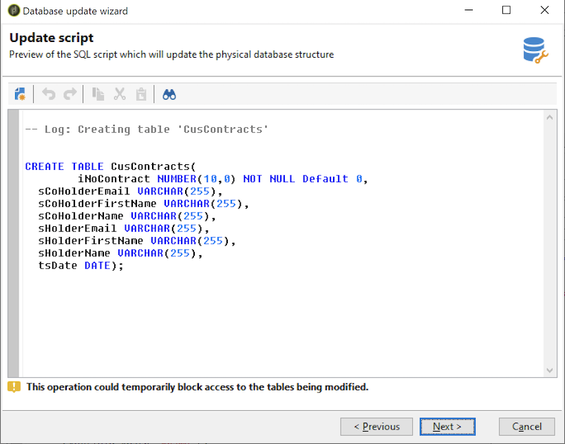

# Uppdatera databasstrukturen{#updating-the-database-structure}

Om du vill använda ändringarna i scheman startar du guiden Databasuppdatering. Den här assistenten är tillgänglig via **[!UICONTROL Tools > Advanced > Update database structure]** . Den kontrollerar om databasens fysiska struktur matchar dess logiska beskrivning och kör SQL-uppdateringsskripten.

Modulerna i databasen fylls i och aktiveras automatiskt.

Följ stegen och visa SQL-skriptet för databasuppdatering:

>[!NOTE]
>
>Detta är i ett redigeringsfält och kan ändras för att ta bort eller lägga till SQL-kod.

Starta sedan databasuppdateringen:

