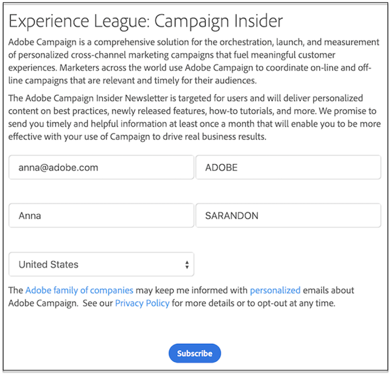

# Kom igång med webbprogram och webbformulär{#gs-ac-web}

Adobe Campaign integrerar en grafisk modul för definition och publicering **Webbformulär** för att skapa sidor med inmatnings- och urvalsfält, som kan innehålla data från databasen. På så sätt kan du utforma och publicera webbsidor som användare kan komma åt för att visa eller ange information.

 Lär dig skapa och publicera webbformulär i [Campaign Classic v7 - dokumentation](https://experienceleague.adobe.com/docs/campaign-classic/using/designing-content/web-forms/about-web-forms.html#designing-content){target="_blank"}

Med Adobe Campaign kan du också skapa och publicera dynamiska och interaktiva **Webbprogram** med data från databasen och innehåll anpassat till den anslutna användarens rättigheter.

Du kan skapa sidor, t.ex. ett redigeringsformulär på ett extranät, eller meddelandeformulär som innehåller data från databasen med tabeller, diagram, indataformulär osv. Med den här funktionen kan du utforma och publicera webbsidor där användarna kan leta upp eller ange information.

 Lär dig hur du skapar och publicerar webbprogram i [Campaign Classic v7 - dokumentation](https://experienceleague.adobe.com/docs/campaign-classic/using/designing-content/web-applications/about-web-applications.html#designing-content){target="_blank"}
