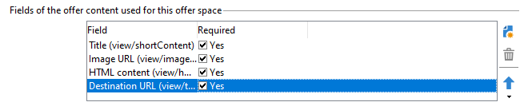
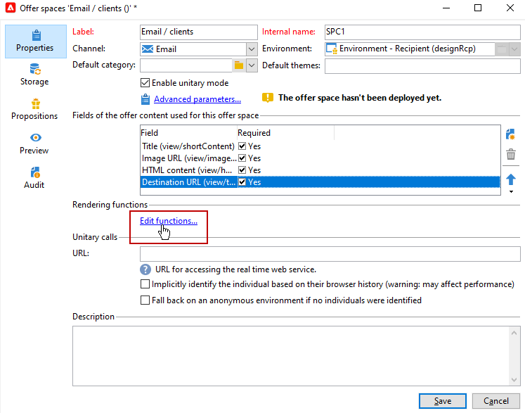
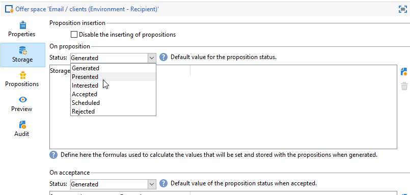
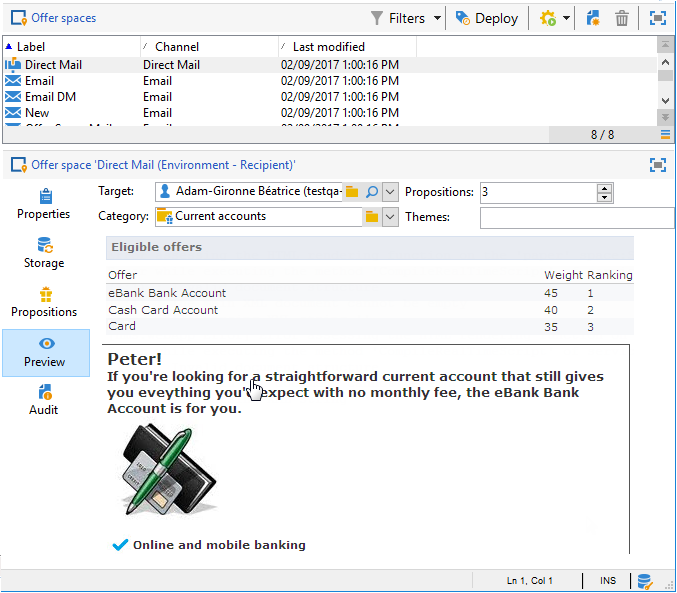

# Skapa erbjudandeplatser{#creating-offer-spaces}

Innehållet i erbjudandekatalogen är konfigurerat i erbjudandemellanslag. Som standard kan innehållet innehålla följande fält: **[!UICONTROL Title]**, **[!UICONTROL Destination URL]**, **[!UICONTROL Image URL]**, **[!UICONTROL HTML content]** och **[!UICONTROL Text content]**. Fältsekvensen är konfigurerad i erbjudandeutrymmet.

Som **teknisk administratör** kan du skapa blanksteg i designmiljön. Du måste ha tillgång till undermappen för erbjudandeutrymmet. När erbjudandet har skapats dupliceras dessa erbjudanden automatiskt till Live-miljön när erbjudandet godkänns.

Återgivningen i HTML skapas via en återgivningsfunktion. Sekvensen för fälten som definieras i återgivningsfunktionen måste vara identisk med sekvensen som konfigurerats i innehållet.


Följ stegen nedan för att skapa ett nytt erbjudandeutrymme:

1. Klicka på i listan med erbjudanden **[!UICONTROL New]**.

   

1. Markera den kanal som du vill använda och ändra etiketten för erbjudandeutrymmet.

   

1. Kontrollera **[!UICONTROL Enable unitary mode]** option

1. Gå till **[!UICONTROL Content field]** fönster och klicka **[!UICONTROL Add]**.

   

1. Gå till **[!UICONTROL Content]** och markera fälten i följande ordning: **[!UICONTROL Title]** sedan **[!UICONTROL Image URL]** sedan **[!UICONTROL HTML content]** sedan **[!UICONTROL Destination URL]**.

   

1. Kontrollera **[!UICONTROL Required]** möjlighet att göra varje fält obligatoriskt.

   >[!NOTE]
   >
   >Det här alternativet används vid förhandsgranskningen och gör att erbjudandemellanslag blir ogiltiga vid publicering om ett av de obligatoriska fälten saknas i erbjudandet. Om ett erbjudande redan finns på en plats där erbjudandet ska erbjudas beaktas dock inte dessa kriterier.

   

1. Klicka **[!UICONTROL Edit functions]** för att skapa en återgivningsfunktion.

   Dessa funktioner används för att generera offertrepresentationer på ett visst utrymme. Det finns flera möjliga format: HTML eller text.

   **Anteckning** - XML-formatet är begränsat till inkommande interaktioner som inte är tillgängliga i den här versionen av produkten. [Läs mer](../start/v7-to-v8.md#gs-unavailable-features)

   _

1. Gå till **[!UICONTROL HTML rendering]** och markera **[!UICONTROL Overload the HTML rendering function]**.
1. Infoga återgivningsfunktionen.

   

## Erbjud förslagsstatus {#offer-proposition-statuses}

Status för erbjudandeförslag varierar beroende på interaktionen med målpopulationen. Campaign Interaction Module innehåller en uppsättning värden som kan tillämpas på erbjudandet under hela dess livscykel. Du måste konfigurera plattformen så att statusen ändras när erbjudandeförslaget skapas och godkänns.

>[!NOTE]
>
>Statusuppdateringen är en **asynkron** -processen. Den utförs av spårningsarbetsflödet som aktiveras varje timme.

### Statuslista för erbjudande {#status-list}

Erbjudandestatus:

* **[!UICONTROL Accepted]**
* **[!UICONTROL Scheduled]**
* **[!UICONTROL Generated]**
* **[!UICONTROL Interested]**
* **[!UICONTROL Presented]**
* **[!UICONTROL Rejected]**

Dessa värden används inte som standard: måste konfigureras.

>[!NOTE]
>
>Status för ett erbjudande ändras automatiskt till Presenterat om erbjudandet är kopplat till en leverans med statusen Skickat.

### Erbjudandestatus när erbjudandet skapas {#configuring-the-status-when-the-proposition-is-created}

När ett erbjudande är **skapad**, uppdateras dess status.

I **[!UICONTROL Design]** för varje erbjudande konfigurerar du statusen som ska gälla när ett erbjudande skapas, beroende på vilken information du vill visa i erbjudanderapporten.

Följ stegen nedan för att göra detta:

1. Gå till **[!UICONTROL Storage]** -fliken för det önskade utrymmet.
1. Välj den status som ska användas för förslaget när det skapas.

   

### Erbjudandestatus när erbjudandet godkänns {#configuring-the-status-when-the-proposition-is-accepted}

När ett erbjudande har lagts fram **accepterad** använder du ett av de värden som anges som standard för att konfigurera förslagets nya status. Uppdateringen tillämpas när en mottagare klickar på en länk i erbjudandet.

Följ stegen nedan för att göra detta:

1. Gå till **[!UICONTROL Storage]** -fliken för det önskade utrymmet.
1. Välj den status som du vill tillämpa på förslaget när det godkänns.

   


**Inkommande interaktion**

The **[!UICONTROL Storage]** kan du definiera status för **föreslaget** och **accepterad** endast erbjudanden. För inkommande interaktion ska status för erbjudandeförslag anges direkt i URL:en för anrop av erbjudandemotorn, i stället för via gränssnittet. På så sätt kan du ange vilken status som ska gälla i andra fall, t.ex. om ett erbjudande avvisas.

```
<BASE_URL>?a=UpdateStatus&p=<PRIMARY_KEY_OF_THE_PROPOSITION>&st=<NEW_STATUS_OF_THE_PROPOSITION>&r=<REDIRECT_URL>
```

Exempel: dispositionen (identifieraren) **40004**) som matchar **Hemförsäkring** erbjudandet visas på **Neobank** -platsen innehåller följande URL:

```
<BASE_URL>?a=UpdateStatus&p=<40004>&st=<3>&r=<"http://www.neobank.com/insurance/subscribe.html">
```

Så snart en besökare klickar på erbjudandet, och därmed webbadressen, **[!UICONTROL Accepted]** status (värde) **3**) används i förslaget och besökaren omdirigeras till en ny sida i **Neobank** Anläggning för teckning av försäkringsavtalet.

>[!NOTE]
>
>Om du vill ange en annan status på URL:en (till exempel om ett erbjudande avvisas) använder du värdet som motsvarar önskad status. Exempel: **[!UICONTROL Rejected]** = &quot;5&quot;, **[!UICONTROL Presented]** = &quot;1&quot; och så vidare.
>
>Status och deras värden kan hämtas i **[!UICONTROL Offer propositions (nms)]** dataschema. Mer information finns på [den här sidan](../dev/create-schema.md).

**Utgående interaktion**

Du kan använda **[!UICONTROL Interested]** status till ett erbjudande när leveransen innehåller en länk. Lägg bara till **_urlType=&quot;11&quot;** värde för länken:

```
<a _urlType="11" href="<DEST_URL>">Link inserted into the delivery</a>
```

## Förhandsgranska per utrymme {#offer-preview-per-space}

I **[!UICONTROL Preview]** kan du visa de erbjudanden som mottagaren är berättigad till via en vald metod. I exemplet nedan är mottagaren berättigad till tre offerter via post.



Om en mottagare inte är berättigad till något erbjudande visas detta i förhandsgranskningen.


Förhandsvisningen kan ignorera kontexter när de är begränsade till ett mellanslag. Detta är fallet när interaktionsschemat har utökats för att lägga till fält som refereras i ett utrymme med en inkommande kanal.

  Mer information om detta finns i exemplet i [Campaign Classic v7-dokumentation](https://experienceleague.adobe.com/docs/campaign-classic/using/managing-offers/advanced-parameters/extension-example.html){target="_blank"}.