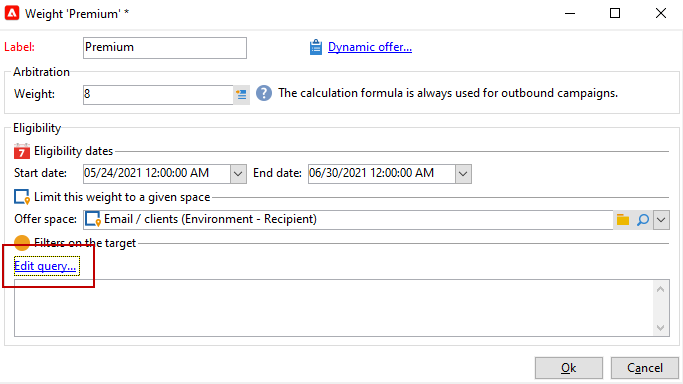
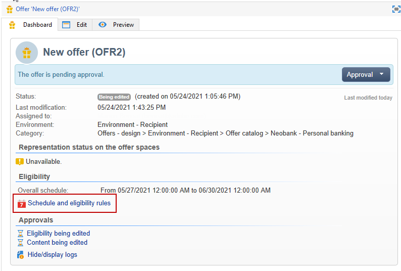
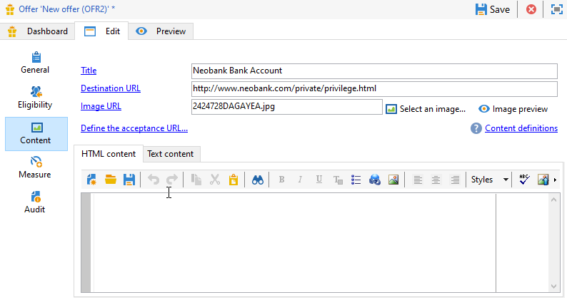

# Skapa ett erbjudande

Följ stegen nedan för att skapa ett erbjudande:

1. Bläddra till **[!UICONTROL Campaigns]** och klicka på **[!UICONTROL Offers]** länk.

1. Klicka på knappen **[!UICONTROL Create]**.

1. Ändra etiketten och välj den kategori som erbjudandet ska tillhöra.

1. Klicka **[!UICONTROL Save]** för att skapa erbjudandet.

   Erbjudandet är tillgängligt på plattformen och dess innehåll kan konfigureras.

## Behörighetsinställningar

Nu kan du använda **[!UICONTROL Eligibility]** -flik för att definiera:

* Giltighetsperioden för erbjudandet. [Läs mer](#eligibility-period)
* Filter för målpopulationen för erbjudandet. [Läs mer](#filters-on-the-target)
* Erbjudandets vikt. [Läs mer](#offer-weight)

### Giltighetsperiod för erbjudandet{#eligibility-period}

I **[!UICONTROL Eligibility]** under erbjudandet, definiera den period som erbjudandet gäller. Använd listrutorna för att välja ett start- och ett slutdatum i kalendern.


Utanför denna period kommer erbjudandet inte att väljas. Om du även har konfigurerat berättigandedatum för erbjudandekategorin gäller den mest restriktiva perioden.

### Lägg till filter på målet {#filters-on-the-target}

I **[!UICONTROL Eligibility]** Lägg på filter på erbjudandemålet.

Om du vill göra det klickar du på **[!UICONTROL Edit query]** och välj det filter som du vill använda.


Om fördefinierade filter redan har skapats kan du välja dem i listan med användarfilter. [Läs mer](interaction-predefined-filters.md)


### Ange offertvikt {#offer-weight}

Om du vill att motorn ska kunna välja mellan flera erbjudanden som målet är kvalificerat för, måste du tilldela ett eller flera vikter till erbjudandet. Du kan också tillämpa filter på målet om det behövs eller begränsa det erbjudandeutrymme som vikten gäller för. Ett erbjudande med större vikt är att föredra framför ett erbjudande med mindre vikt.

Du kan konfigurera flera vikter för samma erbjudande, t.ex. för att skilja mellan delperioder, specifika mål eller till och med ett erbjudandeutrymme.

Ett erbjudande kan till exempel ha vikten A för kontakter mellan 18 och 25 år och vikten B för kontakter över detta intervall. Om ett erbjudande är giltigt hela sommaren kan det även ha A i juli och B i augusti.

>[!NOTE]
>
>Den tilldelade vikten kan ändras tillfälligt enligt parametrarna för den kategori som erbjudandet tillhör. [Läs mer](interaction-offer-catalog.md#creating-offer-categories)

Så här skapar du en vikt i ett erbjudande:

1. I **[!UICONTROL Eligibility]** klicka på **[!UICONTROL Add]**.

   

1. Ändra etiketten och tilldela en vikt. Standardvärdet är 1.

   

   >[!CAUTION]
   >
   >Om ingen vikt anges (0) anses målet inte vara berättigat till erbjudandet.

1. Om du vill att vikten ska gälla för en viss period definierar du datum för berättigande.

   

1. Begränsa vid behov vikten till ett visst erbjudandeutrymme.

   

1. Använd ett filter på ett mål.

   

1. Klicka **[!UICONTROL OK]** för att spara vikt.

   

   >[!NOTE]
   >
   >Om ett mål kan få flera vikter för ett valt erbjudande behåller motorn den bästa (högsta) vikten. Vid anrop till erbjudandemotorn väljs ett erbjudande ut högst en gång per kontakt.

### Sammanfattning av regler för erbjudandekvalificering {#a-summary-of-offer-eligibility-rules}

När konfigurationen är klar finns en sammanfattning av berättigandereglerna på instrumentpanelen för erbjudanden.

Klicka på **[!UICONTROL Schedule and eligibility rules]** länk.



## Skapa erbjudandeinnehållet {#creating-the-offer-content}

Använd **[!UICONTROL Content]** för att definiera innehållet i erbjudandet.


1. Definiera de olika parametrarna för erbjudandeinnehållet.

   * **[!UICONTROL Title]** : Ange den titel som du vill ska visas i erbjudandet. Varning: detta avser inte erbjudandets etikett, som definieras i **[!UICONTROL General]** -fliken.
   * **[!UICONTROL Destination URL]** : ange erbjudandets URL. Det måste börja med&quot;http://&quot; eller&quot;https://&quot;.
   * **[!UICONTROL Image URL]** : Ange en URL eller en åtkomstsökväg till bilden av erbjudandet.
   * **[!UICONTROL HTML content]** / **[!UICONTROL Text content]** : Ange innehållet i erbjudandet på fliken som du vill ha. Om du vill generera spårning visas **[!UICONTROL HTML content]** måste bestå av HTML-element som kan omslutas av en `<div>` type-element. Resultatet av en `<table>` -elementet på HTML-sidan kommer att följas:

   ```
      <div> 
       <table>
        <tr>
         <th>Month</th>
         <th>Savings</th>   
        </tr>   
        <tr>    
         <td>January</td>
         <td>$100</td>   
        </tr> 
       </table> 
      </div>
   ```

   Lär dig hur du definierar accepterings-URL i [det här avsnittet](interaction-offer-spaces.md#configuring-the-status-when-the-proposition-is-accepted).

   

   Om du vill hitta de obligatoriska fälten som de definierades under konfigurationen av erbjudandeutrymmet klickar du på knappen **[!UICONTROL Content definitions]** för att visa listan. [Läs mer](interaction-offer-spaces.md)

   

   I det här exemplet måste erbjudandet innehålla en titel, en bild, HTML och en mål-URL.

## Förhandsgranska erbjudandet {#previewing-the-offer}

När innehållet i erbjudandet har konfigurerats kan du förhandsgranska erbjudandet så som det kommer att visas för mottagaren.

Så här gör du:

1. Klicka på **[!UICONTROL Preview]** -fliken.

   

1. Välj den representation av erbjudandet som du vill visa.

   

1. Om du har personaliserat erbjudandeinnehållet väljer du erbjudandemålet för att visa personalisering.

<!--

## Create a hypothesis on an offer {#creating-a-hypothesis-on-an-offer}

You can create hypotheses on your offer propositions. This lets you determine the impact of your offers on purchases carried out for the product concerned.

>[!NOTE]
>
>These hypotheses are carried out via Response Manager. Please check your license agreement.

Hypotheses carried out on an offer proposition are referenced in their **[!UICONTROL Measure]** tab.

Creating hypotheses is detailed in [this page](../../campaign/using/about-response-manager.md).

-->

## Godkänn och aktivera ett erbjudande{#approve-offers}

Nu kan du godkänna och aktivera erbjudandet och göra det tillgängligt i **Live** miljö.

 Mer information finns i [Campaign Classic v7-dokumentation](https://experienceleague.adobe.com/docs/campaign-classic/using/managing-offers/managing-an-offer-catalog/approving-and-activating-an-offer.html#approving-offer-content)

## Hantera presentation av erbjudanden{#offer-presentation}

Med Campaign kan ni styra flödet av erbjudandeförslag med hjälp av presentationsregler. Dessa regler, som är specifika för Campaign Interaction, är **typologiregler**. Med dem kan du utesluta erbjudanden baserat på historiken för de förslag som redan har lämnats till en mottagare. De refereras i miljön.

 Mer information finns i [Campaign Classic v7-dokumentation](https://experienceleague.adobe.com/docs/campaign-classic/using/managing-offers/managing-an-offer-catalog/managing-offer-presentation.html#managing-offers)

## Simulera erbjudanden

The **Simulering** Med -modulen kan du testa fördelningen av erbjudanden som tillhör en kategori eller miljö innan du skickar ditt förslag till mottagarna.

Simuleringen tar hänsyn till de kontexter och regler för behörighet som tidigare tillämpats på erbjudanden och deras presentationsregler. Detta gör att ni kan testa och förfina olika versioner av ert erbjudande utan att faktiskt använda ett erbjudande eller över/under beställning av ett mål, eftersom simuleringen inte har någon effekt på de avsedda mottagarna.

 Mer information om erbjudandesimulering finns i [Campaign Classic v7-dokumentation](https://experienceleague.adobe.com/docs/campaign-classic/using/managing-offers/simulating-offers/about-offers-simulation.html)
