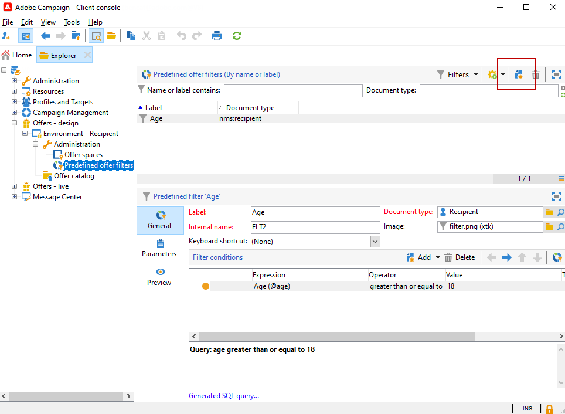
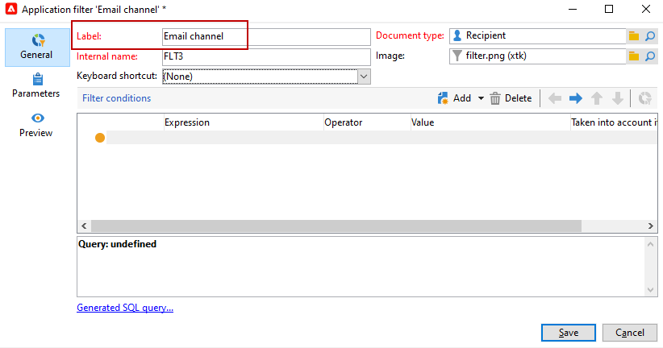
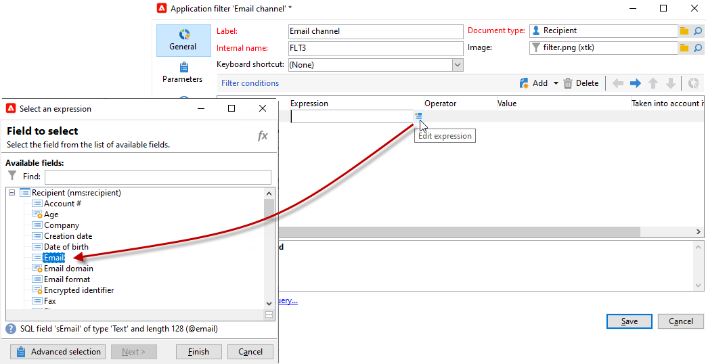

# Skapa fördefinierade filter{#creating-pre-defined-filters}

Skapa fördefinierade filter för att definiera berättiganderegler för målpopulationen som enkelt kan återanvändas när erbjudanden skapas. De är specifika för varje miljö och tar hänsyn till erbjudandeparametrarna.

Så här skapar du ett fördefinierat filter:

1. Bläddra till **[!UICONTROL Administration]** mapp och markera **[!UICONTROL Pre-defined offer filters]**.

   

1. Klicka på **[!UICONTROL New]**.

   

1. Ändra etiketten så att du kan identifiera filtret senare.

   

1. Markera det fält som filtervillkoret gäller.

   

1. Välj en operator och ett värde om det behövs, och spara sedan frågan.

   

1. Klicka **[!UICONTROL Preview]** om du vill visa resultatet av filtret.

   
