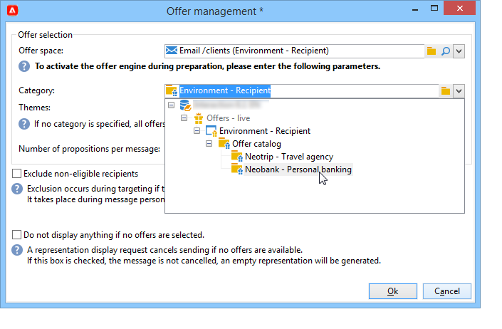
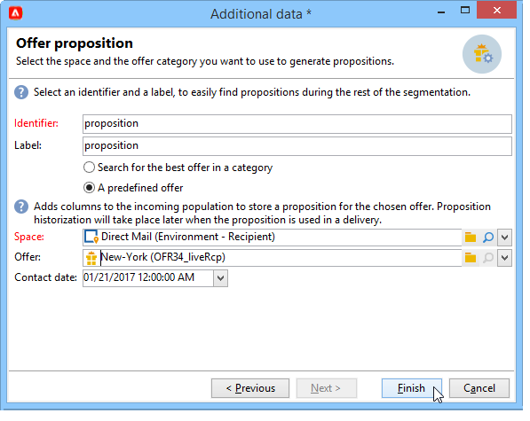
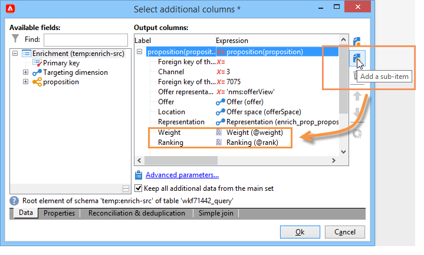

# Skicka ett erbjudande

För att ett erbjudande ska kunna väljas ut av erbjudandemotorn måste det godkännas och vara tillgängligt i en **Live** miljö. [Läs mer](interaction-offer.md#approve-offers)

Erbjudandet presenteras via en utgående kommunikationskanal via direktreklam, e-post eller mobila leveranser. Du kan också använda enhetsläge med Transactional Messaging (Message Center).

## Infoga ett erbjudande i en leverans {#offer-into-a-delivery}

Följ stegen nedan för att infoga offertförslag i en leverans:

1. I leveransfönstret klickar du på **Erbjudanden** ikon.

   

1. Välj det utrymme som passar er erbjudandemiljö.

   

1. Om du vill förfina motorns urval av erbjudanden väljer du antingen den kategori från vilken erbjudandena som ska presenteras är en del av, eller ett eller flera teman. Vi rekommenderar att du bara använder ett av dessa fält i taget för att undvika att överbelasta begränsningarna.

   

   

1. Ange antalet erbjudanden som du vill infoga i leveransbrödtexten.

   

1. Välj **[!UICONTROL Exclude non-eligible recipients]** vid behov. [Läs mer](#parameters-for-calling-offer-engine)

   

1. Välj **[!UICONTROL Do not display anything if no offers are selected]** alternativ. [Läs mer](#parameters-for-calling-offer-engine)

   

1. Infoga egenskaperna i leveransinnehållet med hjälp av kopplingsfälten. Antalet tillgängliga offerter beror på hur motoranropet är konfigurerat och deras ordning beror på erbjudandenas prioritet.

   

1. Slutför innehållet, testa och skicka leveransen.

   

### Parametrar för erbjudandemotorn {#parameters-for-calling-offer-engine}

* **[!UICONTROL Space]** : utrymme för den erbjudandemiljö som måste väljas för att aktivera erbjudandemotorn.
* **[!UICONTROL Category]** : den mapp där erbjudandena sorteras. Om ingen kategori anges kommer alla erbjudanden i miljön att beaktas av erbjudandemotorn, såvida inte ett tema väljs.
* **[!UICONTROL Themes]** : nyckelord som definieras uppströms i kategorierna. Dessa fungerar som ett filter och låter dig förfina antalet erbjudanden som ska presenteras genom att välja dem i en uppsättning kategorier.
* **[!UICONTROL Number of propositions]** : Antal erbjudanden som returneras av motorn och som kan infogas i leveransenheten. Om de inte infogas i meddelandet kommer erbjudandena fortfarande att genereras, men inte presenteras.
* **[!UICONTROL Exclude non-eligible recipients]** : Med det här alternativet kan du aktivera eller inaktivera exkluderingen av mottagare för vilka det inte finns tillräckligt med giltiga erbjudanden. Antalet giltiga förslag kan vara lägre än det begärda antalet. Om den här rutan är markerad kommer mottagare som inte har tillräckligt med erbjudanden att uteslutas från leveransen. Om du inte markerar det här alternativet kommer dessa mottagare inte att uteslutas, men de kommer inte att ha det begärda antalet förslag.
* **[!UICONTROL Do not display anything if no offer is selected]** : Med det här alternativet kan du välja hur meddelandet ska behandlas om något av förslagen inte finns. När den här rutan är markerad visas inte representationen av det saknade förslaget och inget innehåll visas i meddelandet för det här förslaget. Om rutan inte är markerad avbryts själva meddelandet när det skickas och mottagarna får inte längre några meddelanden.

## Skicka erbjudanden i arbetsflöden{#offer-via-wf}

Med flera arbetsflödesaktiviteter kan du definiera hur erbjudanden presenteras:

* Berikning
* Erbjudandemotor
* Erbjudanden per cell

### Berikning {#enrichment}

The **Berikning** Med -aktivitet kan du lägga till erbjudanden eller länkar till erbjudanden för mottagare.

 Mer information om anrikningsaktiviteten finns i [Campaign Classic v7-dokumentation](https://experienceleague.adobe.com/docs/campaign-classic/using/automating-with-workflows/targeting-activities/enrichment.html)

Du kan till exempel förbättra data för en mottagarfråga före en leverans.

Det finns två metoder för att ange erbjudandeförslag.

* Ange ett erbjudande eller ett offertmotorsamtal.
* Referera till en länk till ett erbjudande.

#### Ange ett erbjudande eller ett samtal till erbjudandemotorn {#specifying-an-offer-or-a-call-to-the-offer-engine}

När du har konfigurerat **Fråga** aktivitet:

1. Lägg till och öppna en **Berikning** aktivitet.
1. Välj **[!UICONTROL Enrichment]** **[!UICONTROL Add data]** i flik .
1. Välj **[!UICONTROL An offer proposition]** i de typer av data som ska läggas till.

   

1. Ange en identifierare och en etikett för det förslag som ska läggas till.
1. Ange erbjudandevalet. Det finns två möjliga alternativ:

   * **[!UICONTROL Search for the best offer in a category]** : Markera det här alternativet och ange parametrarna för att ringa upp erbjudandemotorn (erbjudandeutrymme, kategori eller tema, kontaktdatum, antal erbjudanden som ska behållas). Motorn beräknar automatiskt erbjudandena som ska läggas till enligt dessa parametrar. Vi rekommenderar att du fyller i **[!UICONTROL Category]** eller **[!UICONTROL Theme]** i stället för båda samtidigt.

      

   * **[!UICONTROL A pre-defined offer]** : markera det här alternativet och ange ett erbjudandeutrymme, ett specifikt erbjudande och ett kontaktdatum för att direkt konfigurera det erbjudande du vill lägga till, utan att anropa erbjudandemotorn.

      

1. Konfigurera sedan en leveransaktivitet som motsvarar den valda kanalen. [Läs mer](#offer-into-a-delivery)

   >[!NOTE]
   >
   >Antalet tillgängliga offerter för förhandsgranskningen beror på konfigurationen som utförs i anrikningsaktiviteten snarare än eventuell konfiguration som utförs direkt i leveransen.

#### Referera till en länk till ett erbjudande {#referencing-a-link-to-an-offer}

Du kan även referera till en länk till ett erbjudande i en **Berikning** aktivitet.

Följ stegen nedan för att göra detta:

1. Välj **[!UICONTROL Add data]** i aktivitetens **[!UICONTROL Enrichment]** -fliken.
1. I fönstret där du väljer vilken typ av data som ska läggas till väljer du **[!UICONTROL A link]**.
1. Välj den typ av länk som du vill etablera samt dess mål. I det här fallet är målet erbjudandeschemat.

   

1. Ange kopplingen mellan inkommande tabelldata i anrikningsaktiviteten (här mottagartabellen) och erbjudandetabellen. Du kan till exempel länka en erbjudandekod till en mottagare.

   

1. Konfigurera sedan en leveransaktivitet som motsvarar den valda kanalen. [Läs mer](#offer-into-a-delivery)

   >[!NOTE]
   >
   >Antalet tillgängliga offerter för förhandsgranskningen beror på konfigurationen som utförs i leveransen.

#### Rankningar och vikter för butikserbjudanden {#storing-offer-rankings-and-weights}

Som standard när **Berikning** aktiviteten används för att leverera erbjudanden, deras rankningar och deras vikter lagras inte i förslagstabellen.

>[!NOTE]
>
>The **[!UICONTROL Offer engine]** den här informationen lagras som standard i aktiviteten.

Du kan dock lagra den här informationen på följande sätt:

1. Skapa ett anrop till erbjudandemotorn i en anrikningsaktivitet som placerats efter en fråga och före en leveransaktivitet. [Läs mer](#specifying-an-offer-or-a-call-to-the-offer-engine)
1. I aktivitetens huvudfönster väljer du **[!UICONTROL Edit additional data...]**.

   

1. Lägg till **[!UICONTROL @rank]** kolumner för rankningen och **[!UICONTROL @weight]** för erbjudandevikten.

   

1. Bekräfta tillägget och spara arbetsflödet.

Leveransen lagrar automatiskt rangordningen och vikten av erbjudandena. Den här informationen visas i leveransens **[!UICONTROL Offers]** -fliken.

### Erbjudandemotor {#offer-engine}

The **[!UICONTROL Offer engine]** Med -aktiviteten kan du även ange ett anrop till erbjudandemotorn före leveransen.

 Mer information finns på **Erbjudandemotor** aktivitet, se [Campaign Classic v7-dokumentation](https://experienceleague.adobe.com/docs/campaign-classic/using/automating-with-workflows/targeting-activities/offer-engine.html)

Denna verksamhet följer samma princip som **Berikning** Aktivitet med ett motoranrop genom att berika de inkommande populationsdata med ett erbjudande som beräknas av motorn före leverans.

När du har konfigurerat **Fråga** aktivitet:

1. Lägg till och öppna en **[!UICONTROL Offer engine]** aktivitet.
1. Fyll i de olika tillgängliga fälten för att ange parametrar för att anropa erbjudandemotorn (erbjudandeutrymme, kategori eller tema, kontaktdatum, antal erbjudanden som ska behållas). Motorn beräknar automatiskt erbjudandena som ska läggas till enligt dessa parametrar.

   >[!CAUTION]
   >
   >Om du använder den här aktiviteten lagras endast de offertförslag som används i leveransen.

   

1. Konfigurera sedan en leveransaktivitet som motsvarar den valda kanalen. [Läs mer](#inserting-an-offer-proposition-into-a-delivery)

### Erbjudanden per cell {#offers-by-cell}

The **[!UICONTROL Offers by cell]** Med -aktiviteten kan du distribuera den inkommande populationen (från en fråga till exempel) till flera segment och ange ett erbjudande som ska visas för vart och ett av dessa segment.

 Mer information finns på **Erbjudande per cell** aktivitet, se [Campaign Classic v7-dokumentation](https://experienceleague.adobe.com/docs/campaign-classic/using/automating-with-workflows/targeting-activities/offers-by-cell.html)

Gör så här:

1. Lägg till **[!UICONTROL Offers by cell]** när du har angett målpopulationen och sedan öppnar du den.
1. I **[!UICONTROL General]** väljer du det erbjudandeutrymme som du vill visa erbjudandena på.
1. I **[!UICONTROL Cells]** anger du de olika delmängderna med **[!UICONTROL Add]** knapp:

   * Ange delmängdsfyllningen med de tillgängliga filtrerings- och begränsningsreglerna.
   * Välj sedan det erbjudande som du vill presentera för undergruppen. De erbjudanden som är tillgängliga är sådana som är berättigade i den erbjudandemiljö som valdes i föregående steg.

      

1. Konfigurera sedan en leveransaktivitet som motsvarar den valda kanalen.

<!--

## Delivering with delivery outlines {#delivering-with-delivery-outlines}

You can also present offers in a delivery using delivery outlines.

For more information on delivery outlines, refer to the Campaign - MRM guide.

1. Create a new campaign or access an existing campaign.
1. Access the delivery outlines via the campaign's **[!UICONTROL Edit]** > **[!UICONTROL Documents]** tab.
1. Add an outline then insert as many offers as you like into it by right-clicking on the outline and selecting **[!UICONTROL New]** > **[!UICONTROL Offer]**, then save the campaign.

1. Create a delivery whose delivery outlines you have access to (for example, a direct mail delivery).
1. When editing the delivery, click **[!UICONTROL Select a delivery outline]**.

   >[!NOTE]
   >
   >Depending on the type of delivery, this option can be found in the **[!UICONTROL Properties]** > **[!UICONTROL Advanced]** menu (for email deliveries for example).

1. Using the **[!UICONTROL Offers]** button, you can then configure the offer space as well as the number of offers to present in the delivery.

1. Add the propositions into the delivery body using the personalization fields (for more on this, refer to the [Inserting an offer proposition into a delivery](#inserting-an-offer-proposition-into-a-delivery) section), or in the case of a direct mail delivery, by editing the extraction file format.

   Propositions will be selected from the offers referenced in the delivery outline.

   >[!NOTE]
   >
   >Information regarding the offer rankings and weights is only saved in the proposition table if the offers are generated directly in the delivery.
-->
