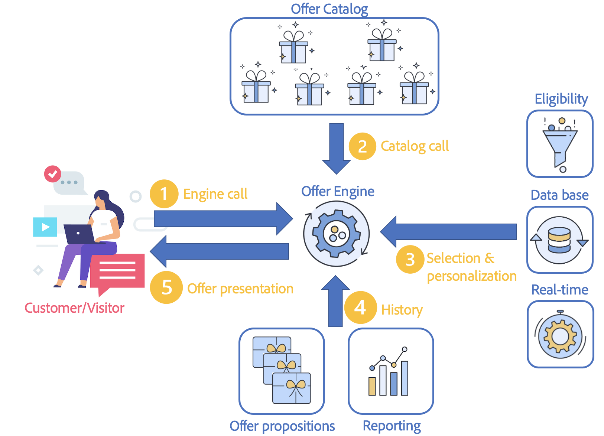

# Hantera interaktioner i realtid

Campaign innehåller en **interaktionsmodul** som gör att du kan svara i realtid under en interaktion med en viss kontakt genom att föreslå en eller flera specifika erbjudanden. Erbjudandena kan vara enkla kommunikationsmeddelanden, specialerbjudanden för en eller flera produkter eller en tjänst.

Du kan skapa en erbjudandekatalog som interagerar med dina utgående kanaler (e-post, direktreklam, SMS) för att välja det bästa erbjudandet att skicka till en kontakt i ett visst sammanhang. Det bästa erbjudandevalet för en mottagare baseras på **berättiganderegler**. Urvalet av ett erbjudande från en uppsättning relevanta erbjudanden bestäms med hjälp av prioritetsregler. Regler för presentation av erbjudanden tar hänsyn till kontaktens historik och hjälper dig att undvika att få samma erbjudande flera gånger.

Med Interaction kan du skapa och hantera en katalog med erbjudanden och konfigurera regler och programteman som är länkade till dem. Beroende på vilken kanal du väljer kan innehållet anpassas tack vare olika återgivningsfunktioner. Slutligen kan du använda simuleringsmodulen för att beräkna effekten av en erbjudandepresentation.

För det första sker en kontakt mellan en kund och ett företag via en kommunikationskanal: det kan vara en webbplats (utgående interaktion), ett e-postmeddelande, SMS, push-meddelanden (inkommande interaktioner). [Läs mer](#interaction-types)

Den här kontakten leder till ett anrop till erbjudandemotorn. (1)

När anropet till erbjudandemotorn sker väljs ett eller flera erbjudanden från erbjudandekatalogen beroende på antalet erbjudandeinställningar i erbjudandet. (2)

Därefter tillämpas regler för behörighet: de bästa erbjudandena väljs ut baserat på berättigandereglerna, start- och slutdatumen för erbjudanden, profildata och kundens realtidsbeteende. (3)

Profilens förslagshistorik uppdateras när valet är gjort för att undvika dubbletter av erbjudandena som presenteras. (4)

Slutligen föreslås det bästa erbjudandet för målet. (5)

## Kom igång med erbjudanden

Viktiga steg att starta visas nedan.

### Konfigurera plattformen

Innan du startar, som **administratör** för kampanj, måste du kontrollera att du har utfört följande uppgifter i designmiljöer:

1. Skapa användarprofiler. [Läs mer](interaction-operators.md)
1. (valfritt) Skapa en erbjudandemiljö för varje målgruppsdimension. [Läs mer](interaction-env.md)
1. Skapa typologiregler för varje miljö. [Läs mer](interaction-offer.md#offer-presentation)
1. Skapa utrymme för varje miljö och konfigurera återgivningsfunktioner. [Läs mer](interaction-offer-spaces.md)
Om utrymmet definieras av en enhetskanal i identifierat läge måste du ange de avancerade parametrarna för det här utrymmet.

   >[!NOTE]
   >
   >Om utrymmet definieras av en enhetskanal i identifierat läge måste du ange de avancerade parametrarna för det här utrymmet.

1. Konfigurera erbjudandemotorn för inkommande interaktioner för att presentera och uppdatera ett eller flera erbjudanden.

   De olika integrationslägena beskrivs i [det här avsnittet](interaction-present-offers.md).

   >[!NOTE]
   >
   >När ett erbjudandeutrymme skapas på den inkommande webbkanalen måste du konfigurera webbplatsen så att erbjudandet visas.
   >

### Skapa och publicera erbjudandekatalogen {#managing-the-offer-catalog-}

Som **erbjudandehanterare** måste du:

1. Skapa erbjudandekategorier i designmiljöer. [Läs mer](interaction-offer-catalog.md#creating-offer-categories)
1. Skapa erbjudanden i designmiljöer. [Läs mer](interaction-offer.md)
1. Godkänn och publicera erbjudanden på ett eller flera platser för att göra dem tillgängliga för leveranshanteraren i aktiva miljöer. [Läs mer](interaction-offer.md#approve-offers)

### Använd erbjudandekatalogen {#using-the-offer-catalog-}

Som **leveranshanterare** måste du:

1. Skapa en kampanj.
1. Referera ett erbjudande i kampanjen eller leveransen. [Läs mer](interaction-send-offers.md).

## Ordlista

Upptäck erbjudandespecifika villkor och tillhörande vägledning innan du börjar.

* **Miljö**: en uppsättning som innehåller en erbjudandekatalog och kopplingar (erbjudandeutrymmen). Skapa en miljö genom att rikta in er på olika aspekter. Det finns två typer av miljöer:

   * **Designmiljö**: En miljö där erbjudanden skapas och/eller typologiregler definieras (regler som avgör vilka erbjudanden som ska visas eller inte visas för en målperson). Tabellen över de individer som ska omfattas av erbjudandena och tabellen för lagring av alla erbjudandeförslag definieras också här. Noden **[!UICONTROL Design environment]** innehåller utrymmesundermappar, fördefinierade filter och erbjudandekategorier. För varje **[!UICONTROL Design environment]** finns det en motsvarande skrivskyddad **[!UICONTROL Live environment]** som genereras från samma **[!UICONTROL Design environment]**.
   * **Live-miljö**: miljö länkad till en **[!UICONTROL Design environment]**. Den innehåller skrivskyddade erbjudanden vars innehåll och behörighet har godkänts via **[!UICONTROL Design environment]**. De kan visas på en webbplats eller infogas i ett meddelande.

* **Erbjud utrymme**: mapp som definierar platsen där erbjudandet visas. När du definierar ett mellanrum kan du:
   * markera kanalen
   * välja att den kan användas i enställningsläge (som standard: endast i gruppläge)
   * bygga innehållet i erbjudandet med hjälp av återgivningsfunktioner
   * ange vilka erbjudanden som ska visas

  Ett blanksteg är ett gränssnitt mellan kanalen och erbjudandemotorn.

  >[!CAUTION]
  >
  >Ett erbjudandeutrymme är inte en kommunikationskanal, det sammanfaller med en specifik exponeringsplats i kanalen. Erbjudanden som visas på en webbplats kan till exempel innehålla två mellanslag på samma sida. I det här fallet har du två mellanslag för samma kanal.
  >
  >Blanksteg måste definieras i specifikationerna och får inte ändras under projektet.

* **Erbjudandekatalog**: en uppsättning erbjudanden som definieras i Adobe Campaign och som kan väljas under en interaktion. Katalogen ordnas hierarkiskt med varje nod som motsvarar en kategori.
* **Kategori**: en mapp som är länkad till erbjudandekatalogen i en miljö, där erbjudandena ordnas baserat på typ, berättigandedatum och programtema. En kategori kan innehålla underkategorier, som ärver alla egenskaper i den överordnade kategorin. Kvalifikationsregler kan definieras för en kategori så att de kan delas för flera erbjudanden.
* **Programteman**: nyckelord som definieras i kategorin, vilket gör att du kan filtrera erbjudanden när de presenteras för en inkommande eller utgående kanal genom att begränsa urvalet av erbjudanden till en eller två kategorier.

  >[!NOTE]
  >
  >Underordnade kategorier ärver de teman som identifieras i den överordnade kategorin.

* **Kvalifikationsregler**: Begränsningar som tillämpas på en miljö, kategori eller erbjudande gällande giltighetsperiod, mål och vikt. De gör att ni kan försäkra er om att ett erbjudande är i linje med den avsedda kontakten.

  I miljöerna omfattar reglerna för rätt till uppgradering presentationsregler som gäller för erbjudandena och de personer som ska väljas ut.

  I kategorierna kan du med reglerna för behörighet: begränsa kategoriens giltighet i tid, definiera programteman och bestämma vilka personer som ska målgruppsanpassas. De kan också få en multiplikatvikt för en viss tid. På så sätt kan du dela reglerna för erbjudanden i andra kategorier och på så sätt förenkla hanteringen av dem.

  I erbjudandena kan ni begränsa giltigheten för erbjudanden i tid och avgöra vilka personer som ska väljas ut.

* **Medling**: välja erbjudanden som ska visas i en miljö (berättigade erbjudanden). Principen om arbitrage rangordnar erbjudanden efter prioritet enligt de kriterier som definieras i kategorierna, erbjudandena och sammanhangserbjudandena.
* **Kontakt**: en kontakt från en inkommande interaktion. Under motorsamtalsbearbetningen är kontakten kopplad till en måldimension. Det finns två typer av kontakter:

   * **[!UICONTROL Identified contact]** : en kontakt som frivilligt har identifierats i kanalen. Vid utgående interaktioner identifieras kontakten automatiskt.
   * **[!UICONTROL Anonymous contact]** : en kontakt som inte frivilligt har prenumererat via kanalen men som kan identifieras implicit via en cookie. Den här terminologin används bara för inkommande interaktioner.

     >[!NOTE]
     >
     >Ej identifierade anonyma kontakter tillskrivs besökarens målgruppsdimension.

* **Utgående interaktion**: anrop till erbjudandemotorn från en kontaktlista (används för att leverera e-post, direktreklam osv.). Samma regler och processer tillämpas för varje kontakt. Den här typen av interaktion bearbetas vanligtvis i gruppläge.
* **Inkommande interaktion**: interaktion efter ett inkommande samtal som genererats av åtgärden för en kontakt i kanalen. Den här typen av interaktion bearbetas vanligtvis i enskärmsläge.
* **Gruppläge**: I gruppläget kan du välja det bästa erbjudandet för en uppsättning kontakter. Reglerna för behörighet/prioritering tillämpas på alla kontakter i uppsättningen. Det här läget används vanligtvis för utgående interaktioner.
* **Enhetsläge**: en enskild kontakt bearbetas åt gången. Det här läget används vanligtvis för inkommande interaktioner och transaktionsmeddelanden.
* **Identifieringsläge**: refererar till status för en kontakt:

   * **[!UICONTROL explicit]** : Kontakter identifieras av deras inloggning i kanalgränssnittet.
   * **[!UICONTROL implicit]** : kontakten identifieras av en cookie (permanent eller session). Den kan behandlas som en anonym eller identifierad kontakt.
   * **[!UICONTROL anonymous]** : det går inte att identifiera kontakter.

* **Berättigat erbjudande**: Erbjudandet uppfyller de begränsningar som definierats uppströms och som konsekvent kan erbjudas ett mål.
* **Presentationsregler**: typologiregler som refereras i erbjudandemiljön, som gör att du kan exkludera vissa erbjudanden genom att ta hänsyn till förslagshistoriken.
* **Vikt**: formler som gör att du kan beräkna relevansen för ett erbjudande och välja det mest relevanta erbjudandet. Vikten definieras i erbjudandena. Berättigade erbjudanden beaktas i minskande viktordning.
* **Återgivningsfunktion**: funktion som definierats i erbjudandeutrymmet för att konstruera sin offertrepresentation baserat på attributen som definieras i erbjudandet. Det finns tre olika återgivningsfunktionslägen: HTML, XML och text.
* **Erbjudandeerbjudande**: resultatet av åtgärden som består av att presentera ett eller flera erbjudanden för en kontakt i ett givet utrymme (banner på en webbplats, ett e-postmeddelande eller ett SMS-meddelande till exempel). Det här resultatet lagras i tabellen för erbjudandeförslag. Det är dock inte obligatoriskt att spara förslagen.
* **Simulering**: Med modulen kan du testa erbjudandepresentationen för målmottagarna innan du skickar erbjudandena.
* **Förhandsgranska**: förhandsgranskning av erbjudandet så som det visas i dess mapp. Den är tillgänglig från inställningsfönstret för erbjudandet eller kontaktprofilen.
* **fördefinierade filter**: fördefinierade filtreringsregler kan ta hänsyn till erbjudandeparametrar (till exempel en erbjudandekod). De kan återanvändas efter att erbjudandena har skapats.
* **Erbjudanderepresentation**: information som används av kanalen för att visa erbjudandet. Erbjudanderepresentationen kan utformas med hjälp av återgivningsfunktionen i det utrymme som erbjudandet avser eller anges direkt i gränssnittet (t.ex. i blocket HTML). Ett erbjudande kan representeras av space.
* **Övergångsprocess**: En aktiverad process i en identifierad miljö, som ansvarar för att dirigera anropet till en anonym miljö om kontakten inte har identifierats explicit och/eller implicit.
