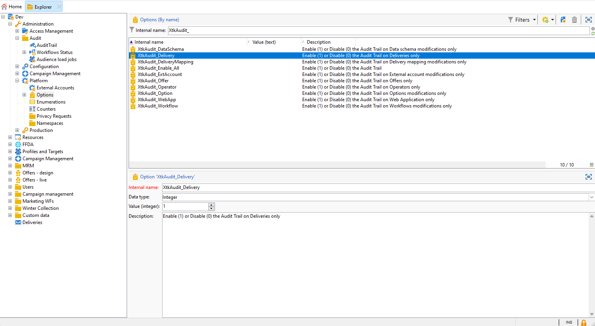

# Granskningskedja{#audit-trail}

Funktionen **[!UICONTROL Audit trail]** i Adobe Campaign ger en detaljerad redovisning av alla ändringar som gjorts på viktiga entiteter i instansen, vanligtvis sådana som påverkar en mjuk funktion i instansen avsevärt. Den fungerar som en realtidslogg och innehåller en detaljerad lista över åtgärder och händelser allt eftersom de inträffar.

>[!NOTE]
>
>Adobe Campaign granskar inte ändringar som gjorts i användarrättigheter, mallar, personalisering eller kampanjer.\
>Granskningsspårning kan bara hanteras av administratörer för instansen.

+++ Läs mer om tillgängliga enheter för granskningsspår

* **Schemagranskningsspår**: Du kan utforska de ändringar som gjorts i dina scheman samt identifiera vem som gjort ändringarna och när de gjordes.

  Mer information om scheman finns på [sidan](../dev/schemas.md).

* **Arbetsflödets granskningsspår** spårar alla åtgärder som är relaterade till dina arbetsflöden, inklusive:

   * Starta
   * Pausa
   * Stoppa
   * Starta om
   * Rensning som motsvarar åtgärden Rensa historik
   * Simulera vilket motsvarar åtgärden Starta i simuleringsläge
   * Aktivering som är lika med åtgärden Kör väntande uppgifter nu
   * Ovillkorligt stopp

  Mer information om arbetsflöden finns på [sidan](../../automation/workflow/about-workflows.md).

  Mer information om hur du övervakar arbetsflöden finns i det [dedikerade avsnittet](../../automation/workflow/monitor-workflow-execution.md).

* Med **Alternativ granskningsspår** kan du kontrollera aktiviteter och senaste ändringar som du har gjort i alternativen.

  Mer information om alternativ finns på [sidan](https://experienceleague.adobe.com/en/docs/campaign-classic/using/installing-campaign-classic/appendices/configuring-campaign-options).

* **Leveransverifieringskedja** gör att du kan kontrollera aktiviteter och senaste ändringar som du har gjort i leveranserna.

  Mer information om leveranser finns på [sidan](../start/create-message.md).

* Med **externt konto** kan du kontrollera ändringar som gjorts i externa konton, som används av tekniska processer som tekniska arbetsflöden eller kampanjarbetsflöden.

  Mer information om externt konto finns på [sidan](../config/external-accounts.md).

* Med **Leveransmappning** kan du övervaka aktiviteter och nyligen gjorda ändringar i dina leveransmappningar.

  Mer information om leveransmappning finns på [sidan](../audiences/target-mappings.md).

* Med **Webbprogram** kan du kontrollera ändringar som gjorts i webbformulär i Campaign V8 som används för att skapa sidor med indata- och urvalsfält, och som kan innehålla data från databasen.

  Mer information om webbprogram finns på [sidan](../dev/webapps.md).

* Med **Erbjudandet** kan du kontrollera aktiviteter och senaste ändringar av dina erbjudanden.

  Mer information om erbjudandet finns på [sidan](../interaction/interaction.md).

* Med **Operator** kan du övervaka aktiviteter och nyligen gjorda ändringar i operatorerna.

  Mer information om operatorer finns på [sidan](../interaction/interaction-operators.md).

+++

## Åtkomst till granskningsspår {#accessing-audit-trail}

Så här kommer du åt instansens **[!UICONTROL Audit trail]**:

1. Gå till **[!UICONTROL Explorer]**-menyn för din instans.

1. Välj **[!UICONTROL Audit]** och sedan **[!UICONTROL Audit Trail]** på menyn **[!UICONTROL Administration]**.

   

1. Fönstret **[!UICONTROL Audit trail]** öppnas med listan över dina enheter. Adobe Campaign granskar åtgärderna för att skapa, redigera och ta bort för olika enheter.

   Välj en av enheterna om du vill veta mer om de senaste ändringarna.

1. Fönstret **[!UICONTROL Audit entity]** ger dig mer detaljerad information om den valda entiteten, till exempel:

   * **[!UICONTROL Type]**: Arbetsflöde, alternativ, leveranser eller scheman.
   * **[!UICONTROL Entity]**: Inbyggt namn på dina aktiviteter.
   * **[!UICONTROL Modified by]**: Användarnamn för den senaste personen som ändrade entiteten.
   * **[!UICONTROL Action]**: Senaste åtgärden som utfördes på den här entiteten, antingen Skapad, Ändrad eller Borttagen.
   * **[!UICONTROL Modification date]**: Datum för den senaste åtgärden som utfördes på entiteten.

   

>[!NOTE]
>
>Som standard är kvarhållningsperioden inställd på 180 dagar för **[!UICONTROL Audit logs]**. Det här värdet kan ändras i distributionsguiden.

## Aktivera/inaktivera granskningsspår {#enable-disable-audit-trail}

Granskningsspårning kan enkelt aktiveras eller inaktiveras för en viss aktivitet om du t.ex. vill spara utrymme i databasen.

För att göra detta:

1. Gå till **[!UICONTROL Explorer]**-menyn för din instans.

1. Välj **[!UICONTROL Platform]** och sedan **[!UICONTROL Options]** på menyn **[!UICONTROL Administration]**.

1. Välj något av följande alternativ beroende på vilken enhet du vill aktivera/inaktivera:

   * För arbetsflöde: **[!UICONTROL XtkAudit_Workflows]**
   * För scheman: **[!UICONTROL XtkAudit_DataSchema]**
   * För alternativ: **[!UICONTROL XtkAudit_Option]**
   * För leveranser: **[!UICONTROL XtkAudit_Delivery]**
   * För externt konto: **[!UICONTROL XtkAudit_ExtAccount]**
   * För leveransmappning: **[!UICONTROL XtkAudit_DeliveryMapping]**
   * För webbprogram: **[!UICONTROL XtkAudit_WebApp]**
   * Erbjudande: **[!UICONTROL XtkAudit_Offer]**
   * För operator: **[!UICONTROL XtkAudit_Operator]**
   * För varje entitet: **[!UICONTROL XtkAudit_Enable_All]**

   

1. Ändra **[!UICONTROL Value]** till 1 om du vill aktivera entiteten eller till 0 om du vill inaktivera den.

   

1. Klicka på **[!UICONTROL Save]**.
