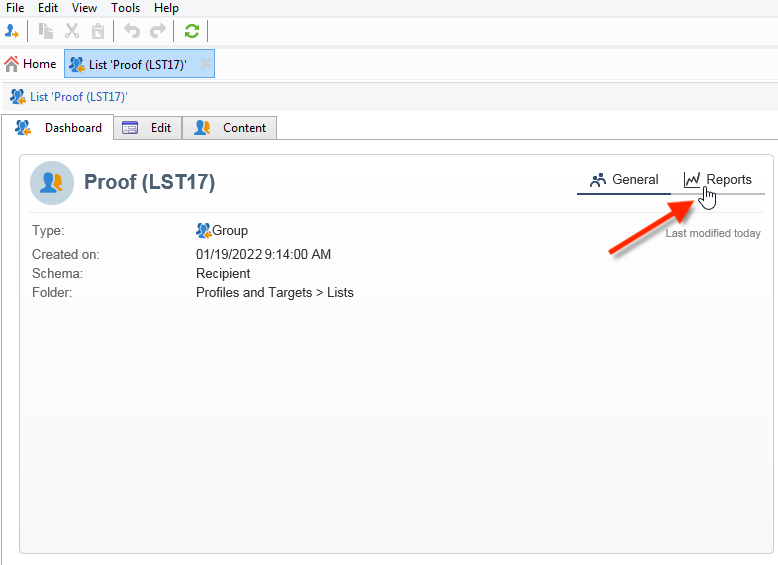

# Inbyggda rapporter från Adobe Campaign {#ootb-reports}

På den här sidan finns en lista över Adobe Campaign inbyggda rapporter, deras innehåll och sammanhang. Adobe Campaign tillhandahåller ett antal inbyggda rapporter som är tillgängliga via klientkonsolen eller en webbläsare.

Följande typer av rapporter är tillgängliga:

* Rapporter om hela plattformen. [Läs mer](global-reports.md).
* Leveransrapporter. [Läs mer](delivery-reports.md).

Du kommer åt inbyggda rapporter från Campaigns hemsida, den dedikerade rapportkontrollpanelen eller leveranslistan. Hur rapporten visas i användargränssnittet beror på sammanhanget.

En lista med viktiga rapporter finns på startsidan, så att du snabbt kan komma åt leveransdata. Listan kan ändras efter dina behov. Du kan även lära dig hur du lägger till egna rapporter på fliken **[!UICONTROL Reports]**.

Mer information om dessa anpassade konfigurationer finns i [Campaign Classic v7-dokumentationen](https://experienceleague.adobe.com/docs/campaign-classic/using/reporting/creating-new-reports/configuring-access-to-the-report.html){target="_blank"}.

## Åtkomst till inbyggda rapporter {#access-ootb-reports}

Få tillgång till inbyggda rapporter för Campaign:

1. Välj fliken **[!UICONTROL Reports]** i Adobe Campaign-gränssnittet.

   

1. Använd sökfälten för att filtrera de visade rapporterna.

1. Klicka sedan på den rapport som du vill visa.

   

1. Klicka på länken **[!UICONTROL Back]** högst upp på skärmen så visas rapportlistan igen.

   

Rapporter som är specifika för en kampanj eller leverans är tillgängliga via respektive instrumentpanel.

Principen är densamma för listor, tjänster, erbjudanden osv. enligt nedan:

## Rapporter om leveranser {#reports-on-deliveries}

De inbyggda rapporterna från Adobe Campaign finns i tabellen nedan.

Mer information om innehållet i dessa rapporter finns i [det här avsnittet](delivery-reports.md).

<table> 
 <tbody> 
  <tr> 
   <td> <strong>Etikett och internt namn</strong>  </td> 
   <td> <strong>Beskrivning</strong>  </td> 
   <td> <strong>Schema</strong>  </td> 
  </tr> 
  <tr> 
   <td> Användaraktiviteter (receiveActivity)  </td> 
   <td> Uppdelning av öppningar, klick och transaktioner efter tidsperiod.  </td> 
   <td> nms:delivery  </td> 
  </tr> 
  <tr> 
   <td> Leveransdataflöde (dataflöde)  </td> 
   <td> Leveransdataflödesdiagram, i meddelanden/timme och Mbit/s.  </td> 
   <td> nms:delivery  </td> 
  </tr> 
  <tr> 
   <td> Fel och studsar (fel)  </td> 
   <td> Begränsningar och icke-levererbara produkter utifrån orsak och domän.  </td> 
   <td> nms:delivery  </td> 
  </tr> 
  <tr> 
   <td> Spårningsindikatorer (deliveryFeedback)  </td> 
   <td> Sammanfattning av nyckelindikatorer för spårning av mottagarbeteende.  </td> 
   <td> nms:delivery  </td> 
  </tr> 
  <tr> 
   <td> Spårningsindikatorer (mobileAppDeliveryFeedback)  </td> 
   <td> Spåra indikatorer för en leverans till ett mobilprogram.  </td> 
   <td> nms:delivery  </td> 
  </tr> 
  <tr> 
   <td> Webbläsare (browserStatistics)  </td> 
   <td> Statistik för webbläsare som används av mottagare som klickat i meddelanden.  </td> 
   <td> xtk:none  </td> 
  </tr> 
  <tr> 
   <td> Delning till sociala nätverk (deliveryForward)  </td> 
   <td> Delningsaktivitet och statistik för att öppna e-post.  </td> 
   <td> nms:delivery  </td> 
  </tr> 
  <tr> 
   <td> Snabbklickningar (hoturls)  </td> 
   <td> Visar meddelandet och klickfrekvenserna som ligger ovanpå.  </td> 
   <td> nms:delivery  </td> 
  </tr> 
  <tr> 
   <td> Hypotesrapport (deliveryHypothesis)  </td> 
   <td> Visar en sammanfattning av mått för leveranshypoteser.  </td> 
   <td> nms:delivery  </td> 
  </tr> 
  <tr> 
   <td> Leveransstatistik (StatisticsPerDelivery)  </td> 
   <td> Statistik (bearbetade meddelanden, levererade meddelanden, hårda studsar, mjuka studsar, klick, avbeställningar) per e-postdomän.  </td> 
   <td> nms:delivery  </td> 
  </tr> 
  <tr> 
   <td> Dela aktivitetsstatistik (forwardActivities)  </td> 
   <td> Analys av delningsaktiviteter, öppningar och prenumerationer per tidsperiod.  </td> 
   <td> nms:delivery  </td> 
  </tr> 
  <tr> 
   <td> Spårningsstatistik (trackingStatistics)  </td> 
   <td> Öppna, klicka och rapportera transaktionsräntor.  </td> 
   <td> nms:delivery  </td> 
  </tr> 
  <tr> 
   <td> Leveranssammanfattning (deliverySending)  </td> 
   <td> Sammanfattning av leveransindikatorer: mål, undantag och skickade meddelanden.  </td> 
   <td> nms:delivery  </td> 
  </tr> 
  <tr> 
   <td> Leveranssammanfattning (deliveryStatistics)  </td> 
   <td> Sammanfattningstabell för valda leveranser: Mål, undantag och skickade meddelanden.  </td> 
   <td> nms:delivery  </td> 
  </tr> 
  <tr> 
   <td> Operativsystem (osStatistics)  </td> 
   <td> Statistik för operativsystem som används av mottagare som klickade i ett meddelande.  </td> 
   <td> xtk:none  </td> 
  </tr> 
  <tr> 
   <td> Reaktivitetsfrekvens (deliveryFeedbackSocial)  </td> 
   <td> Leveransreaktivitet och reaktionsnedbrytning.  </td> 
   <td> nms:delivery  </td> 
  </tr> 
  <tr> 
   <td> URL:er och klickdataflöde (topUrlDelivery)  </td> 
   <td> De flesta reaktiva URL:erna och associerade klickströmmar.  </td> 
   <td> nms:delivery  </td> 
  </tr> 
 </tbody> 
</table>

## Rapporter om kampanjer {#reports-on-campaigns}

Rapporter om kampanjer rör data i tabellen **nms:operation**.

<table> 
 <tbody> 
  <tr> 
   <td> <strong>Etikett och internt namn</strong>  </td> 
   <td> <strong>Beskrivning</strong>  </td> 
  </tr> 
  <tr> 
   <td> Användaraktiviteter (operationRecipientActivity)  </td> 
   <td> Uppdelningen av öppningar, klick och transaktioner efter tidsperiod beror på Campaign.  </td> 
  </tr> 
  <tr> 
   <td> Leveransdataflöde (operationThoutput)  </td> 
   <td> Leveransdataflödesdiagram, i e-post/timme och Mbit/s, är beroende av Campaign.  </td> 
  </tr> 
  <tr> 
   <td> Kampanjutgifter (budgetOperationExpenses)  </td> 
   <td> Visar kampanjradobjekten i detalj, beroende på kampanj.  </td> 
  </tr> 
  <tr> 
   <td> Fel och studsar (operationErrors)  </td> 
   <td> Begränsningar och icke-levererbara produkter beroende på orsak och domän, är beroende av Campaign.  </td> 
  </tr> 
  <tr> 
   <td> Utforska kostnadsrader (budgetExplorerOperation)  </td> 
   <td> Beskrivande analys av kostnadsrader, beror på MRM.  </td> 
  </tr> 
  <tr> 
   <td> Spårningsindikatorer (operationFeedback)  </td> 
   <td> Översikt över nyckelspårningsindikatorer: Öppningar, klick och transaktioner, beror på Campaign.  </td> 
  </tr> 
  <tr> 
   <td> Delning till sociala nätverk (operationForward)  </td> 
   <td> Delningsaktivitet och statistik för att öppna e-post är beroende av Campaign.  </td> 
  </tr> 
  <tr> 
   <td> Hypotesrapport (operationHypothesis)  </td> 
   <td> Visar sammanfattningen av hypotesmått för kampanjleveranser, beroende på kampanj.  </td> 
  </tr> 
  <tr> 
   <td> Delningsaktivitetsstatistik (forwardActivityOpt)  </td> 
   <td> Analys av delningsaktiviteter, öppningar och prenumerationer per tidsperiod, beror på Campaign.  </td> 
  </tr> 
  <tr> 
   <td> Leveranssammanfattning (operationStatistics)  </td> 
   <td> Översiktsdiagram över kampanjleveranser: Mål, undantag och skickade meddelanden.  </td> 
  </tr> 
  <tr> 
   <td> URL:er och klickdataflöde (operationTopUrlDelivery)  </td> 
   <td> De flesta reaktiva URL:er och associerade klickströmmar är beroende av Campaign.  </td> 
  </tr> 
 </tbody> 
</table>

## Rapporter om tjänster {#reports-on-services}

Rapporter om tjänster rör data i tabellen **nms:service**.

<table> 
 <tbody> 
  <tr> 
   <td> <strong>Etikett och internt namn</strong>  </td> 
   <td> <strong>Beskrivning</strong>  </td> 
  </tr> 
  <tr> 
   <td> Fläktförvärv (socialAcquisitionsByWebapp)  </td> 
   <td> Vilka webbprogram aktiverade köp av potentiella kunder? Beroende på tillägg för social marknadsföring.  </td> 
  </tr> 
  <tr> 
   <td> Uppdelning av prenumerationer (mobileAppDistribution)  </td> 
   <td> Uppdelning av aktiva prenumerationer per mobilprogram, beroende på kanaltillägg för mobilappen.  </td> 
  </tr> 
  <tr> 
   <td> Prenumerationsspårning (subscriptionsProgress)  </td> 
   <td> Prenumerationernas utveckling för informationstjänster   </td> 
  </tr> 
  <tr> 
   <td> Reaktivitetsfrekvens (socialReactionRate)  </td> 
   <td> Vilka är reaktivitetsfrekvenserna för de senaste leveranserna? Beroende på tillägg för social marknadsföring.  </td> 
  </tr> 
  <tr> 
   <td> Reaktivitetsfrekvens (mobileAppReactivityRate)  </td> 
   <td> Reaktivitetsfrekvensen för de senaste leveranserna är beroende av kanaltillägg för mobilappen.  </td> 
  </tr> 
 </tbody> 
</table>

## Budgetrapporter {#budget-reports}

De inbyggda rapporterna från Adobe Campaign finns i tabellen nedan.

<table> 
 <tbody> 
  <tr> 
   <td> <strong>Etikett och internt namn</strong>  </td> 
   <td> <strong>Beskrivning</strong>  </td> 
   <td> <strong>Schema</strong>  </td> 
  </tr> 
  <tr> 
   <td> Kostnader kopplade till program (budgetProgramCost)  </td> 
   <td> Uppdelning av programkostnader.  </td> 
   <td> nms:program  </td> 
  </tr> 
  <tr> 
   <td> Budgetutveckling (budgetEvolution)  </td> 
   <td> Utveckling av budgetkostnader per åtagandenivå.  </td> 
   <td> nms:budget  </td> 
  </tr> 
  <tr> 
   <td> Kumulativ utveckling av budgeten (budgetCumulativeEvolution)  </td> 
   <td> Utveckling av de kumulerade budgetkostnaderna uppdelat efter implementeringsnivå för  . </td> 
   <td> nms:budget  </td> 
  </tr> 
  <tr> 
   <td> Utforska kostnadsrader (budgetExplorerBudget)  </td> 
   <td> Beskrivande analys av kostnadsrader.  </td> 
   <td> nms:budget  </td> 
  </tr> 
  <tr> 
   <td> Utforska kostnadsrader (budgetExplorer)  </td> 
   <td> Beskrivande analys av kostnadsrader.  </td> 
   <td> nms:costLine  </td> 
  </tr> 
  <tr> 
   <td> Utforska kostnadsrader (budgetExplorerPlan)  </td> 
   <td> Beskrivande analys av kostnadsrader.  </td> 
   <td> nms:plan  </td> 
  </tr> 
  <tr> 
   <td> Utforska kostnadsrader (budgetExplorerProgram)  </td> 
   <td> Beskrivande analys av kostnadsrader.  </td> 
   <td> nms:program  </td> 
  </tr> 
  <tr> 
   <td> Sammanfattning av budget(er) (budget)  </td> 
   <td> Ögonblicksbild av huvudkostnader, utgiftskategorier och budgetar.  </td> 
   <td> nms:budget  </td> 
  </tr> 
 </tbody> 
</table>

## Rapporter om simuleringar {#reports-on-simulations}

Rapporter om simuleringar rör data i tabellen **nms:simulation**.

<table> 
 <tbody> 
  <tr> 
   <td> <strong>Etikett och internt namn</strong>  </td> 
   <td> <strong>Beskrivning</strong>  </td> 
  </tr> 
  <tr> 
   <td> Information om simuleringsundantag (dlvSimuLossesDetail)  </td> 
   <td> Detaljerad tabell över alla orsaker till uteslutning.  </td> 
  </tr> 
  <tr> 
   <td> Uppdelning av erbjudanden efter rangordning (offerSimulationRanking)  </td> 
   <td> Uppdelning av erbjudanden i simuleringen, efter rangordning.  </td> 
  </tr> 
  <tr> 
   <td> Simuleringssammanfattning (dlvSimuLossesSummary)  </td> 
   <td> Sammanfattning av simuleringsvolymer och undantag.  </td> 
  </tr> 
  <tr> 
   <td> Överlappningsstatistik (dlvSimuOverlapping)  </td> 
   <td> Leveransmål för överlappande volymer.  </td> 
  </tr> 
  <tr> 
   <td> Sammanfattning av undantag på grund av simuleringen (dlvSimuLossesSimu)  </td> 
   <td> Tabell över undantag på grund av simuleringen.  </td> 
  </tr> 
 </tbody> 
</table>

## Rapporter om webbprogram {#reports-on-web-applications}

Rapporter om webbprogram rör data i tabellen **nms:WebApp**.

<table> 
 <tbody> 
  <tr> 
   <td> <strong>Etikett och internt namn</strong>  </td> 
   <td> <strong>Beskrivning</strong>  </td> 
  </tr> 
  <tr> 
   <td> Dokumentation (surveyDictionary)  </td> 
   <td> Beskrivning av undersökningsstrukturen, beror på tillägget Undersökningshanteraren.  </td> 
  </tr> 
  <tr> 
   <td> Main (surveyProperties)  </td> 
   <td> Undersökningsegenskaper   </td> 
  </tr> 
  <tr> 
   <td> Uppdelning av svar (surveyDistribution)  </td> 
   <td> Uppdelning av svar på frågor.  </td> 
  </tr> 
 </tbody> 
</table>

## Andra rapporter {#other-ootb-reports}

Följande rapporter finns också inbyggda. Mer information finns i dokumentet om de funktioner som berörs.

<table> 
 <tbody> 
  <tr> 
   <td> <strong>Etikett och internt namn</strong>  </td> 
   <td> <strong>Beskrivning</strong>  </td> 
   <td> <strong>Schema</strong>  </td> 
  </tr> 
  <tr> 
   <td> Erbjudandeanalys (offerAnalysis)  </td> 
   <td> Erbjudandeanalys per datum och kanal, beroende på interaktionstillägget.  </td> 
   <td> nms:offer  </td> 
  </tr> 
  <tr> 
   <td> Effektiv ommarknadsföring (remarketingEffect)  </td> 
   <td> Mätning av återmarknadsföringseffektivitet  </td> 
   <td> nms:webEvent  </td> 
  </tr> 
  <tr> 
   <td> Historik över förvärv av sociala potentiella kunder (socialVisitorStatistics)  </td> 
   <td> Historiken för köp av X (tidigare kallat Twitter) och Facebook potentiella kunder beror på tillägget för social marknadsföring.  </td> 
   <td> nms:visitor  </td> 
  </tr> 
  <tr> 
   <td> Spårning av senaste förslag (recentPropositions)  </td> 
   <td> Spåra offert i realtid   </td> 
   <td> nms:propositionRcp  </td> 
  </tr> 
 </tbody> 
</table>
