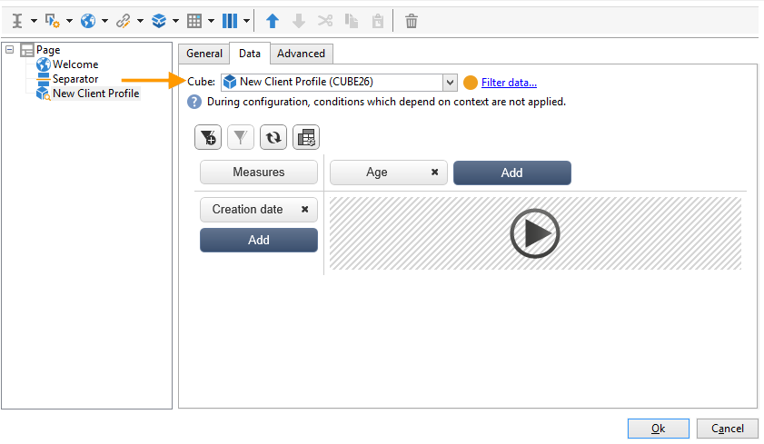

# Använd kuber för att utforska data{#use-cubes-to-create-reports}

Använd kuber för att skapa rapporter och för att identifiera och välja data från databasen. Du kan:

* Skapa rapporter baserade på kuber. [Läs mer](#explore-the-data-in-a-report).
* Samla in data i databasen och gruppera dem i listor, t.ex. för att identifiera och bygga mål och leveranser. [Läs mer](#build-a-target-population).
* Infoga en pivottabell i en rapport och referera till en befintlig kub i den. [Läs mer](#insert-a-pivot-table-into-a-report).

## Utforska data i en rapport {#explore-the-data-in-a-report}

### Steg 1 - Skapa en rapport baserad på en kub {#step-1---create-a-report-based-on-a-cube}

När [kuben är konfigurerad](cube-indicators.md)kan den användas som mall för att skapa en ny rapport.

Så här skapar du en rapport baserad på en befintlig kub:

1. Klicka på **[!UICONTROL Create]** knappen **[!UICONTROL Reports]** och väljer den kub du just har skapat.

   

1. Klicka på **[!UICONTROL Create]** för att bekräfta: kommer du till sidan för rapportkonfiguration och visning.

   Som standard visas de två första tillgängliga dimensionerna i rader och kolumner, men inget värde visas i tabellen. Klicka på huvudikonen om du vill generera tabellen:

   

1. Du kan ändra dimensionens axlar, ta bort dem, lägga till nya mått osv. Använd lämpliga ikoner för att göra detta.

   

   Dessa åtgärder beskrivs nedan.

### Steg 2 - Markera rader och kolumner {#step-2---select-lines-and-columns}

Standardvisningen visar de två första måtten för kuben (ålder och stad, i det här fallet).

The **[!UICONTROL Add]** Med knapparna på varje axel kan du lägga till dimensioner.

1. Markera de dimensioner som ska visas i tabellens rader och kolumner. Det gör du genom att dra och släppa de tillgängliga dimensionerna.
1. Välj de dimensioner som du vill lägga till i tabellen i listan:
   

1. Välj sedan parametrarna för dimensionen.

   

   Dessa parametrar beror på datatypen för den valda dimensionen.

   För datum kan till exempel flera nivåer vara tillgängliga. Mer information finns i [Visningsmått](cube-best-practices.md#display-measures).

   I så fall är följande alternativ tillgängliga:

   

   Du kan antingen:

   * Expandera data vid inläsning: värdena visas som standard varje gång rapporten uppdateras (standardvärde: nej).
   * Visa summan i slutet av raden: När data visas i kolumner kan du med ett extra alternativ visa summan i slutet av raden: en kolumn läggs till i tabellen (standardvärde: ja).
   * Använd en sortering: värdena i kolumnen kan sorteras efter värde, etikett eller baserat på ett mått (standardvärde: efter värde).
   * Visa värdena i stigande (a-z, 0-9) eller fallande (z-a, 9-0) ordning.
   * Ändra antalet kolumner som ska visas vid inläsning (som standard: 200).

1. Klicka **[!UICONTROL Ok]** för att bekräfta: dimensionen läggs till i de befintliga dimensionerna.

   Den gula banderollen ovanför tabellen visar att du har gjort ändringar: klicka på **[!UICONTROL Save]** för att spara dem.

   

### Steg 3 - Konfigurera de mått som ska visas {#step-3---configure-the-measures-to-display}

När raderna och kolumnerna har definierats väljer du vilka mått du vill visa. Som standard visas bara ett mått.

Följ stegen nedan för att lägga till och konfigurera mått:

1. Klicka på knappen **[!UICONTROL Measures]**.

   

1. Med **[!UICONTROL Use a measure]** väljer du ett av de befintliga måtten.

   

   Välj den information som ska visas och formateringsalternativen. Listan med alternativ beror på typen av mått.

   

   Den övergripande mätkonfigurationen är också tillgänglig via **[!UICONTROL Edit the configuration of the pivot table]** -ikonen i sidhuvudet.

   

   Du kan sedan välja om måttetiketter ska visas eller inte. [Läs mer](cube-best-practices.md#configure-the-display).

1. Du kan bygga nya mått baserat på befintliga. Det gör du genom att klicka **[!UICONTROL Create a measure]** och konfigurera det.

   

   Följande typer av åtgärder är tillgängliga:

   * En kombination av åtgärder: den här typen av åtgärd gör det möjligt att bygga den nya åtgärden med hjälp av befintliga åtgärder:

      De tillgängliga operatorerna är: summa, differens, multiplikation och ränta.

   * Andel: Med den här typen av mått kan du beräkna antalet poster som mäts för en given dimension. Du kan beräkna proportionaliteten baserat på en dimension eller en underdimension.
   * Variation: Med det här måttet kan du beräkna variationen i värden för en nivå.
   * Standardavvikelse: Med den här typen av mått kan du beräkna avvikelser inom varje cellgrupp jämfört med medelvärdet för värdena. Du kan till exempel jämföra inköpsvolymen för alla befintliga segment.

   När åtgärden har skapats läggs den till i rapporten.

   

   När du har skapat ett mått kan du redigera det och ändra dess konfiguration. Om du vill göra det klickar du på **[!UICONTROL Measures]** och bläddra sedan till fliken för det mått som ska redigeras.

   Klicka sedan på **[!UICONTROL Edit the dynamic measure]** för att öppna inställningsmenyn.

## Skapa en målpopulation {#build-a-target-population}

Rapporter som byggs med kuber gör att du kan samla in data från tabellen och spara dem i en lista.

Följ stegen nedan för att gruppera en population i en lista:

1. Markera cellerna som innehåller de ifyllningar som ska samlas och klicka sedan på **[!UICONTROL Add to cart]** ikon.

   

   Så många gånger som krävs för att samla in olika profiler

1. Klicka på **[!UICONTROL Show cart]** om du vill visa innehållet innan du kör exporten.

   

1. Använd **[!UICONTROL Export]** om du vill gruppera artiklarna i vagnen i en lista.

   Ange namnet på listan och välj vilken typ av export som ska utföras.

   

   Klicka **[!UICONTROL Start]** för att köra exporten.

1. När exporten är klar bekräftar ett meddelande att den har körts och hur många poster som har bearbetats.

   

   Du kan antingen spara innehållet i kundvagnen eller tömma den.

   Den nya listan är tillgänglig via **[!UICONTROL Profiles and targets]** -fliken.

   

## Infoga en pivottabell i en rapport {#insert-a-pivot-table-into-a-report}

Följ stegen nedan för att skapa en tabell och utforska data i en kub:

1. Skapa en ny rapport med en enda sida och infoga en pivottabell i den.

   

1. I **[!UICONTROL Data]** på sidan väljer du en kub för att bearbeta dimensionerna som den innehåller och visar beräknade mått.

   

   Detta gör att du kan skapa rapporten som ska visas. Mer information finns i [Steg 2 - Markera rader och kolumner](#step-2---select-lines-and-columns).
