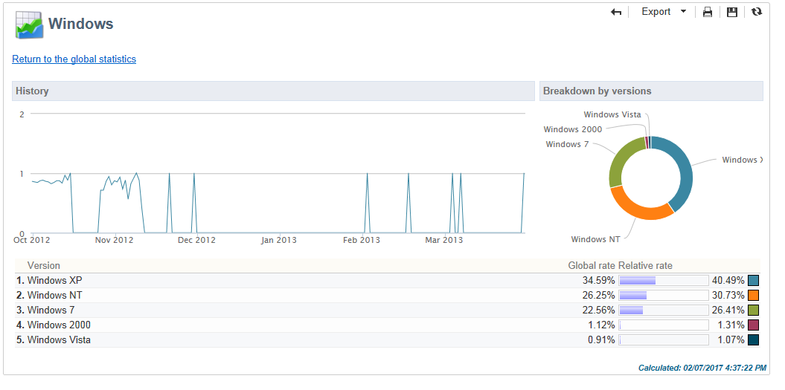

# Globala rapporter {#global-reports}

Dessa rapporter gäller aktiviteten hos data i hela databasen. Om du vill visa rapportkontrollpanelen går du till **[!UICONTROL Reports]** -fliken.

Om du vill visa rapporter klickar du på deras namn. Följande rapporter är tillgängliga som standard:

>[!NOTE]
>
>I det här avsnittet visas endast rapporter som är länkade till leveranser.

* **[!UICONTROL Delivery throughput]** : referera till [Leveransflöde](#delivery-throughput).
* **[!UICONTROL Browsers]** : referera till [Webbläsare](#browsers).
* **[!UICONTROL Sharing to social networks]** : referera till [Delning till sociala nätverk](#sharing-to-social-networks).
* **[!UICONTROL Statistics on sharing activities]** : referera till [Statistik om delningsaktiviteter](#statistics-on-sharing-activities).
* **[!UICONTROL Operating systems]** : referera till [Operativsystem](#operating-systems).
* **[!UICONTROL URLs and click streams]** : referera till [URL:er och klickbara strömmar](delivery-reports.md#urls-and-click-streams).
* **[!UICONTROL Tracking indicators]** : referera till [Spårningsindikatorer](delivery-reports.md#tracking-indicators).
* **[!UICONTROL Non-deliverables and bounces]** : referera till [Ej levererbara produkter och studsar](#non-deliverables-and-bounces).
* **[!UICONTROL User activities]** : referera till [Användaraktiviteter](#user-activities).
* **[!UICONTROL Subscription tracking]** : referera till [Prenumerationsspårning](#subscription-tracking).
* **[!UICONTROL Delivery summary]** : referera till [Sammanfattning av leverans](delivery-reports.md#delivery-summary).
* **[!UICONTROL Delivery statistics]** : referera till [Leveransstatistik](#delivery-statistics).
* **[!UICONTROL Breakdown of opens]** : referera till [Indelning av öppningar](#breakdown-of-opens).

## Leveranskapacitet {#delivery-throughput}

Den här rapporten innehåller information om leveransflödet för hela plattformen under en viss period. För att mäta den hastighet med vilken meddelandena levereras är kriterierna antalet meddelanden som skickas per timme och meddelandets storlek (i bitar per sekund). I exemplet nedan visar det första diagrammet de lyckade leveranserna i blått och antalet felaktiga leveranser i orange.

Du kan konfigurera de värden som visas genom att ändra tidsskalan: 1-timmars vy, 3-timmars vy, 24-timmars vy osv. Klicka **[!UICONTROL Refresh]** för att bekräfta valet.  

>[!NOTE]
>
>Du kan också övervaka antalet leveranser som skickas per timme med [Kontrollpanelen](https://experienceleague.adobe.com/docs/control-panel/using/sftp-management/sftp-storage-management.html).
>
>Kontrollpanelen är tillgänglig för alla administratörsanvändare. Stegen för att bevilja administratörsåtkomst till en användare finns på [den här sidan](https://experienceleague.adobe.com/docs/control-panel/using/discover-control-panel/managing-permissions.html?lang=sv#discover-control-panel).
>

## Användaraktiviteter {#user-activities}

Den här rapporten visar hur öppningar, klick och transaktioner per halvtimme, timme eller dag delas upp i ett diagram.

Följande alternativ är tillgängliga:

* **[!UICONTROL Opens]** : Totalt antal öppnade meddelanden. E-post i textformat tas inte med i beräkningen. [Läs mer](metrics-calculation.md#tracking-opens-).
* **[!UICONTROL Clicks]** : Totalt antal klick på länkar i leveranser. Klickningar på prenumerationslänkar och spegelsidor beaktas inte.
<!--
* **[!UICONTROL Transactions]** : Total number of transactions after a message is received. In order for a transaction to be taken into account, a transaction type webtracking tag must be inserted into the matching web page. Webtracking configuration is presented in [this section](../../configuration/using/about-web-tracking.md).
-->

## Ej levererbara och studsningar {#non-deliverables-and-bounces}

I den här rapporten visas uppdelningen av icke-levererbara produkter samt en uppdelning av studenterna per Internetdomän.

The **[!UICONTROL Number of messages processed]** representerar det totala antalet meddelanden som bearbetas av leveransservern. Värdet är lägre än antalet meddelanden som ska levereras när vissa leveranser har stoppats eller pausats (innan de bearbetas av servern).

**[!UICONTROL Breakdown of errors by type]**

>[!NOTE]
>
>Felen som visas i den här rapporten utlöser karantänprocessen. Mer information om karantänhantering finns i [Karantänhantering](../send/quarantines.md).

I det första avsnittet i den här rapporten visas uppdelningen av icke-levererbara produkter i form av en värdetabell och ett diagram.

För varje feltyp har vi:

* antalet felmeddelanden av den här typen,
* Andelen meddelanden med fel av den här typen jämfört med det totala antalet meddelanden med fel.
* procentandelen felmeddelanden av den här typen jämfört med det totala antalet bearbetade meddelanden.

Följande indikatorer används:

* **[!UICONTROL User unknown]** : Feltyp som genererades under leveransen för att ange att e-postadressen är ogiltig.
* **[!UICONTROL Invalid domain]** : Feltyp som genereras när en leverans skickas för att ange att domänen för e-postadressen är fel eller inte finns.
* **[!UICONTROL Inbox full]** : Feltyp som genererats efter fem leveransförsök för att ange att mottagarens inkorg innehåller för många meddelanden.
* **[!UICONTROL Account disabled]** : Feltyp som genereras när en leverans skickas för att ange att adressen inte längre finns.
* **[!UICONTROL Rejected]** : Feltyp som genereras när en adress nekas av IAP (Internet Access Provider), till exempel efter att en säkerhetsregel (antispam-program) har tillämpats.
* **[!UICONTROL Unreachable]** : Feltyp som inträffar i meddelandedistributionssträngen: incident i SMTP-reläet, domän som inte går att nå temporärt, osv.
* **[!UICONTROL Not connected]** : Feltyp som anger att mottagarens mobiltelefon är avstängd eller frånkopplad från nätverket vid tidpunkten för sändningen.

  >[!NOTE]
  >
  >Denna indikator avser leveranser på [mobilkanaler](../send/send.md) endast.

  Du kan öppna varje rad i värdetabellen genom att klicka på `[+]` symbol. För varje feltyp kan du visa hur felmeddelandena är uppdelade efter domän.

**[!UICONTROL Breakdown of errors per domain]**

I det andra avsnittet i den här rapporten visas uppdelningen av fel per Internetdomän i form av en värdetabell och ett diagram.

För varje domännamn har vi:

* antalet meddelanden med fel för den här domänen,
* Andelen meddelanden med fel för den här domänen jämfört med det totala antalet meddelanden som bearbetats för den här domänen.
* procentandelen felmeddelanden för den här domänen jämfört med det totala antalet felmeddelanden.

Du kan öppna varje rad i värdetabellen genom att klicka på [+] symbol. För varje domäntyp kan du visa hur felmeddelanden är uppdelade efter feltyp.

>[!NOTE]
>
>Domännamnen som visas i den här rapporten definieras på kubnivå. Om du vill ändra dessa värden redigerar du **[!UICONTROL Delivery logs (broadlogrcp)]** kub. Mer information om detta finns i [det här avsnittet](gs-cubes.md). The **[!UICONTROL Others]** omfattar domännamn som inte tillhör en viss klass.

## Webbläsare {#browsers}

Den här rapporten visar hur de webbläsare som används av de som tar emot leveransen under den aktuella perioden har delats upp.

>[!NOTE]
>
>Värdena som visas i den här rapporten är uppskattningar: endast mottagare som har klickat i en leverans kommer att beaktas.

**Global statistik**

Den globala statistiken om webbläsaranvändning presenteras i form av en värdetabell och ett diagram.

Följande indikatorer används:

* **[!UICONTROL Visitors]** : Totalt antal mottagare (per webbläsare) som har klickat på en leverans minst en gång.
* **[!UICONTROL Pages viewed]** : Totalt antal klick på länkar i en leverans (per webbläsare) för alla leveranser.
* **[!UICONTROL Usage rate]** : Denna frekvens motsvarar fördelningen av besökare (per webbläsare) i förhållande till det totala antalet besökare.

**Statistik per webbläsare**

I tabellen med globala statistikvärden kan du klicka på varje webbläsarnamn för att visa användningsstatistik.

Statistiken presenteras i form av en kurva, ett diagram och en värdetabell.

The **[!UICONTROL History]** -kurvan representerar närvarofrekvensen för den här webbläsaren per dag. Frekvensen är förhållandet mellan antalet besökare per dag (i den här webbläsaren) och antalet besökare som mäts på dagen med den högsta närvarofrekvensen.

The **[!UICONTROL Breakdown per version]** diagram visar uppdelningen av besökare per version jämfört med det totala antalet besökare (i den här webbläsaren).

I värdetabellen används följande indikatorer:

* **[!UICONTROL Global rate]** : Den här frekvensen representerar fördelningen av besökare per version jämfört med det totala antalet besökare (i alla webbläsare).
* **[!UICONTROL Relative rate]** : Den här frekvensen representerar fördelningen av besökare per version jämfört med det totala antalet besökare (i den här webbläsaren).

<!--
### Sharing to social networks {#sharing-to-social-networks}

Viral marketing lets delivery recipients share information with their contact network: they can add a link to their profile (Facebook, Twitter, etc.) or send a message to a friend. Each share and each access to shared information is tracked within the delivery. For more information on viral marketing, refer to [this section](../../delivery/using/viral-and-social-marketing.md).

This report shows the breakdown of shared and opened messages per social network (Facebook, Twitter, etc.) and/or per email.

**[!UICONTROL Email delivery statistics]**

In the email delivery statistics, two values are displayed:

* **[!UICONTROL Number of messages to be delivered]** : Total number of messages processed during delivery analysis.
* **[!UICONTROL Number of successful deliveries]** : Number of messages processed successfully.

**[!UICONTROL Sharing activities and mail open statistics]**

The central table shows the statistics on email shares and opens.

In the **[!UICONTROL Shares]** column, we have the following indicators:

* **[!UICONTROL No. of sharing activities]** : Total number of messages shared on each social network. This value equals the total number of clicks on the icon of the matching **[!UICONTROL Links for sharing to social networks]** personalization block.
* **[!UICONTROL Breakdown]** : This rate represents the breakdown of shares per social network, in relation to the total number of shares.
* **[!UICONTROL Sharing rate]** : This rate represents the breakdown of shares per social network, in relation to the number of messages to be delivered.

In the **[!UICONTROL Opens]** column, we have the following indicators:

* **[!UICONTROL No. of opens]** : Total number of messages opened by people whom the message was forwarded to (via the **[!UICONTROL Links for sharing to social networks]** personalization block). This value equals the number of times the mirror page was displayed. Opens by delivery recipients are not taken into account.
* **[!UICONTROL Breakdown]** : This rate represents the breakdown of opens per social network, in relation to the total number of opens.
* **[!UICONTROL Rate of opens]** : This rate represents the breakdown of opens per social network, in relation to the total number of shares.

**[!UICONTROL Breakdown of sharing activities and opens]**

This section includes two charts which represent the breakdown of sharing activities and opens per social network.

## Statistics on sharing activities {#statistics-on-sharing-activities}

This report shows the evolution of shares to social media in time.

For more information on viral marketing, refer to [this section](../../delivery/using/viral-and-social-marketing.md).

Statistics are presented in the form of a table of values and a chart.

The following indicators are used:

* **[!UICONTROL New contacts]** : Number of new subscriptions following the reception of a message shared via email. This value matches the number of people who received a message shared via email, clicked the **[!UICONTROL Subscription link]** and filled in the subscription form. 
* **[!UICONTROL Opens]** : Total number of messages opened by people whom the message was transferred to (via the **[!UICONTROL Link for sharing to social networks]** personalization block). This value equals the number of times the mirror page was displayed. Opens by delivery recipients are not taken into account.
* **[!UICONTROL Sharing activities]** : Total number of messages shared via social networks. This value matches the total number of clicks on the icon of the **[!UICONTROL Links for sharing to social networks]** personalization block.
-->

## Operativsystem {#operating-systems}

I den här rapporten visas uppdelningen av operativsystem som används av leveransmottagarna under den aktuella perioden.

>[!NOTE]
>
>Värdena som visas i den här rapporten är uppskattningar: endast mottagare som har klickat i en leverans kommer att beaktas.

**Global statistik**

Den globala användningsstatistiken för operativsystem presenteras i form av en värdetabell och ett diagram.

Följande indikatorer används:

* **[!UICONTROL Visitors]** : Dagligt genomsnitt av det totala antalet målmottagare (per operativsystem) som klickade på en leverans minst en gång.
* **[!UICONTROL Pages viewed]** : Dagligt genomsnitt av det totala antalet klick på leveranslänkar (per operativsystem) för alla leveranser.
* **[!UICONTROL Rate of use]** : Den här frekvensen representerar fördelningen av besökare (per operativsystem) i förhållande till det totala antalet besökare.

**Statistik per operativsystem**

I tabellen med globala statistikvärden klickar du på namnet på varje operativsystem för att visa statistiken per operativsystem.

Statistiken presenteras i form av en kurva, ett diagram och en värdetabell.

The **[!UICONTROL History]** -kurvan visar hur snabbt operativsystemet används per dag. Den här frekvensen är förhållandet mellan antalet besökare per dag (i det här operativsystemet) och antalet besökare som mäts på dagen med den högsta närvaron.

The **[!UICONTROL Breakdown by version]** diagram visar uppdelningen av besökare per version i förhållande till det totala antalet besökare i det här operativsystemet.

I värdetabellen används följande indikatorer:

* **[!UICONTROL Global rate]** : Den här frekvensen representerar fördelningen av besökare (per version) i förhållande till det totala antalet besökare i operativsystemen.
* **[!UICONTROL Relative rate]** : Den här frekvensen representerar fördelningen av besökare (per version) i förhållande till det totala antalet besökare för det här operativsystemet.

## Prenumerationsspårning {#subscription-tracking}

I den här rapporten kan du övervaka prenumerationer på informationstjänster. Prenumerationer och prenumerationer visas.

Den kan visas för en prenumeration genom att klicka på **[!UICONTROL Profiles and targets > Services and subscriptions]** noden på startsidan eller utforskaren. Välj önskad prenumeration och klicka sedan på **[!UICONTROL Reports]** -fliken. The **[!UICONTROL Subscriptions tracking]** rapporten är tillgänglig som standard. Här kan du se trender för prenumeration och avprenumeration samt lojalitetsnivån under en period. Du kan konfigurera representationen av dessa data via listrutan. Klicka **[!UICONTROL Refresh]** för att validera den valda konfigurationen.

Mer information finns i [den här sidan](../start/subscriptions.md).

The **[!UICONTROL Number subscribed to date]** representerar det totala antalet personer som för närvarande prenumererar.

**[!UICONTROL Overall evolution of subscriptions]**

I värdetabellen används följande indikatorer:

* **[!UICONTROL Subscribers]** : Totalt antal abonnenter under den berörda perioden.
* **[!UICONTROL Subscriptions]** : Antal prenumerationer för den aktuella perioden.
* **[!UICONTROL Unsubscriptions]** : Antal avbrutna prenumerationer under den aktuella perioden.
* **[!UICONTROL Evolution]** : Antal avbrutna prenumerationer minus antalet prenumerationer. Kursen beräknas utifrån det totala antalet prenumeranter.
* **[!UICONTROL Loyalty]** : Abonnenternas lojalitetsgrad under den berörda perioden.

**[!UICONTROL Subscription evolution curves]**

Diagrammet visar utvecklingen av prenumerationer och avbeställningar för den aktuella perioden.

## Leveransstatistik {#delivery-statistics}

Den här rapporten visar hur alla meddelanden som bearbetas och skickas har delats upp per Internetdomän, både när det gäller hårda och mjuka studsar, öppningar, klick och prenumerationer.

Följande indikatorer används:

* **[!UICONTROL Emails processed]** : Totalt antal meddelanden som har bearbetats av leveransservern.
* **[!UICONTROL Delivered]** : procentandel av antalet meddelanden som har bearbetats jämfört med det totala antalet meddelanden som har bearbetats.
* **[!UICONTROL Hard bounces]** : procentandel av antalet&quot;hårda&quot; studsar jämfört med det totala antalet bearbetade meddelanden.
* **[!UICONTROL Soft bounces]** : procentandel av antalet &quot;mjuka&quot; studsar jämfört med det totala antalet bearbetade meddelanden.

  >[!NOTE]
  >
  >Mer information om hårda och mjuka studsar finns i [den här sidan](../send/quarantines.md).

* **[!UICONTROL Opens]** : procentandel av antalet målmottagare som öppnade ett meddelande minst en gång jämfört med antalet meddelanden som bearbetades.
* **[!UICONTROL Clicks]** : procentandel av antalet personer som klickade i en leverans minst en gång jämfört med antalet meddelanden som bearbetades.
* **[!UICONTROL Unsubscription]** : procent av antalet klick på en länk för att avbryta prenumerationen jämfört med antalet meddelanden som har bearbetats.

## Indelning av öppningar {#breakdown-of-opens}

Denna rapport visar hur öppningarna fördelats efter operativsystem, enhet och webbläsare under den aktuella perioden. För varje kategori används två diagram. Den första visar statistik om öppningar på datorer och mobila enheter. Den andra visar statistik som endast gäller öppningar på mobila enheter.

Antalet öppningar motsvarar det totala antalet öppnade meddelanden. E-postmeddelanden i textformat räknas inte. Mer information om att spåra öppnas finns i [det här avsnittet](metrics-calculation.md#tracking-opens-).

>[!NOTE]
>
>Namnen på webbläsare och operativsystem utgör en del av den information som skickas av webbläsarens användaragent som meddelandet har öppnats till. Adobe Campaign minskar enhetstypen med hjälp av enhetens enhetsinformation.
