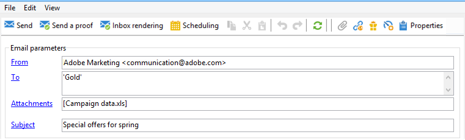

# Bifoga filer i ett e-postmeddelande{#attaching-files}

## Om e-postbilagor {#about-email-attachments}

Du kan bifoga en eller flera filer till en e-postleverans.

>[!NOTE]
>
>För att undvika prestandaproblem rekommenderar vi att du inte inkluderar mer än en bifogad fil per e-post. Det rekommenderade tröskelvärdet kan konfigureras från listan med kampanjalternativ. Mer information finns i [Campaign Classic-dokumentationen](https://experienceleague.adobe.com/docs/campaign-classic/using/installing-campaign-classic/appendices/configuring-campaign-options.html#delivery).

Det finns två möjliga fall:

* Välj en fil och bifoga den till leveransen som den är.
* Anpassa innehållet i den bifogade filen för varje mottagare. I det här fallet måste du skapa en **beräknad bifogad fil**: namnet på den bifogade filen beräknas vid leveranstillfället för varje meddelande beroende på mottagaren. Innehållet kan också anpassas och konverteras till PDF-format när det levereras, om du har alternativet **Variabel digital utskrift** .

>[!NOTE]
>
>Den här typen av konfiguration utförs vanligtvis i leveransmallarna. Mer information finns i [Campaign Classic-dokumentationen](https://experienceleague.adobe.com/docs/campaign-classic/using/sending-messages/using-delivery-templates/about-templates.html).

## Guardrails {#attachments-guardrails}

För att undvika prestandaproblem får bilderna i e-postmeddelanden inte överstiga 100 kB. Den här gränsen, som är inställd som standard, kan ändras från alternativet `NmsDelivery_MaxDownloadedImageSize`. Adobe rekommenderar dock att du undviker stora bilder i e-postutskick.

Adobe rekommenderar också att du begränsar storleken och antalet bifogade filer. Som standard kan du bara lägga till en fil som en bifogad fil i ett e-postmeddelande. Det här tröskelvärdet kan konfigureras från alternativet `NmsDelivery_MaxRecommendedAttachments`.

Läs mer i listan över Campaign-alternativ i [Campaign Classic-dokumentationen](https://experienceleague.adobe.com/docs/campaign-classic/using/installing-campaign-classic/appendices/configuring-campaign-options.html#delivery).

## Bifoga en lokal fil {#attaching-a-local-file}

Följ stegen nedan för att bifoga en lokal fil till en leverans.

>[!NOTE]
>
>Du kan bifoga flera filer till en leverans. Bifogade filer kan ha vilket format som helst, inklusive zippat format.

1. Klicka på länken **[!UICONTROL Attachments]**.
1. Klicka på knappen **[!UICONTROL Add]**.
1. Klicka på **[!UICONTROL File...]** för att välja filen som ska bifogas till leveransen.

   

Du kan också dra och släppa filen direkt i leveransfältet **[!UICONTROL Attachments]** eller använda ikonen **[!UICONTROL Attach]** från leveransassistentverktygsfältet,

När filen är markerad överförs den direkt till servern för att vara tillgänglig vid leveransen. Den visas i fältet **[!UICONTROL Attachments]**.

## Skapa en beräknad bilaga {#creating-a-calculated-attachment}

När du skapar en beräknad bilaga kan namnet på den bifogade filen beräknas under analys eller leverans av varje meddelande och kan bero på mottagaren. Den kan också personaliseras och konverteras till PDF.

Så här skapar du en personlig bifogad fil:

1. Klicka på länken **[!UICONTROL Attachments]**.
1. Klicka på knappen **[!UICONTROL Add]** och välj sedan **[!UICONTROL Calculated attachment]**.
1. Välj typ av beräkning i listrutan **[!UICONTROL Type]**:

Följande alternativ är tillgängliga:

* **Filnamnet anges när leveransmallen skapas**
* **Innehållet i filen anpassas och konverteras till PDF när varje meddelande levereras**
* **Filnamnet beräknas under leveransanalys (det kan inte bero på mottagarprofilen)**
* **Filnamnet beräknas vid leveranstillfället för varje mottagare (det kan bero på mottagaren)**

### Bifoga en lokal fil {#attach-a-local-file}

Om den bifogade filen är en lokal fil väljer du alternativet: **[!UICONTROL File name is specified when creating the delivery template]**. Filen markeras lokalt och överförs till servern. Följ stegen nedan:

1. Markera filen som ska överföras i fältet **[!UICONTROL Local file]**.
1. Ange etiketten om det behövs. Etiketten ersätter filnamnet när den visas i meddelandesystem. Om inget anges används filnamnet som standard.

   

1. Om det behövs väljer du **[!UICONTROL Upload file on the server]** och klickar sedan på **[!UICONTROL Update on server]** för att starta överföringen.

   

Filen är sedan tillgänglig på servern för att bifogas till de olika leveranser som skapas från den här mallen.

### Bifoga ett personligt meddelande {#attach-a-personalized-message}

Med alternativet **[!UICONTROL The file content is personalized and converted into PDF format at the time of delivery for each message]** kan du välja en fil med anpassningsfält, till exempel efternamnet och förnamnet för den avsedda mottagaren.

Använd följande konfigurationssteg för den här typen av bifogad fil:

1. Markera filen som ska överföras.
1. Ange etiketten om det behövs.
1. Välj **[!UICONTROL Upload file on the server]** och klicka sedan på **[!UICONTROL Update on server]** för att starta överföringen.
1. Du kan visa en förhandsgranskning. Välj en mottagare om du vill göra det.

   

1. Analysera leveransen och starta den sedan.

   Varje mottagare får en skräddarsydd PDF som bifogas leveransen.

   

### Bifoga en beräknad fil {#attach-a-calculated-file}

Du kan beräkna namnet på den bifogade filen under färdigställandet av leveransen. Välj alternativet **[!UICONTROL The file name is calculated during delivery analysis (it cannot depend on the recipient)]** om du vill göra det.

>[!NOTE]
>
>Det här alternativet används bara när leveransen skickas av en extern process eller ett arbetsflöde.

1. Ange den etikett som du vill använda för den bifogade filen.
1. Ange filens åtkomstsökväg och dess exakta namn i definitionsfönstret.

   >[!IMPORTANT]
   >
   >Filen måste finnas på servern.

   

1. Analysera och påbörja sedan leveransen.

   Filnamnsberäkningen visas i analysloggen.

   

### Bifoga en personlig fil {#attach-a-personalized-file}

När du väljer den bifogade filen kan du välja alternativet **[!UICONTROL The file name is calculated during delivery for each recipient (it can depend on the recipient)]**. Du kan sedan mappa mottagarnas personaliseringsdata med namnet på filen som ska skickas.

>[!NOTE]
>
>Det här alternativet används bara när leveransen skickas av en extern process eller ett arbetsflöde.

1. Ange den etikett som du vill använda för den bifogade filen.
1. Ange filens åtkomstsökväg och dess exakta namn i definitionsfönstret. Om filnamnet är anpassat kan du använda personaliseringsfälten för relevanta värden.

   

   >[!IMPORTANT]
   >
   >Filen måste finnas på servern.

1. Analysera och påbörja sedan leveransen.

   I exemplet nedan valdes den bifogade filen utifrån dess namn så som det definierats med hjälp av kopplingsfälten.

   

### Inställningar för bifogade filer {#attachment-settings}

För de första två alternativen kan du välja **[!UICONTROL Upload file on the server]** genom att välja lämpligt alternativ. Med länken **[!UICONTROL Update the file on the server]** kan du börja överföra.

Ett meddelande om att filen har överförts till servern:

Ett varningsmeddelande visas för en ändring av filen:

På fliken **[!UICONTROL Advanced]** kan du definiera avancerade alternativ för bifogade filer:

* Du kan definiera filteralternativ för att undvika att skicka den bifogade filen till alla mottagare. Alternativet **[!UICONTROL Enable filtering of recipients who will receive the attachment]** aktiverar ett indatafält som används för att definiera ett mottagarurvalsskript, som måste anges i JavaScript.
* Du kan skripta namnet på filen för att anpassa den.

  Ange texten i fönstret och använd de anpassningsfält som finns i listrutan. I följande exempel anpassas filnamnet så att det innehåller dagens datum och namnet på mottagaren.

  
