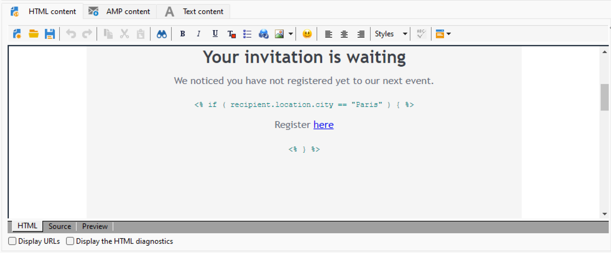

# Skapa villkorsstyrt innehåll{#conditional-content}

Genom att konfigurera fält med villkorsstyrt innehåll kan du skapa avancerad personalisering. Fullständiga textblock och/eller bilder ersätts när ett visst villkor uppfyllts.


## Använd villkor i ett e-postmeddelande {#conditions-in-an-email}

I exemplet nedan lär du dig hur du skapar ett meddelande som är dynamiskt anpassat efter mottagarens ort och intressen.

* Ändra meddelandet beroende på mottagarens ort,
* Anpassa innehållet i erbjudandet efter mottagarens intressen.

Om du vill skapa villkorligt innehåll enligt värdet för ett fält gör du så här:

1. Öppna en befintlig leverans eller skapa en ny e-postleverans.
1. Klicka på personaliseringsikonen i e-postredigeraren och välj **[!UICONTROL Conditional content > If]**.

   

   Anpassningselementen infogas i meddelandetexten. Du måste konfigurera dem nu.

1. Fyll i parametrarna för uttrycket **if**.

   * Markera det första elementet i uttrycket, **`<FIELD>`**, och klicka på personaliseringsikonen för att ersätta det med testfältet.
   * Ersätt **`<VALUE>`** med värdet för det fält som villkoret ska uppfyllas för. Värdet måste vara inom citattecken.
   * Ange det innehåll som ska infogas när villkoret är uppfyllt. Det kan vara en text, en bild, ett formulär, en hypertextlänk osv.

   

1. Klicka på fliken **[!UICONTROL Preview]** för att visa innehållet i meddelandet enligt leveransmottagaren. Välj en mottagare som villkoret är true för att kontrollera innehållet. Välj sedan en annan mottagare som det är falskt för och försök igen.

Du kan lägga till andra fall och definiera olika innehåll utifrån värdena i ett eller flera fält. Använd **[!UICONTROL Conditional content > Else]** och **[!UICONTROL Conditional content > Else if]** om du vill göra det. Uttrycken konfigureras på samma sätt som uttrycket **if**.

>[!CAUTION]
>
>Tecknen **%> &lt;%** måste tas bort efter att villkoren **Annars** och **Annars om** har lagts till.


## Användningsfall: skapa flerspråkig e-post {#creating-multilingual-email}

Läs om hur du skapar flerspråkiga e-postmeddelanden i exemplet nedan. Innehållet visas på det ena språket eller det andra beroende på vilket språk mottagaren föredrar.

1. Skapa ett e-postmeddelande och välj målpopulation. I det här exemplet baseras villkoret för att visa den ena versionen eller den andra på värdet **Språk** för mottagarens profil. Dessa värden är inställda på **EN**, **FR**, **ES**.
1. Klicka på fliken **[!UICONTROL Source]** i e-postinnehållet i HTML och klistra in följande kod:

   ```
   <% if (language == "EN" ) { %>
   <DIV id=en-version>Hello <%= recipient.firstName %>,</DIV>
   <DIV>Discover your new offers!</DIV>
   <DIV><a href="https://www.adobe.com/products/en">www.adobe.com/products/en</A></FONT></DIV><%
    } %>
   <% if (language == "FR" ) { %>
   <DIV id=fr-version>Bonjour <%= recipient.firstName %>,</DIV>
   <DIV>Découvrez nos nouvelles offres !</DIV>
   <DIV><a href="https://www.adobe.com/products/fr">www.adobe.com/products/fr</A></DIV><%
    } %>
    <% if (language == "ES" ) { %>
   <DIV id=es-version><FONT face=Arial>
   <DIV>Olà <%= recipient.firstName %>,</DIV>
   <DIV>Descubra nuestros nuevas ofertas !</DIV>
   <DIV><a href="https://www.adobe.com/products/es">www.adobe.com/products/es</A></DIV>
   <% } %>
   ```

1. Testa e-postinnehåll på fliken **[!UICONTROL Preview]** genom att välja mottagare med olika språk.

   >[!NOTE]
   >
   >Eftersom ingen alternativ version har definierats i e-postinnehållet måste du filtrera målpopulationen innan du skickar e-postmeddelandet.

## Självstudievideo {#conditionnal-content-video}

Lär dig hur du lägger till villkorsstyrt innehåll i en leverans med ett exempel som visar ett flerspråkigt nyhetsbrev.

>[!VIDEO](https://video.tv.adobe.com/v/3446715?quality=12&captions=swe)
