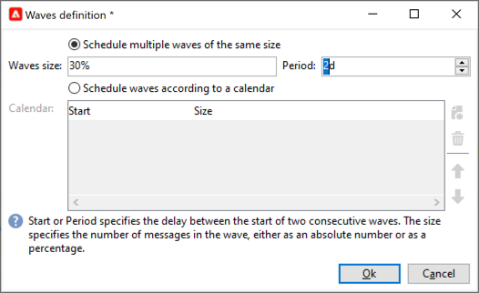

# Konfigurera och skicka leveransen {#configure-delivery}

Få åtkomst till leveransparametrarna för att konfigurera fler inställningar och definiera hur meddelanden ska skickas. Du kan definiera leverans [prioritet](#delivery-priority), konfigurera [påfyllnader](#sending-using-multiple-waves) och testa leveransen. När konfigurationen är klar kan du bekräfta sändningen enligt beskrivningen i [det här avsnittet](#confirm-delivery). Meddelanden skickas sedan omedelbart eller baserat på leveransschema [&#128279;](#schedule-delivery-sending).

## Ange ytterligare parametrar {#delivery-additional-parameters}

Innan du skickar leveransen kan du definiera sändningsparametrarna i leveransegenskaperna via fliken **[!UICONTROL Delivery]**.

### Leveransprioritet {#delivery-priority}

Använd alternativet **[!UICONTROL Delivery priority]** om du vill ändra sändningsordningen för dina leveranser genom att ange deras prioritetsnivå, från **[!UICONTROL Very low]** till **[!UICONTROL Very high]** (standardvärdet är **[!UICONTROL Normal]**).

### Batchkvantitet {#delivery-batch-quantity}

Använd alternativet **[!UICONTROL Message batch quantity]** för att definiera antalet meddelanden som grupperats i samma XML-leveranspaket. Om parametern är inställd på 0 grupperas meddelandena automatiskt. Paketstorleken definieras av beräkningen `<delivery size>/1024`, med minst 8 och högst 256 meddelanden per paket.

>[!IMPORTANT]
>
>När leveransen skapas genom duplicering av en befintlig, återställs den här parametern.

### Testa leveransen

Använd alternativet **[!UICONTROL Test SMTP delivery]** för att testa att skicka via SMTP. Leveransen behandlas upp till anslutning till SMTP-servern men skickas inte: För varje mottagare av leveransen ansluter Campaign till SMTP-providerservern, kör SMTP RCPT TO-kommandot och stänger anslutningen före SMTP DATA-kommandot.

>[!NOTE]
>
>* Det här alternativet får inte ställas in i mitten av källkoden.
>
>* Läs mer om SMTP-serverkonfigurationen i [Campaign Classic v7-dokumentationen](https://experienceleague.adobe.com/docs/campaign-classic/using/installing-campaign-classic/additional-configurations/configure-delivery-settings.html?lang=sv-SE#smtp-relay){target="_blank"}.

## Skicka med flera vågor {#sending-using-multiple-waves}

För att balansera lasten kan du dela upp leveranser i flera satser. Konfigurera antalet batchar och deras proportioner i förhållande till hela leveransen.

### Aktivera vågor {#enable-waves}

Så här definierar du vågor:

1. Öppna leveransegenskaperna och bläddra till fliken **[!UICONTROL Delivery]**.
1. Aktivera alternativet **[!UICONTROL Send using multiple waves]** och klicka på länken **[!UICONTROL Define waves...]**.

   

### Konfigurera påfyllnader {#config-waves}

>[!NOTE]
>
>Du kan bara definiera storleken och fördröjningen mellan två på varandra följande påfyllnader. Det går inte att konfigurera urvalskriterierna för mottagare för varje påfyllnad.

Du kan antingen definiera storleken på varje våg eller lägga till dem i en kalender.

* **Definiera storleken för varje våg**. Om du till exempel anger **[!UICONTROL 30%]** i motsvarande fält representerar varje påfyllnad 30 % av meddelandena som ingår i leveransen, förutom det sista, som representerar 10 % av meddelandena.

  I fältet **[!UICONTROL Period]** anger du fördröjningen mellan början av två på varandra följande påfyllnader. Om du till exempel anger **[!UICONTROL 2d]** startar den första vågen omedelbart, den andra om två dagar, den tredje vågen om fyra dagar och så vidare.

  

* **Definiera en kalender för sändning av varje påfyllnad**.  Den första vågen representerar till exempel 25 % av det totala antalet meddelanden som ingår i leveransen och börjar omedelbart. Nästa två vågor slutför leveransen och är inställda på att börja med 6 timmars intervall.

  I kolumnen **[!UICONTROL Start]** anger du fördröjningen mellan början av två på varandra följande påfyllnader. Ange ett fast tal eller en procentsats i kolumnen **[!UICONTROL Size]**.

  

### Kontroll av vågplanering {#check-waves}

En specifik typologiregel, **[!UICONTROL Wave scheduling check]**, säkerställer att den sista påfyllnaden planeras före leveransens giltighetsgräns. Kampanjtypologier och deras regler, som har konfigurerats på fliken **[!UICONTROL Typology]** i leveransegenskaperna, presenteras i [det här avsnittet](../../automation/campaign-opt/campaign-typologies.md#typology-rules)<!--ref TBC-->.

>[!IMPORTANT]
>
>* Kontrollera att de sista påfyllnaderna inte överskrider leveransdeadline, som definieras på fliken **[!UICONTROL Validity]**. Annars kanske vissa meddelanden inte skickas. Läs mer om giltighetsperioden för en leverans i [det här avsnittet](delivery-failures.md#valid-period).
>
>* Du måste också ange tillräckligt med tid för att försöka igen när du konfigurerar de sista vågorna. Läs mer om återförsök i [det här avsnittet](delivery-failures.md#retries).

### Bildskärmsvågor {#monitor-waves}

Bläddra till leveransloggarna för att övervaka dina sändningar. Se [den här sidan](send.md)

Du kan se leveranser som redan har skickats i de bearbetade påfyllnaderna (**[!UICONTROL Sent]** status) och leveranser som ska skickas i återstående påfyllnader (**[!UICONTROL Pending]** status).

### Vågprover {#samples-waves}

De två exemplen nedan är de vanligaste användningsområdena när du använder flera vågor.

* **Under avstämningsprocessen**

  När e-postmeddelanden skickas via en ny plattform, är Internetleverantörer (ISP) misstänkta för IP-adresser som inte känns igen. Om stora mängder e-postmeddelanden plötsligt skickas markerar internetleverantörerna dem ofta som skräppost.

  För att undvika att markeras som skräppost kan du stegvis öka volymen som skickas med vågor. Detta bör säkerställa en smidig utveckling av startfasen och göra det möjligt att minska den totala frekvensen av ogiltiga adresser.

  Använd alternativet **[!UICONTROL Schedule waves according to a calendar]** om du vill göra det. Du kan till exempel ställa in den första vågen på 10 %, den andra på 15 % och så vidare.

  

* **Kampanjer med ett callcenter**

  När ni hanterar en lojalitetskampanj per telefon har organisationen begränsad kapacitet att behandla antalet samtal till kontaktprenumeranter.

  Med hjälp av vågor kan du begränsa antalet meddelanden till 20 per dag, till exempel med tanke på den dagliga bearbetningskapaciteten hos ett callcenter.

  Välj alternativet **[!UICONTROL Schedule multiple waves of the same size]** om du vill göra det. Ange **[!UICONTROL 20]** som vågstorlek och **[!UICONTROL 1d]** i fältet **[!UICONTROL Period]**.

  

## Bekräfta leveransen {#confirm-delivery}

När leveransen är konfigurerad och klar att skickas kontrollerar du att du har kört leveransanalysen innan du bekräftar sändningen.

Följ stegen nedan för att göra detta.

1. Klicka på **[!UICONTROL Send]** och välj önskad åtgärd.

   * Om du vill skicka leveransen omedelbart väljer du **[!UICONTROL Deliver as soon as possible]**.
   * Välj **[!UICONTROL Postpone the delivery]** om du vill schemalägga sändningen till ett senare datum. [Läs mer](#schedule-delivery-sending)

1. Klicka på **[!UICONTROL Analyze]**. Mer information finns i [det här avsnittet](delivery-analysis.md).

   

1. När du är klar klickar du på **[!UICONTROL Confirm delivery]** för att starta meddelandeleveransen.

   

1. Du kan stänga leveransguiden och spåra leveransen på fliken **[!UICONTROL Delivery]**, som du kommer åt via leveransinformationen eller genom leveranslistan.

   Mer information finns i avsnitten nedan:

   * [Övervaka en leverans](send.md)
   * [Förstå leveransfel](delivery-failures.md)

<!--About message tracking-->

## Schemalägg leverans som skickas {#schedule-delivery-sending}

Du kan skjuta upp leveransen av meddelanden för att schemalägga den eller för att hantera säljtrycket och undvika att överbelasta en grupp.

1. Klicka på knappen **[!UICONTROL Send]** och välj alternativet **[!UICONTROL Postpone delivery]**.

1. Ange ett startdatum i fältet **[!UICONTROL Contact date]**.

   

1. Starta leveransanalysen och bekräfta leveransen. Leveranssändningen kommer dock inte att börja förrän det datum som anges i fältet **[!UICONTROL Contact date]**.

   >[!IMPORTANT]
   >
   >När du har startat analysen är det kontaktdatum som du har definierat fixerat. Om du ändrar det här datumet måste du starta om analysen så att dina ändringar beaktas.

   

I leveranslistan visas leveransen med statusen **[!UICONTROL Pending]**.

Schemaläggningen kan också konfigureras uppströms via leveransknappen **[!UICONTROL Scheduling]**.

Du kan skjuta upp leveransen till ett senare datum eller spara leveransen i den preliminära kalendern.

* Med alternativet **[!UICONTROL Schedule delivery (no automatic execution)]** kan du schemalägga en preliminär analys av leveransen.

  När den här konfigurationen sparas ändras leveransstatusen till **[!UICONTROL Targeting pending]**. Analysen startas på det angivna datumet.

* Med alternativet **[!UICONTROL Schedule delivery (automatic execution on planned date)]** kan du ange leveransdatum.

  Klicka på **[!UICONTROL Send]** och välj **[!UICONTROL Postpone delivery]**, starta analysen och bekräfta leveransen. När analysen är klar är leveransmålet klart och meddelanden skickas automatiskt det angivna datumet.

Datum och tider anges i tidszonen för den aktuella operatorn. Med den nedrullningsbara listan **[!UICONTROL Time zone]** som finns under kontaktdatumsinmatningsfältet kan du automatiskt konvertera det angivna datumet och den angivna tiden till den valda tidszonen.

Om du till exempel schemalägger att en leverans ska köras automatiskt vid klockan 8 London, konverteras tiden automatiskt till den valda tidszonen:

<!--
## Adjust delivery failure management {#delivery-failure-management}

### Configure retries {#configure-retries}

Temporarily undelivered messages due to a **Soft** or **Ignored** error are subject to an automatic retry. The delivery failure types and reasons are presented in this [section](../../delivery/using/understanding-delivery-failures.md#delivery-failure-types-and-reasons).

>[!IMPORTANT]
>
>For hosted or hybrid installations, if you have upgraded to the [Enhanced MTA](../../delivery/using/sending-with-enhanced-mta.md), the retry settings in the delivery are no longer used by Campaign. Soft bounce retries and the length of time between them are determined by the Enhanced MTA based on the type and severity of the bounce responses coming back from the message's email domain.

For on-premise installations and hosted/hybrid installations using the legacy Campaign MTA, the central section of the **[!UICONTROL Delivery]** tab for delivery parameters indicates how many retries should be performed the day after the delivery and the minimum delay between retries.

By default, five retries are scheduled for the first day of the delivery with a minimum interval of one hour spread out over the 24 hours of the day. One retry per day is programmed after that and until the delivery deadline, which is defined in the **[!UICONTROL Validity]** tab (see [Defining validity period](#defining-validity-period)).

### Define the validity period {#define-validity-period}

When the delivery has been launched, the messages (and any retries) can be sent until the delivery deadline. This is indicated in the delivery properties, via the **[!UICONTROL Validity]** tab.

* The **[!UICONTROL Delivery duration]** field lets you enter the limit for global delivery retries. This means that Adobe Campaign sends the messages beginning on the start date, and then, for messages returning an error only, regular, configurable retries are performed until the validity limit is reached.

  You can also choose to specify dates. To do this, select **[!UICONTROL Explicitly set validity dates]**. In this case, the delivery and validity limit dates also let you specify the time. The current time is used by default, but you can modify this directly in the input field.

  >[!IMPORTANT]
  >
  >For hosted or hybrid installations, if you have upgraded to the [Enhanced MTA](../../delivery/using/sending-with-enhanced-mta.md), the **[!UICONTROL Delivery duration]** setting in your Campaign email deliveries will be used only if set to **3.5 days or less**. If you define a value higher than 3.5 days, it will not be taken into account.

* **Validity limit of resources**: The **[!UICONTROL Validity limit]** field is used for uploaded resources, mainly for the mirror page and images. The resources on this page are valid for a limited time (to save disk space).

  The values in this field can be expressed in the units listed in [this section](../../platform/using/adobe-campaign-workspace.md#default-units).
-->
