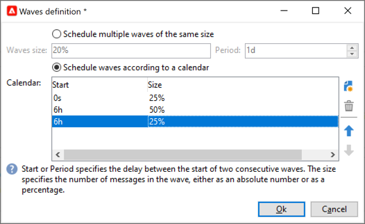

# Konfigurera och skicka leveransen {#configure-delivery}

## Ange ytterligare parametrar {#delivery-additional-parameters}

Innan du skickar leveransen kan du definiera sändningsparametrarna i leveransegenskaperna via **[!UICONTROL Delivery]** -fliken.

* **[!UICONTROL Delivery priority]**: Använd det här alternativet om du vill ändra utskicksordningen för dina leveranser genom att ange deras prioritetsnivå, från **[!UICONTROL Very low]** till **[!UICONTROL Very high]** (standardvärdet är **[!UICONTROL Normal]**).

* **[!UICONTROL Message batch quantity]**: Använd det här alternativet för att definiera antalet meddelanden som grupperas i samma XML-leveranspaket. Om parametern är inställd på 0 grupperas meddelandena automatiskt. Paketstorleken definieras av beräkningen `<delivery size>/1024`, med minst 8 och högst 256 meddelanden per paket.

  >[!IMPORTANT]
  >
  >När leveransen skapas genom duplicering av en befintlig, återställs den här parametern.

* **[!UICONTROL Send using multiple waves]**: Använd det här alternativet om du vill skicka meddelanden gruppvis i stället för till hela målgruppen samtidigt. [Läs mer](#sending-using-multiple-waves).

* **[!UICONTROL Test SMTP delivery]**: Använd det här alternativet om du vill testa att skicka via SMTP. Leveransen behandlas upp till anslutningen till SMTP-servern men skickas inte: för varje mottagare av leveransen ansluter Campaign till SMTP-providerservern, kör SMTP RCPT TO-kommandot och stänger anslutningen före SMTP DATA-kommandot.

  >[!NOTE]
  >
  >* Det här alternativet får inte ställas in i mitten av källkoden.
  >
  >* Läs mer om SMTP-serverkonfigurationen i [Campaign Classic v7-dokumentation](https://experienceleague.adobe.com/docs/campaign-classic/using/installing-campaign-classic/additional-configurations/configure-delivery-settings.html#smtp-relay){target="_blank"}.

* **[!UICONTROL Email BCC]**: Använd det här alternativet om du vill lagra e-post på ett externt system via BCC genom att lägga till en e-postadress för hemlig kopia till meddelandemålet. [Läs mer](email-parameters.md).

## Skicka med flera vågor {#sending-using-multiple-waves}

För att balansera lasten kan du dela upp leveranser i flera satser. Konfigurera antalet batchar och deras proportioner i förhållande till hela leveransen.

>[!NOTE]
>
>Du kan bara definiera storleken och fördröjningen mellan två på varandra följande påfyllnader. Det går inte att konfigurera urvalskriterierna för mottagare för varje påfyllnad.

1. Öppna fönstret för leveransegenskaper och klicka på **[!UICONTROL Delivery]** -fliken.
1. Välj **[!UICONTROL Send using multiple waves]** och klicka på **[!UICONTROL Define waves...]** länk.

   

1. Om du vill konfigurera påfyllnader kan du antingen:

   * Definiera storleken för varje våg. Om du till exempel skriver **[!UICONTROL 30%]** i motsvarande fält representerar varje våg 30 % av de meddelanden som ingår i leveransen, utom den sista, som representerar 10 % av meddelandena.

     I **[!UICONTROL Period]** anger du fördröjningen mellan början av två påfyllnader i följd. Om du till exempel skriver **[!UICONTROL 2d]**, startar den första vågen omedelbart, den andra om två dagar, den tredje vågen om fyra dagar och så vidare.

     

   * Definiera en kalender för att skicka varje påfyllnad.

     I **[!UICONTROL Start]** anger du fördröjningen mellan början av två på varandra följande påfyllnader. I **[!UICONTROL Size]** anger du ett fast tal eller ett procenttal.

     I exemplet nedan representerar den första vågen 25 % av det totala antalet meddelanden som ingår i leveransen och börjar omedelbart. Nästa två vågor slutför leveransen och är inställda på att börja med 6 timmars intervall.

     

   En specifik typologiregel, **[!UICONTROL Wave scheduling check]**, säkerställer att den sista vågen planeras före leveransens giltighetsgräns. Kampanjtypologier och deras regler, konfigurerade i **[!UICONTROL Typology]** -fliken för leveransegenskaperna visas i [det här avsnittet](../../automation/campaign-opt/campaign-typologies.md#typology-rules)<!--ref TBC-->.

   >[!IMPORTANT]
   >
   >Kontrollera att de sista påfyllnaderna inte överskrider leveransdatumet, som definieras i **[!UICONTROL Validity]** -fliken. Annars kanske vissa meddelanden inte skickas.
   >
   >Du måste också ge tillräckligt med tid för att försöka igen när du konfigurerar de sista vågorna. <!--See [this section]().-->

1. Gå till leveransloggarna för att övervaka dina utskick. Läs [den här sidan](send.md)<!--ref TBC-->.

   Du kan se leveranser som redan har skickats i de bearbetade påfyllnaderna (**[!UICONTROL Sent]** status) och de leveranser som ska skickas i de återstående påfyllnaderna (**[!UICONTROL Pending]** status).

De två exemplen nedan är de vanligaste användningsområdena när du använder flera vågor.

* **Under avstämningsprocessen**

  När e-postmeddelanden skickas via en ny plattform, är Internetleverantörer (ISP) misstänkta för IP-adresser som inte känns igen. Om stora mängder e-postmeddelanden plötsligt skickas markerar internetleverantörerna dem ofta som skräppost.

  För att undvika att markeras som skräppost kan du stegvis öka volymen som skickas med vågor. Detta bör säkerställa en smidig utveckling av startfasen och göra det möjligt att minska den totala frekvensen av ogiltiga adresser.

  Om du vill göra det använder du **[!UICONTROL Schedule waves according to a calendar]** alternativ. Du kan till exempel ställa in den första vågen på 10 %, den andra på 15 % och så vidare.

  

* **Kampanjer som involverar ett callcenter**

  När ni hanterar en lojalitetskampanj via telefon har er organisation begränsad kapacitet att behandla antalet samtal till kontaktabonnenter.

  Med hjälp av vågor kan du begränsa antalet meddelanden till 20 per dag, vilket är den dagliga bearbetningskapaciteten för ett callcenter.

  Om du vill göra det väljer du **[!UICONTROL Schedule multiple waves of the same size]** alternativ. Retur **[!UICONTROL 20]** som vågens storlek och **[!UICONTROL 1d]** i **[!UICONTROL Period]** fält.

  

<!--
## Adjust delivery failure management {#delivery-failure-management}

### Configure retries {#configure-retries}

Temporarily undelivered messages due to a **Soft** or **Ignored** error are subject to an automatic retry. The delivery failure types and reasons are presented in this [section](../../delivery/using/understanding-delivery-failures.md#delivery-failure-types-and-reasons).

>[!IMPORTANT]
>
>For hosted or hybrid installations, if you have upgraded to the [Enhanced MTA](../../delivery/using/sending-with-enhanced-mta.md), the retry settings in the delivery are no longer used by Campaign. Soft bounce retries and the length of time between them are determined by the Enhanced MTA based on the type and severity of the bounce responses coming back from the message's email domain.

For on-premise installations and hosted/hybrid installations using the legacy Campaign MTA, the central section of the **[!UICONTROL Delivery]** tab for delivery parameters indicates how many retries should be performed the day after the delivery and the minimum delay between retries.

By default, five retries are scheduled for the first day of the delivery with a minimum interval of one hour spread out over the 24 hours of the day. One retry per day is programmed after that and until the delivery deadline, which is defined in the **[!UICONTROL Validity]** tab (see [Defining validity period](#defining-validity-period)).

### Define the validity period {#define-validity-period}

When the delivery has been launched, the messages (and any retries) can be sent until the delivery deadline. This is indicated in the delivery properties, via the **[!UICONTROL Validity]** tab.

* The **[!UICONTROL Delivery duration]** field lets you enter the limit for global delivery retries. This means that Adobe Campaign sends the messages beginning on the start date, and then, for messages returning an error only, regular, configurable retries are performed until the validity limit is reached.

  You can also choose to specify dates. To do this, select **[!UICONTROL Explicitly set validity dates]**. In this case, the delivery and validity limit dates also let you specify the time. The current time is used by default, but you can modify this directly in the input field.

  >[!IMPORTANT]
  >
  >For hosted or hybrid installations, if you have upgraded to the [Enhanced MTA](../../delivery/using/sending-with-enhanced-mta.md), the **[!UICONTROL Delivery duration]** setting in your Campaign email deliveries will be used only if set to **3.5 days or less**. If you define a value higher than 3.5 days, it will not be taken into account.

* **Validity limit of resources**: The **[!UICONTROL Validity limit]** field is used for uploaded resources, mainly for the mirror page and images. The resources on this page are valid for a limited time (to save disk space).

  The values in this field can be expressed in the units listed in [this section](../../platform/using/adobe-campaign-workspace.md#default-units).

## Confirm the delivery {#confirm-delivery}

When the delivery is configured and ready to be sent, make sure you have run the delivery analysis.

To do this, click **[!UICONTROL Send]**, select the desired action and click **[!UICONTROL Analyze]**. For more on this, see [Launching the analysis](../../delivery/using/steps-validating-the-delivery.md#analyzing-the-delivery).

Once done, click **[!UICONTROL Confirm delivery]** to launch the delivery of messages.

You can then close the delivery wizard and track the execution of the delivery from the **[!UICONTROL Delivery]** tab, accessible via the detail of this delivery or via the list of deliveries.

After sending messages, you can monitor and track your deliveries. For more on this, refer to these sections:

* [Monitoring a delivery](send.md)
* [Understanding delivery failures](delivery-failures.md)
* [About message tracking]

## Schedule the delivery sending {#schedule-delivery-sending}

You can defer the delivery of messages in order to schedule the delivery or to manage sales pressure and avoid over-soliciting a population.

1. Click the **[!UICONTROL Send]** button and select the **[!UICONTROL Postpone delivery]** option.

1. Specify a start date in the **[!UICONTROL Contact date]** field.

  

1. You can then start the delivery analysis, then confirm the delivery sending. However, the delivery sending will not start until the date given in the **[!UICONTROL Contact date]** field.

  >[!IMPORTANT]
  >
  >Once you have started the analysis, the contact date that you defined is fixed. If you modify this date, you will have to restart the analysis so that your modifications are taken into account.

  

In the delivery list, the delivery will appear with **[!UICONTROL Pending]** status.

Scheduling can also be configured upstream via the **[!UICONTROL Scheduling]** button of the delivery.

It lets you defer the delivery to a later date or save the delivery in the provisional calendar.

* The **[!UICONTROL Schedule delivery (no automatic execution)]** option lets you schedule a provisional analysis of the delivery.

  When this configuration is saved, the delivery changes to **[!UICONTROL Targeting pending]** status. The analysis will be launched on the specified date.

* The **[!UICONTROL Schedule delivery (automatic execution on planned date)]** option lets you specify the delivery date.

  Click **[!UICONTROL Send]** and select **[!UICONTROL Postpone delivery]** then launch the analysis and confirm delivery. When the analysis is complete, the delivery target is ready and messages will automatically be sent on the specified date.

Dates and times are expressed in the time zone of the current operator. The **[!UICONTROL Time zone]** drop-down list located below the contact date input field lets you automatically convert the entered date and time into the selected time zone.

For instance, if you schedule a delivery to be executed automatically at 8 o'clock London time, the time is automatically converted into the selected time zone:

-->