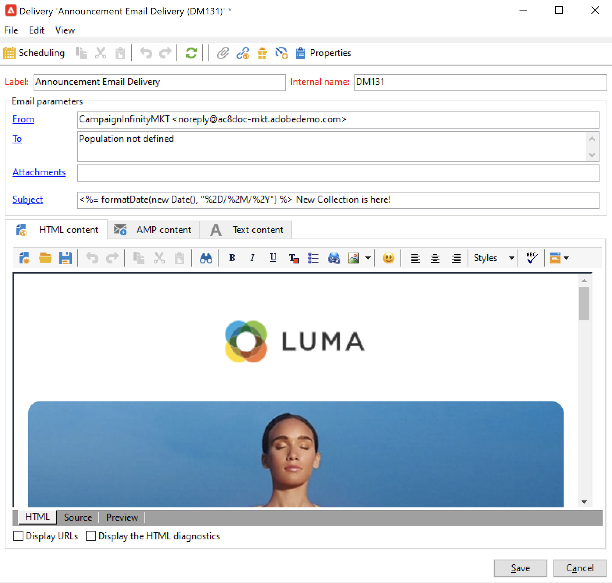
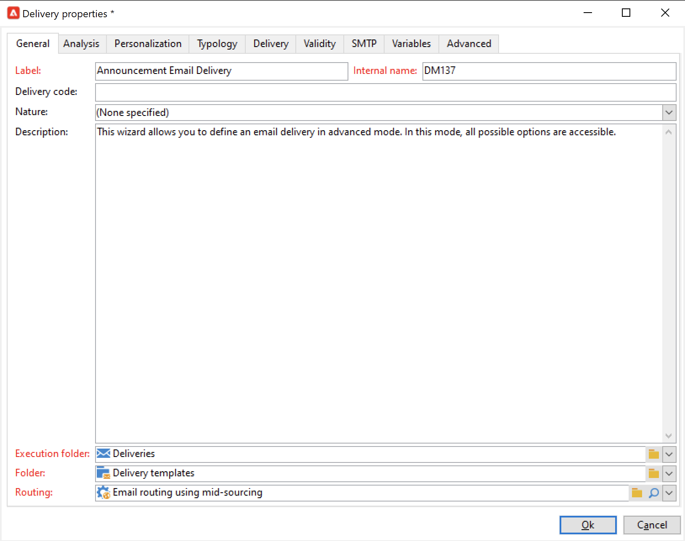

# Arbeta med leveransmallar {#work-with-delivery-template}

## Kom igång med leveransmallar

Varje leverans skapas baserat på en mall. En mall är en konfiguration som kan återanvändas för att underlätta och standardisera implementeringen. Du kan använda en inbyggd eller anpassad mall.

En mall kan innehålla delar av eller fullständiga konfigurationsinställningar, till exempel:

* [Typologiregler](../../automation/campaign-opt/campaign-typologies.md)
* Avsändare och svarsadresser
* Grundläggande [anpassningsblock](../send/personalization-blocks.md)
* Länkar till [spegelsidor](../send/mirror-page.md) och länkar för att avbryta prenumeration
* Innehåll, företagslogotyp eller signatur
* Andra leveransegenskaper, som resursgiltighet, återförsöksparametrar eller karantäninställningar.

 [Upptäck den här funktionen i en video](#delivery-template-video)

Leveransmallar lagras i mappen **[!UICONTROL Resources > Templates > Delivery templates]** i Utforskaren. I Adobe Campaign kan du arbeta med två typer av mallar:

1. Adobe Campaign **inbyggda** leveransmallar - Inbyggda mallar finns tillgängliga för varje kanal. De får inte ändras eller tas bort. De innehåller en grundläggande konfiguration för varje leveranskanal. Som administratör kan du ange standardvärden eller begränsa vissa funktioner till slutanvändare, som att ändra spårningsparametrar, avsändarens e-postadresser med mera. Inbyggda mallar visas med fet stil i listan med mallar.

1. **Anpassade** leveransmallar - Som Adobe Campaign-administratör kan du skapa nya leveransmallar. Det bästa sättet är att duplicera och uppdatera en inbyggd mall i stället för att skapa en mall från grunden. Du kan till exempel konfigurera en mall för e-postleverans, och när användare skapar en leverans från den här mallen behöver de bara ange texten eller HTML-innehållet. Alla andra inställningar har redan definierats.

>[!NOTE]
>
>Vilka mallar som är tillgängliga beror på din åtkomstbehörighet, instanskonfigurationen och kontexten. När du t.ex. skapar en informationstjänst kan du länka en leveransmall för bekräftelsemeddelanden: du kan då bara komma åt mallar vars målmappning är prenumerationsmappningen. Andra mallar visas inte i det här sammanhanget. Mer information finns i [Arbeta med målmappningar](../audiences/target-mappings.md) och [Hantera prenumerationer och avbeställningar](../start/subscriptions.md).

## Skapa en mall {#create-a-delivery-template}

Om du vill skapa en leveransmall kan du duplicera en inbyggd mall eller konvertera en befintlig leverans till en mall. Du kan också skapa en leveransmall från grunden, men det rekommenderas inte. Dessa metoder beskrivs nedan.

### Duplicera en befintlig mall{#copy-an-existing-template}

Campaign innehåller en uppsättning inbyggda mallar för varje kanal: e-post, push, SMS, direktreklam med mera.

Det enklaste sättet att skapa en leveransmall är att duplicera och anpassa en inbyggd mall.

Så här duplicerar du en leveransmall:

1. Bläddra till **[!UICONTROL Resources > Templates > Delivery templates]** i Adobe Campaign Explorer.
1. Välj en inbyggd leveransmall. Inbyggda mallar är fogade i listan.
1. Högerklicka och välj **[!UICONTROL Duplicate]**.

   

1. Definiera mallinställningarna och spara den nya mallen.

   

Mallen läggs till i listan med leveransmallar. Du kan nu välja den när du skapar en ny leverans.

### Konvertera en befintlig leverans till en mall {#convert-an-existing-delivery}

En leverans kan konverteras till en mall för nya upprepade leveransåtgärder.

Så här konverterar du en leverans till en mall:

1. Välj leveransen från leveranslistan, tillgänglig via noden **[!UICONTROL Campaign management]** i Campaign Explorer.

1. Högerklicka och välj **[!UICONTROL Actions > Save as template...]**.

   

1. Redigera leveransegenskaperna och välj den mapp där den nya mallen måste sparas (i fältet **[!UICONTROL Folder]**) och den mapp där leveranser som skapats baserat på den här mallen måste skapas (i fältet **[!UICONTROL Execution folder]**).

   

### Skapa en ny mall {#create-a-new-template}

>[!NOTE]
>
>För att undvika konfigurationsfel rekommenderar Adobe att du [duplicerar en inbyggd mall](#copy-an-existing-template) och anpassar dess egenskaper i stället för att skapa en ny mall.

Så här konfigurerar du en leveransmall från grunden:

1. Bläddra till mappen **Resources** i Campaign Explorer och välj **Mallar** och sedan **Leveransmallar**.
1. Klicka på **Nytt** i verktygsfältet för att skapa en ny leveransmall.
1. Ange mappens **etikett** och **interna namn**.
1. Spara mallen och öppna den igen.
1. Anpassa inställningarna från knappen **Egenskaper** .
1. På fliken **Allmänt** bekräftar du eller ändrar de platser som har valts i listrutorna **Körningsmapp**, **Mapp** och **Routning**.
1. Fyll i kategorin **E-postparametrar** med ditt e-postämne och målpopulationen.
1. Lägg till ditt **HTML-innehåll** om du vill anpassa mallen kan du visa en [länk för spegelsida](../send/mirror-page.md) och en länk för att avbryta prenumerationen.
1. Välj fliken **Förhandsgranska**. I listrutan **Testa anpassning** väljer du **Mottagare** om du vill förhandsgranska mallen som den valda profilen.
1. Klicka på **Spara**. Mallen kan nu användas i en leverans.

## Använd mallar {#use-a-delivery-template}

### Skapa en leverans från en mall {#create-a-delivery-from-a-template}

Om du vill skapa en leverans baserad på en befintlig mall väljer du mallen i listan med tillgängliga leveransmallar.

Om du inte kan se din mall klickar du på mappen **[!UICONTROL Select link]** till höger om fältet för att bläddra bland Campaign-mappar.

Välj önskad katalog i fältet **[!UICONTROL Folder]** eller klicka på ikonen **[!UICONTROL Display sub-levels]** för att visa innehållet i katalogerna i underträden till den aktuella katalogen.

Välj den leveransmall som ska användas och klicka på **[!UICONTROL Ok]**.

### Kör en mall {#execute-a-template}

Du kan starta körningen av en mall direkt från malllistan utan att först skapa en leverans. Leveransmallen kan köras manuellt, enligt beskrivningen nedan, eller aktiveras av en händelse (som körs vid en viss tidpunkt, när en fil är tillgänglig på servern, osv.), vilket förklaras i [det här avsnittet](https://experienceleague.adobe.com/en/docs/campaign/automation/workflows/wf-activities/action-activities/delivery).

Så här kör du en mall manuellt:

1. Välj den mall som ska köras och högerklicka. Välj **[!UICONTROL Actions>Execute the delivery template...]**.

   Du kan också använda **[!UICONTROL File>Actions>Execute the delivery template...]**.

   

1. Ange leveransparametrarna och klicka på **[!UICONTROL Send]**.

Den här åtgärden genererar en leverans i den mapp som är associerad med mallen. Namnet på den här leveransen är namnet på leveransmallen som den skapades från.

## Självstudievideor {#delivery-template-video}

### Konfigurera en leveransmall

I följande video visas hur du konfigurerar en mall för en ad hoc-leverans.

>[!VIDEO](https://video.tv.adobe.com/v/342082?quality=12)

### Så här ställer du in egenskaper för leveransmallar

I följande video visas hur du ställer in leveransmallsegenskaperna och förklarar varje egenskap i detalj.

>[!VIDEO](https://video.tv.adobe.com/v/338969?quality=12)

### Så här distribuerar du en ad hoc-leveransmall

I den här videon förklaras hur du distribuerar en mall för ad hoc-e-postleverans och den förklarar skillnaden mellan en e-postleverans och ett leveransarbetsflöde.

>[!VIDEO](https://video.tv.adobe.com/v/338965?quality=12)

Det finns ytterligare utbildningsvideor för Campaign [här](https://experienceleague.adobe.com/docs/campaign-learn/tutorials/getting-started/introduction-to-adobe-campaign.html){target="_blank"}.
