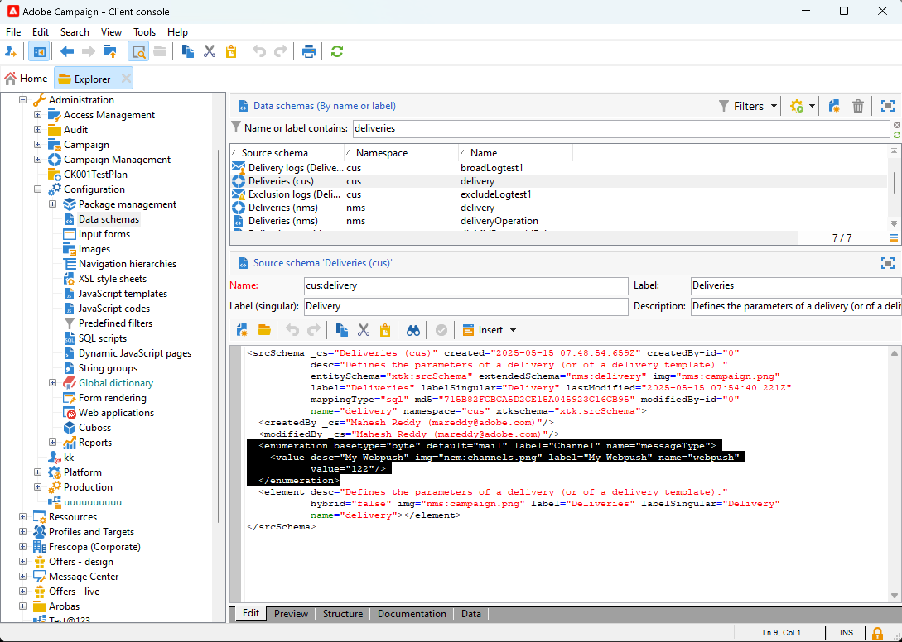

# Kom igång med anpassade kanaler {#gs-custom-channel}

Med Adobe Campaign kan du skapa anpassade externa eller API-kanaler som är integrerade med tredje part. Du kan sedan ordna och köra leveranser baserat på dessa kanaler.

Leveransskapande och -sändning kan utföras både i klientkonsolen och i webbgränssnittet. Men den anpassade kanalkonfigurationen utförs bara i klientkonsolen.

Mer information om hur du skapar och skickar en leverans baserad på en anpassad kanal finns på [sidan](https://experienceleague.adobe.com/docs/campaign-web/v8/msg/gs-custom-channel.html){target="_blank"}.

Här är stegen för att konfigurera en ny anpassad kanal i klientkonsolen. De här stegen är gemensamma för anpassade externa kanaler och API-kanaler:

1. Konfigurera schemat, [läs mer](#configure-schema)
1. Skapa ett nytt externt konto, [läs mer](#create-ext-account)
1. Skapa en ny leveransmall, [läs mer](#create-template)

Anpassade API-kanaler kräver ytterligare konfiguration. [Läs mer](#api-additional)

## Konfigurera schemat{#configure-schema}

Först måste du konfigurera schemat för att lägga till den nya kanalen i listan över tillgängliga kanaler.

1. I Campaign Explorer väljer du **Administration** > **Konfiguration** > **Datascheman**.

1. Skapa ett schematillägg som utökar **messageType** [enumeration](../config/enumerations.md) med den nya kanalen.

   Exempel:

   ```
   <enumeration basetype="byte" default="mail" label="Channel" name="messageType">
   <value desc="My Webpush" img="ncm:channels.png" label="My Webpush" name="webpush"
          value="122"/>
   </enumeration>
   ```

   {zoomable="yes"}

## Skapa ett nytt externt konto{#create-ext-account}

Sedan måste du skapa ett nytt externt routningskonto.

1. Välj **Administration** > **Plattform** > **Externa konton** i Campaign Explorer.

1. Skapa ett nytt externt konto.

1. Markera kanalen och ändra leveranssätt. Välj **Extern** för anpassade externa kanaler och **Massor** för anpassade API-kanaler.

   {zoomable="yes"}

## Skapa en ny leveransmall{#create-template}

Nu skapar vi den nya mallen som är kopplad till den nya kanalen.

1. Välj **Resurser** > **Mallar** > **Leveransmallar** i Campaign Explorer.

1. Skapa en ny mall.

1. Klicka på **Egenskaper** och välj rätt mapp och routning.

   {zoomable="yes"}

Den nya kanalen är nu tillgänglig. Du kan skapa och köra leveranser baserat på den här kanalen.

## Ytterligare konfiguration för anpassat API{#api-additional}

Här är de viktigaste ytterligare stegen för att konfigurera anpassade API-kanaler.

### Utöka schemat{#api-additional-schema}

I klientkonsolen utökar du schemat **Delivery** med alla ytterligare egenskaper som krävs för den anpassade kanalen.

Mer information om schemautökning finns på [sidan](../dev/extend-schema.md).

### Ställ in anpassad skärmdefinition{#api-additional-screen}

Ställ in den anpassade skärmdefinitionen från webbgränssnittet för Campaign:

1. Öppna schemat **Delivery** och klicka på **Screen Edition**.

   {zoomable="yes"}

1. Välj den flik som motsvarar kanalen och definiera hur fälten ska visas på leveransens innehållsskärm. Mer information om skärmversionen finns på [sidan](https://experienceleague.adobe.com/docs/campaign-web/v8/conf/schemas.html#fields){target="_blank"}.

   {zoomable="yes"}

1. I avsnittet **Förhandsgranska för att simulera innehåll** väljer du den dedikerade JSPP:n. Detta är valfritt. Förhandsgranskningen aktiveras på leveranssimuleringsskärmen. [Läs mer](#api-additional-preview)

### Konfigurera förhandsgranskningen{#api-additional-preview}

Den här konfigurationen är valfri. Om du vill aktivera förhandsgranskningen i webbgränssnittet måste du konfigurera en dedikerad JSSP i klientkonsolen på skärmen för leveranssimulering.

När du klickar på **Öppna förhandsgranskning** på skärmen för leveranssimulering i webbgränssnittet skickas följande parametrar i URL:en:

`https://adobe.campaign.adobe.com/cus/webPushMessagePreview.jssp?deliveryId=%40ToPzTurO9aGzQxYcMArBbA%3D%3D&id=%40oF8Fi17txuLmtiOFj4OIjQ%3D%3D`

* `deliveryId`: leveransidentifieraren
* `id`: profilidentifieraren

I klientkonsolen väljer du **Administration** > **Konfiguration** > **Dynamiska JavaScript-sidor** och skapar en ny JSSP. Här är ett exempel med de parametrar som måste hämtas.

```
<%@ page import="xtk:shared/nl.js"
%><%
  NL.require("/nl/core/shared/core.js")
    .require('/nl/core/jsspcontext.js')
    .require('/nl/core/shared/dataTypes.js')
    .require('/nl/core/schema.js');
    
  //response.setContentType("text/plain");
  var parameters = request.parameters;
  var deliveryId = decryptString(parameters.deliveryId);
  var oldUserContext = logonEscalation("neolane")
  
   var delivery = xtk.queryDef.create(<queryDef schema="nms:delivery" operation="getIfExists">
                                         <select>
                                           <node expr="[WebpushParameters/@richMediaOptions]" alias="@richMediaOptions"/>
                                           <node expr="[WebpushParameters/@mediaUrlInfo]" alias="@mediaUrlInfo"/>
                                           <node expr="[WebpushParameters/@WebpushMessageType]"/>
                                         </select>
                                         <where>
                                           <condition expr={"@id = " + NL.XTK.toXTKString(deliveryId)}/>
                                         </where>
                                       </queryDef>).ExecuteQuery();

  // Restore previous context
  logonWithContext(oldUserContext)
%>

<!DOCTYPE html ...
```

### Tekniskt genomförande{#api-additional-technical}

Beroende på vilken kanal du använder måste du konfigurera andra delar av programmet, till exempel externa konton, målmappning, Javascript-kod för API.

