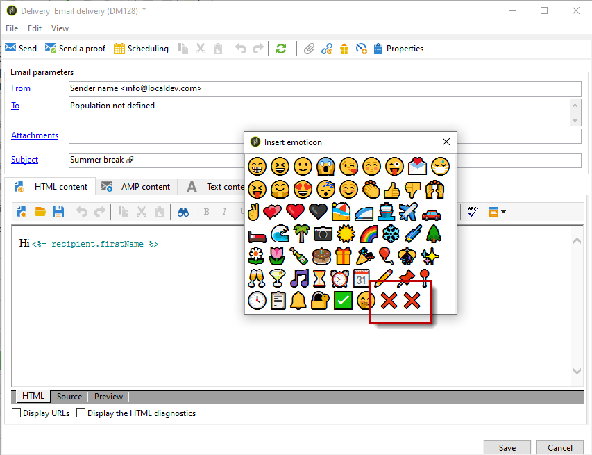

# Anpassa listan över uttryckssymboler {#customize-emoticons}

Uttryckslistan som visas i popup-fönstret styrs av en uppräkning som gör att du kan visa värden i en lista för att begränsa vilka val användaren har för ett visst fält.
Ordningen på uttryckslistan kan anpassas. Du kan också lägga till andra uttryckssymboler i listan.

Observera att uttryckssymboler endast är tillgängliga för e-post och push-meddelanden. Mer information finns i [avsnittet](defining-the-email-content.md#inserting-emoticons).

## Lägga till en ny uttryckssymbol {#add-new-emoticon}

>[!CAUTION]
>
>Uttryckssymbollistan får inte innehålla fler än 81 poster.

1. Välj din nya uttryckssymbol som du vill lägga till på den här [sidan](https://unicode.org/emoji/charts/full-emoji-list.html). Observera att det måste vara kompatibelt med olika plattformar som webbläsare och operativsystem.

1. I **[!UICONTROL Explorer]** väljer du **[!UICONTROL Administration]** > **[!UICONTROL Platform]** > **[!UICONTROL Enumerations]** och klickar på uppräkningen **[!UICONTROL Emoticon list]** som är klar.

   >[!NOTE]
   >
   >Enkla uppräkningar kan bara hanteras av en administratör för din Adobe Campaign Classic-konsol.

   

1. Klicka på **[!UICONTROL Add]**.

1. Fyll i fälten:

   * **[!UICONTROL U+]**: Kod för din nya uttryckssymbol. Du hittar listan med uttryckssymbolkoder på den här [sidan](https://unicode.org/emoji/charts/full-emoji-list.html).
För att undvika kompatibilitetsproblem rekommenderar vi att du väljer uttryckssymboler som stöds i webbläsare och i alla operativsystem.

   * **[!UICONTROL Label]**: Etikett för din nya uttryckssymbol.

   

1. Klicka på **[!UICONTROL Ok]** och sedan på **[!UICONTROL Save]** när konfigurationen är klar.
Din nya uttryckssymbol placeras automatiskt i butiken.

1. Om du vill visa den i fönstret **[!UICONTROL Insert emoticon]** för dina leveranser väljer du den nya uttryckssymbolen genom att dubbelklicka på den.

1. Välj i listrutan **[!UICONTROL Display order]** i vilken ordning din nya uttryckssymbol ska visas. Observera att om du väljer en redan tilldelad visningsordning flyttas den befintliga uttryckssymbolen automatiskt till butiken.

    I det här exemplet har vi valt visningsordernummer 61, vilket innebär att om en post redan har den här beställningen flyttas den automatiskt till butiken och den nya posten får plats i uppräkningslistan.

   

1. Din nya uttryckssymbol har nu lagts till i uppräkningen **[!UICONTROL Insert emoticon list]** som är klar att användas. Du kan ändra dess **[!UICONTROL Display order]** när som helst eller flytta den till butiken om du inte behöver den längre.

1. Ta hänsyn till dina ändringar genom att koppla från och sedan ansluta igen från Adobe Campaign Classic. Om din nya uttryckssymbol fortfarande inte visas i popup-fönstret **[!UICONTROL Insert emoticon]** kan du behöva rensa din cache. Använd menyn **[!UICONTROL File > Clear the local cache]** om du vill göra det.

1. Din nya uttryckssymbol finns nu i leveranserna i popup-fönstret **[!UICONTROL Insert emoticon]** i den 61:a positionen som konfigurerats i föregående steg. Mer information om hur du använder uttryckssymboler i leveranser finns i [avsnittet](defining-the-email-content.md#inserting-emoticons).

   

1. Om följande uttryckssymboler visas i popup-fönstret **[!UICONTROL Insert emoticon]** betyder det att de inte har konfigurerats korrekt. Kontrollera om din **[!UICONTROL U+]**-kod eller **[!UICONTROL Display order]** är rätt i **[!UICONTROL Emoticon list]**.

   
