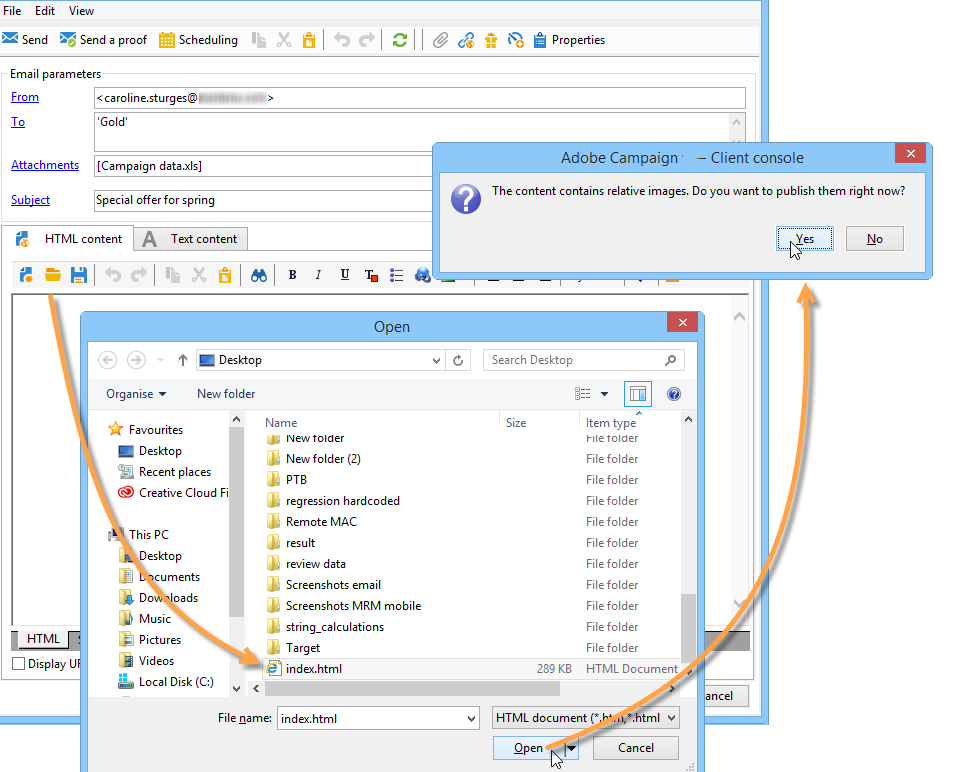
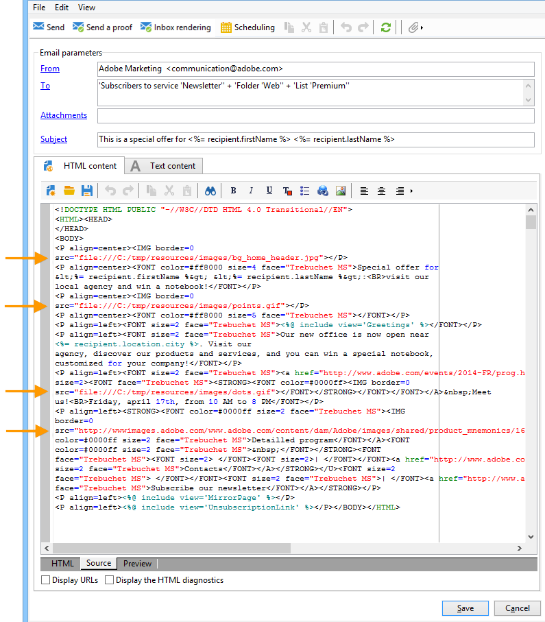
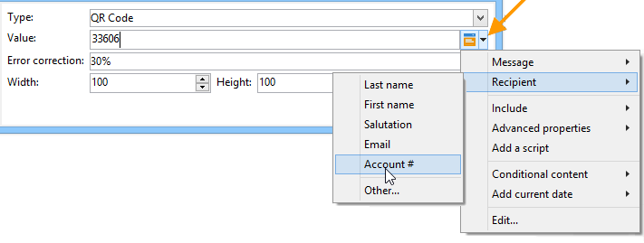

# Definiera e-postinnehållet {#defining-the-email-content}

## Avsändare {#sender}

Klicka på länken **[!UICONTROL From]** om du vill definiera namn och adress för avsändaren som ska visas i meddelandehuvudet.

I det här fönstret kan du ange all information som krävs för att skapa e-postmeddelanderubriker. Informationen kan personaliseras. Det gör du genom att använda knapparna till höger om inmatningsfälten för att infoga anpassningsfält.

Information om hur du infogar och använder anpassningsfält finns i [det här avsnittet](personalize.md).

>[!NOTE]
>
>* Avsändarens adress används som standard för svar.
>* Huvudparametrarna får inte vara tomma. Som standard innehåller de värdeindata när distributionsguiden konfigureras.
>* Avsändarens adress är obligatorisk för att tillåta att ett e-postmeddelande skickas (RFC-standard).
>* Adobe Campaign kontrollerar syntaxen för de e-postadresser som anges.

>[!CAUTION]
>
>För att undvika leveransproblem måste det finnas e-postkonton som motsvarar de adresser som angetts för leveranser och svar och som måste övervakas. Kontakta systemadministratören.

## Meddelandeämne {#message-subject}

Meddelandets ämne är konfigurerat i motsvarande fält. Du kan ange det direkt i fältet eller klicka på länken **[!UICONTROL Subject]** för att ange ett skript. Med personaliseringslänken kan du infoga databasfält i ämnet.

>[!IMPORTANT]
>
>Ämnet för meddelandet är obligatoriskt.

Fältinnehållet ersätts med värdet i mottagarprofilen när meddelandet skickas.

I meddelandet ovan anpassas till exempel meddelandets ämne för varje mottagare med data från deras profil.

>[!NOTE]
>
>Användningen av anpassningsfält beskrivs i [det här avsnittet](personalize.md).

Du kan även infoga uttryckssymboler på ämnesraden med popup-fönstret **[!UICONTROL Insert emoticon]**.

## Meddelandeinnehåll {#message-content}

>[!IMPORTANT]
>
>Av sekretesskäl rekommenderar vi att du använder HTTPS för alla externa resurser.

Innehållet i meddelandet definieras i det nedre avsnittet av fönstret för leveranskonfiguration.

Meddelanden skickas som standard i HTML- eller textformat enligt mottagarens önskemål. Vi rekommenderar att du skapar innehåll i båda formaten för att säkerställa att meddelanden visas korrekt i alla e-postsystem. Mer information finns i [Välja meddelandeformat](email-parameters.md#selecting-message-formats).

* Om du vill importera ett HTML-innehåll använder du knappen **[!UICONTROL Open]**. Du kan också klistra in källkoden direkt på underfliken **[!UICONTROL Source]**.

  Om du använder Digital Content Editor (DCE) läser du [Campaign Classic-dokumentationen](https://experienceleague.adobe.com/docs/campaign-classic/using/designing-content/editing-html-content/use-case-creating-an-email-delivery.html#step-3---selecting-a-content).

  >[!IMPORTANT]
  >
  >HTML-innehållet måste skapas i förväg och sedan importeras till Adobe Campaign. HTML-redigeraren är inte utformad för att skapa innehåll.

  Med underfliken **[!UICONTROL Preview]** kan du visa återgivningen av varje innehåll för en mottagare. Anpassningsfälten och de villkorliga elementen i innehållet ersätts med motsvarande information för den valda profilen.

  Verktygsfältsknapparna ger åtkomst till standardåtgärder och formateringsparametrar för HTML-sidan.

  

  Du kan infoga bilder från en lokal fil eller från ett bildbibliotek i Adobe Campaign. Om du vill göra det klickar du på ikonen **[!UICONTROL Image]** och väljer lämpligt alternativ.

  

  Du kan komma åt biblioteksbilder via mappen **[!UICONTROL Resources>Online>Public resources]** i mappträdet. Se även [Lägga till bilder](#adding-images).

  Med den sista knappen i verktygsfältet kan du infoga anpassningsfält.

  >[!NOTE]
  >
  >Användningen av anpassningsfält beskrivs i [det här avsnittet](personalize.md).

  Med flikarna längst ned på sidan kan du visa HTML-koden för den sida som skapas och visa återgivningen av meddelandet med dess anpassning. Om du vill starta den här visningen klickar du på **[!UICONTROL Preview]** och väljer en mottagare med knappen **[!UICONTROL Test personalization]** i verktygsfältet. Du kan välja en mottagare bland de definierade målen eller en annan mottagare.

  

  Du kan validera HTML-meddelandet. Du kan även visa innehållet i e-posthuvudet.

  

* Om du vill importera ett textinnehåll använder du knappen **[!UICONTROL Open]** eller fliken **[!UICONTROL Text Content]** för att ange innehållet i meddelandet när det visas i textformat. Använd verktygsfältsknapparna för att komma åt åtgärder för innehållet. Med den sista knappen kan du infoga anpassningsfält.

  

  När det gäller HTML-formatet klickar du på fliken **[!UICONTROL Preview]** längst ned på sidan för att visa återgivningen av meddelandet med dess personalisering.

  

## Definiera interaktivt innehåll {#amp-for-email-format}

Med Adobe Campaign kan du testa det nya interaktiva [AMP-formatet för e-post](https://amp.dev/about/email/) som gör att du kan skicka dynamiska e-postmeddelanden under vissa förhållanden.

Mer information finns i [det här avsnittet](defining-interactive-content.md).

## Använd innehållshantering {#using-content-management}

Du kan definiera innehållet i leveransen med hjälp av innehållshanteringsformulären, direkt i leveransassistenten. För att göra detta måste du referera till publiceringsmallen för innehållshanteringen som ska användas på fliken **[!UICONTROL Advanced]** i leveransegenskaperna.

Med en extra flik kan du ange innehåll som automatiskt ska integreras och formateras enligt reglerna för innehållshantering.

>[!NOTE]
>
>Mer information om innehållshantering i Adobe Campaign finns i [Campaign Classic-dokumentationen](https://experienceleague.adobe.com/docs/campaign-classic/using/sending-messages/content-management/about-content-management.html).

## Infoga uttryckssymboler {#inserting-emoticons}

Du kan infoga uttryckssymboler i ditt e-postinnehåll.

1. Klicka på ikonen **[!UICONTROL Insert emoticon]**.
1. Välj en uttryckssymbol i popup-fönstret.

   

1. Klicka på knappen **[!UICONTROL Close]** när du är klar.

Mer information om hur du anpassar uttryckslistan finns i [Campaign Classic-dokumentationen](https://experienceleague.adobe.com/docs/campaign-classic/using/sending-messages/personalizing-deliveries/customizing-emoticon-list.html).

## Lägg till bilder {#adding-images}

E-postleveranser i HTML-format kan innehålla bilder. Från leveransassistenten kan du importera en HTML-sida som innehåller bilder eller infoga bilder direkt med HTML-redigeraren via ikonen **[!UICONTROL Image]**.

### Guardrails {#img-guardrails}

För att undvika prestandaproblem får bilderna i e-postmeddelanden inte överstiga 100 kB. Den här gränsen, som är inställd som standard, kan ändras från alternativet `NmsDelivery_MaxDownloadedImageSize`. Adobe rekommenderar dock att du undviker stora bilder i e-postutskick.

Läs mer i listan över Campaign-alternativ i [Campaign Classic-dokumentationen](https://experienceleague.adobe.com/docs/campaign-classic/using/installing-campaign-classic/appendices/configuring-campaign-options.html#delivery).

### Typer av bilder {#img-types}

Bilderna kan vara:

* En lokal bild eller en bild som anropats från en server
* En bild som lagras i Adobe Campaign bibliotek för offentliga resurser

  Offentliga resurser är tillgängliga via noden **[!UICONTROL Resources > Online]** i Adobe Campaign-hierarkin. De grupperas i ett bibliotek och kan inkluderas i e-postmeddelanden, men kan också användas för kampanjer eller uppgifter, eller för innehållshantering.

* En resurs som delas med Adobe Experience Cloud. Mer information finns i [Campaign Classic-dokumentationen](https://experienceleague.adobe.com/docs/campaign-classic/using/integrating-with-adobe-experience-cloud/asset-sharing/sharing-assets-with-adobe-experience-cloud.html).

### Infoga och hantera bilder {#manage-images}

Med leveransassistenten kan du lägga till lokala bilder, eller bilder som lagras i biblioteket, i innehållet i meddelanden. Det gör du genom att klicka på knappen **[!UICONTROL Image]** i HTML innehållsverktygsfält.

>[!IMPORTANT]
>
>För att mottagarna ska kunna se bilderna i de meddelanden de får måste meddelandena vara tillgängliga på en server som är tillgänglig utifrån.

Så här hanterar du bilder via leveransassistenten:

1. Klicka på ikonen **[!UICONTROL Tracking & Images]** i verktygsfältet.
   

1. Välj **[!UICONTROL Upload images]** på fliken **[!UICONTROL Images]**.
1. Du kan sedan välja om du vill inkludera bilderna i e-postmeddelandet.
   

* Du kan överföra bilder manuellt utan att vänta på leveransanalysfasen. Klicka på länken **[!UICONTROL Upload the images straightaway...]** om du vill göra det.
* Du kan ange en annan sökväg för åtkomst till bilderna på spårningsservern. Om du vill göra det anger du det i fältet **[!UICONTROL Images URL]**. Det här värdet åsidosätter det värde som definieras i installationsassistentens parametrar.

När du öppnar HTML-innehåll med inkluderade bilder i leveransassistenten får du ett meddelande som ger dig möjlighet att ladda upp bilderna direkt enligt leveransparametrarna.

>[!IMPORTANT]
>
> Bild-URL:erna ändras vid manuell överföring eller när meddelanden skickas.
> 

### Användningsfall: skicka ett meddelande med bilder {#uc-images}

Nedan visas ett exempel på en leverans med fyra bilder:

De här bilderna kommer från en lokal katalog eller webbplats som du kan verifiera på fliken **[!UICONTROL Source]**.

Klicka på ikonen **[!UICONTROL Tracking & Images]** och sedan på fliken **[!UICONTROL Images]** för att börja identifiera bilder i meddelandet.

För varje bild som identifieras kan du visa dess status:

* Om en bild lagras lokalt eller finns på en annan server identifieras den som **[!UICONTROL Not yet online]**, även om den här servern är synlig från utsidan (till exempel på en webbplats).
* Bilderna identifieras som **[!UICONTROL Already online]** om de överfördes tidigare när en annan leverans skapades.
* I distributionsguiden kan du definiera URL:er för vilka bildidentifiering inte är aktiverat: överföring av dessa bilder blir **[!UICONTROL Skipped]**.

>[!NOTE]
>
>Bilderna identifieras av deras innehåll och inte av deras åtkomstsökvägar. Det innebär att en bild som har överförts tidigare under ett annat namn eller i en annan katalog identifieras som **[!UICONTROL Already online]**.

Under analysfasen överförs bilderna automatiskt till servern så att de är åtkomliga från utsidan, med undantag för de lokala bilderna som måste överföras i förväg.

Du kan arbeta vidare och överföra bilder så att de kan visas av andra Adobe Campaign-operatörer. Detta kan vara användbart om du arbetar tillsammans. Om du vill göra det klickar du på **[!UICONTROL Upload the images straightaway...]** för att överföra bilderna till servern.

>[!NOTE]
>
>URL:erna för bilderna i e-postmeddelandet, och deras namn i synnerhet, ändras sedan.

När bilderna är online kan du visa ändringar av deras namn och sökvägar på fliken **[!UICONTROL Source]** i meddelandet.

Om du väljer **[!UICONTROL Include the images in the email]** kan du välja vilka bilder som ska inkluderas i motsvarande kolumn.

>[!NOTE]
>
>Om det finns lokala bilder i meddelandet måste du bekräfta ändringarna i meddelandets källkod.

## Infoga en anpassad streckkod{#insert-a-barcode}

Med modulen för streckkodsgenerering kan du skapa flera typer av streckkoder som följer många vanliga standarder, inklusive 2D-streckkoder.

Det går att dynamiskt generera en streckkod som en bitmapp med ett värde som definierats enligt kundkriterierna. Personaliserade streckkoder kan inkluderas i e-postkampanjer. Mottagaren kan skriva ut meddelandet och visa det för det utgivande företaget för skanning (t.ex. vid utcheckning).

Om du vill infoga en streckkod i ett e-postmeddelande placerar du markören i innehållet där du vill visa den och klickar sedan på knappen för anpassning. Välj **[!UICONTROL Include > Barcode...]**.

Konfigurera sedan följande element efter dina behov:

1. Välj typ av streckkod.

   * För 1D-format finns följande typer i Adobe Campaign: Codabar, Code 128, GS1-128 (tidigare EAN-128), UPC-A, UPC-E, ISBN, EAN-8, Code39, Interleaved 2 of 5, POSTNET och Royal Mail (RM4SCC).

     Exempel på en 1D-streckkod:

     

   * Typerna DataMatrix och PDF417 gäller 2D-formatet.

     Exempel på en 2D-streckkod:

     

   * Om du vill infoga en QR-kod väljer du den här typen och anger den felkorrigeringsgrad som ska användas. Denna frekvens definierar mängden information som upprepas och toleransen för försämring.

     

     Exempel på en QR-kod:

     

1. Ange storleken på streckkoden som du vill infoga i e-postmeddelandet: om du konfigurerar skalan kan du öka eller minska storleken på streckkoden, från x1 till x10.
1. I fältet **[!UICONTROL Value]** kan du definiera värdet för streckkoden. Ett värde kan matcha ett specialerbjudande och kan vara funktionen för ett villkor, det kan vara värdet för ett databasfält som är länkat till kunderna.

   I det här exemplet visas en EAN-8-typstreckkod, till vilken en mottagares kontonummer har lagts till. Om du vill lägga till det här kontonumret klickar du på personaliseringsknappen till höger om fältet **[!UICONTROL Value]** och väljer **[!UICONTROL Recipient > Account number]**.

   

1. I fältet **[!UICONTROL Height]** kan du konfigurera höjden på streckkoden utan att ändra bredden, genom att ändra avståndet mellan varje fält.

   Det finns ingen begränsande inmatningskontroll beroende på streckkodstypen. Om ett streckkodsvärde är felaktigt visas det bara i läget **Förhandsgranska** där streckkoden stryks över med rött.

   >[!NOTE]
   >
   >Vilket värde som tilldelas en streckkod beror på dess typ. En EAN-8-typ ska till exempel ha exakt 8 siffror.
   >
   >Med personaliseringsknappen till höger om fältet **[!UICONTROL Value]** kan du lägga till data utöver själva värdet. Detta förbättrar streckkoden, förutsatt att den accepteras av streckkodsstandarden.
   >
   >Om du till exempel använder en GS1-128-typstreckkod och vill ange kontonumret för en mottagare utöver värdet, klickar du på personaliseringsknappen och väljer **[!UICONTROL Recipient > Account number]**. Om kontonumret för den valda mottagaren anges korrekt kommer streckkoden att ta hänsyn till det.

När dessa element har konfigurerats kan du slutföra e-postmeddelandet och skicka det. För att undvika fel ska du alltid se till att ditt innehåll visas korrekt innan du utför en leverans genom att klicka på fliken **[!UICONTROL Preview]**.

>[!NOTE]
>
>Om värdet för en streckkod är felaktigt visas dess bitmapp överstruket i rött.

