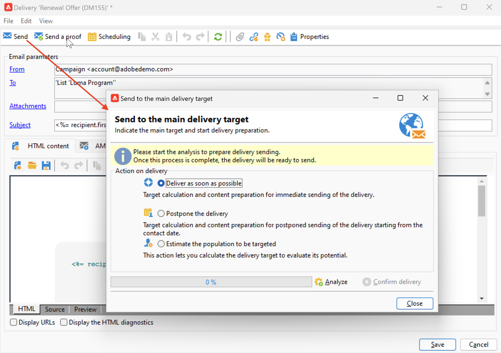

# Leveransanalys {#analyze-delivery}

Analysen är leveransförberedelsesteget. Det kan startas när målgruppen har definierats och meddelandeinnehållet är klart och testat. Vid leveransanalys beräknas målpopulationen och leveransinnehållet förbereds. När leveransen är klar kan den skickas.

## Starta analysen {#start-the-analysis}

För att förbereda leveransen kontrollerar du att leveransinnehållet och leveransmålet har definierats och följer stegen nedan:

1. I leveransfönstren klickar du på **[!UICONTROL Send]** -knappen.
1. Välj **[!UICONTROL Deliver as soon as possible]** för att göra målgruppsberäkningen och förbereda materialet för att skickas omedelbart. Du kan också skjuta upp leveransen till ett senare datum eller få en uppskattning av populationen utan att förbereda innehållet.

   

1. Klicka **[!UICONTROL Analyze]** för att starta analysen manuellt. Förloppsindikatorn visar analysförloppet.

   En inställd kontrollregel tillämpas under leveransanalysen. Dessa regler definieras i en **typologi**, som är markerat i **[!UICONTROL Typology]** i leveransegenskaperna. Läs mer om typologier i [det här avsnittet](../../automation/campaign-opt/campaign-typologies.md).

   Som standard täcker analysen följande punkter för e-post:

   * Godkänna objektet
   * Godkänna URL:er och bilder
   * Godkänna URL-etiketterna
   * Godkänn länken för avprenumeration
   * Kontrollera storleken på korrektur
   * Kontrollera giltighetsperioden
   * Kontrollera schemaläggning av vågor

1. Du kan när som helst stoppa analysen genom att klicka på **[!UICONTROL Stop]** -knappen.

   Inga meddelanden skickas under förberedelsefasen. Du kan därför påbörja eller avbryta analysen utan risk.

   >[!IMPORTANT]
   >
   >Vid körning fryser analysen leveransen (eller korrekturet). Alla ändringar av leveransen (eller beviset) måste följas av en annan analys innan de blir tillämpliga.

   När analysen är klar anger fönstrets övre del om leveransförberedelserna är slutförda eller om några fel har inträffat. Alla valideringssteg, varningar och fel visas. Färgade ikoner visar meddelandetypen:

   * En blå ikon visar ett informativt meddelande.
   * En gul ikon anger ett icke-kritiskt bearbetningsfel.
   * En röd ikon anger ett kritiskt fel som gör att leveransen inte kan skickas.

   {width="800" align="left"}

1. Klicka **[!UICONTROL Close]** för att korrigera eventuella fel. När du har gjort ändringarna startar du om analysklickningen **[!UICONTROL Analyze]**.

   >[!NOTE]
   >
   >Klicka på **[!UICONTROL Change the main delivery target]** om antalet meddelanden som ska skickas inte matchar dina förväntningar. Med det här alternativet kan du ändra definitionen av målpopulationen och starta om analysen.

1. När du har kontrollerat resultatet av analysen klickar du på **[!UICONTROL Confirm delivery]** för att skicka meddelandet till huvudmålet.

## Analysinställningar {#analysis-settings}

Bläddra till **[!UICONTROL Analysis]** fliken med leveransegenskaperna för att definiera inställningar för meddelandeförberedelsen under analysfasen.

{width="800" align="left"}

På den här fliken finns följande alternativ:

* **[!UICONTROL Label and code of the delivery]** : Alternativen i detta avsnitt används för att beräkna värdena för dessa fält under leveransanalysfasen. The **[!UICONTROL Compute the execution folder during the delivery analysis]** field beräknar namnet på mappen som kommer att innehålla den här leveransåtgärden under analysfasen.

* **[!UICONTROL Approval mode]** : I det här fältet kan du definiera manuell eller automatisk leverans när analysen är klar.

   Om varningar genereras under analysen (t.ex. om vissa tecken framhävs i leveransämnet osv.) kan du konfigurera leveransen för att definiera om den fortfarande ska köras eller inte. Som standard måste användaren bekräfta att meddelanden skickas i slutet av analysfasen: det här är **manuell** validering.

   Välj ett annat godkännandeläge i listrutan i lämpligt fält.

   Följande godkännandelägen är tillgängliga:

   * **[!UICONTROL Manual]**: I slutet av analysfasen måste användaren bekräfta leveransen för att kunna börja skicka. Om du vill göra det klickar du på **[!UICONTROL Start]** för att starta leveransen.
   * **[!UICONTROL Semi-automatic]**: Skicka börjar automatiskt om analysfasen inte genererar några varningsmeddelanden.
   * **[!UICONTROL Automatic]**: Sändningen börjar automatiskt i slutet av analysfasen, oavsett resultatet.

* **[!UICONTROL Start job in a detached process]** : Med det här alternativet kan du påbörja leveransanalysen i en separat process. Analysfunktionen använder som standard Adobe Campaign programserverprocess (webbserver). Om du väljer det här alternativet ser du till att analysen slutförs även om ett programserverfel inträffar.
* **[!UICONTROL Log SQL queries generated during the analysis in the journal]** : Med det här alternativet läggs SQL-frågeloggarna till i leveransjournalen under analysfasen.
* **[!UICONTROL Ignore personalization scripts during sending]** : Med det här alternativet kan du kringgå tolkningen av JavaScript-direktiv som finns i HTML. De visas som i det levererade innehållet. Dessa direktiv införs med `<%=` -tagg.

